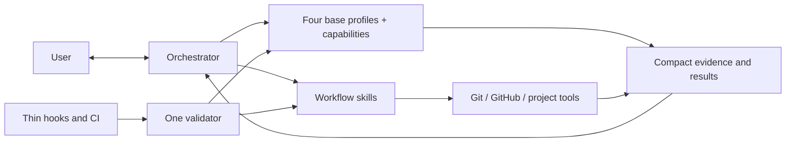

# Orchestra Architecture

## Architectural objective

Build a Codex-native orchestration product whose complexity is dominated by
software delivery work, not by its own control plane.



## Target repository shape

```text
Orchestra/
├── README.md
├── VISION.md
├── AGENTS.md
├── docs/
│   ├── WORKFLOW.md
│   ├── ARCHITECTURE.md
│   └── ROADMAP.md              # non-canonical sequencing
├── .githooks/                 # versioned thin wrappers only
└── codex/
    ├── agents/                # four behavior-only base profiles
    ├── skills/                # public lanes and internal playbook references
    ├── scripts/               # deterministic mechanical helpers
    └── tests/
```

## Component responsibilities

### Orchestrator

Owns user dialogue, tiering, product clarification, capability routing,
synthesis, the local task plan, in-scope decisions, blocker resolution, phase
commits, PR synthesis and observation, delivery choice, and final judgment. It
holds compact context and delegates repository-wide reading. Current source and
Git provide repository context; project tests, runtime evidence, and independent
review provide correctness evidence without a separate repository index.

### Base profiles and capabilities

Orchestra has exactly four behavior-only base profiles:

- `analyst` gathers bounded evidence, researches, plans, analyzes architecture,
  or diagnoses difficult failures. It does not edit implementation files,
  commit, route agents, or claim product authority.
- `implementation_worker` owns scoped code and test changes for an approved
  packet. It may implement general or frontend work, but does not independently
  review itself, commit, or manage delivery.
- `reviewer` independently examines plans, architecture, code, and meaningful
  deltas. It reports evidence-backed findings and never silently implements
  them.
- `verifier` runs targeted checks, runtime acceptance, or browser acceptance
  and reports observed evidence. It does not edit source code or reinterpret a
  failing result as success.

Each dispatch composes one profile with one explicit named capability selected
by the root. `general_implementation` and `independent_review` are assignment
keys whose behavior stays in the base `implementation_worker` and `reviewer`
prompts; they have no internal playbooks. Internal playbooks exist only for
`repository_context`, `web_research`, `technical_planning`,
`difficult_debugging`, `frontend_implementation`, `browser_acceptance`, and
`runtime_verification`. Architecture guidance is one shared reference used with
`technical_planning` or `independent_review` when named; the
`architecture_analysis` assignment has no separate playbook. Playbooks are
internal references, not public skills or additional personas. Public skill
names remain unchanged.

Frontend implementation and browser acceptance are independent capabilities on
different profiles. Root-owned planning, commits, PR observation, routing, and
final judgment add no agent profile or capability key.

Profiles share only minimal conventions: explicit capability, input packet,
outcome-first output status, evidence references, scope boundaries, and stop
conditions. Returns omit routine replay and duplicate context while preserving
the material safety, authority, failure, review, ambiguity, verification, and
remaining-risk evidence needed for root judgment. Sensitive values are redacted
with a safe category or locator, and revision identity distinguishes a committed
revision from a dirty worktree or diff state.

For approved implementation, focused read-only inspection of the affected flow
and relevant callers does not expand edit authority. The worker chooses existing
repository, standard-library, native-platform, or installed primitives by actual
constraints, corrects the supported root cause at the causal boundary that
explains the affected behavior within scope, rejects symptom-only patches, and
records a limitation only with evidence and a concrete revisit trigger. Review
treats complexity as material only when an unsupported consumer, requirement,
or reproducible risk makes it defect-prone; size or novelty metrics alone do
not establish a finding.

### Workflow skills

Skills describe the behavioral route and call deterministic helpers. Expected
public lanes are:

- orchestration and discovery;
- planned delivery;
- phase commit;
- PR open;
- PR review;
- PR merge;
- local integration;
- repository delivery policy.

They should remain readable and route to deeper references only when needed.

### Mechanical helpers

Scripts perform operations that benefit from deterministic behavior: parsing
Git status, validating structured messages, loading delivery policy, running
configured argv checks, opening or observing a PR through direct `gh`, merging
an authorized clean PR, integrating a local fast-forward, synchronizing managed
resources through direct sync, and validating the suite.

Helpers return compact structured results. They do not make product decisions,
spawn agents, or own parallel approval systems. The root commits directly or
through the narrow commit helper and invokes the PR helper directly to observe
GitHub state.

## Minimal contracts

Orchestra may persist only contracts with direct consumers:

- repository delivery policy;
- one root-owned local task plan per standard or critical worktree, resolved
  with `git rev-parse --git-path orchestra/plan.md`;
- structured commit message;
- compact commit result (`sha` or stable failure reason);
- one PR-CONTEXT capsule in the GitHub PR body;
- direct-sync manifest consumed by install, update, status, and uninstall.

The local plan is never versioned. Its consumer is the root, its purpose is
continuity across compaction or resumed sessions, and its lifecycle ends with
task worktree cleanup. It records `draft`, `active`, `blocked`, or `completed`
plus a resume note. Explicit user approval moves `draft` directly to `active`
without another persisted status. Git remains authoritative for branch, HEAD,
commits, and worktree state; the plan carries intent and progress, not delivery
authority.

The previous clean PR head exists only in root memory between consecutive
observations. GitHub owns PR, check, and review-thread state; Orchestra creates
no local PR state file.

Do not introduce a global workflow event ledger, authority-bundle chain,
duplicate Git index, commit recovery journal, plan CLI, Kanban board, benchmark
control plane, or general-purpose workflow state engine unless real usage later
demonstrates a requirement Git/GitHub cannot meet.

## Model and reasoning configuration

The approved capability matrix is documented in `WORKFLOW.md`. The user selects
the root's current Sol medium or Sol high session outside Orchestra, and the
root has no machine-readable assignment. `codex/config/roles.toml` contains
assignments only for spawned capabilities. Skills pass those explicit overrides
when spawning a profile. Profiles contain behavior; playbooks contain capability
instructions only for the seven capabilities listed above, and architecture
guidance remains one shared reference.

Light composes general implementation and independent review with Terra max; the
root itself runs the single direct targeted verification that qualified the task
as light. Standard and critical use the exact matrix in `WORKFLOW.md`; a second
critical review requires a named measurable risk. No Orchestra assignment uses
Sol xhigh. Named browser acceptance makes a task at least standard; a frontend
change may be light only when every light condition holds, including one direct
targeted verification. Frontend work and browser acceptance remain separate
dispatches.

## Browser testing constraint

The `verifier` composed with `browser_acceptance` uses Computer Use with Chrome
as its exclusive browser-control path:

1. Open a new Chrome tab for the target application.
2. Preserve unrelated existing tabs and sessions.
3. Execute the acceptance scenario through visible interaction.
4. Capture concise evidence and reproducible failure steps.
5. Return findings without editing source code.

It never invokes, probes, or falls back to Codex's in-app Browser and returns
blocked when Computer Use or Chrome is unavailable. The parent orchestrator may
use the in-app Browser separately when appropriate.

## Lightweight conformance and hooks

The workflow needs drift protection, but enforcement must remain thin.

### Canonical validator

`codex/scripts/validate_suite.py` is the only suite conformance engine. Its
checks should stay deterministic and fast enough for local use. It validates:

- required canonical files and direct-sync boundaries;
- skill links and profile references;
- capability matrix/profile consistency;
- concise AGENTS/runtime instructions;
- forbidden distribution paths and historical product narrative;
- representative workflow contract tests.

It does not validate live approvals, replay agent history, or inspect unrelated
consumer repositories.

### Hooks

The Orchestra source repository should install one versioned pre-commit wrapper
that invokes the validator's quick mode. Consumer repositories do not receive
that Orchestra validator hook, and no separate pre-push workflow is required.

Orchestra validator hooks must:

- contain no independent workflow policy;
- avoid network calls and agent launches;
- never mutate files, stage changes, or commit;
- finish quickly and print one actionable failure;
- be installable and removable explicitly.

CI may call the full validator later. Hook, CI, and manual validation must not
implement three competing rule sets.

### Behavioral tests

Tests protect the few important invariants:

- light classification fails closed on ambiguity or risk;
- plan approval permits phase commits but not merge/deploy;
- local plan resume reconciles against Git instead of overriding it;
- PR-open authority includes the review/fix/push loop but not implicit merge;
- accepted review findings return to the same implementation owner;
- hooks call the validator without adding policy;
- local integration cleans only safely merged branches and worktrees;
- rejected authority/journal machinery is not introduced.

## Complexity safeguards

Before accepting a persistent artifact, schema, lock, transaction layer,
helper, agent profile, or capability playbook, document:

- its named consumer;
- a demonstrated failure, explicit requirement, or reproducible risk;
- why an existing Git, GitHub, Codex, or project-test primitive is insufficient;
- lifecycle, ownership, and cleanup;
- why its cost is proportional;
- why a smaller direct implementation does not suffice.

Review only the delta after a finding. If a mechanism fails this gate, stop and
simplify it.

The design explicitly rejects a global workflow event ledger, authority-bundle
chain, duplicate Git index, commit recovery journal, plan CLI, Kanban board,
general-purpose workflow state engine, and repeated validation of unchanged
authority unless later evidence passes the same gate.

Delivery uses exactly three focused helpers: `policy.py`, `pr.py`, and
`integrate_local.py`. The root invokes `pr.py` directly for open, observe, and
authorized merge; `pr.py` calls `gh` and is not a generalized GitHub
abstraction. Review-thread observation uses one bounded GraphQL query because
REST check and comment data cannot establish thread resolution. Incomplete
pagination remains `partial`, never clean. Phase commits use direct Git or the
existing narrow commit helper, not an agent.

Warnings about size or complexity may inform review, but arbitrary line-count
limits do not replace engineering judgment. The strongest guard is architectural:
one source of truth, narrow roles, deterministic helpers, and deletion of
unused mechanisms.

## Installation boundary

The source repository is authoritative. V1 installation uses only
repository-driven direct sync. A single sync tool owns explicitly managed Codex
resources, supports dry-run and backup, preserves unrelated user configuration,
and reports what it installed. Orchestra runtime installation is never part of
ordinary task execution, and bootstrap of Orchestra itself must not invoke
Orchestra.

The direct-sync destinations are `$HOME/.agents/skills/<skill>` including their
internal playbook references, the four `$CODEX_HOME/agents/<profile>.toml`
files, and `$CODEX_HOME/orchestra/` for the capability matrix, runtime helpers,
manifest, and deterministic current backups. The default `CODEX_HOME` is
`$HOME/.codex`. The
only managed content in `$CODEX_HOME/AGENTS.md` is the single block delimited by
`<!-- orchestra:start -->` and `<!-- orchestra:end -->`.

`status` and `apply --dry-run` are read-only. `apply` creates, upgrades, and
removes stale owned resources only after a complete preflight. `uninstall`
removes only content that still matches the manifest digest; drift and unrelated
configuration are preserved and reported. The generated manifest is ownership
evidence, while backups are bounded safety evidence rather than a recovery log.
