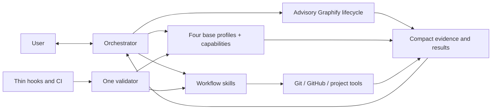

# Orchestra Architecture

## Architectural objective

Build a Codex-native orchestration product whose complexity is dominated by
software delivery work, not by its own control plane.



## Target repository shape

```text
Orchestra/
├── README.md
├── VISION.md
├── AGENTS.md
├── docs/
│   ├── WORKFLOW.md
│   ├── ARCHITECTURE.md
│   └── ROADMAP.md              # non-canonical sequencing
├── .githooks/                 # versioned thin wrappers only
└── codex/
    ├── agents/                # four behavior-only base profiles
    ├── skills/                # public lanes and internal playbook references
    ├── scripts/               # deterministic mechanical helpers
    └── tests/
```

## Component responsibilities

### Orchestrator

Owns user dialogue, tiering, product clarification, capability routing,
synthesis, the local task plan, in-scope decisions, blocker resolution, phase
commits, PR synthesis and observation, delivery choice, and final judgment. It
holds compact context, delegates repository-wide reading, and solely owns the
advisory Graphify lifecycle for standard and critical planned repositories.

### Base profiles and capabilities

Orchestra has exactly four behavior-only base profiles:

- `analyst` gathers bounded evidence, researches, plans, analyzes architecture,
  or diagnoses difficult failures. It does not edit implementation files,
  commit, route agents, or claim product authority.
- `implementation_worker` owns scoped code and test changes for an approved
  packet. It may implement general or frontend work, but does not independently
  review itself, commit, or manage delivery.
- `reviewer` independently examines plans, architecture, code, and meaningful
  deltas. It reports evidence-backed findings and never silently implements
  them.
- `verifier` runs targeted checks, runtime acceptance, or browser acceptance
  and reports observed evidence. It does not edit source code or reinterpret a
  failing result as success.

Each dispatch composes one profile with one explicit named capability selected
by the root. `general_implementation` and `independent_review` are assignment
keys whose behavior stays in the base `implementation_worker` and `reviewer`
prompts; they have no internal playbooks. Internal playbooks exist only for
`repository_context`, `web_research`, `technical_planning`,
`difficult_debugging`, `frontend_implementation`, `browser_acceptance`, and
`runtime_verification`. Architecture guidance is one shared reference used with
`technical_planning` or `independent_review` when named; the
`architecture_analysis` assignment has no separate playbook. Playbooks are
internal references, not public skills or additional personas. Public skill
names remain unchanged.

Frontend implementation and browser acceptance are independent capabilities on
different profiles. Root-owned planning, commits, PR observation, routing, and
final judgment add no agent profile or capability key.

Profiles share only minimal conventions: explicit capability, input packet,
output status, evidence references, scope boundaries, and stop conditions.

### Workflow skills

Skills describe the behavioral route and call deterministic helpers. Expected
public lanes are:

- orchestration and discovery;
- planned delivery;
- phase commit;
- PR open;
- PR review;
- PR merge;
- local integration;
- repository delivery policy.

They should remain readable and route to deeper references only when needed.

### Mechanical helpers

Scripts perform operations that benefit from deterministic behavior: parsing
Git status, validating structured messages, loading delivery policy, running
configured argv checks, opening or observing a PR through direct `gh`, merging
an authorized clean PR, integrating a local fast-forward, synchronizing managed
resources through direct sync, and validating the suite.

Helpers return compact structured results. They do not make product decisions,
spawn agents, or own parallel approval systems. The root commits directly or
through the narrow commit helper and invokes the PR helper directly to observe
GitHub state.

### Advisory Graphify lifecycle

Graphify is an existing external CLI and native-hook facility, not an Orchestra
subsystem. The root calls it directly and owns detection, approved bootstrap,
freshness checks, the one final semantic update, graph-only commit decisions,
and safe native-hook cleanup. No profile, capability, playbook, helper, wrapper,
schema, lock, transaction, state machine, or policy gate represents that
lifecycle.

Configuration detection composes existing truth instead of storing a second
status: command availability, Git's exact tracked-file set, repository ignore
rules, canonical `git rev-parse --git-dir` and
`git rev-parse --git-common-dir`, the actual hooks destination including
`core.hooksPath`, and, only for an eligible non-linked worktree with the command
available, exactly one interpreted `graphify hook status` result per detection
pass. Different canonical Git and common directories identify a linked
worktree, where native refresh is unsupported: detection records hook automation
as `partial`, preserves existing common hooks, and skips status, installation,
reinstallation, uninstall, wrappers, alternate hooks, and hook-only bootstrap.
When the command exists, it still evaluates graph freshness from the relevant
Git delta and pending-update evidence before query smoke/use. A tracked graph
proven fresh at HEAD remains usable advisory context; otherwise source is
authoritative. A missing command adds bootstrap and uses source because query
cannot run. A valid eligible result with both hooks installed passes; valid
absence adds bootstrap only when safely repairable; command failure or
uninterpretable output is `partial` source fallback. No branch makes a second
status call.
Stale or pending evidence and query/hook execution failure are `partial`
source-fallback conditions, not bootstrap triggers.
`inactive`, `active`, `stale`, and `pending` are transient root conclusions, not
persisted Orchestra states. Git owns versioning, Graphify owns its output
formats and hook implementation, and the local plan records only the approved
bootstrap phase or a compact partial-result note.

The default is proportional: light never auto-adopts Graphify; the first
standard or critical plan includes one bootstrap phase only for missing CLI or
artifact configuration, or safely repairable hooks in an eligible non-linked
worktree.
Nothing mutates before plan approval. Approved bootstrap may install or upgrade
the CLI with `uv tool install --upgrade graphifyy`, build the graph, update
ignore/versioning files, and review, verify, and commit the initial snapshot.
Only after that commit succeeds does the root recanonicalize Git and common
directories. A linked worktree skips the hook step while retaining the approved
build and artifact-boundary work. An eligible non-linked worktree resolves the
actual hooks destination and installs Graphify's native `post-commit` and
`post-checkout` hooks only when the destination is outside the tracked worktree
and no tracked hook would change, then reruns configuration and freshness
detection. An unsafe or linked destination is preserved and its hook automation
reported as `partial`; it does not justify a wrapper, alternate hook, or
repeated bootstrap, and it does not by itself invalidate a fresh tracked graph.
External credentials or material cost remain separately authorized.
`graphify codex install` is outside the design because Orchestra already owns
its Codex routing contract.

Structural hook refresh after commits reduces ordinary drift only in eligible
non-linked worktrees. It cannot prove semantic freshness, source correctness,
or acceptance. Before later phase context, the root first checks canonical Git
and common directories; linked worktrees skip hook status and record hook
automation as `partial`. Eligible worktrees interpret hook status exactly once.
Both branches then check the relevant Git delta and pending evidence before
query smoke/use. A fresh graph at HEAD remains usable; stale, pending, unsafe,
or failed Graphify use falls back to source without adding bootstrap.
After functional phase commits,
the root performs at most one semantic `graphify . --update` before plan
completion and creates at most one separate
graph-only commit when tracked outputs changed.

## Minimal contracts

Orchestra may persist only contracts with direct consumers:

- repository delivery policy;
- one root-owned local task plan per standard or critical worktree, resolved
  with `git rev-parse --git-path orchestra/plan.md`;
- structured commit message;
- compact commit result (`sha` or stable failure reason);
- one PR-CONTEXT capsule in the GitHub PR body;
- direct-sync manifest consumed by install, update, status, and uninstall;
- exactly three versioned advisory Graphify outputs:
  `graphify-out/graph.json`, `graphify-out/graph.html`, and
  `graphify-out/GRAPH_REPORT.md`.

The local plan is never versioned. Its consumer is the root, its purpose is
continuity across compaction or resumed sessions, and its lifecycle ends with
task worktree cleanup. It records `draft`, `active`, `blocked`, or `completed`
plus a resume note. Explicit user approval moves `draft` directly to `active`
without another persisted status. Git remains authoritative for branch, HEAD,
commits, and worktree state; the plan carries intent and progress, not delivery
authority.

The previous clean PR head exists only in root memory between consecutive
observations. GitHub owns PR, check, and review-thread state; Orchestra creates
no local PR state file.

The Graphify outputs have direct, bounded consumers. `graph.json` supports root
and analyst context queries; `graph.html` supports optional root or user visual
inspection; `GRAPH_REPORT.md` provides a compact human-readable audit and
navigation summary. They address repeated repository-context cost and
cross-file discoverability that raw Git does not provide, but never replace
source inspection. Their lifecycle begins in an approved bootstrap commit,
continues through native structural refresh where eligible and at most one final
semantic update per plan, and ends only when a separately approved product
change removes Graphify from the repository. Their proportional cost is three
derived files and occasional graph-only history.

`graphify-out/manifest.json`, `graphify-out/cost.json`, extraction caches, and
other generated files are local Graphify implementation data, not Orchestra
contracts. Repository ignore rules exclude them, and clone cleanup may delete
them. The executable and native hook installation are local environment state,
but hooks are clone-local and unversioned only when the resolved Git hooks
destination proves that. Safe installation and cleanup use
`graphify hook install` and `graphify hook uninstall`; unsafe destinations are
preserved. No Orchestra manifest or status file mirrors them.

Do not introduce a global workflow event ledger, authority-bundle chain,
duplicate Git index, commit recovery journal, plan CLI, Kanban board, benchmark
control plane, or general-purpose workflow state engine unless real usage later
demonstrates a requirement Git/GitHub cannot meet.

## Model and reasoning configuration

The approved capability matrix is documented in `WORKFLOW.md`. The user selects
the root's current Sol medium or Sol high session outside Orchestra, and the
root has no machine-readable assignment. `codex/config/roles.toml` contains
assignments only for spawned capabilities. Skills pass those explicit overrides
when spawning a profile. Profiles contain behavior; playbooks contain capability
instructions only for the seven capabilities listed above, and architecture
guidance remains one shared reference.

Light composes general implementation, independent review, and runtime
verification with Luna max. Standard and critical use the exact matrix in
`WORKFLOW.md`; a second critical review requires a named measurable risk. No
Orchestra assignment uses Sol xhigh. Frontend work and named browser acceptance
make a task at least standard and remain separate dispatches.

## Browser testing constraint

The `verifier` composed with `browser_acceptance` uses Computer Use with Chrome
as its exclusive browser-control path:

1. Open a new Chrome tab for the target application.
2. Preserve unrelated existing tabs and sessions.
3. Execute the acceptance scenario through visible interaction.
4. Capture concise evidence and reproducible failure steps.
5. Return findings without editing source code.

It never invokes, probes, or falls back to Codex's in-app Browser and returns
blocked when Computer Use or Chrome is unavailable. The parent orchestrator may
use the in-app Browser separately when appropriate.

## Lightweight conformance and hooks

The workflow needs drift protection, but enforcement must remain thin.

### Canonical validator

`codex/scripts/validate_suite.py` is the only suite conformance engine. Its
checks should stay deterministic and fast enough for local use. It validates:

- required canonical files and direct-sync boundaries;
- skill links and profile references;
- capability matrix/profile consistency;
- concise AGENTS/runtime instructions;
- forbidden distribution paths and historical product narrative;
- representative workflow contract tests.

It does not validate live approvals, replay agent history, or inspect unrelated
consumer repositories.

### Hooks

The Orchestra source repository should install one versioned pre-commit wrapper
that invokes the validator's quick mode. Consumer repositories do not receive
that Orchestra validator hook, and no separate pre-push workflow is required.

Orchestra validator hooks must:

- contain no independent workflow policy;
- avoid network calls and agent launches;
- never mutate files, stage changes, or commit;
- finish quickly and print one actionable failure;
- be installable and removable explicitly.

Graphify hooks have a separate, narrower lifecycle. Before hook status or any
hook mutation, the root canonicalizes `git rev-parse --git-dir` and
`git rev-parse --git-common-dir`. Native hooks exit without refresh when those
directories differ, so a linked worktree preserves existing common hooks,
records hook automation as `partial`, and skips status, install, reinstall,
uninstall, wrappers, alternate hooks, and hook-only bootstrap. With the command
available, it then continues with Git delta, pending evidence, and query smoke;
a tracked graph proven fresh at HEAD remains usable. Without the command, it
adds bootstrap and uses source because query cannot run. The approved build
remains valid when CLI or artifact configuration required it, and the manual
final update remains the closure path.

For an eligible non-linked worktree whose standard or critical bootstrap
snapshot is reviewed, verified, and committed, the root resolves Git's actual
hooks destination, including `core.hooksPath`. `graphify hook install` may
install native `post-commit` and `post-checkout` hooks only when that destination
is outside the tracked worktree and no tracked hook would be modified. They may
refresh Graphify's derived structural outputs after commits and detect checkout
drift, but they make no Orchestra decision, launch no Orchestra agent, and never
establish acceptance or semantic freshness. With the command available,
`graphify hook status` is executed and interpreted exactly once per detection
pass as its configuration signal. If the destination is inside the tracked
worktree or installation would modify a tracked hook, preserve it, return
`partial`, skip installation, and use source. Do not add a wrapper or alternate
hook path. Only safely untracked, installation-local hooks may be described as
clone-local or unversioned and removed with `graphify hook uninstall`.

CI may call the full validator later. Hook, CI, and manual validation must not
implement three competing rule sets.

### Behavioral tests

Tests protect the few important invariants:

- light classification fails closed on ambiguity or risk;
- plan approval permits phase commits but not merge/deploy;
- local plan resume reconciles against Git instead of overriding it;
- PR-open authority includes the review/fix/push loop but not implicit merge;
- accepted review findings return to the same implementation owner;
- hooks call the validator without adding policy;
- missing Graphify configuration adds one non-mutating-until-approved bootstrap
  phase only for standard or critical work;
- stale or failed Graphify evidence falls back to source and never blocks the
  functional workflow;
- linked worktrees skip native hook status and mutation, preserve common hooks,
  and still evaluate graph freshness before the manual final update;
- unsafe Git hook destinations are preserved without a wrapper or alternate
  hook mechanism;
- final semantic update creates at most one graph-only commit;
- local integration cleans only safely merged branches and worktrees;
- rejected authority/journal machinery is not introduced.

## Complexity safeguards

Before accepting a persistent artifact, schema, lock, transaction layer,
helper, agent profile, or capability playbook, document:

- its named consumer;
- a demonstrated failure, explicit requirement, or reproducible risk;
- why an existing Git, GitHub, Codex, or project-test primitive is insufficient;
- lifecycle, ownership, and cleanup;
- why its cost is proportional;
- why a smaller direct implementation does not suffice.

Review only the delta after a finding. If a mechanism fails this gate, stop and
simplify it. Graphify can inform repository context; it does not establish
correctness or policy.

The design explicitly rejects a global workflow event ledger, authority-bundle
chain, duplicate Git index, commit recovery journal, plan CLI, Kanban board,
general-purpose workflow state engine, and repeated validation of unchanged
authority unless later evidence passes the same gate.

Delivery uses exactly three focused helpers: `policy.py`, `pr.py`, and
`integrate_local.py`. The root invokes `pr.py` directly for open, observe, and
authorized merge; `pr.py` calls `gh` and is not a generalized GitHub
abstraction. Review-thread observation uses one bounded GraphQL query because
REST check and comment data cannot establish thread resolution. Incomplete
pagination remains `partial`, never clean. Phase commits use direct Git or the
existing narrow commit helper, not an agent.

Warnings about size or complexity may inform review, but arbitrary line-count
limits do not replace engineering judgment. The strongest guard is architectural:
one source of truth, narrow roles, deterministic helpers, and deletion of
unused mechanisms.

## Installation boundary

The source repository is authoritative. V1 installation uses only
repository-driven direct sync. A single sync tool owns explicitly managed Codex
resources, supports dry-run and backup, preserves unrelated user configuration,
and reports what it installed. Orchestra runtime installation is never part of
ordinary task execution, and bootstrap of Orchestra itself must not invoke
Orchestra.

The direct-sync destinations are `$HOME/.agents/skills/<skill>` including their
internal playbook references, the four `$CODEX_HOME/agents/<profile>.toml`
files, and `$CODEX_HOME/orchestra/` for the capability matrix, runtime helpers,
manifest, and deterministic current backups. The default `CODEX_HOME` is
`$HOME/.codex`. The
only managed content in `$CODEX_HOME/AGENTS.md` is the single block delimited by
`<!-- orchestra:start -->` and `<!-- orchestra:end -->`.

`status` and `apply --dry-run` are read-only. `apply` creates, upgrades, and
removes stale owned resources only after a complete preflight. `uninstall`
removes only content that still matches the manifest digest; drift and unrelated
configuration are preserved and reported. The generated manifest is ownership
evidence, while backups are bounded safety evidence rather than a recovery log.

This boundary does not install Graphify for consumer repositories. Graphify
adoption belongs only to an approved standard or critical plan, uses
`uv tool install --upgrade graphifyy` plus native `graphify hook` commands only
for eligible non-linked worktrees, and must never use `graphify codex install`
or extend Orchestra's direct-sync manifest. Machine-level CLI availability may
be shared, but configuration and freshness detection, ignored caches, and
cleanup remain repository-local; hook locality depends on canonical Git/common
directories, the resolved hooks destination, and tracked-hook safety.
