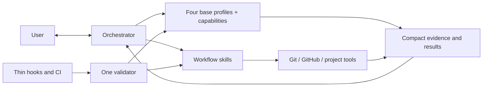

# Orchestra Architecture

## Architectural objective

Build a Codex-native orchestration product whose complexity is dominated by
software delivery work, not by its own control plane.



## Target repository shape

```text
Orchestra/
├── README.md
├── VISION.md
├── AGENTS.md
├── docs/
│   ├── WORKFLOW.md
│   ├── ARCHITECTURE.md
│   └── ROADMAP.md              # non-canonical sequencing
├── .githooks/                 # versioned thin wrappers only
└── codex/
    ├── agents/                # four behavior-only base profiles
    ├── skills/                # public lanes and internal playbook references
    ├── scripts/               # deterministic mechanical helpers
    └── tests/
```

## Component responsibilities

### Orchestrator

Owns user dialogue, tier recommendation, product clarification, capability routing,
synthesis, the local task plan, in-scope decisions, blocker resolution, phase
commits, PR synthesis and observation, delivery choice, and final judgment. It
holds compact authority and decision context and delegates repository-wide
reading. Current source and Git remain authoritative; task-private evidence
artifacts let downstream agents navigate prior analysis without requiring the
root to rewrite it.

After obtaining a bounded minimum brief, the orchestrator recommends an initial
tier with concise risk and cost-benefit evidence, and the user chooses the
active tier. It performs a short read-only Git and execution-readiness preflight.
The root uses Git directly to create a collision-free task branch in either a
managed Orchestra-root worktree or the current clean hybrid checkout before
dispatching repository analysis. It keeps that
task-checkout identity in transient context before plan approval, registers a
best-effort local coordination snapshot, and passes the exact checkout to every
capability. Coordination failure is reported but never changes authority or
prevents the existing inline-packet path.

The first repository-context pass grounds the continuing specification dialogue
and feasibility-determining facts. Later passes answer only newly material
factual questions through targeted deltas. The root confirms the complete
specification and recommends any justified tier change after consuming that
evidence, before formal planning; the user chooses.

For each implementation phase, the root also keeps transient handles for the
implementation owner, reviewer, one verifier per used verification capability,
and only the temporary processes or tabs created for that phase. It reuses the
phase agents for fixes, reruns, and delta review, then tears down those known
resources before commit. Agent and resource handles remain in memory.
Best-effort activity snapshots expose material progress but do not prove that an
agent or process is live and never participate in commit safety.

The active implementation owner defines a stable observation boundary. Until
that owner returns an outcome or blocker, the root coordinates without reading
the evolving implementation diff, exercising it with speculative canaries, or
sending design corrections. At each handoff the root may perform one bounded
Git identity, status, allowed-scope, `diff --check`, and evidence-inventory
check. A root-originated correctness investigation completes against the
current source and diff before it produces one consolidated finding packet with
evidence, impact, and acceptance.

### Base profiles and capabilities

Orchestra has exactly four behavior-only base profiles:

- `orchestra_analyst` gathers bounded evidence, researches, plans, analyzes architecture,
  or diagnoses difficult failures. It does not edit implementation files,
  commit, route agents, or claim product authority.
- `orchestra_implementation_worker` owns scoped code and test changes for an approved
  packet. It may implement general or frontend work, but does not independently
  review itself, commit, or manage delivery.
- `orchestra_reviewer` independently examines plans, architecture, code, and meaningful
  deltas. It reports evidence-backed findings and never silently implements
  them.
- `orchestra_verifier` runs targeted checks, runtime acceptance, or browser acceptance
  and reports observed evidence. It does not edit source code or reinterpret a
  failing result as success.

Each dispatch composes one profile with one explicit named capability selected
by the root. `general_implementation` and `independent_review` are assignment
keys whose behavior stays in the base `orchestra_implementation_worker` and `orchestra_reviewer`
prompts; they have no internal playbooks. Internal playbooks exist only for
`repository_context`, `web_research`, `technical_planning`,
`difficult_debugging`, `frontend_implementation`, `browser_acceptance`, and
`runtime_verification`. Architecture guidance is one shared reference used with
`technical_planning` or `independent_review` when named; the
`architecture_analysis` assignment has no separate playbook. Playbooks are
internal references, not public skills or additional personas. Public skill
identifiers remain stable except for the additive implicit
`orchestra-project-start` greenfield entry point.

Frontend implementation and browser acceptance are independent capabilities on
different profiles. Root-owned plan authority, commits, PR observation,
routing, and final judgment add no agent profile or capability key; a
dispatched technical planner may author the exact candidate documents that the
root approves or rejects.

The implementation owner, reviewer, and each capability verifier form a bounded
phase cohort. One-shot analysts close after their result is consumed. The cohort
closes only after final phase evidence is consumed, preserving relevant context
without carrying implementation state across phases. Analysis agents are
one-shot except that a technical planner remains open through a dispatched
plan-review correction loop and closes before implementation.

At a user-directed tier transition, the root waits for the active tool call,
collects the exact worktree state, progress, evidence, and owned resources,
closes only agents whose immutable assignment changes, and creates replacements
only when needed. The worktree and valid evidence provide continuity; there is
no workflow restart, transition commit, or tier-history subsystem.

Profiles share only minimal conventions: explicit capability and authority,
worktree, exact target artifact identifiers and roles, revision identity,
accepted finding identifiers, new context delta, stop conditions, and
outcome-first output status. Reusable results are complete
revision-identified task-private Markdown artifacts; returns carry produced
identifiers, blockers, risks, and requested decisions instead of replaying
content. Objective, scope, acceptance, verification, plan details, and prior
findings are read from named documents. Publication failure falls back to the
complete inline result or an exact private path already recorded in the
approved manifest.
Revision identity still distinguishes a committed revision from a dirty
worktree or diff state and names affected paths.

For approved implementation, focused read-only inspection of the affected flow
and relevant callers does not expand edit authority. The worker chooses existing
repository, standard-library, native-platform, or installed primitives by actual
constraints, corrects the supported root cause at the causal boundary that
explains the affected behavior within scope, rejects symptom-only patches, and
records a limitation only with evidence and a concrete revisit trigger. Review
treats complexity as material only when an unsupported consumer, requirement,
or reproducible risk makes it defect-prone; size or novelty metrics alone do
not establish a finding.

### Workflow skills

Skills describe the behavioral route and call deterministic helpers. Expected
public lanes are:

- implicit greenfield project start;
- explicit orchestration and discovery;
- planned delivery;
- phase commit;
- PR open;
- PR review;
- PR merge;
- local integration;
- repository delivery policy.

They should remain readable and route to deeper references only when needed.

### Mechanical helpers

Scripts perform operations that demonstrably benefit from deterministic
behavior: bounded Git inspection, loading delivery policy, running configured
argv checks, opening or observing a PR through direct `gh`, merging an
authorized clean PR with guarded task-resource cleanup, integrating a local
fast-forward, synchronizing managed resources through direct sync, and
validating the suite. `coordination.py` is a separate fail-soft task and
activity snapshot helper; it never performs Git mutations or product decisions.

Helpers return compact structured results. They do not make product decisions,
spawn agents, or own parallel approval systems. A helper must reduce the total
agent, tool, time, and repair cost of its operation; deterministic behavior is
not a reason to duplicate Git or the root's judgment. The root commits with
direct Git by default, may use the narrow exact-path helper, and invokes the PR
helper directly to observe GitHub state.

## Minimal contracts

Orchestra may persist only contracts with direct consumers:

- repository delivery policy;
- one non-authoritative local task snapshot store at
  `$HOME/.orchestra/state.sqlite3`;
- revision-identified Markdown artifacts in each task worktree's private
  `git rev-parse --git-path orchestra/artifacts` directory;
- one root-owned approved task plan per confirmed checkout, resolved with
  `git rev-parse --git-path orchestra/plan.md`;
- concise commit intent and validation in Git history;
- compact optional-helper result (`committed` with `sha`,
  `nothing_to_commit`, or `blocked` with the observed reason);
- one PR-CONTEXT capsule in the GitHub PR body;
- direct-sync manifest consumed by install, update, status, and uninstall.

The installed session-model helper is a read-only runtime probe consumed only
by the dual Orchestra routing skill. It persists no state and returns a compact
JSON result.

The provisional specification remains in conversation. An unapproved formal
candidate is one `plan-overview`, one `plan-phase` per phase, and optional
`plan-review` artifacts. Its current membership is an explicit bundle of IDs,
never whichever artifacts are newest. Only after approval does the root write
`plan.md` as `active`: task/Git identity, tier and decisions, approved overview
verbatim, and an exact phase manifest with IDs, private paths, artifact
revisions, progress, commits, blocker, and next action. Phase details are not
duplicated. Git remains authoritative for branch, HEAD, commits, and worktree
state; the plan carries approved intent, exact bundle selection, and progress.

Branches and worktrees are Git resources, not a new Orchestra state store.
Every new formal task uses an Orchestra-owned collision-free branch. Managed
mode owns its portable worktree; hybrid mode preserves the user/host-owned
checkout and owns only the task branch and private task artifacts. The same live preapproval task may
continue in memory; later reuse requires the approved plan's checkout path,
branch, base, and HEAD to agree with Git. Rejected planning and completed
delivery clean only resources that exact Git evidence proves safe.

The previous clean PR head exists only in root memory between consecutive
observations. GitHub owns PR, check, and review-thread state; Orchestra creates
no local PR state file.

The coordination store contains two snapshot concepts only: tasks and material
agent activities. Stages are labels rather than validated
transitions. The store retains completed task metadata. It has no
authority, event history, heartbeat requirement, delete command, or automatic
import of preexisting tasks. A failed update is telemetry loss, not workflow
failure. Artifacts are plain files in the task-private
`git rev-parse --git-path orchestra/artifacts` directory, named
`<NN>-<kind>[-p<phase>].md`; the file name is the identifier, the filesystem
is the only locator, and they follow the task worktree lifecycle. Agents
return inline evidence when artifact publication fails.

Artifact `kind` is a file-naming convention:
`repository-context`, `context-delta`, `plan-overview`, `plan-phase`,
`plan-review`, `implementation-report`, `verification-report`,
`implementation-review`, `debugging-report`, and `pr-review` only when PR
analysis has a downstream semantic consumer. Corrected overview and phase
documents are immutable complete replacements. Mechanical start, completion,
commit, push, check, and merge facts remain activity, Git, or GitHub state.

The root keeps a compact manifest of current IDs, revision, accepted findings,
risks, and decisions. It opens complete documents for specification and
approval, authority or risk judgment, and failed convergence. After a second
material plan review it observes convergence; before a third correction, or
immediately for marginal, contradictory, or out-of-scope findings, it
adjudicates the exact bundle and reviews. No review counter or limit persists.

Do not introduce a global workflow event ledger, authority-bundle chain,
duplicate Git index, commit recovery journal, Kanban board, benchmark control
plane, or general-purpose workflow state engine unless real usage demonstrates
a requirement the snapshot projection cannot meet. The root uses the one-shot
`adopt_worktree.py` helper only because Git does not carry selected dirty paths
into an Orchestra task worktree; that helper keeps no state.

## Model and reasoning configuration

The approved capability matrices are documented in `WORKFLOW.md`. The user
selects the root's current Sol medium or Sol high entry outside Orchestra.
Source retains only the `native` and `external` matrices; the `dual` matrix is
composed deterministically at sync time from those two sources (native wrapped
under `modes.native`, external wrapped under `modes.external` with its
Orchestra V1 aliases). Direct sync installs exactly one matrix at the canonical
`$CODEX_HOME/orchestra/roles.toml` path and records that install choice.

The dual matrix contains `native` and `external` modes. Before task setup, a
read-only helper resolves the current rollout identified by `CODEX_THREAD_ID`,
reads its latest turn context, and accepts only native Sol V2 or the Orchestra
Sol V1 compatibility alias. It maps those combinations to the corresponding
mode and requires medium or high root effort. The result is kept in memory
before plan approval and in plan Decisions afterward. It is immutable for the
task and must match again on resume. This is routing evidence, not a new model
selector: Orchestra never changes or respawns the root.

Legacy installations remain fixed and do not invoke session detection. Their
existing sync and task behavior stays compatible. In the dual matrix, native
mode is equal to the legacy native matrix. External mode is equal to the legacy
external matrix except that every native OpenAI model reference uses a
CodexBridge `orchestra-v1/` alias. The bridge publishes those aliases only in
catalog mode, marks them V1, rewrites them to their native target before
forwarding, and never sends them through CLIProxyAPI.

The two logical modes differ only in their standard assignments and share one
critical capability/profile/reasoning matrix; external critical uses the V1 Sol
alias so it never crosses protocol versions. Skills pass the selected explicit
overrides when spawning a profile. Profiles contain behavior; playbooks contain
capability instructions only for the seven capabilities listed above, and
architecture guidance remains one shared reference.

The task's active tier is a user-selected lookup key inside its immutable mode.
It may change in either direction without changing that mode. Because spawned
agents cannot change model or reasoning effort, a safe transition replaces only
live agents whose assignment differs and passes them a compact continuation
packet. Changing between native V2 and external V1 requires a new task started
from the matching root selector entry.

Assignment resolution still prefers the exact installed model. A narrow runtime
compatibility rule permits only `repository_context` to retry internally with
Luna at reasoning `high` when its assigned model is rejected as unsupported
before execution. Legacy installations retain their existing fallback; dual
external uses the installed Orchestra V1 Luna alias; dual native blocks instead
of crossing protocol versions. The root records a permitted substitution only
in memory for the live task. It creates no visible Codex task, persists no
fallback, changes no matrix, and blocks unsupported models for every other
capability.

A second critical review requires a named measurable risk. No Orchestra
assignment uses Sol xhigh. Frontend work and browser acceptance remain separate
dispatches.

Operational notes for the V1 aliases: alias catalog metadata must stay
synchronized with the native metadata (the context-window entry controls when
Codex compacts), `ultra` reasoning effort is not used on V1 aliases, and
encrypted compaction blobs are not portable across alias/native routes.

## Verification environment and browser routing

Orchestra synchronizes Guardian (`:workspace`, `on-request`, and Auto-review)
as the default while the active permission choice for the task, host, or
launcher remains authoritative; the complete permission rules live in
`docs/WORKFLOW.md` ("Test permissions and browser routing"). Deterministic
syntax, type, compile, lint, import, assertion, validation-contract, and
CLI-usage failures remain real failures.

Browser packets use the transient `browser_route` value `auto`, `in_app`, or
`chrome`. An explicit user route is attempted even as a tool canary and fixed
unless fallback is also authorized; an agent may report its technical blocker
but may not veto or substitute it.
Without an explicit route, `auto` selects Codex's in-app Browser first and uses
Computer Use with Chrome only for a technical availability or capability gap.
The root may select Chrome directly when the named scenario requires existing
Chrome state, an extension, a native dialog, browser-specific behavior, or
system integration.

Frontend iteration and independent browser acceptance use separate task tabs.
An allowed fallback closes the in-app task tab and repeats the complete scenario
in a new Chrome task tab. Product failures, timeouts, and selector errors remain
evidence on the selected surface and never trigger fallback. Unrelated tabs,
windows, authenticated sessions, processes, and user state are preserved.

## Phase resource lifecycle

Phase agents may retain exact owned test processes and task tabs for reuse
within their phase. Before commit, the root requests teardown from each resource
owner, stops root-owned shared test processes, consumes those results, and calls
`close_agent` on every phase agent so descendants close as well. An active agent
or process capable of writing the worktree blocks commit; an unclosed
source-read-only task tab is reported as partial cleanup without invalidating
the commit.

Live-agent observation uses `wait_agent` with a ten-minute maximum. Completion
wakes the root immediately; timeout does not contact, interrupt, restart, or
fail the agent. After 30 accumulated minutes, only concrete blocker evidence
justifies intervention.

Once the root gives a stable revision packet to a verifier, it stops
speculative source review until that verification returns. It interrupts a
verifier only when the revision changed or a finding was first confirmed
against the exact current source and diff and invalidates the packet. Every
required verifier must return `pass`, or a `blocked` result explicitly accepted
by the root, before `independent_review` is dispatched. An active verifier or a
failed verifier awaiting its rerun is not final evidence.

No helper discovers or kills processes globally. Resource handles exist only in
root memory, apply only to resources Orchestra created, and expire at phase
teardown. Commit execution remains a separate direct Git operation.

## Lightweight conformance and hooks

The workflow needs drift protection, but enforcement must remain thin.

### Canonical validator

`codex/scripts/validate_suite.py` is the only suite conformance engine. Its
checks should stay deterministic and fast enough for local use. It validates:

- required canonical files and direct-sync boundaries;
- skill links and profile references;
- capability matrix/profile consistency;
- concise AGENTS/runtime instructions;
- forbidden distribution paths and historical product narrative;
- representative workflow contract tests.

It does not validate live approvals, replay agent history, or inspect unrelated
consumer repositories.

### Hooks

The Orchestra source repository should install one versioned pre-commit wrapper
that invokes the validator's quick mode. Consumer repositories do not receive
that Orchestra validator hook, and no separate pre-push workflow is required.

Orchestra validator hooks must:

- contain no independent workflow policy;
- avoid network calls and agent launches;
- never mutate files, stage changes, or commit;
- finish quickly and print one actionable failure;
- be installable and removable explicitly.

CI may call the full validator later. Hook, CI, and manual validation must not
implement three competing rule sets.

### Behavioral tests

Tests protect the few important invariants:

- only explicit `$orchestra` or an unequivocal use/start Orchestra imperative
  activates the workflow;
- the visible primary skill name is `Orchestra`;
- planning-only host mode reuses context without mutation and continues when
  execution-capable without a second invocation;
- the skill never changes the host into a planning-only mode;
- ordinary plan requests, direct implementation, and descriptive mentions do
  not activate Orchestra;
- initial routing follows minimum brief, installed-mode resolution, tier,
  read-only preflight, sibling worktree creation, focused repository context,
  final specification, then formal plan;
- repeated repository context requests only targeted deltas and every one-shot
  analyst closes after its result;
- only repository context may use the transient Luna-high unsupported-model
  fallback, after attempting the installed assignment first and without
  crossing from dual native V2 into V1;
- dual routing derives an immutable task mode from the root model and
  multi-agent version, while legacy native and external installs remain fixed;
- only standard and critical assignments are valid;
- plan approval permits phase commits but not merge/deploy;
- every formal task creates one collision-free `orchestra/*` branch before work;
- managed mode creates an isolated Orchestra-root worktree, while hybrid mode
  branches in place only from a clean primary checkout or linked worktree;
- neither mode implements directly on the starting branch or `main`;
- scoped dirty adoption uses `adopt_worktree.py` as a one-shot selected-path
  import into the clean task worktree;
- fresh task `HEAD` equals the base revision; adopted task `HEAD` equals the
  adopted source revision while retaining the integration base;
- task resume requires exact plan, path, branch, base, and HEAD;
- local plan resume reconciles against Git instead of overriding it;
- phase owners, reviewers, and capability verifiers are reused only within one
  phase and close before its commit;
- the synchronized Guardian defaults remain distinct from an authoritative
  explicit task, host, or launcher permission choice, and under Guardian test
  failures use at most one exact automatically reviewed boundary escalation
  with no denial retry;
- the root recommends a tier, the user selects it, and a user-directed tier
  transition preserves unchanged work and evidence;
- browser routing honors explicit selection and otherwise prefers the in-app
  Browser with capability-based Chrome fallback;
- the first review covers the bounded target while delta reviews stay focused;
- the implicit greenfield skill never silently activates Orchestra;
- PR-open authority includes the review/fix/push loop but not implicit merge;
- authorized PR merge cleans only exact unchanged local and remote task resources;
- accepted review findings return to the same implementation owner;
- hooks call the validator without adding policy;
- local integration removes only safely merged Orchestra-owned resources;
- rejected authority/journal machinery is not introduced.

## Complexity safeguards

Before accepting a persistent artifact, schema, lock, transaction layer,
helper, agent profile, or capability playbook, document:

- its named consumer;
- a demonstrated failure, explicit requirement, or reproducible risk;
- why an existing Git, GitHub, Codex, or project-test primitive is insufficient;
- lifecycle, ownership, and cleanup;
- why its cost is proportional;
- why a smaller direct implementation does not suffice.

Review only the delta after a finding. If a mechanism fails this gate, stop and
simplify it. Count root and delegated-agent context, tool calls, wall time, and
failure-repair loops in that cost. Do not harden against speculative
concurrency, crashes, adversarial inputs, or exotic filesystems without a
consumer requirement or reproducible risk.

The design explicitly rejects an authoritative workflow event ledger,
authority-bundle chain, duplicate Git index, commit recovery journal, Kanban
board, general-purpose workflow state engine, and repeated validation of
unchanged authority unless later evidence passes the same gate. The bounded
coordination snapshot is explicitly observational and fail-soft.

Delivery uses exactly three focused helpers: `policy.py`, `pr.py`, and
`integrate_local.py`. The root invokes `pr.py` directly for open, observe, and
authorized merge and guarded post-merge cleanup; `pr.py` calls `gh` and direct
Git primitives and is not a generalized GitHub abstraction. Review-thread
observation uses one bounded GraphQL query because REST check and comment data
cannot establish thread resolution. Incomplete pagination remains `partial`,
never clean. Managed task worktree creation remains a direct root
`git worktree add` operation using the configured path and exact base commit.
Hybrid task setup uses direct `git switch -c` in the selected clean checkout
against its captured HEAD. Synchronization records the absolute root, checkout
mode, and one reversible Codex permission backend.
Codex 0.146.0 or later receives the built-in `:workspace` profile with
`approval_policy = "on-request"` and
`approvals_reviewer = "auto_review"`; older clients block before mutation.
Historical manifest-owned Full Access and legacy blocks remain migration and
uninstall inputs only. No legacy sandbox mode, custom permission profile,
writable-root list, worktree helper, or command rule is installed. Direct App
Server launchers omit permission overrides to inherit those defaults. Explicit
launcher overrides remain authoritative and are neither rejected nor rewritten;
the exact workspace, on-request, and Auto-review values select Guardian
explicitly. User-owned profiles or sandbox blocks that cannot be migrated
unambiguously stop synchronization. When Guardian is active, the root proves
write access with a temporary canary before dispatch, then requests one exact
automatically reviewed escalation when direct Git must write protected shared
metadata; active worktrees in older locations are never migrated implicitly.
Scoped dirty adoption uses `adopt_worktree.py` as a one-shot selected-path
import into the task worktree.
Phase commits use direct Git by default or the existing narrow exact-path helper
when useful, never an agent.

Warnings about size or complexity may inform review, but arbitrary line-count
limits do not replace engineering judgment. The strongest guard is architectural:
one source of truth, narrow roles, deterministic helpers, and deletion of
unused mechanisms.

## Installation boundary

The source repository is authoritative. V1 installation uses only
repository-driven direct sync. A single sync tool owns explicitly managed Codex
resources. It supports dry-run and backup, preserves unrelated user
configuration, reports what it installed, and requires a restart when its
permission backend changes. Orchestra runtime installation is never part of
ordinary task execution, and bootstrap of Orchestra itself must not invoke
Orchestra.

The direct-sync destinations are `$HOME/.agents/skills/<skill>` including their
internal playbook references, the four `$CODEX_HOME/agents/<profile>.toml`
files, and `$CODEX_HOME/orchestra/` for the capability matrix, runtime helpers,
manifest, and deterministic current backups. The default `CODEX_HOME` is
`$HOME/.codex`. The
only managed content in `$CODEX_HOME/AGENTS.md` is the single block delimited by
`<!-- orchestra:start -->` and `<!-- orchestra:end -->`.

`status` and `apply --dry-run` are read-only. `apply` creates, upgrades, and
removes stale owned resources only after a complete preflight. `uninstall`
removes only content that still matches the manifest digest; drift and unrelated
configuration are preserved and reported. The generated manifest is ownership
evidence, while backups are bounded safety evidence rather than a recovery log.
An explicit user-owned sandbox mode, default permission profile, or incompatible
legacy sandbox table blocks preflight without byte changes. Synchronization
takes reversible ownership of `approval_policy`, `approvals_reviewer`, and
`default_permissions`, preserving their previous values for exact uninstall.
Only a manifest-owned permission block may migrate from historical legacy or
Full Access forms. Permission edits remove exact TOML spans and preserve all
unrelated bytes, including multiline strings.
