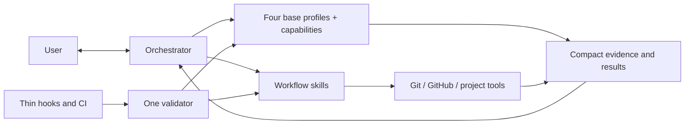

# Orchestra Architecture

## Architectural objective

Build a Codex-native orchestration product whose complexity is dominated by
software delivery work, not by its own control plane.



## Target repository shape

```text
Orchestra/
├── README.md
├── VISION.md
├── AGENTS.md
├── docs/
│   ├── WORKFLOW.md
│   ├── ARCHITECTURE.md
│   └── ROADMAP.md              # non-canonical sequencing
├── .githooks/                 # versioned thin wrappers only
└── codex/
    ├── agents/                # four behavior-only base profiles
    ├── skills/                # public lanes and internal playbook references
    ├── scripts/               # deterministic mechanical helpers
    └── tests/
```

## Component responsibilities

### Orchestrator

Owns user dialogue, tiering, product clarification, capability routing,
synthesis, the local task plan, in-scope decisions, blocker resolution, phase
commits, PR synthesis and observation, delivery choice, and final judgment. It
holds compact context and delegates repository-wide reading. Current source and
Git provide repository context; project tests, runtime evidence, and independent
review provide correctness evidence without a separate repository index.

After obtaining a bounded minimum brief, the orchestrator declares an initial
tier and creates a new task branch and dedicated sibling worktree before
dispatching repository analysis. It never adopts the current worktree for a new
task. Fresh work starts at the intended integration base. Adopted committed work
starts at the adopted source HEAD while retaining that base for later delivery.
The root uses Git directly, keeps the task identity in transient context before
plan approval, and passes the exact worktree to every capability.

The first repository-context pass grounds the continuing specification dialogue.
Later passes answer only newly material factual questions through targeted
deltas. The root confirms the complete specification and revalidates the tier
after consuming that evidence, before formal planning.

For each implementation phase, the root also keeps transient handles for the
implementation owner, reviewer, one verifier per used verification capability,
and only the temporary processes or tabs created for that phase. It reuses the
phase agents for fixes, reruns, and delta review, then tears down those known
resources before commit. This is in-memory lifecycle coordination, not a
registry, helper, or persisted workflow state.

### Base profiles and capabilities

Orchestra has exactly four behavior-only base profiles:

- `analyst` gathers bounded evidence, researches, plans, analyzes architecture,
  or diagnoses difficult failures. It does not edit implementation files,
  commit, route agents, or claim product authority.
- `implementation_worker` owns scoped code and test changes for an approved
  packet. It may implement general or frontend work, but does not independently
  review itself, commit, or manage delivery.
- `reviewer` independently examines plans, architecture, code, and meaningful
  deltas. It reports evidence-backed findings and never silently implements
  them.
- `verifier` runs targeted checks, runtime acceptance, or browser acceptance
  and reports observed evidence. It does not edit source code or reinterpret a
  failing result as success.

Each dispatch composes one profile with one explicit named capability selected
by the root. `general_implementation` and `independent_review` are assignment
keys whose behavior stays in the base `implementation_worker` and `reviewer`
prompts; they have no internal playbooks. Internal playbooks exist only for
`repository_context`, `web_research`, `technical_planning`,
`difficult_debugging`, `frontend_implementation`, `browser_acceptance`, and
`runtime_verification`. Architecture guidance is one shared reference used with
`technical_planning` or `independent_review` when named; the
`architecture_analysis` assignment has no separate playbook. Playbooks are
internal references, not public skills or additional personas. Public skill
identifiers remain unchanged.

Frontend implementation and browser acceptance are independent capabilities on
different profiles. Root-owned planning, commits, PR observation, routing, and
final judgment add no agent profile or capability key.

The implementation owner, reviewer, and each capability verifier form a bounded
phase cohort. One-shot analysts close after their result is consumed. The cohort
closes only after final phase evidence is consumed, preserving relevant context
without carrying implementation state across phases.

Profiles share only minimal conventions: explicit capability, input packet,
outcome-first output status, evidence references, scope boundaries, and stop
conditions. Returns omit routine replay and duplicate context while preserving
the material safety, authority, failure, review, ambiguity, verification, and
remaining-risk evidence needed for root judgment. Sensitive values are redacted
with a safe category or locator, and revision identity distinguishes a committed
revision from a dirty worktree or diff state.

For approved implementation, focused read-only inspection of the affected flow
and relevant callers does not expand edit authority. The worker chooses existing
repository, standard-library, native-platform, or installed primitives by actual
constraints, corrects the supported root cause at the causal boundary that
explains the affected behavior within scope, rejects symptom-only patches, and
records a limitation only with evidence and a concrete revisit trigger. Review
treats complexity as material only when an unsupported consumer, requirement,
or reproducible risk makes it defect-prone; size or novelty metrics alone do
not establish a finding.

### Workflow skills

Skills describe the behavioral route and call deterministic helpers. Expected
public lanes are:

- orchestration and discovery;
- planned delivery;
- phase commit;
- PR open;
- PR review;
- PR merge;
- local integration;
- repository delivery policy.

They should remain readable and route to deeper references only when needed.

### Mechanical helpers

Scripts perform operations that demonstrably benefit from deterministic
behavior: bounded Git inspection, loading delivery policy, running configured
argv checks, opening or observing a PR through direct `gh`, merging an
authorized clean PR with guarded task-resource cleanup, integrating a local
fast-forward, synchronizing managed resources through direct sync, and
validating the suite.

Helpers return compact structured results. They do not make product decisions,
spawn agents, or own parallel approval systems. A helper must reduce the total
agent, tool, time, and repair cost of its operation; deterministic behavior is
not a reason to duplicate Git or the root's judgment. The root commits with
direct Git by default, may use the narrow exact-path helper, and invokes the PR
helper directly to observe GitHub state.

## Minimal contracts

Orchestra may persist only contracts with direct consumers:

- repository delivery policy;
- one root-owned approved task plan per Orchestra worktree, resolved with
  `git rev-parse --git-path orchestra/plan.md`;
- concise commit intent and validation in Git history;
- compact optional-helper result (`committed` with `sha`,
  `nothing_to_commit`, or `blocked` with the observed reason);
- one PR-CONTEXT capsule in the GitHub PR body;
- direct-sync manifest consumed by install, update, status, and uninstall.

The provisional specification and unapproved formal plan remain in conversation
or system temporary storage. The local plan is first written after approval as
`active` and is never versioned. Its consumer is the root, its purpose is
continuity across implementation or resumed sessions, and its lifecycle ends
with task worktree cleanup. It records `active`, `blocked`, or `completed` plus
a resume note. Git remains authoritative for branch, HEAD,
commits, and worktree state; the plan carries intent and progress, not delivery
authority.

The branch and worktree are Git resources, not a new Orchestra state store. A
new task always creates new resources with collision-free names. The same live
pre-approval task may continue in memory; later reuse requires the approved plan
and Git identity to agree. Rejected planning removes only a clean branch still
equal to its captured base. Completed delivery removes only resources proven to
belong to the exact integrated or merged task head.

The previous clean PR head exists only in root memory between consecutive
observations. GitHub owns PR, check, and review-thread state; Orchestra creates
no local PR state file.

Do not introduce a global workflow event ledger, authority-bundle chain,
duplicate Git index, commit recovery journal, plan CLI, Kanban board, benchmark
control plane, or general-purpose workflow state engine unless real usage later
demonstrates a requirement Git/GitHub cannot meet. The root uses the one-shot
`adopt_worktree.py` helper only because Git does not carry selected dirty paths
into a sibling worktree; the helper keeps no state.

## Model and reasoning configuration

The approved capability matrices are documented in `WORKFLOW.md`. The user
selects the root's current Sol medium or Sol high session outside Orchestra, and
the root has no machine-readable assignment. The source contains complete
`native` and `external` role matrices. Direct sync installs exactly one of them
at the canonical `$CODEX_HOME/orchestra/roles.toml` path and records the global
selection in the install manifest. Orchestra reads only that canonical path; it
has no task-level model selector or configuration state.

The two configurations differ only in their standard assignments and share one
critical matrix. Skills pass the installed explicit overrides when spawning a
profile. Profiles contain behavior; playbooks contain capability instructions
only for the seven capabilities listed above, and architecture guidance remains
one shared reference. Switching the installed matrix is an explicit sync
operation outside ordinary task execution and must not occur while an Orchestra
task is active.

Assignment resolution still prefers the exact installed model. A narrow runtime
compatibility rule permits only `repository_context` to retry internally with
`gpt-5.6-luna` reasoning `high` when its assigned model is rejected as
unsupported before execution. The root records the substitution only in memory
for the live task. It creates no visible Codex task, persists no fallback,
changes no matrix, and blocks unsupported models for every other capability.

A second critical review requires a named measurable risk. No Orchestra
assignment uses Sol xhigh. Frontend work and browser acceptance remain separate
dispatches.

## Verification environment and browser routing

Tests use ordinary sandboxing unless the packet declares a concrete elevated
need. Any failed test is repeated once with the exact command, arguments, and
working directory under elevated permission before broader verification or
diagnosis. A pass records a sandbox dependency; a repeated failure is
trustworthy failure evidence; unavailable or unsafe elevation returns
`blocked`.

Browser packets use the transient `browser_route` value `auto`, `in_app`, or
`chrome`. An explicit user route is fixed unless fallback is also authorized.
Without an explicit route, `auto` selects Codex's in-app Browser first and uses
Computer Use with Chrome only for a technical availability or capability gap.
The root may select Chrome directly when the named scenario requires existing
Chrome state, an extension, a native dialog, browser-specific behavior, or
system integration.

Frontend iteration and independent browser acceptance use separate task tabs.
An allowed fallback closes the in-app task tab and repeats the complete scenario
in a new Chrome task tab. Product failures, timeouts, and selector errors remain
evidence on the selected surface and never trigger fallback. Unrelated tabs,
windows, authenticated sessions, processes, and user state are preserved.

## Phase resource lifecycle

Phase agents may retain exact owned test processes and task tabs for reuse
within their phase. Before commit, the root requests teardown from each resource
owner, stops root-owned shared test processes, consumes those results, and calls
`close_agent` on every phase agent so descendants close as well. An active agent
or process capable of writing the worktree blocks commit; an unclosed
source-read-only task tab is reported as partial cleanup without invalidating
the commit.

No helper discovers or kills processes globally. Resource handles exist only in
root memory, apply only to resources Orchestra created, and expire at phase
teardown. Commit execution remains a separate direct Git operation.

## Lightweight conformance and hooks

The workflow needs drift protection, but enforcement must remain thin.

### Canonical validator

`codex/scripts/validate_suite.py` is the only suite conformance engine. Its
checks should stay deterministic and fast enough for local use. It validates:

- required canonical files and direct-sync boundaries;
- skill links and profile references;
- capability matrix/profile consistency;
- concise AGENTS/runtime instructions;
- forbidden distribution paths and historical product narrative;
- representative workflow contract tests.

It does not validate live approvals, replay agent history, or inspect unrelated
consumer repositories.

### Hooks

The Orchestra source repository should install one versioned pre-commit wrapper
that invokes the validator's quick mode. Consumer repositories do not receive
that Orchestra validator hook, and no separate pre-push workflow is required.

Orchestra validator hooks must:

- contain no independent workflow policy;
- avoid network calls and agent launches;
- never mutate files, stage changes, or commit;
- finish quickly and print one actionable failure;
- be installable and removable explicitly.

CI may call the full validator later. Hook, CI, and manual validation must not
implement three competing rule sets.

### Behavioral tests

Tests protect the few important invariants:

- only explicit `$orchestra` or an unequivocal use/start Orchestra imperative
  activates the workflow;
- the visible primary skill name is `Orchestra`;
- planning-only host mode reuses context without mutation and continues when
  execution-capable without a second invocation;
- the skill never changes the host into a planning-only mode;
- ordinary plan requests, direct implementation, and descriptive mentions do
  not activate Orchestra;
- initial routing follows minimum brief, task worktree, focused repository
  context, final specification, then formal plan;
- repeated repository context requests only targeted deltas and every one-shot
  analyst closes after its result;
- only repository context may use the transient Luna-high unsupported-model
  fallback, after attempting the installed assignment first;
- only standard and critical assignments are valid;
- plan approval permits phase commits but not merge/deploy;
- every new formal task creates a dedicated sibling worktree before repository
  analysis and never mutates the source checkout;
- scoped dirty adoption uses `adopt_worktree.py` as a one-shot selected-path
  import into the clean task worktree;
- fresh task `HEAD` equals the base revision; adopted task `HEAD` equals the
  adopted source revision while retaining the integration base;
- task-worktree reuse requires exact same-task identity;
- local plan resume reconciles against Git instead of overriding it;
- phase owners, reviewers, and capability verifiers are reused only within one
  phase and close before its commit;
- test failures receive one exact elevated retry before broader diagnosis;
- browser routing honors explicit selection and otherwise prefers the in-app
  Browser with capability-based Chrome fallback;
- PR-open authority includes the review/fix/push loop but not implicit merge;
- authorized PR merge cleans only exact unchanged local and remote task resources;
- accepted review findings return to the same implementation owner;
- hooks call the validator without adding policy;
- local integration cleans only safely merged branches and worktrees;
- rejected authority/journal machinery is not introduced.

## Complexity safeguards

Before accepting a persistent artifact, schema, lock, transaction layer,
helper, agent profile, or capability playbook, document:

- its named consumer;
- a demonstrated failure, explicit requirement, or reproducible risk;
- why an existing Git, GitHub, Codex, or project-test primitive is insufficient;
- lifecycle, ownership, and cleanup;
- why its cost is proportional;
- why a smaller direct implementation does not suffice.

Review only the delta after a finding. If a mechanism fails this gate, stop and
simplify it. Count root and delegated-agent context, tool calls, wall time, and
failure-repair loops in that cost. Do not harden against speculative
concurrency, crashes, adversarial inputs, or exotic filesystems without a
consumer requirement or reproducible risk.

The design explicitly rejects a global workflow event ledger, authority-bundle
chain, duplicate Git index, commit recovery journal, plan CLI, Kanban board,
general-purpose workflow state engine, and repeated validation of unchanged
authority unless later evidence passes the same gate.

Delivery uses exactly three focused helpers: `policy.py`, `pr.py`, and
`integrate_local.py`. The root invokes `pr.py` directly for open, observe, and
authorized merge and guarded post-merge cleanup; `pr.py` calls `gh` and direct
Git primitives and is not a generalized GitHub abstraction. Review-thread
observation uses one bounded GraphQL query because REST check and comment data
cannot establish thread resolution. Incomplete pagination remains `partial`,
never clean. Worktree creation remains a direct root Git operation. Scoped
dirty adoption uses `adopt_worktree.py` as a one-shot selected-path import.
Phase commits use direct Git by default or the existing narrow exact-path helper
when useful, never an agent.

Warnings about size or complexity may inform review, but arbitrary line-count
limits do not replace engineering judgment. The strongest guard is architectural:
one source of truth, narrow roles, deterministic helpers, and deletion of
unused mechanisms.

## Installation boundary

The source repository is authoritative. V1 installation uses only
repository-driven direct sync. A single sync tool owns explicitly managed Codex
resources, supports dry-run and backup, preserves unrelated user configuration,
and reports what it installed. Orchestra runtime installation is never part of
ordinary task execution, and bootstrap of Orchestra itself must not invoke
Orchestra.

The direct-sync destinations are `$HOME/.agents/skills/<skill>` including their
internal playbook references, the four `$CODEX_HOME/agents/<profile>.toml`
files, and `$CODEX_HOME/orchestra/` for the capability matrix, runtime helpers,
manifest, and deterministic current backups. The default `CODEX_HOME` is
`$HOME/.codex`. The
only managed content in `$CODEX_HOME/AGENTS.md` is the single block delimited by
`<!-- orchestra:start -->` and `<!-- orchestra:end -->`.

`status` and `apply --dry-run` are read-only. `apply` creates, upgrades, and
removes stale owned resources only after a complete preflight. `uninstall`
removes only content that still matches the manifest digest; drift and unrelated
configuration are preserved and reported. The generated manifest is ownership
evidence, while backups are bounded safety evidence rather than a recovery log.
