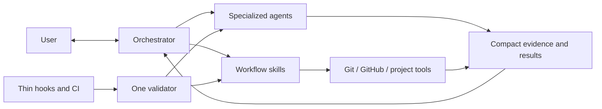

# Orchestra Architecture

## Architectural objective

Build a Codex-native orchestration product whose complexity is dominated by
software delivery work, not by its own control plane.



## Target repository shape

```text
Orchestra/
├── README.md
├── VISION.md
├── AGENTS.md
├── docs/
│   ├── WORKFLOW.md
│   ├── ARCHITECTURE.md
│   └── MIGRATION.md
├── .githooks/                 # optional thin wrappers only
└── codex/
    ├── .codex-plugin/
    ├── agents/                # specialized role profiles
    ├── skills/                # user-facing workflow entry points
    ├── scripts/               # deterministic mechanical helpers
    └── tests/
```

No Hermes or Devin source exists in the initial repository.

## Component responsibilities

### Orchestrator

Owns user dialogue, tiering, product clarification, routing, synthesis,
in-scope decisions, blocker resolution, delivery choice, and final judgment.
It holds compact context and delegates repository-wide reading.

### Specialized agents

Each recurring role has its own profile and prompt. Initial roles are:

- `repo_context_explorer`
- `planner`
- `plan_scope_auditor`
- `implementation_worker`
- `reviewer`
- `debugging_investigator`
- `web_researcher`
- `browser_acceptance_tester`
- `phase_committer`

PR polling and triage remain specialized internal roles in the PR-review lane.
PR-open synthesis and PR-merge verification may use dedicated Sol-high fallback
profiles when the root cannot safely perform the synthesis from compact input.

Future profiles such as architecture or frontend specialists are added when a
recurring task has a distinct context, tool set, acceptance standard, and prompt
that measurably improves results. They are not simulated through one universal
profile, and they are not created speculatively.

Profiles share only minimal conventions: input packet shape, output status,
evidence references, scope boundaries, and stop conditions.

### Workflow skills

Skills describe the behavioral route and call deterministic helpers. Expected
public lanes are:

- orchestration and discovery;
- planned delivery;
- phase commit;
- PR open;
- PR review;
- PR merge;
- local integration;
- repository delivery policy.

They should remain readable and route to deeper references only when needed.

### Mechanical helpers

Scripts perform operations that benefit from deterministic behavior: parsing
Git status, validating structured messages, collecting PR state, publishing a
PR body, resolving review threads, running configured checks, synchronizing
installed resources, and validating the suite.

Helpers return compact structured results. They do not make product decisions,
spawn agents, or own parallel approval systems.

## Minimal contracts

The rebuild may persist only contracts with direct consumers:

- repository delivery policy;
- approved plan and phase definition;
- structured commit message;
- compact commit result (`sha` or stable failure reason);
- PR context and PR-review state required to resume external asynchronous work;
- installation manifest for resources managed by the sync tool.

Do not introduce a global workflow event ledger, authority-bundle chain,
duplicate Git index, commit recovery journal, or general-purpose workflow state
engine unless real usage later demonstrates a requirement Git/GitHub cannot
meet.

## Model and reasoning configuration

The role matrix in `WORKFLOW.md` is canonical. Agent profile files map those
assignments to current Codex model identifiers and reasoning effort. Model
selection lives in one configuration surface so a future retune does not
require editing every skill.

Light tasks dispatch `implementation_worker` and `reviewer` with Luna max.
Standard and critical use the exact role matrix documented in `WORKFLOW.md`.

## Browser testing constraint

Codex's in-app Browser currently fails when invoked from a subagent. Therefore
`browser_acceptance_tester` must use Computer Use with Chrome:

1. Open a new Chrome tab for the target application.
2. Preserve unrelated existing tabs and sessions.
3. Execute the acceptance scenario through visible interaction.
4. Capture concise evidence and reproducible failure steps.
5. Return findings without editing source code.

The parent orchestrator may use the in-app Browser when appropriate, but the
delegated tester profile must not rely on it until capability evidence changes.

## Lightweight conformance and hooks

The workflow needs drift protection, but enforcement must remain thin.

### Canonical validator

`codex/scripts/validate_suite.py` is the only suite conformance engine. Its
checks should stay deterministic and fast enough for local use. It validates:

- required files and plugin metadata;
- skill links and profile references;
- model matrix/profile consistency;
- concise AGENTS/runtime instructions;
- forbidden legacy dependencies and paths;
- representative workflow contract tests.

It does not validate live approvals, replay agent history, or inspect unrelated
consumer repositories.

### Hooks

The Orchestra source repository should install one versioned pre-commit wrapper
that invokes the validator's quick mode. Consumer repositories do not receive
that hook unless their user explicitly opts in. No separate pre-push workflow is
required initially.

Hooks must:

- contain no independent workflow policy;
- avoid network calls and agent launches;
- never mutate files, stage changes, or commit;
- finish quickly and print one actionable failure;
- be installable and removable explicitly.

CI may call the full validator later. Hook, CI, and manual validation must not
implement three competing rule sets.

### Behavioral tests

Tests protect the few important invariants:

- light classification fails closed on ambiguity or risk;
- plan approval permits phase commits but not merge/deploy;
- PR-open authority includes the review/fix/push loop but not implicit merge;
- accepted review findings return to the same implementation owner;
- hooks call the validator without adding policy;
- local integration cleans only safely merged branches and worktrees;
- legacy authority/journal machinery is not reintroduced.

## Complexity safeguards

Before adding a persistent artifact, schema, lock, helper, or agent profile,
identify its direct consumer and the concrete failure it prevents. Prefer an
existing Git, GitHub, Codex, or project-test primitive when it already owns the
truth.

Warnings about size or complexity may inform review, but arbitrary line-count
limits do not replace engineering judgment. The strongest guard is architectural:
one source of truth, narrow roles, deterministic helpers, and deletion of
unused mechanisms.

## Installation boundary

The source repository is authoritative. A single sync tool owns only explicitly
managed Codex resources, supports dry-run and backup, preserves unrelated user
configuration, and can report what it installed. Installation must not be part
of ordinary task execution.
