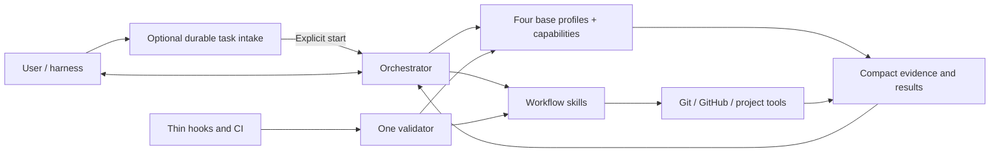

# Orchestra Architecture

## Architectural objective

Build a multi-host orchestration product whose complexity is dominated by
software delivery work, not by its own control plane. Codex and Cursor are
equal execution hosts; shared skills, helpers, and Git remain one copy.



## Target repository shape

```text
Orchestra/
├── README.md
├── VISION.md
├── AGENTS.md
├── docs/
│   ├── WORKFLOW.md
│   ├── ARCHITECTURE.md
│   └── ROADMAP.md              # non-canonical sequencing
├── .githooks/                 # versioned thin wrappers only
├── hosts/
│   └── cursor/                # Cursor spawn, roles, local plugin
└── codex/
    ├── agents/                # four Codex TOML base profiles
    ├── control/               # local prepared-task Kanban and native-chat ownership
    ├── skills/                # public lanes and internal playbook references
    ├── scripts/               # deterministic mechanical helpers
    └── tests/
```

## Component responsibilities

### Durable task intake

`codex/control/orchestra_control` and the thin `task_control.py` entry point own
one private prepared-task Kanban. Their direct consumers are
`$orchestra-task`, the stdio MCP adapter, the read-only Hub, and harnesses using
the JSON CLI. Capture and preparation are inert. They never launch an execution
host, create a checkout, select permissions, or own an implementation process.

`control.sqlite3` owns UUID and immutable human ID, briefs, origin references,
notes, preparation state, revision and document digests, native-chat ownership,
and transfer generation. Complete private context, specification, and marker
documents live under `$HOME/.orchestra/tasks/<short-id>/`. The v3 migration
leaves preexisting tasks without human IDs and retains the old run, turn, and
interaction tables as read-only legacy history. New public code exposes no App
Server operation. Native-chat adoption requires the adapter-provided conversation
identity (`CODEX_THREAD_ID` on Codex; on Cursor, the plugin `sessionStart` hook
verifies `session_id == conversation_id` and exports that value as
`ORCHESTRA_HOST_THREAD_ID`). The
chat then invokes normal Orchestra. Coordinator receives the same UUID only
after checkout creation. Hub joins both stores by UUID and remains GET-only.
Cooperative transfer remains owning-chat plus stable checkpoint. When that
chat cannot release the card, explicit reclaim from another native host chat
swaps ownership without passing through `ready`.

The short-ID namespace has one allocator: the transaction in Task Control.
Coordinator stores no short ID, direct tasks have none, and clients may expose
one only after an exact UUID join to Control. Consequently concurrent chats do
not need leases or a second counter: prepared cards serialize in the existing
SQLite transaction, while direct tasks use repository plus title.

### Orchestrator

Owns user dialogue, tier recommendation, product clarification, capability routing,
synthesis, the local task plan, in-scope decisions, blocker resolution, phase
commits, PR synthesis and observation, delivery choice, and final judgment. It
holds compact authority and decision context and delegates repository-wide
reading. Current source and Git remain authoritative; task-private evidence
artifacts let downstream agents navigate prior analysis without requiring the
root to rewrite it.

The root preserves the approved objective, constraints, acceptance, and
authority while treating any proposed mechanism or causal explanation as a
hypothesis to test against current evidence. It owns user-facing explanation
and distinguishes verified facts, supported inference, and uncertainty. It may
use an available visualization capability when a complex sequence, hierarchy,
comparison, or mapping becomes materially clearer. Simple prose is the default,
missing visualization support is non-blocking, and delegated agents never own
user-facing visualization.

After obtaining a bounded minimum brief, the orchestrator recommends an initial
tier with concise risk and cost-benefit evidence, and the user chooses the
active tier. It performs a short read-only Git and execution-readiness preflight.
The root uses Git directly to create a collision-free task branch in either a
managed Orchestra-root worktree or the current clean hybrid checkout before
dispatching repository analysis. It keeps that
task-checkout identity in transient context before plan approval, registers a
best-effort local coordination snapshot, and passes the exact checkout to every
capability. Coordination failure is reported but never changes authority or
prevents the existing inline-packet path.

The first repository-context pass grounds the continuing specification dialogue
and feasibility-determining facts. Later passes answer only newly material
factual questions through targeted deltas. The root confirms the complete
specification and recommends any justified tier change after consuming that
evidence, before formal planning; the user chooses.

For each implementation phase, the root also keeps transient handles for the
implementation owner, reviewer, one verifier per used verification capability,
and only explicitly retained non-browser temporary processes created for that
phase. Agents close their owned resources before each handoff by default while
remaining available for fixes, reruns, and delta review. Before commit, the
root follows up only on authorized retention or incomplete cleanup. Agent and
resource handles remain in memory.
At any earlier handoff, blocked cleanup prevents downstream dispatch and
receives one cleanup-only return to the same owner; failure to clear it blocks
the phase. A source-read-only task tab or window may remain partial until phase
teardown.
Best-effort activity snapshots expose material progress but do not prove that an
agent or process is live and never participate in commit safety.

The root also projects material progress into the task's localized `summary`
for read-only external clients. It uses approved phase-manifest counts,
reviewer handoffs, root-accepted finding IDs, Git commits, and verified delivery
results directly rather than asking a monitor to infer workflow semantics.
This projection adds no workflow database or event log. Task Control remains
the sole source of an adopted card's short ID and confirmed human title;
Coordinator remains the source of current execution fields and never assigns a
short ID. The Hub attaches those Control fields only on an exact UUID match.

The active implementation owner defines a stable observation boundary. Until
that owner returns an outcome or blocker, the root coordinates without reading
the evolving implementation diff, exercising it with speculative canaries, or
sending design corrections. At each handoff the root may perform one bounded
Git identity, status, allowed-scope, `diff --check`, and evidence-inventory
check. A root-originated correctness investigation completes against the
current source and diff before it produces one consolidated finding packet with
evidence, impact, and acceptance.

At that stable boundary, the root also owns disposition of material context
discoveries returned from any role. It may route the producing report to a
named current-task consumer, validate a consequential claim through one
targeted `repository_context` delta, replace an affected phase, persist durable
knowledge through an already-authorized source-documentation edit, or explicitly
defer or discard the candidate. This judgment never runs concurrently with an
active mutable implementation owner and never lets a discovery expand its
producer's authority.

Approved plans expose context without creating a context store: the overview
contains a provenance-preserving `Review context` index and each phase names its
exact evidence dependencies plus exact, non-glob `Context maintenance paths` or
`none`. The implementation reviewer consumes the cited evidence directly and
records `Context basis` while remaining read-only. A validated descriptive
correction returns to the same implementation owner, then receives a fresh
repository-context delta, affected verification, and delta review. Normative or
uncertain conflicts remain intent, implementation, planning, or authority
questions rather than automatic documentation updates.

### Base profiles and capabilities

Orchestra has exactly four behavior-only base profiles:

- `orchestra_analyst` gathers bounded evidence, researches, plans, analyzes architecture,
  or diagnoses difficult failures. It does not edit implementation files,
  commit, route agents, or claim product authority.
- `orchestra_implementation_worker` owns scoped code and test changes for an approved
  packet. It may implement general or frontend work, but does not independently
  review itself, commit, or manage delivery.
- `orchestra_reviewer` independently examines plans, architecture, code, and meaningful
  deltas. It reports evidence-backed findings and never silently implements
  them.
- `orchestra_verifier` runs targeted checks, runtime acceptance, or browser acceptance
  and reports observed evidence. It does not edit source code or reinterpret a
  failing result as success.

Each dispatch composes one profile with one explicit named capability selected
by the root. `general_implementation` and `independent_review` are assignment
keys whose behavior stays in the base `orchestra_implementation_worker` and `orchestra_reviewer`
prompts; they have no internal playbooks. Internal playbooks exist only for
`repository_context`, `web_research`, `technical_planning`,
`difficult_debugging`, `frontend_implementation`, `browser_acceptance`, and
`runtime_verification`. Architecture guidance is one shared reference used with
`technical_planning` or `independent_review` when named; the
`architecture_analysis` assignment has no separate playbook. Playbooks are
internal references, not public skills or additional personas. Public skill
identifiers remain stable except for the additive implicit
`orchestra-project-start` greenfield entry point.

Frontend implementation and browser acceptance are independent capabilities on
different profiles. Root-owned plan authority, commits, PR observation,
routing, and final judgment add no agent profile or capability key; a
dispatched technical planner may author the exact candidate documents that the
root approves or rejects.

The implementation owner, reviewer, and each capability verifier form a bounded
phase cohort. One-shot analysts close after their result is consumed. The cohort
closes only after final phase evidence is consumed, preserving relevant context
without carrying implementation state across phases. Analysis agents are
one-shot except that a technical planner remains open through a dispatched
plan-review correction loop and closes before implementation.

At a user-directed tier transition, the root waits for the active tool call,
collects the exact worktree state, progress, evidence, and owned resources,
closes only agents whose immutable assignment changes, and creates replacements
only when needed. The worktree and valid evidence provide continuity; there is
no workflow restart, transition commit, or tier-history subsystem.

Profiles share only minimal conventions: explicit capability and authority,
worktree, exact target artifact identifiers and roles, revision identity,
accepted finding identifiers, new context delta, stop conditions, and
outcome-first output status. Reusable results are complete
revision-identified task-private Markdown artifacts; returns carry produced
identifiers, blockers, risks, and requested decisions instead of replaying
content. Objective, scope, acceptance, verification, plan details, and prior
findings are read from named documents. Publication failure falls back to the
complete inline result or an exact private path already recorded in the
approved manifest.
Revision identity still distinguishes a committed revision from a dirty
worktree or diff state and names affected paths.

The implementation-review packet additionally carries the exact
`repository-context` and `context-delta` evidence required by the approved
overview and phase, or complete labeled inline fallbacks. This is routed
evidence, not a profile, capability, persisted packet, or new artifact kind.

Every profile applies the same owner-cleanup contract. It tracks task-owned
servers, managed or detached processes, terminal sessions, Chrome connector
tabs, and in-app Browser tabs in live context; closes them before a final,
failed, or blocked handoff; and preserves unrelated user state. Analysts and
reviewers never retain resources across a handoff. Implementers and verifiers
may retain only an explicitly authorized non-browser resource category and
report its exact handle. Browser tabs are always fresh per run and never
retained across a handoff. Each handoff declares cleanup as `pass`, `partial`,
or `blocked` plus any authorized retained resources. This is an agent
instruction and transient return contract, not semantic artifact content, a
registry, or a mechanical guarantee.

When a role discovers new material context outside the immediate report
purpose, it records a conditional evidence-backed entry with a report-local
stable identifier and returns the composite artifact-and-entry identifier when
publication succeeds. On inline fallback it returns the local identifier beside
the complete report, which downstream packets keep together. The entry remains
part of the existing report kind. It is not an authority grant, canonical
documentation, or a separate artifact, and no empty section is emitted when
nothing new was found.

Every profile preserves the approved objective, constraints, acceptance, and
authority. A proposed mechanism or causal explanation is not evidence by
itself: profiles distinguish observed facts, supported inference, and
uncertainty, and report a conflict instead of silently broadening or replacing
the approved result.

For approved implementation, focused read-only inspection of the affected flow
and relevant callers does not expand edit authority. The worker chooses existing
repository, standard-library, native-platform, or installed primitives by actual
constraints, corrects the supported root cause at the causal boundary that
explains the affected behavior within scope, rejects symptom-only patches, and
records a limitation only with evidence and a concrete revisit trigger. Review
treats complexity as material only when an unsupported consumer, requirement,
or reproducible risk makes it defect-prone; size or novelty metrics alone do
not establish a finding.

### Workflow skills

Skills describe the behavioral route and call deterministic helpers. Expected
public lanes are:

- implicit greenfield project start;
- explicit orchestration and discovery;
- planned delivery;
- phase commit;
- PR open;
- PR review;
- PR merge;
- local integration;
- repository delivery policy.

They should remain readable and route to deeper references only when needed.

### Mechanical helpers

Scripts perform operations that demonstrably benefit from deterministic
behavior: bounded Git inspection, initializing and safely cleaning the one
reserved worktree-local task-state directory, loading delivery policy, running
configured argv checks, opening or observing a PR through direct `gh`, merging
an authorized clean PR with guarded task-resource cleanup, integrating a local
fast-forward, synchronizing managed resources through direct sync, and
validating the suite. `coordination.py` is a separate fail-soft task and
activity snapshot helper; it never performs Git mutations or product decisions.

Helpers return compact structured results. They do not make product decisions,
spawn agents, or own parallel approval systems. A helper must reduce the total
agent, tool, time, and repair cost of its operation; deterministic behavior is
not a reason to duplicate Git or the root's judgment. The root commits with
direct Git by default, may use the narrow exact-path helper, and invokes the PR
helper directly to observe GitHub state.

## Minimal contracts

Orchestra may persist only contracts with direct consumers:

- repository delivery policy;
- one private prepared-task Kanban store at
  `$HOME/.orchestra/control.sqlite3`, consumed by `task_control.py`, its stdio
  MCP adapter, the read-only Hub, and `$orchestra-task`;
- one non-authoritative local task snapshot store at
  `$HOME/.orchestra/state.sqlite3`;
- revision-identified Markdown artifacts in each task worktree's ignored
  `.orchestra/artifacts` directory;
- one root-owned approved task plan per confirmed checkout at
  `.orchestra/plan.md`;
- concise commit intent and validation in Git history;
- compact optional-helper result (`committed` with `sha`,
  `nothing_to_commit`, or `blocked` with the observed reason);
- one PR-CONTEXT capsule in the GitHub PR body;
- direct-sync manifest consumed by install, update, status, and uninstall.

The installed session-model helper is a read-only runtime probe consumed only
by the dual Orchestra routing skill. It persists no state and returns a compact
JSON result.

The provisional specification remains in conversation. An unapproved formal
candidate is one `plan-overview`, one `plan-phase` per phase, and optional
`plan-review` artifacts. Its current membership is an explicit bundle of IDs,
never whichever artifacts are newest. Only after approval does the root write
`plan.md` as `active`: task/Git identity, tier and decisions, approved overview
verbatim, and an exact phase manifest with IDs, private paths, artifact
revisions, progress, commits, blocker, and next action. Phase details are not
duplicated. Git remains authoritative for branch, HEAD, commits, and worktree
state; the plan carries approved intent, exact bundle selection, and progress.
Task identity records whether the task is `prepared-card` or `direct`; only the
former carries the exact Control UUID, canonical short ID, and confirmed title
returned by adoption. Resume reconciles those values rather than recomputing
them.

Every overview includes the semantic `Review context` section, and every phase
includes semantic context dependencies plus `Context maintenance paths` set to
exact versioned human-readable documentation paths or `none`. These sections
add no `plan.md` manifest field, coordination column, or workflow state.

Branches and worktrees are Git resources, not a new Orchestra state store.
Every new formal task uses an Orchestra-owned collision-free branch. Managed
mode owns its portable worktree; hybrid mode preserves the user/host-owned
checkout and owns only the task branch and reserved worktree-local private
state. The same live preapproval task may
continue in memory; later reuse requires the approved plan's checkout path,
branch, base, and HEAD to agree with Git. Rejected planning and completed
delivery clean only resources that exact Git evidence proves safe.

The previous clean PR head exists only in root memory between consecutive
observations. GitHub owns PR, check, and review-thread state; Orchestra creates
no local PR state file.

The coordination store contains two snapshot concepts only: tasks and material
agent activities. Stages are labels rather than validated
transitions. The store retains completed task metadata. It has no
authority, event history, heartbeat requirement, delete command, or automatic
import of preexisting tasks. A failed update is telemetry loss, not workflow
failure. Artifacts are plain files in the task-private
`.orchestra/artifacts` directory initialized after branch/worktree creation, named
`<NN>-<kind>[-p<phase>].md`; the file name is the identifier, the filesystem
is the only locator, and they follow the task worktree lifecycle. The
self-ignored ownership marker keeps Git status clean; tracked, ambiguous, or
unsafe collisions block before capability dispatch. Legacy tasks continue on
their prior Git-private paths without migration or dual writes. Agents return
inline evidence when artifact publication fails.

Artifact `kind` is a file-naming convention:
`repository-context`, `context-delta`, `plan-overview`, `plan-phase`,
`plan-review`, `implementation-report`, `verification-report`,
`implementation-review`, `debugging-report`, and `pr-review` only when PR
analysis has a downstream semantic consumer. Corrected overview and phase
documents are immutable complete replacements. Mechanical start, completion,
commit, push, check, and merge facts remain activity, Git, or GitHub state.

Material context discoveries remain sections of those existing reports and
share their task-private lifecycle. They become cross-task knowledge only when
an authorized implementation changes the repository's canonical versioned
documentation (or the applicable existing Orchestra guidance); task cleanup
does not promote them automatically. `repository_context` alone may validate a
reported candidate into a targeted `context-delta`. No discovery registry,
global context file, coordination column, or additional artifact kind exists.

Each discovery preserves evidence status separately from context role:
`descriptive` current-state information, `normative` intended behavior or
constraint, or `uncertain`. Only a validated descriptive claim at an exact
phase-authorized documentation path may receive `persist`; executable
configuration and operational data remain normal implementation scope. The
same owner makes the change, repository context revalidates it independently,
and the same reviewer evaluates the meaningful delta before commit.

The root keeps a compact manifest of current IDs, revision, accepted findings,
risks, and decisions. It opens complete documents for specification and
approval, authority or risk judgment, and failed convergence. After a second
material plan review it observes convergence; before a third correction, or
immediately for marginal, contradictory, or out-of-scope findings, it
adjudicates the exact bundle and reviews. No review counter or limit persists.

The bounded prepared-task Kanban is not a workflow authority. Do not
introduce a global workflow event ledger, authority-bundle chain, duplicate Git
index, commit recovery journal, event-sourced board, benchmark control plane, or
general-purpose workflow state engine unless real usage demonstrates a
requirement these narrow stores cannot meet. The root uses the one-shot
`adopt_worktree.py` helper only because Git does not carry selected dirty paths
into an Orchestra task worktree; that helper keeps no state.

Schema v4 adds descriptive `task_initiatives`, immutable directed
`task_dependencies`, Git common-dir identity, and exact completion and delivery
revisions. Initiative membership groups cards but has no state or executable
human ID. Parallelism is a read-time graph derivation. The Control service owns
transactional decomposition, DAG validation, dependency satisfaction, and
native-chat delivery registration; the CLI supplies current Git identity and
ancestry evidence. The Hub accepts control schemas v3 and v4 during migration,
projects initiative/dependency fields through an allowlist, and stays GET-only.

## Host adapters

Shared product, skills, packets, artifacts, Git, and the four role skills are
host-neutral. Each execution host supplies only spawn/wait/close, the model
matrix, conversation identity, permissions, and `browser_route`.

The root detects the host from available tools: Codex when `spawn_agent` and
`wait_agent` exist; Cursor when `Task` exists. It never mixes protocols in one
task. Codex keeps `fork_turns: none`, V1 `close_agent`, and V2 completed-state
evidence. Cursor uses a fresh isolated Task per dispatch, may `resume` the same
phase-cohort agent, and never uses `resume: self` for a reviewer. Cursor Task
`subagent_type` is a closed enum; custom `~/.cursor/agents` files are not the
dispatch API.

Cursor has no native/external mode and does not run `session_model.py`. Codex
mode detection remains Codex-only. Shared helpers, checkout-mode, and
worktree-root live under `${ORCHESTRA_HOME:-$HOME/.orchestra}`; `$CODEX_HOME`
remains the Codex-only install root for profiles, Guardian, and session
inspection.

## Model and reasoning configuration

The approved Codex capability matrices are documented in `WORKFLOW.md`. On
Codex, the user selects the root's current Sol medium or Sol high entry outside
Orchestra. Source retains only the `native` and `external` matrices; the `dual`
matrix is composed deterministically at sync time from those two sources
(native wrapped under `modes.native`, external wrapped under `modes.external`
with its Orchestra V1 aliases). Direct Codex sync installs exactly one matrix
at the canonical `$CODEX_HOME/orchestra/roles.toml` path and records that
install choice.

Cursor reads one host matrix at
`${ORCHESTRA_HOME:-$HOME/.orchestra}/hosts/cursor/roles.toml`. It offers
`minimal`, `standard`, and `critical` with no mode split. This cut assigns
`minimal` (Luna high for low-analysis capabilities, Grok 4.6 medium for
implementation and remaining judgment) and `standard` (Grok 4.6 medium / high /
xhigh). Selecting `critical` on Cursor blocks until those rows are assigned.

The dual matrix contains `native` and `external` modes. Before task setup, a
read-only helper resolves the current rollout identified by `CODEX_THREAD_ID`,
reads its latest turn context, and accepts only native Sol V2 or the Orchestra
Sol V1 compatibility alias. It maps those combinations to the corresponding
mode and requires medium or high root effort. The result is kept in memory
before plan approval and in plan Decisions afterward. It is immutable for the
task and must match again on resume. This is routing evidence, not a new model
selector: Orchestra never changes or respawns the root.

Legacy installations remain fixed and do not invoke session detection. Their
existing sync and task behavior stays compatible. In the dual matrix, native
mode is equal to the legacy native matrix. External mode is equal to the legacy
external matrix except that every native OpenAI model reference uses a
CodexBridge `orchestra-v1/` alias. The bridge publishes those aliases only in
catalog mode, marks them V1, rewrites them to their native target before
forwarding, and never sends them through CLIProxyAPI.

The two logical modes differ in their standard assignments, and external alone
adds the cost-focused `luna` tier. They share one critical
capability/profile/reasoning matrix; external critical uses the V1 Sol alias so
it never crosses protocol versions. The external Luna source assignments use
the native Luna slug, while dual composition rewrites them to the Orchestra V1
Luna alias. Skills pass the selected explicit overrides when spawning a
profile. Profiles contain behavior; playbooks contain capability instructions
only for the seven capabilities listed above, and architecture guidance remains
one shared reference.

The task's active tier is a user-selected lookup key inside its immutable mode.
Native accepts `standard` and `critical`; external additionally accepts `luna`
as an opt-in only when the user explicitly prioritizes cost for ordinary,
bounded work. `standard` remains the default recommendation, and material risk
still calls for `standard` or `critical`. The active tier may change only after
explicit user direction without changing the mode. Because spawned agents
cannot change model or reasoning effort, a safe transition replaces only live
agents whose assignment differs and passes them a compact continuation packet.
Changing between native V2 and external V1 requires a new task started from the
matching root selector entry.

Assignment resolution still prefers the exact installed model. A narrow runtime
compatibility rule permits only `repository_context` to retry internally with
Luna at reasoning `high` when its assigned model is rejected as unsupported
before execution. Legacy installations retain their existing fallback; dual
external uses the installed Orchestra V1 Luna alias; dual native blocks instead
of crossing protocol versions. The root records a permitted substitution only
in memory for the live task. It creates no visible Codex task, persists no
fallback, changes no matrix, and blocks unsupported models for every other
capability.

A second critical review requires a named measurable risk. No Orchestra
assignment uses Sol xhigh. Frontend work and browser acceptance remain separate
dispatches.

Operational notes for the V1 aliases: alias catalog metadata must stay
synchronized with the native metadata (the context-window entry controls when
Codex compacts), `ultra` reasoning effort is not used on V1 aliases, and
encrypted compaction blobs are not portable across alias/native routes.

## Verification environment and browser routing

On Codex, Orchestra synchronizes Guardian (`:workspace`, `on-request`, and
Auto-review) as the default. Cursor observes the host permission choice and
never writes permission configuration. The active permission choice for the
task, host, or launcher remains authoritative; the complete permission rules
live in `docs/WORKFLOW.md` ("Test permissions and browser routing").
Deterministic syntax, type, compile, lint, import, assertion,
validation-contract, and CLI-usage failures remain real failures.

Browser packets use the transient `browser_route` value `auto`, `in_app`, or
`chrome`. An explicit user route is attempted even as a tool canary and remains
fixed without fallback; an agent may report its technical blocker but may not
veto or substitute it. On Codex, without an explicit route, `auto` selects the
dedicated Chrome connector first and uses Codex's in-app Browser only for a
technical availability or capability gap that the in-app Browser can satisfy.
On Cursor, `auto` maps to Playwright and `in_app` is blocked. `chrome` selects
only the dedicated Chrome connector on both hosts. Computer Use and standalone
browser automation are not browser route substitutes, except that Cursor `auto`
uses Playwright as the host-mapped surface.

Every browser run creates a new task-owned tab rather than claiming or reusing a
user tab or a prior run's tab. Frontend iteration and independent browser
acceptance use separate task tabs. An allowed `auto` fallback captures the
Chrome blocker, closes any task-owned Chrome tab already created, and repeats
the complete scenario in a new in-app Browser task tab. Product failures,
timeouts, and selector errors remain evidence on the selected surface and never
trigger fallback. Each task tab is closed before a successful, failed, or
blocked handoff and a rerun opens another new tab; browser tabs cannot be
retained for phase reuse. Browser-work handoffs stop their owned supporting
processes and report `retained_resources: none`. Unrelated tabs, windows,
authenticated sessions, processes, and user state are preserved, and Orchestra
never closes the Chrome application or a shared window.

## Phase resource lifecycle

Phase agents clean exact owned test processes, terminal sessions, and task tabs
before every handoff by default, recreating them for a later fix or rerun when
needed. Only packet-authorized non-browser resource categories may be retained
for phase reuse, with exact handles reported; browser task tabs never qualify.
Before commit, the root skips agents that
reported `cleanup: pass` and no retained resources, sends one parallel
cleanup-only follow-up to owners with retained resources or incomplete cleanup,
and stops root-owned shared test processes. Under V1 it then calls
`close_agent`; under V2, which exposes no true close operation, it requires
completed agents with no active descendants or retained resources. An active
agent or process capable of writing the worktree blocks commit; an unclosed
source-read-only task tab is reported as partial cleanup without invalidating
the commit.

Live-agent observation uses the host wait contract with a ten-minute maximum.
On Codex that is `wait_agent`. On Cursor it is a background Task plus
completion notification without busy-polling. Completion wakes the root
immediately; timeout does not contact, interrupt, restart, or fail the agent.
After 30 accumulated minutes, only concrete blocker evidence justifies
intervention.

Once the root gives a stable revision packet to a verifier, it stops
speculative source review until that verification returns. It interrupts a
verifier only when the revision changed or a finding was first confirmed
against the exact current source and diff and invalidates the packet. Every
required verifier must return `pass`, or a `blocked` result explicitly accepted
by the root, before `independent_review` is dispatched. An active verifier or a
failed verifier awaiting its rerun is not final evidence.

No helper discovers or kills processes globally. Resource handles exist only in
root memory, apply only to resources Orchestra created, and expire at phase
teardown. Commit execution remains a separate direct Git operation.

## Lightweight conformance and hooks

The workflow needs drift protection, but enforcement must remain thin.

### Canonical validator

`codex/scripts/validate_suite.py` is the only suite conformance engine. Its
checks should stay deterministic and fast enough for local use. It validates:

- required canonical files and direct-sync boundaries;
- skill links and profile references;
- capability matrix/profile consistency, including the Cursor `minimal` and
  `standard` matrices;
- concise AGENTS/runtime instructions;
- forbidden distribution paths and historical product narrative;
- representative workflow contract tests.

It does not validate live approvals, replay agent history, or inspect unrelated
consumer repositories.

### Hooks

The Orchestra source repository should install one versioned pre-commit wrapper
that invokes the validator's quick mode. Consumer repositories do not receive
that Orchestra validator hook, and no separate pre-push workflow is required.

Orchestra validator hooks must:

- contain no independent workflow policy;
- avoid network calls and agent launches;
- never mutate files, stage changes, or commit;
- finish quickly and print one actionable failure;
- be installable and removable explicitly.

CI may call the full validator later. Hook, CI, and manual validation must not
implement three competing rule sets.

### Behavioral tests

Tests protect the few important invariants:

- only explicit `$orchestra`, native-host-chat adoption of a ready
  `$orchestra-task`, or an unequivocal use/start Orchestra imperative activates
  the workflow;
- ordinary capture and preparation remain inert and never create a host chat,
  branch, worktree, tier, permission override, or implementation run;
- immutable case-insensitive human IDs are never reused, while Coordinator and
  Control use the same UUID after checkout creation; direct tasks never invent
  a human ID and clients attach one only through an exact Control UUID match;
- adoption is exclusive to one native chat, changed Git requests only a focused
  context delta, and stable-checkpoint transfer preserves worktree and plan;
  when the owning chat cannot release the card, explicit reclaim from another
  native chat with `task reclaim --authorized` preserves the same worktree and
  plan;
- the visible primary skill name is `Orchestra`;
- planning-only host mode reuses context without mutation and continues when
  execution-capable without a second invocation;
- the skill never changes the host into a planning-only mode;
- ordinary plan requests, direct implementation, and descriptive mentions do
  not activate Orchestra;
- initial routing follows minimum brief, installed-mode resolution, tier,
  read-only preflight, sibling worktree creation, focused repository context,
  final specification, then formal plan;
- repeated repository context requests only targeted deltas and every one-shot
  analyst closes after its result;
- only repository context may use the transient Luna-high unsupported-model
  fallback, after attempting the installed assignment first and without
  crossing from dual native V2 into V1;
- Cursor has no native/external mode, does not run `session_model.py`, and
  dispatches through isolated Task workers rather than Codex profiles;
- native Codex defines only standard and critical assignments, while Codex
  external adds exactly one complete Luna assignment matrix;
- Cursor offers `minimal`, `standard`, and `critical` with no native/external
  mode, assigns `minimal` and `standard` in this cut, and blocks unassigned
  Cursor `critical`;
- plan approval permits phase commits but not merge/deploy;
- every formal task creates one collision-free `orchestra/*` branch before work;
- managed mode creates an isolated Orchestra-root worktree, while hybrid mode
  branches in place only from a clean primary checkout or linked worktree;
- task setup creates one ignored `.orchestra/` state directory inside the
  selected worktree, rejects unsafe collisions, leaves Git status clean, and
  supplies exact plan and artifact paths without protected-write escalation;
- neither mode implements directly on the starting branch or `main`;
- a fresh canonical-base task resolves and fetches the configured upstream
  before fixing its base revision; a fetch failure blocks, while an absent
  remote/upstream permits an explicitly identified local base that is not
  remotely verified;
- managed mode branches directly from the verified upstream commit without
  updating the base checkout; hybrid mode accepts equality, fast-forwards a
  strictly behind clean base, and blocks when the local base is ahead or
  diverged;
- explicit noncanonical bases preserve stacked work, and setup never performs
  a pull, implicit merge, or rebase;
- scoped dirty adoption uses `adopt_worktree.py` as a one-shot selected-path
  import into the clean task worktree;
- fresh task `HEAD` equals the base revision; adopted task `HEAD` equals the
  adopted source revision while retaining the integration base;
- task resume requires exact plan, path, branch, base, and HEAD;
- local plan resume reconciles against Git instead of overriding it;
- phase owners, reviewers, and capability verifiers are reused only within one
  phase, clean owned resources before each handoff, and retire before its
  commit using the active protocol's lifecycle evidence;
- the synchronized Guardian defaults remain distinct from an authoritative
  explicit task, host, or launcher permission choice, and under Guardian test
  failures use at most one exact automatically reviewed boundary escalation
  with no denial retry;
- the root recommends a tier, the user selects it, and a user-directed tier
  transition preserves unchanged work and evidence;
- browser routing honors explicit selection; Codex otherwise prefers the Chrome
  connector with capability-based in-app Browser fallback, while Cursor maps
  `auto` to Playwright and blocks `in_app`, using a fresh task-owned tab per
  run and closing it before every handoff;
- the first review covers the bounded target while delta reviews stay focused;
- the implicit greenfield skill never silently activates Orchestra;
- PR-open authority includes the review/fix/push loop but not implicit merge;
- authorized PR merge cleans only exact unchanged local and remote task resources;
- accepted review findings return to the same implementation owner;
- implementation review receives exact project-context evidence, records its
  `Context basis`, and blocks acceptance when a material judgment depends on
  missing, stale, or conflicting context;
- every material context discovery has an evidence-backed composite identifier
  when published, or a local identifier kept with its complete inline fallback,
  plus an explicit root disposition, while only `repository_context` can
  publish a validating `context-delta` and durable promotion requires
  authorized versioned source;
- validated descriptive context corrections use exact non-glob phase paths,
  return to the same implementation owner, and receive revalidation,
  verification, and delta review; normative conflicts never follow code
  automatically;
- the root alone uses optional user-facing visualization, only when it
  materially clarifies a complex relationship and never as a workflow
  dependency;
- proposed mechanisms remain hypotheses while the approved objective,
  constraints, acceptance, and authority are preserved;
- planned and implemented tests map to observable acceptance or a named
  regression risk instead of duplicated, count-driven, or implementation-detail
  coverage;
- hooks call the validator without adding policy;
- local integration removes only safely merged Orchestra-owned resources;
- managed and hybrid delivery remove only the recognized worktree-local task
  state, while hold and an unmerged PR retain it;
- rejected authority/journal machinery is not introduced.

## Complexity safeguards

Before accepting a persistent artifact, schema, lock, transaction layer,
helper, agent profile, or capability playbook, document:

- its named consumer;
- a demonstrated failure, explicit requirement, or reproducible risk;
- why an existing Git, GitHub, host, or project-test primitive is insufficient;
- lifecycle, ownership, and cleanup;
- why its cost is proportional;
- why a smaller direct implementation does not suffice.

Review only the delta after a finding. If a mechanism fails this gate, stop and
simplify it. Count root and delegated-agent context, tool calls, wall time, and
failure-repair loops in that cost. Do not harden against speculative
concurrency, crashes, adversarial inputs, or exotic filesystems without a
consumer requirement or reproducible risk.

The design explicitly rejects an authoritative workflow event ledger,
authority-bundle chain, duplicate Git index, commit recovery journal, Kanban
board, general-purpose workflow state engine, and repeated validation of
unchanged authority unless later evidence passes the same gate. Durable intake
is inert until explicit activation; the separate coordination snapshot is
observational and fail-soft.

Delivery uses exactly three focused helpers: `policy.py`, `pr.py`, and
`integrate_local.py`. The root invokes `pr.py` directly for open, observe, and
authorized merge and guarded post-merge cleanup; `pr.py` calls `gh` and direct
Git primitives and is not a generalized GitHub abstraction. Review-thread
observation uses one bounded GraphQL query because REST check and comment data
cannot establish thread resolution. Incomplete pagination remains `partial`,
never clean. Managed task worktree creation remains a direct root
`git worktree add` operation using the configured path and exact fetched
upstream commit for a remotely tracked canonical base. Hybrid task setup first
resolves and fetches that upstream, uses `git merge --ff-only <upstream>` only
when the clean local base is strictly behind, and then uses direct
`git switch -c` against its captured HEAD. Ahead or diverged bases block instead
of being rewritten. Synchronization records the absolute root, checkout
mode, and one reversible Codex permission backend.
Codex 0.146.0 or later receives the built-in `:workspace` profile with
`approval_policy = "on-request"` and
`approvals_reviewer = "auto_review"`; older clients block before mutation.
Historical manifest-owned Full Access and legacy blocks remain migration and
uninstall inputs only. No legacy sandbox mode, custom permission profile,
writable-root list, worktree helper, or command rule is installed. Direct App
Server launchers omit permission overrides to inherit those defaults. Explicit
launcher overrides remain authoritative and are neither rejected nor rewritten;
the exact workspace, on-request, and Auto-review values select Guardian
explicitly. User-owned profiles or sandbox blocks that cannot be migrated
unambiguously stop synchronization. When Guardian is active, the root proves
write access with a temporary canary before dispatch, then requests one exact
automatically reviewed escalation when direct Git must write protected shared
metadata; active worktrees in older locations are never migrated implicitly.
Scoped dirty adoption uses `adopt_worktree.py` as a one-shot selected-path
import into the task worktree.
Phase commits use direct Git by default or the existing narrow exact-path helper
when useful, never an agent.

The approved plan remains the source of the terminal phase commit. PR open, PR
merge, and local integration receive that exact full SHA as an explicit helper
argument and compare it with their effective task head before checks or
mutation. Helpers do not parse `plan.md` and no delivery state is duplicated.
Accepted PR fixes within approved intent update the affected terminal manifest
commit before push; new scope creates a new task.

Warnings about size or complexity may inform review, but arbitrary line-count
limits do not replace engineering judgment. The strongest guard is architectural:
one source of truth, narrow roles, deterministic helpers, and deletion of
unused mechanisms.

## Installation boundary

The source repository is authoritative. Installation uses only
repository-driven direct sync. A single sync tool owns explicitly managed
resources per requested host (`codex`, `cursor`, or `all`; default `codex`). It
supports dry-run and backup, preserves unrelated user configuration, reports
what it installed, and requires a restart when a Codex permission backend
changes. Orchestra runtime installation is never part of ordinary task
execution, and bootstrap of Orchestra itself must not invoke Orchestra.

Shared destinations are `$HOME/.agents/skills/<skill>` including their internal
playbook references, and `${ORCHESTRA_HOME:-$HOME/.orchestra}/` for helpers,
checkout-mode, worktree-root, and the Cursor host matrix. Codex-only
destinations remain the four `$CODEX_HOME/agents/<profile>.toml` files,
`$CODEX_HOME/orchestra/` for the Codex matrix, helper mirrors, manifest, and
deterministic current backups, plus the marked blocks in `$CODEX_HOME/AGENTS.md`
and `$CODEX_HOME/config.toml`. Cursor-only destinations are the local plugin
under `~/.cursor/plugins/local/orchestra` and the Cursor spawn reference. The
default `CODEX_HOME` is `$HOME/.codex`. The default `ORCHESTRA_HOME` is
`$HOME/.orchestra`. Cursor sync never writes Codex or Cursor permission
configuration.

The only managed content in `$CODEX_HOME/AGENTS.md` is the single block
delimited by `<!-- orchestra:start -->` and `<!-- orchestra:end -->`.

`status` and `apply --dry-run` are read-only. `apply` creates, upgrades, and
removes stale owned resources only after a complete preflight. `uninstall`
removes only content that still matches the manifest digest; drift and unrelated
configuration are preserved and reported. The generated manifest is ownership
evidence, while backups are bounded safety evidence rather than a recovery log.
An explicit user-owned sandbox mode, default permission profile, or incompatible
legacy sandbox table blocks preflight without byte changes. Synchronization
takes reversible ownership of `approval_policy`, `approvals_reviewer`, and
`default_permissions`, preserving their previous values for exact uninstall.
Only a manifest-owned permission block may migrate from historical legacy or
Full Access forms. Permission edits remove exact TOML spans and preserve all
unrelated bytes, including multiline strings.
