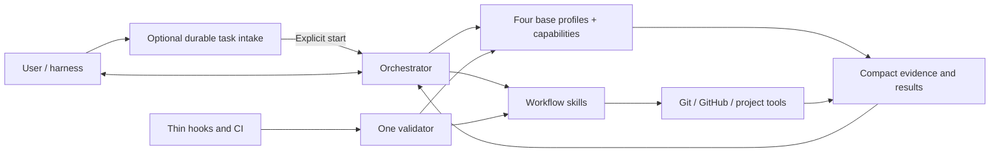

# Orchestra Architecture

## Architectural objective

Build a multi-host orchestration product whose complexity is dominated by
software delivery work, not by its own control plane. Codex, Cursor, Grok
Build, and Devin are equal execution hosts; shared skills, helpers, and Git
remain one copy.



## Target repository shape

```text
Orchestra/
├── README.md
├── VISION.md
├── AGENTS.md
├── orchestra.toml
├── .agent/
│   └── backend-testing.md
├── docs/
│   ├── WORKFLOW.md
│   ├── ARCHITECTURE.md
│   └── ROADMAP.md              # non-canonical sequencing
├── packaging/                # plugin metadata and usage; built from canonical sources
├── .githooks/                 # versioned thin wrappers only
├── hosts/
│   ├── cursor/                # Cursor spawn, roles, local plugin
│   ├── grok/                  # Grok Build spawn and roles
│   └── devin/                 # Devin spawn, roles, agent profiles, plugin hook
└── codex/
    ├── agents/                # four Codex TOML base profiles
    ├── control/               # local prepared-task Kanban and native-chat ownership
    ├── skills/                # public lanes and internal playbook references
    ├── scripts/               # deterministic mechanical helpers
    └── tests/
```

## Component responsibilities

### Durable task intake

`codex/control/orchestra_control` and the thin `task_control.py` entry point own
one private prepared-task Kanban. Their direct consumers are
`$orchestra-task`, the stdio MCP adapter, the read-only Hub, and harnesses using
the JSON CLI. Capture and preparation are inert. They never launch an execution
host, create a checkout, select permissions, or own an implementation process.

`control.sqlite3` schema v8 owns UUID and immutable human ID, briefs, origin
references, notes, preparation state, revision and document digests,
host-namespaced native-chat ownership, transfer generation, recoverable trash,
and safe-stop/cancellation timestamps. Complete private context, specification, and marker
documents live under `$HOME/.orchestra/tasks/<short-id>/`. The v3 migration
leaves preexisting tasks without human IDs and retains the old run, turn, and
interaction tables as read-only legacy history. New public code exposes no App
Server operation. Native-chat adoption requires the adapter-provided conversation
identity (`CODEX_THREAD_ID` on Codex; on Cursor, the plugin `sessionStart` hook
verifies `session_id == conversation_id` and exports that value as
`ORCHESTRA_HOST_THREAD_ID`; on Grok Build, `GROK_SESSION_ID`; on Devin, the
`SessionStart` hook supplies `session_id` as `ORCHESTRA_DEVIN_THREAD_ID`). The
chat then invokes normal Orchestra. Coordinator receives the same UUID only
after checkout creation. Hub joins both stores by UUID and remains GET-only.
The macOS app obtains bounded mutation authority only through the same local
Task Control JSON CLI; it never adds a Hub write endpoint. Prepared documents
may be replaced before first adoption, while any card with execution-owner
history must resume its existing checkout and plan.
Cooperative transfer remains owning-chat plus stable checkpoint. When that
chat cannot release the card, explicit reclaim from another native host chat
swaps ownership without passing through `ready`.

The explicit storage migration described in WORKFLOW "Durable task intake"
upgrades to schema v8. Ordinary commands never migrate an older database.
The migration atomically reconstructs the task table after recognizing the exact
column shape of v2 through v7, including the incompatible ownership and
safe-stop/trash variants that both used `user_version = 5`; its owner-harness
allowlist adds `devin`. Historical un-namespaced owners become `codex`;
unknown shapes roll back without changes, and every migration must pass
`foreign_key_check` before commit.

Task Control alone computes card action capabilities. The Hub reads compatible
control schemas and projects observational state only; the macOS app obtains
cards and capabilities from Task Control and joins only Hub progress by exact
UUID. State-check-plus-mutation operations serialize with an immediate SQLite
write transaction so lifecycle decisions cannot race adoption or completion.
A safe-stop request never interrupts an active owner. Transfer and finish
are blocked while it is pending; reclaim preserves it. At a stable boundary the
owner cleans resources, marks the existing plan blocked, and acknowledges with
its Codex, Cursor, Grok, or Devin identity. Cancellation preserves the
checkout and plan so reopening may return ownership to the same prior
conversation.

The short-ID namespace has one allocator: the transaction in Task Control.
Coordinator stores no short ID, direct tasks have none, and clients may expose
one only after an exact UUID join to Control. Consequently concurrent chats do
not need leases or a second counter: prepared cards serialize in the existing
SQLite transaction, while direct tasks use repository plus title.

The shared Git identity resolver separates clone identity from execution
location: `repository` is the validated primary worktree of the clone,
`worktree` is the specific task checkout, and Git common-dir is the comparison
key for cross-worktree preparation, adoption, resume, and registration. This
uses only local Git metadata. It neither resolves remotes nor treats a GitHub
URL as identity, so separate clones intentionally remain separate repository
groups. The existing columns and API shape are sufficient; rows that contain
older checkout paths remain readable and are not backfilled.

### Orchestrator

Owns user dialogue, tier recommendation, product clarification, capability routing,
synthesis, the local task plan, in-scope decisions, blocker resolution, phase
commits, PR synthesis and observation, delivery choice, and final judgment. It
holds compact authority and decision context and delegates repository-wide
reading. Current source and Git remain authoritative; task-private evidence
artifacts let downstream agents navigate prior analysis without requiring the
root to rewrite it.

The root preserves the approved objective, constraints, acceptance, and
authority while treating any proposed mechanism or causal explanation as a
hypothesis to test against current evidence. It owns user-facing explanation
and distinguishes verified facts, supported inference, and uncertainty. It may
use an available visualization capability when a complex sequence, hierarchy,
comparison, or mapping becomes materially clearer. Simple prose is the default,
missing visualization support is non-blocking, and delegated agents never own
user-facing visualization.

After obtaining a bounded minimum brief, the orchestrator recommends an initial
tier with concise risk and cost-benefit evidence, and the user chooses the
active tier. It performs a short read-only Git and execution-readiness
preflight, grounds the specification dialogue in focused repository context
(gathered directly or by a dispatched analyst), and confirms the complete
specification. Immediately after that confirmation the root uses Git directly
to create a collision-free task branch in either a managed Orchestra-root
worktree or the current clean hybrid checkout, keeps that task-checkout
identity in transient context before plan approval, registers a best-effort
local coordination snapshot, and passes the exact checkout to every
capability. Coordination failure is reported but never changes authority or
prevents the existing inline-packet path.

For each implementation phase, the root also keeps transient handles for the
implementation owner, reviewer, only verifiers required by the independent
gate, and only explicitly retained non-browser temporary processes created for
that phase. Agents close their owned resources before each handoff by default
while remaining available for fixes, reruns, and delta review. Before commit,
the root follows up only on authorized retention or incomplete cleanup. Agent
and resource handles remain in memory.
At any earlier handoff, blocked cleanup prevents downstream dispatch and
receives one cleanup-only return to the same owner; failure to clear it blocks
the phase. A source-read-only task tab or window may remain partial until phase
teardown.
Best-effort activity snapshots expose material progress but do not prove that an
agent or process is live and never participate in commit safety.

The root also projects material progress into the task's localized `summary`
for read-only external clients. It uses approved phase-manifest counts,
reviewer handoffs, root-accepted finding IDs, Git commits, and verified delivery
results directly rather than asking a monitor to infer workflow semantics.
This projection adds no workflow database or event log. Task Control remains
the sole source of an adopted card's short ID and confirmed human title;
Coordinator remains the source of current execution fields and never assigns a
short ID. The Hub attaches those Control fields only on an exact UUID match.

The active implementation owner defines a stable observation boundary. Until
that owner returns an outcome or blocker, the root coordinates without reading
the evolving implementation diff, exercising it with speculative canaries, or
sending design corrections. At each handoff the root may perform one bounded
Git identity, status, allowed-scope, `diff --check`, and evidence-inventory
check. A required user preview starts only at that handoff after every
Orchestra-owned resource is closed; no process is retained across the pause.
A fresh owner absorbs any in-scope user delta after resume. The frozen
revision is that post-absorption revision with green handoff checks.
A root-originated correctness investigation completes against the
current source and diff before it produces one consolidated finding packet with
evidence, impact, and acceptance.

At that stable boundary, the root also owns disposition of material context
discoveries returned from any role; discoveries never expand their producer's
authority or create a context store. Approved plans expose context without a
registry: the overview carries a provenance-preserving `Review context` index
and each phase names its exact evidence dependencies plus exact non-glob
`Context maintenance paths` or `none`. Repository conventions, including
normative code conventions, live in the consumer's tracked `.agent/` files and
reach workers as exact cited paths; applicable repository instructions retain
their own authority. Operational recipes follow the separate maintenance
lifecycle in WORKFLOW "Project verification". Disposition and persistence mechanics
live in `docs/WORKFLOW.md` ("Material context discovery").

### Base profiles and capabilities

Orchestra has exactly four behavior-only base profiles:

- `orchestra_analyst` gathers bounded evidence, researches, plans, analyzes architecture,
  or diagnoses difficult failures. It does not edit implementation files,
  commit, route agents, or claim product authority.
- `orchestra_implementation_worker` owns scoped code and test changes for an approved
  packet and acts as the first deterministic quality gate. It runs and
  autocorrects required local deterministic checks. It may implement general or
  frontend work, but does not independently review itself, commit, or manage
  delivery.
- `orchestra_reviewer` independently examines plans, architecture, code, meaningful
  deltas, tests, and verification evidence. It does not routinely repeat gates,
  reports evidence-backed findings, and never silently implements them.
- `orchestra_verifier` supplies dedicated independent runtime or browser evidence
  only when phase risk or policy requires it. It does not edit source code or
  reinterpret a failing result as success.

Each dispatch composes one profile with one explicit named capability selected
by the root. `general_implementation` and `independent_review` are assignment
keys whose behavior stays in the base `orchestra_implementation_worker` and `orchestra_reviewer`
prompts; they have no internal playbooks. Internal playbooks exist only for
`repository_context`, `web_research`, `technical_planning`,
`difficult_debugging`, `frontend_implementation`, `browser_acceptance`, and
`runtime_verification`. The existing `architecture_guidance.md` is the shared
architecture and engineering reference consumed by the relevant roles and
playbooks, including standalone use; operational routing and evidence placement
live in WORKFLOW "Engineering guidance and evidence". The
`architecture_analysis` assignment has no separate playbook. Playbooks are
internal references, not public skills or additional personas. Public skill
identifiers include the reusable engineering and project-verification entries,
explicit initiative coordination and Lite companion, greenfield project-start,
repository onboarding and explicit `orchestra-repo-maintenance`. Maintenance
reuses the four roles and existing execution routes; WORKFLOW "Repository
maintenance" owns its authority and lifecycle. Shared engineering guidance owns
the comment policy and prevention criteria; writing entries link them directly.

Frontend implementation and browser acceptance are independent capabilities on
different profiles. Root-owned plan authority, commits, PR observation,
routing, and final judgment add no agent profile or capability key; a
dispatched technical planner may author the exact candidate documents that the
root approves or rejects.

The implementation owner, reviewer, and each required capability verifier form
a bounded phase cohort. Ordinary deterministic non-critical phases have no
verifier unless the selected execution preset assigns the terminal gate to one. A required user preview closes the first owner before the pause;
after resume a fresh owner joins the remainder of the phase. One-shot analysts close after their result is consumed. The cohort
closes only after final phase evidence is consumed, preserving relevant context
without carrying implementation state across phases. Analysis agents are
one-shot except that a technical planner remains open through a dispatched
plan-review correction loop and closes before implementation.

At a user-directed tier transition, the root waits for the active tool call,
collects the exact worktree state, progress, evidence, and owned resources,
closes only agents whose immutable assignment changes, and creates replacements
only when needed. The worktree and valid evidence provide continuity; there is
no workflow restart, transition commit, or tier-history subsystem.

Profiles share only minimal conventions: explicit capability and authority,
worktree, exact target artifact identifiers and roles, revision identity,
accepted finding identifiers, new context delta, stop conditions, and
outcome-first output status. Reusable results are complete
revision-identified task-private Markdown artifacts; returns carry produced
identifiers, blockers, risks, and requested decisions instead of replaying
content. Objective, scope, acceptance, verification, plan details, and prior
findings are read from named documents. Publication failure falls back to the
complete inline result or an exact private path already recorded in the
approved manifest.
Revision identity still distinguishes a committed revision from a dirty
worktree or diff state and names affected paths.

The implementation-review packet additionally carries the exact
`repository-context` and `context-delta` evidence required by the approved
overview and phase, or complete labeled inline fallbacks. This is routed
evidence, not a profile, capability, persisted packet, or new artifact kind.

Every profile applies the same owner-cleanup contract. It tracks task-owned
servers, managed or detached processes, terminal sessions, Chrome connector
tabs, and in-app Browser tabs in live context; closes them before a final,
failed, or blocked handoff; and preserves unrelated user state. Analysts and
reviewers never retain resources across a handoff. Implementers and verifiers
may retain only an explicitly authorized non-browser resource category and
report its exact handle. Browser tabs are always fresh per run and never
retained across a handoff. Each handoff declares cleanup as `pass`, `partial`,
or `blocked` plus any authorized retained resources. This is an agent
instruction and transient return contract, not semantic artifact content, a
registry, or a mechanical guarantee.

When a role discovers new material context outside the immediate report
purpose, it records a conditional evidence-backed entry with a report-local
stable identifier and returns the composite artifact-and-entry identifier when
publication succeeds. On inline fallback it returns the local identifier beside
the complete report, which downstream packets keep together. The entry remains
part of the existing report kind. It is not an authority grant, canonical
documentation, or a separate artifact, and no empty section is emitted when
nothing new was found.

Every profile preserves the approved objective, constraints, acceptance, and
authority. A proposed mechanism or causal explanation is not evidence by
itself: profiles distinguish observed facts, supported inference, and
uncertainty, and report a conflict instead of silently broadening or replacing
the approved result.

For approved implementation, focused read-only inspection of the affected flow
and relevant callers does not expand edit authority. The worker chooses existing
repository, standard-library, native-platform, or installed primitives by actual
constraints, corrects the supported root cause at the causal boundary that
explains the affected behavior within scope, rejects symptom-only patches, and
records a limitation only with evidence and a concrete revisit trigger. Review
treats complexity as material only when an unsupported consumer, requirement,
or reproducible risk makes it defect-prone; size or novelty metrics alone do
not establish a finding.

### Workflow skills

Skills describe the behavioral route and call deterministic helpers. Expected
public lanes are:

- modular engineering and project verification;
- explicit initiative coordination across independent task roots;
- implicit greenfield project start;
- explicit repository onboarding into `.agent/` conventions;
- explicit orchestration and discovery;
- planned delivery;
- phase commit;
- PR open;
- PR review;
- PR merge;
- local integration;
- repository delivery policy.

They should remain readable and route to deeper references only when needed.

### Mechanical helpers

Scripts perform operations that demonstrably benefit from deterministic
behavior: bounded Git inspection, initializing and safely cleaning the one
reserved worktree-local task-state directory, loading delivery policy, running
configured argv checks, opening or observing a PR through direct `gh`, merging
an authorized clean PR with guarded task-resource cleanup, integrating a local
fast-forward, synchronizing managed resources through direct sync, and
validating the suite. `coordination.py` is a separate fail-soft task and
activity snapshot helper; it never performs Git mutations or product decisions.

Helpers return compact structured results. They do not make product decisions,
spawn agents, or own parallel approval systems. A helper must reduce the total
agent, tool, time, and repair cost of its operation; deterministic behavior is
not a reason to duplicate Git or the root's judgment. The root commits with
direct Git by default, may use the narrow exact-path helper, and invokes the PR
helper directly to observe GitHub state.

## Minimal contracts

Orchestra may persist only contracts with direct consumers:

- repository delivery policy;
- one private prepared-task Kanban store at
  `$HOME/.orchestra/control.sqlite3`, consumed by `task_control.py`, its stdio
  MCP adapter, the read-only Hub, and `$orchestra-task`;
- one non-authoritative local task snapshot store at
  `$HOME/.orchestra/state.sqlite3`;
- revision-identified Markdown artifacts in each task worktree's ignored
  `.orchestra/artifacts` directory;
- one root-owned approved task plan per confirmed checkout at
  `.orchestra/plan.md`;
- concise commit intent and validation in Git history;
- compact optional-helper result (`committed` with `sha`,
  `nothing_to_commit`, or `blocked` with the observed reason);
- one PR-CONTEXT capsule in the GitHub PR body;
- direct-sync manifest consumed by install, update, status, and uninstall.

The provisional specification remains in conversation. An unapproved formal
candidate is one `plan-overview`, one `plan-phase` per phase, and optional
`plan-review` artifacts. Its current membership is an explicit bundle of IDs,
never whichever artifacts are newest. Only after approval does the root write
`plan.md` as `active`: task/Git identity, tier and decisions, approved overview
verbatim, and an exact phase manifest with IDs, private paths, artifact
revisions, progress, commits, blocker, and next action. Phase details are not
duplicated. Git remains authoritative for branch, HEAD, commits, and worktree
state; the plan carries approved intent, exact bundle selection, and progress.
Task identity records whether the task is `prepared-card` or `direct`; only the
former carries the exact Control UUID, canonical short ID, and confirmed title
returned by adoption. Resume reconciles those values rather than recomputing
them.

Every overview includes the semantic `Review context` section, and every phase
includes semantic context dependencies plus `Context maintenance paths` set to
exact versioned human-readable documentation paths or `none`, and
`User preview: required | none`. These sections
add no `plan.md` manifest field, coordination column, or workflow state.

Branches and worktrees are Git resources, not a new Orchestra state store.
Every new formal task uses an Orchestra-owned collision-free branch. Managed
mode owns its portable worktree; hybrid mode preserves the user/host-owned
checkout and owns only the task branch and reserved worktree-local private
state. The same live preapproval task may
continue in memory; later reuse requires the approved plan's checkout path,
branch, base, and HEAD to agree with Git. Rejected planning and completed
delivery clean only resources that exact Git evidence proves safe.

The previous clean PR head exists only in root memory between consecutive
observations. GitHub owns PR, check, and review-thread state; Orchestra creates
no local PR state file.

The coordination store contains two snapshot concepts only: tasks and material
agent activities. Stages are labels rather than validated
transitions. The store retains completed task metadata. It has no
authority, event history, heartbeat requirement, delete command, or automatic
import of preexisting tasks. A failed update is telemetry loss, not workflow
failure. Artifacts are plain files in the task-private
`.orchestra/artifacts` directory initialized after branch/worktree creation, named
`<NN>-<kind>[-p<phase>].md`; the file name is the identifier, the filesystem
is the only locator, and they follow the task worktree lifecycle. The
self-ignored ownership marker keeps Git status clean; tracked, ambiguous, or
unsafe collisions block before capability dispatch. Legacy tasks continue on
their prior Git-private paths without migration or dual writes. Agents return
inline evidence when artifact publication fails.

Artifact `kind` is a file-naming convention:
`repository-context`, `context-delta`, `plan-overview`, `plan-phase`,
`plan-review`, `implementation-report`, `verification-report`,
`implementation-review`, `debugging-report`, and `pr-review` only when PR
analysis has a downstream semantic consumer. Corrected overview and phase
documents are immutable complete replacements. Mechanical start, completion,
commit, push, check, and merge facts remain activity, Git, or GitHub state.

Material context discoveries remain sections of those existing reports and
share their task-private lifecycle. They become cross-task knowledge only when
an authorized implementation changes the repository's canonical versioned
documentation (or the applicable existing Orchestra guidance); task cleanup
does not promote them automatically. `repository_context` alone may validate a
reported candidate into a targeted `context-delta`. No discovery registry,
global context file, coordination column, or additional artifact kind exists.
The durable knowledge checkpoint before completion is one root judgment with
the existing canonical repository knowledge path as its destination; it adds no store, helper, or agent
(`docs/WORKFLOW.md`, "Durable knowledge checkpoint").

Each discovery classifies its claim as `descriptive` current-state
information, `normative` intended behavior or constraint, or `uncertain`.
Only a confirmed descriptive claim at an exact phase-authorized documentation
path may receive `persist`; executable configuration and operational data
remain normal implementation scope. The same owner makes the change and the
same reviewer evaluates the meaningful delta before commit.

The root keeps a compact manifest of current IDs, revision, accepted findings,
risks, and decisions. It opens complete documents for specification and
approval, authority or risk judgment, and failed convergence. After a second
material plan review it observes convergence; before a third correction, or
immediately for marginal, contradictory, or out-of-scope findings, it
adjudicates the exact bundle and reviews. No review counter or limit persists.

The bounded prepared-task Kanban is not a workflow authority. Do not
introduce a global workflow event ledger, authority-bundle chain, duplicate Git
index, commit recovery journal, event-sourced board, benchmark control plane, or
general-purpose workflow state engine unless real usage demonstrates a
requirement these narrow stores cannot meet. The root uses the one-shot
`adopt_worktree.py` helper only because Git does not carry selected dirty paths
into an Orchestra task worktree; that helper keeps no state.

Schema v4 adds descriptive `task_initiatives`, immutable directed
`task_dependencies`, Git common-dir identity, and exact completion and delivery
revisions. Initiative membership groups cards but has no state or executable
human ID. Parallelism is a read-time graph derivation. The Control service owns
transactional decomposition, DAG validation, dependency satisfaction, and
native-chat delivery registration; the CLI supplies current Git identity and
ancestry evidence. The Hub accepts control schemas v3 through v8 during migration,
projects initiative/dependency fields through an allowlist, and stays GET-only.

## Modular composition

`orchestra-engineering` routes ordinary technical work to the shared guidance
without forcing it through standalone leaf roles or the full planned route.
`orchestra-project-verification` owns the consumer-facing entry for preparing,
executing and maintaining repository feature maps and recipes. These entries
reuse the existing four roles and seven playbooks; no additional persona or
model matrix is introduced. Operational authority and lifecycle live in
WORKFLOW "Modular engineering", "Project verification" and "Repository conventions".

`orchestra-coordinate` owns an explicitly selected parent responsibility across
independent task roots. Its native host tasks or supported CLI root sessions
retain child context. The existing leaf delegate remains deliberately narrower.
One compact private index links handles, plans, accepted revisions and joint
evidence for the parent/resume consumer; it does not mirror child phase state
or create a scheduler. Host-created worktrees are adopted once and retained for
host-owned cleanup. WORKFLOW "Initiative coordination" owns the contract.

## Host adapters

Shared product, skills, packets, artifacts, Git, and the four role skills are
host-neutral. Each execution host supplies only spawn/wait/close, the model
matrix, conversation identity, permissions, and `browser_route`.

The root detects the host and resolves its native transport as specified in
WORKFLOW "Orchestrator behavior" and the host spawn reference. An explicit
CLI executor does not change the owning host. Codex keeps
`fork_turns: none` and completed-state evidence. Cursor uses a fresh isolated Task per dispatch, may `resume` the same
phase-cohort agent, and never uses `resume: self` for a reviewer. Cursor Task
`subagent_type` is a closed enum; custom `~/.cursor/agents` files are not the
dispatch API. Grok uses a fresh native subagent per dispatch, `isolation:
none`, `cwd` equal to the task checkout, may `resume_from` the same
phase-cohort agent after completion, including the same reviewer for delta
reviews; first reviews stay fresh spawns. Devin uses a fresh `run_subagent`
per dispatch in foreground by default; its `subagent_type` is the installed
custom Devin profile name, namespaced `orchestra:<name>` under a plugin
bundle. It resumes only the same phase-cohort subagent for delta reviews, and
the `read_subagent` or foreground result is the completed-state evidence
because Devin has no `close_agent`.

Every host resolves one native matrix through the selected installation, as
specified in WORKFLOW "Host adapters". Settings and mutable state remain under
`${ORCHESTRA_HOME:-$HOME/.orchestra}`; direct sync additionally manages Codex
profiles and Guardian under `$CODEX_HOME`.

### Standalone roles and CLI executor

Role skills have one behavior contract with two contexts: a direct assignment
returns inline evidence; an approved phase supplies the workflow's artifacts
and gates. `WORKFLOW.md` ("Standalone tools") owns that boundary. No alias
skill, new agent profile, or parallel implementation of the role is needed.

`orchestra-delegate` routes a selected capability to `scripts/delegate.py`.
The helper adapts Codex, Cursor, Grok, and Devin headless arguments and event output, checks
Git identity and worktree content around one process, and returns a compact
result plus a private diagnostic log. An optional private result file preserves
the same final JSON before stdout delivery; it is atomically published once,
never used as a running-state registry, and shares the log's recovery lifecycle.
The host owns completion-aware waiting. Leader exit triggers bounded pipe
drain and owned-child cleanup rather than waiting for the assignment timeout.
The native CLI owns its session;
explicit session IDs provide resumption. There is no delegation database or
workflow engine. Native host matrices continue to own default assignments;
the user's explicit executor/model selection is a per-assignment override.
An optional shared execution preset resolves those overrides from
`codex/config/execution-presets.toml` through the same helper. The root consumes
its read-only resolution for native/root dispatch, and CLI execution consumes
the same result directly. The source is synchronized with the existing managed
file lifecycle; no selection or retry database is added. This small lookup
prevents four host adapters from maintaining divergent copies of the user's
assignment and recovery ladder. Selection, check ownership, root planning reuse,
and recovery are defined only in WORKFLOW "Delegated execution presets".
`WORKFLOW.md` ("CLI delegation") owns permissions, independence, recovery,
and acceptance. Execution results cannot replace reviews or Git evidence.

### Lite companion worker

`orchestra-lite` is an instruction-only companion skill for one externally
coordinated, approved task. A fresh worker receives a fixed-field
`ORCHESTRA_LITE_SPEC` kickoff, reuses the standalone role and commit
contracts, publishes its task branch, and returns a fixed-key
`ORCHESTRA_LITE_RESULT` JSON object that the coordinator parses. Tier and
model selection, independent review, and merge stay outside the worker, so
the route adds no parser, executor, validator CLI, workflow state,
coordinator service, model-selection helper, or persisted evaluation engine,
and it does not consume `task_state.py`, `pr.py`, or `orchestra-pr-open`. Its
resources include the worker skill, kickoff, versioned result examples and
coordinator/review instructions, distributed through the existing sync inventory
and plugin bundles. The external coordinator reads those instructions at the
worker's pinned revision; the canonical validator checks their routes and
example shapes, not live acceptance. Shared decision evidence lives in existing
reports or a caller-supplied document, with no mapper profile or registry. Policy lives in `docs/WORKFLOW.md` ("Orchestra Lite
companion").

## Model and reasoning configuration

The user's root and the host catalog determine native model availability.
Codex installs `codex/config/roles.native.toml` at
`$CODEX_HOME/orchestra/roles.toml`. It exposes one top-level `tiers` table;
there is no composed provider mode or model-specific rollout probe.

Cursor reads one host matrix at
`${ORCHESTRA_HOME:-$HOME/.orchestra}/hosts/cursor/roles.toml`. It offers
`minimal`, `standard`, and `critical` with no mode split; this cut assigns
all three. The TOML matrix, not this document, defines the per-capability
model and effort assignments.

Grok Build reads one host matrix at
`${ORCHESTRA_HOME:-$HOME/.orchestra}/hosts/grok/roles.toml`. It offers
`minimal`, `standard`, and `critical` with no mode split. This cut assigns
`standard` and `critical` on the live `grok-4.6` catalog. There is no cheaper
assigned tier. `critical` uses the same spawn rows and raises root scrutiny.
Selecting `minimal` on Grok blocks.

Devin reads one host matrix at
`${ORCHESTRA_HOME:-$HOME/.orchestra}/hosts/devin/roles.toml`. It offers
`minimal`, `standard`, and `critical`. This cut assigns `standard` and
`critical`: every capability pins `swe-2-max`, the model fixed in each
installed Devin agent profile, with `inherit` effort because `run_subagent`
accepts no per-dispatch model or reasoning field. `subagent_type` is that
custom Devin profile name. There is no cheaper assigned tier; selecting
`minimal` on Devin blocks.

The installed rows supply exact models and reasoning efforts. Role profiles
stay behavior-only; capability playbooks remain independent of providers.
Workflow owns tier selection, transitions, unsupported assignments, and legacy
task resumption. CLI executor overrides continue through `delegate.py`.

CodexBridge is a separate optional product. Its historical Orchestra external
matrix, V1 aliases, session inspection, and composition code are preserved
unchanged under `docs/reference/orchestra-external/` in that repository. This
reference has no runtime consumer in Orchestra and is not an installable
integration. Future Bridge support must establish its own opt-in contract.
Host adapters and CLI delegation stay in the Orchestra repository because they
implement execution of the shared workflow. Task Control and Hub remain
optional task-intake and observation components; packaging does not change
their responsibilities.

## Verification environment and browser routing

Permission and browser-routing behavior is specified once in
`docs/WORKFLOW.md` ("Test permissions and browser routing"). Architecturally:
each host supplies its own permission surface (Codex synchronizes Guardian as
the default; Cursor, Grok, and Devin observe the host choice and never write
permission configuration), and `browser_route` is a transient packet value
whose host mapping is fixed — Codex `auto` prefers the Chrome connector with a
capability-based in-app fallback, Cursor maps `auto` and `chrome` to Browser
Use and blocks `in_app`, Grok maps `auto` to Playwright and blocks
`in_app` and `chrome`, and Devin blocks all three routes. Browser evidence is
PNG screenshot files cited from the existing report kinds, not a new artifact
kind.

## Phase resource lifecycle

Resource hygiene is owner-first and transient: agents clean exact owned
resources before each handoff, retention requires explicit packet
authorization, handles live only in root memory, and no helper discovers or
kills processes globally. Waiting uses the host wait contract without
busy-polling. The complete rules — cleanup statuses, teardown, verification
ordering, and the observation boundary — live in `docs/WORKFLOW.md` ("Phase
execution", "Phase teardown", and "Agent waiting"). Commit execution remains a
separate direct Git operation.

## Lightweight conformance and hooks

The workflow needs drift protection, but enforcement must remain thin.

### Canonical validator

`codex/scripts/validate_suite.py` is the only suite conformance engine. Its
checks should stay deterministic and fast enough for local use. It validates:

- required canonical files and direct-sync boundaries;
- skill links and profile references;
- capability matrix/profile consistency, including the Cursor `minimal` and
  `standard` matrices;
- concise AGENTS/runtime instructions;
- plugin packaging boundaries and historical product narrative;
- representative workflow contract tests.

It does not validate live approvals, replay agent history, or inspect unrelated
consumer repositories.

### Hooks

The Orchestra source repository should install one versioned pre-commit wrapper
that invokes the validator's quick mode. Consumer repositories do not receive
that Orchestra validator hook, and no separate pre-push workflow is required.

Orchestra validator hooks must:

- contain no independent workflow policy;
- avoid network calls and agent launches;
- never mutate files, stage changes, or commit;
- finish quickly and print one actionable failure;
- be installable and removable explicitly.

CI may call the full validator later. Hook, CI, and manual validation must not
implement three competing rule sets.

### Behavioral tests

Tests pin structural invariants, never prose wording: explicit activation
routing, the closed four-profile and seven-playbook inventory, capability →
profile mapping consistency across every installed native matrix, helper
behavior (checkout, commit, delivery,
sync, coordination, task control), and host adapter structure. Behavioral
policy lives only in `docs/WORKFLOW.md` and is enforced by review, not by
sentence-freezing assertions.

## Complexity safeguards

Before accepting a persistent artifact, schema, lock, transaction layer,
helper, agent profile, or capability playbook, document:

- its named consumer;
- a demonstrated failure, explicit requirement, or reproducible risk;
- why an existing Git, GitHub, host, or project-test primitive is insufficient;
- lifecycle, ownership, and cleanup;
- why its cost is proportional;
- why a smaller direct implementation does not suffice.

Review only the delta after a finding. If a mechanism fails this gate, stop and
simplify it. Count root and delegated-agent context, tool calls, wall time, and
failure-repair loops in that cost. Do not harden against speculative
concurrency, crashes, adversarial inputs, or exotic filesystems without a
consumer requirement or reproducible risk.

The design explicitly rejects an authoritative workflow event ledger,
authority-bundle chain, duplicate Git index, commit recovery journal, Kanban
board, general-purpose workflow state engine, and repeated validation of
unchanged authority unless later evidence passes the same gate. Durable intake
is inert until explicit activation; the separate coordination snapshot is
observational and fail-soft.

Delivery uses exactly three focused helpers: `policy.py`, `pr.py`, and
`integrate_local.py`. The root invokes `pr.py` directly for open, observe, and
authorized merge and guarded post-merge cleanup; `pr.py` calls `gh` and direct
Git primitives and is not a generalized GitHub abstraction. Review-thread
observation uses one bounded GraphQL query because REST check and comment data
cannot establish thread resolution. Incomplete pagination remains `partial`,
never clean. Managed task worktree creation remains a direct root
`git worktree add` operation using the configured path and exact fetched
upstream commit for a remotely tracked canonical base. Hybrid task setup first
resolves and fetches that upstream, uses `git merge --ff-only <upstream>` only
when the clean local base is strictly behind, and then uses direct
`git switch -c` against its captured HEAD. Ahead or diverged bases block instead
of being rewritten. Synchronization records the absolute root, checkout
mode, and one reversible Codex permission backend.
Codex 0.146.0 or later receives the built-in `:workspace` profile with
`approval_policy = "on-request"` and
`approvals_reviewer = "auto_review"`; older clients block before mutation.
Historical manifest-owned Full Access and legacy blocks remain migration and
uninstall inputs only. No legacy sandbox mode, custom permission profile,
writable-root list, worktree helper, or command rule is installed. Direct App
Server launchers omit permission overrides to inherit those defaults. Explicit
launcher overrides remain authoritative and are neither rejected nor rewritten;
the exact workspace, on-request, and Auto-review values select Guardian
explicitly. User-owned profiles or sandbox blocks that cannot be migrated
unambiguously stop synchronization. When Guardian is active, the root proves
write access with a temporary canary before dispatch, then requests one exact
automatically reviewed escalation when direct Git must write protected shared
metadata; active worktrees in older locations are never migrated implicitly.
Scoped dirty adoption uses `adopt_worktree.py` as a one-shot selected-path
import into the task worktree.
Phase commits use direct Git by default or the existing narrow exact-path helper
when useful, never an agent.

The approved plan remains the source of the terminal phase commit. PR open, PR
merge, and local integration receive that exact full SHA as an explicit helper
argument and compare it with their effective task head before checks or
mutation. Helpers do not parse `plan.md` and no delivery state is duplicated.
Accepted PR fixes within approved intent update the affected terminal manifest
commit before push; new scope creates a new task.

Warnings about size or complexity may inform review, but arbitrary line-count
limits do not replace engineering judgment. The strongest guard is architectural:
one source of truth, narrow roles, deterministic helpers, and deletion of
unused mechanisms.

## Installation boundary

The source repository is authoritative. `codex/scripts/prepare_source.py` uses
Git to prepare or verify one clean source checkout at a requested full SHA for
an external coordinator or prepared environment. It returns runtime paths,
preserves existing destinations and adds no installer service or task state.
The setup owner handles retention; workers consume the selected runtime.
`codex/skills/orchestra/references/source_preparation.md` owns this preparation
recipe and ships with both plugin and direct-sync skills.

`codex/scripts/package_plugin.py`
builds a relocatable plugin from the same skills, profiles, helpers, native
matrices, and canonical workflow used by direct sync. The builder consumes
`packaging/orchestra/.codex-plugin/plugin.json` as its only metadata source and
writes a new output directory; it refuses to overwrite an existing destination.
Generated bundles are disposable distribution artifacts, excluded from Git.
They contain no installers, active configuration, credentials, or private data.

The portable target uses Agent Plugins 1.0 `plugin.json` with a Codex
compatibility manifest. Cursor, Grok, and Devin targets use native manifests
for their host loaders. Cursor and Devin additionally include the existing
session identity hook for optional task adoption. The four Codex behavior
profiles are packet content, not plugin-registered agent types; the Devin
target ships the four Devin agent profiles under `agents/` as the registered
`subagent_type` dispatch surface. All targets retain the same shared workflow;
only distribution metadata and necessary host hooks vary. No MCP or Hub process
is started by the core plugin. Runtime resolution and dispatch policy belong to
WORKFLOW "Host adapters" and the loaded skill's runtime reference.

Plugin install, update, listing, and removal belong to the host's plugin manager.
Removing a plugin does not remove user task data. Publishing bundles or a public
marketplace is a separate delivery action. Supporting another host requires an
explicit native capability adapter; recognizing a manifest is insufficient.

Repository-driven direct sync remains an alternative installation route. A
single sync tool owns explicitly managed
resources per requested host (`codex`, `cursor`, `grok`, `devin`, or `all`; default `codex`). It
supports dry-run and backup, preserves unrelated user configuration, reports
what it installed, and requires a restart when a Codex permission backend
changes. Orchestra runtime installation is never part of ordinary task
execution, and bootstrap of Orchestra itself must not invoke Orchestra.

Shared destinations are `$HOME/.agents/skills/<skill>` including their internal
playbook references, and `${ORCHESTRA_HOME:-$HOME/.orchestra}/` for helpers,
checkout-mode, worktree-root, and the Cursor, Grok, and Devin host matrices.
Codex-only destinations remain the four `$CODEX_HOME/agents/<profile>.toml` files,
`$CODEX_HOME/orchestra/` for the Codex matrix, helper mirrors, manifest, and
deterministic current backups, plus the marked blocks in `$CODEX_HOME/AGENTS.md`
and `$CODEX_HOME/config.toml`. Cursor-only destinations are the local plugin
under `~/.cursor/plugins/local/orchestra` and the Cursor spawn reference.
Grok-only destinations are the Grok roles and spawn reference under
`${ORCHESTRA_HOME}/hosts/grok/`. Devin-only destinations are the agent
profiles under `~/.config/devin/agents/`, skills under
`~/.config/devin/skills/`, the Devin roles, spawn reference, and
session-identity script under `${ORCHESTRA_HOME}/hosts/devin/`, and the
managed `SessionStart` hook merged into `~/.config/devin/config.json` by
command identity while preserving unrelated hooks. The
default `CODEX_HOME` is `$HOME/.codex`. The default `ORCHESTRA_HOME` is
`$HOME/.orchestra`. Cursor, Grok, and Devin sync never write Codex, Cursor,
Grok, or Devin permission configuration.

The only managed content in `$CODEX_HOME/AGENTS.md` is the single block
delimited by `<!-- orchestra:start -->` and `<!-- orchestra:end -->`.

`status` and `apply --dry-run` are read-only. `apply` creates, upgrades, and
removes stale owned resources only after a complete preflight. `uninstall`
removes only content that still matches the manifest digest; drift and unrelated
configuration are preserved and reported. The generated manifest is ownership
evidence, while backups are bounded safety evidence rather than a recovery log.
An explicit user-owned sandbox mode, default permission profile, or incompatible
legacy sandbox table blocks preflight without byte changes. Synchronization
takes reversible ownership of `approval_policy`, `approvals_reviewer`, and
`default_permissions`, preserving their previous values for exact uninstall.
Only a manifest-owned permission block may migrate from historical legacy or
Full Access forms. Permission edits remove exact TOML spans and preserve all
unrelated bytes, including multiline strings.

Codex sync defaults to the native matrix. Former `external` and `dual` manifest
values are accepted only to preserve ownership during migration or uninstall.
An apply that includes Codex replaces the owned matrix with native content and
removes an unchanged owned session-model helper through the existing digest
checks. Status and dry-run preview the transition without mutation; drift still
blocks apply. Sync for another host preserves Codex's installed selection until
Codex itself is selected. Migration changes installation resources only; it does
not convert active task plans or change CodexBridge configuration.
