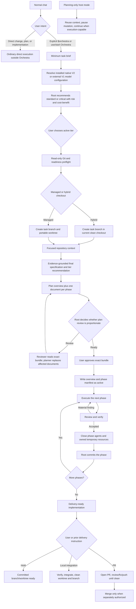

# Orchestra Workflow

## End-to-end flow

## Orchestrator behavior

Orchestra is an explicit planned-work route. It activates only through
`$orchestra` or an unequivocal imperative to use or start Orchestra. Ordinary
plan requests, descriptive mentions, and direct change, fix, or implementation
work remain outside Orchestra.

If Orchestra is invoked in a planning-only host mode, reuse the conversation,
identify the latest candidate checkpoint, and pause before branch, worktree,
plan persistence, implementation, or commit mutations. Ask the user to switch
to an execution-capable mode, then continue without a second invocation.
Orchestra observes the host mode; it never changes the host into a
planning-only mode.

Every Orchestra dispatch starts from a clean context: the packet and named
artifacts carry the assignment. Under multi-agent V2, pass `fork_turns: none`
explicitly on every spawn (the V2 default forks the full root history, which
multiplies token cost and destroys reviewer independence). Under V1, never set
`fork_context: true` for an Orchestra dispatch.

The orchestrator maintains the main objective while adapting safely to facts
found during execution. It does not stop for routine technical choices and does
not blindly follow a stale step when a reversible correction is clearly needed.

It reports meaningful scope or design changes to the user. It owns capability
routing, the local plan, phase commits, direct PR observation, and final
judgment.

## Autonomy within an approved objective

The root is the technical lead: it receives the objective, hard constraints,
and success criteria, and decides the steps itself.

For requests to answer, explain, review, diagnose, or plan: inspect the
relevant materials and report the result; implement nothing.

Within an approved objective or plan: make in-scope reversible decisions and
carry out every step named in the plan without asking again — technical
choices, tool and configuration details, file and directory locations,
dependency and environment fixes, changed-approach retries, and
non-destructive validation. A step named in the approved plan is authorized
by that approval. Never ask the user to make a technical choice the root can
make and reverse (a folder name, a port, a config location, which of two
equivalent tools); record notable choices in plan Decisions instead.

Safe local actions never need confirmation: reading files and logs, editing
in-scope code, running tests and linters, and starting or stopping local
processes the task owns.

Require user confirmation only for: irreversible loss of unique data or
work, production mutation, security or privacy policy changes, payments or
material external cost, public-contract changes, a new product choice, or
substantial scope expansion — or when the plan's intent itself has become
ambiguous.

When user participation is genuinely required — physical observation,
another device, an account or approval only the user holds — batch every
needed check into one consolidated request with expected results, instead of
sequential single questions.

## Tier flows and models

The user selects the root's current Sol medium or Sol high entry outside
Orchestra. The additive `dual` installation exposes native Sol as V2 and an
Orchestra Sol compatibility alias as V1. Before tier selection, Orchestra reads
the current task's model, multi-agent version, and effort through the installed
read-only session helper. Native Sol V2 selects `native`; the Orchestra Sol V1
alias selects `external`. Any other root combination blocks before resource
creation. Orchestra never changes or respawns the root.

For every spawned dispatch, the root selects the explicit capability, base
profile, model, and reasoning effort from the selected mode in the one installed
matrix. The selected model configuration is kept in memory before plan approval
and in plan Decisions afterward. It cannot change within a task, including
during tier transitions. Legacy `native` and `external` installations continue
to provide one fixed top-level matrix and do not run session detection.

The installed assignment is always attempted first. The only runtime
compatibility exception is `repository_context`: when its assigned model is
rejected before execution because the internal subagent runtime does not support
that model, a legacy installation may retain its current Luna-high behavior and
dual external may use its Orchestra V1 Luna alias. Dual native blocks instead of
crossing protocol versions. Record a permitted substitution only in live root
memory. Do not create a visible Codex task, modify source or installed matrices,
persist fallback state, or apply the fallback to another capability. An
unsupported assigned model for any other capability returns `blocked`.

Profiles contain behavior only. Existing public skill identifiers remain stable;
`orchestra-project-start` is the additive implicit greenfield entry point.
`general_implementation` and `independent_review` are assignment keys whose
behavior remains in the base `orchestra_implementation_worker` and `orchestra_reviewer` prompts;
neither has an internal playbook.

The only internal playbooks are `repository_context`, `web_research`,
`technical_planning`, `difficult_debugging`, `frontend_implementation`,
`browser_acceptance`, and `runtime_verification`. `architecture_analysis` uses
the shared architecture guidance reference also used with `technical_planning`
or `independent_review` when architecture is named; it has no dedicated
playbook.

### Native standard configuration

| Tier | Capability | Base profile | Model | Reasoning |
| --- | --- | --- | --- | --- |
| Standard | `repository_context` | `orchestra_analyst` | `gpt-5.6-terra` | `high` |
| Standard | `web_research` | `orchestra_analyst` | `gpt-5.6-terra` | `high` |
| Standard | `technical_planning` | `orchestra_analyst` | `gpt-5.6-sol` | `high` |
| Standard | `architecture_analysis` | `orchestra_analyst` | `gpt-5.6-sol` | `high` |
| Standard | `difficult_debugging` | `orchestra_analyst` | `gpt-5.6-sol` | `high` |
| Standard | `general_implementation` | `orchestra_implementation_worker` | `gpt-5.6-sol` | `medium` |
| Standard | `frontend_implementation` | `orchestra_implementation_worker` | `gpt-5.6-sol` | `medium` |
| Standard | `independent_review` | `orchestra_reviewer` | `gpt-5.6-sol` | `medium` |
| Standard | `browser_acceptance` | `orchestra_verifier` | `gpt-5.6-terra` | `high` |
| Standard | `runtime_verification` | `orchestra_verifier` | `gpt-5.6-terra` | `high` |

### External standard configuration

| Tier | Capability | Base profile | Model | Reasoning |
| --- | --- | --- | --- | --- |
| Standard | `repository_context` | `orchestra_analyst` | `opencode/deepseek-v4-flash` | `max` |
| Standard | `web_research` | `orchestra_analyst` | `antigravity/gemini-3.6-flash-high` | `high` |
| Standard | `technical_planning` | `orchestra_analyst` | `gpt-5.6-sol` | `high` |
| Standard | `architecture_analysis` | `orchestra_analyst` | `gpt-5.6-sol` | `high` |
| Standard | `difficult_debugging` | `orchestra_analyst` | `gpt-5.6-sol` | `high` |
| Standard | `general_implementation` | `orchestra_implementation_worker` | `cursor/grok-4.5` | `high` |
| Standard | `frontend_implementation` | `orchestra_implementation_worker` | `opencode/glm-5.2` | `max` |
| Standard | `independent_review` | `orchestra_reviewer` | `gpt-5.6-terra` | `high` |
| Standard | `browser_acceptance` | `orchestra_verifier` | `gpt-5.6-terra` | `medium` |
| Standard | `runtime_verification` | `orchestra_verifier` | `gpt-5.6-terra` | `high` |

In the dual matrix, every native model named by the external configuration is
resolved through its `orchestra-v1/` compatibility alias. Cursor, OpenCode, and
Antigravity assignments remain unchanged.

### Shared critical configuration

| Tier | Capability | Base profile | Model | Reasoning |
| --- | --- | --- | --- | --- |
| Critical | `repository_context` | `orchestra_analyst` | `gpt-5.6-sol` | `medium` |
| Critical | `web_research` | `orchestra_analyst` | `gpt-5.6-sol` | `medium` |
| Critical | `technical_planning` | `orchestra_analyst` | `gpt-5.6-sol` | `high` |
| Critical | `architecture_analysis` | `orchestra_analyst` | `gpt-5.6-sol` | `high` |
| Critical | `difficult_debugging` | `orchestra_analyst` | `gpt-5.6-sol` | `high` |
| Critical | `general_implementation` | `orchestra_implementation_worker` | `gpt-5.6-sol` | `high` |
| Critical | `frontend_implementation` | `orchestra_implementation_worker` | `gpt-5.6-sol` | `high` |
| Critical | `independent_review` | `orchestra_reviewer` | `gpt-5.6-sol` | `high` |
| Critical | `browser_acceptance` | `orchestra_verifier` | `gpt-5.6-sol` | `medium` |
| Critical | `runtime_verification` | `orchestra_verifier` | `gpt-5.6-sol` | `medium` |

A second critical review reuses `independent_review`
with Sol high only for a named measurable risk and independently detectable
defect class. No Orchestra assignment uses Sol xhigh.

The critical capability, profile, and reasoning matrix remains logically
shared. Dual native uses Sol V2; dual external uses the Sol V1 compatibility
alias so a tier transition never crosses protocol versions.

Frontend implementation composes `orchestra_implementation_worker`; browser acceptance
composes `orchestra_verifier`. They remain independent and never run as one combined
role.

## Context and planning

After explicit activation in an execution-capable mode:

1. The root reuses the prior conversation, classifies the internal checkpoint
   (exploration, candidate specification, candidate plan, adopted
   implementation, or resumable Orchestra task), and obtains a minimum brief:
   objective, visible result, approximate repository area, known critical
   risks, and bounded factual open questions. If `$orchestra` arrives without
   an objective, ask for it before creating resources. If the user explicitly
   limits the request to brainstorming, remain read-only until the user
   authorizes formal task setup.
2. The root reads the installed assignment matrix. A dual matrix requires one
   successful read-only session inspection and selects `native` or `external`
   from the root model and multi-agent version before tier selection. A legacy
   matrix remains fixed. The selected dual mode is immutable for the task.
3. From that brief, the root recommends an initial standard or critical tier
   with one concise explanation of material risk, added scrutiny, and expected
   cost-benefit. The user explicitly chooses the active tier. A user-selected
   standard tier does not waive separate authority gates for production,
   migrations, data, security, payments, destructive actions, or delivery.
4. The root resolves the intended base branch and revision and performs a short
   read-only Git preflight. It also reads repository policy and identifies the
   canonical runtime, dependency setup, services, permissions, credential
   categories without reading secrets, verification commands, test-data
   provenance, and generated paths relevant to the task. It then resolves the
   installed checkout mode. Managed mode verifies a write canary below the
   portable worktree root, chooses the first matching branch/path pair, and
   creates the task worktree with direct `git worktree add` against the captured
   full base revision. Hybrid mode verifies the current primary checkout
   or linked worktree, captures its named branch and exact HEAD, and creates the
   first matching `orchestra/*` branch there. A clean starting `main` needs no
   extra prompt because implementation begins only after branch creation.
   Dirty, detached, conflicted, active-operation, or identity-ambiguous state
   requires one consolidated decision before mutation.
5. The root records the exact task-worktree identity in memory before capability
   dispatch, as described in
   [Task checkout and branch](#task-checkout-and-branch). It then attempts one
   idempotent `coordination.py task create`. When the state database is outside
   the active workspace, this first attempt uses one exact, narrow Guardian
   escalation instead of first running the known-protected operation
   unprivileged. An `invalid` or `unavailable` result after that correctly
   authorized attempt is reported as lost observability and the normal inline
   workflow continues without retry or reduced authority.
6. An `orchestra_analyst` with `repository_context` answers the brief's bounded factual
   questions from the exact task worktree. The root may skip or reduce this
   dispatch only when it cites the specific prior evidence it reuses (artifact
   and revision); otherwise dispatch. The analyst publishes a revision-identified
   context artifact when coordination is available and returns its identifier.
   Publication failure returns the full inline report instead. Consume the
   result and close the one-shot analyst.
7. The orchestrator continues the user dialogue using that evidence. Additional
   `repository_context` dispatches are allowed only for newly material factual
   questions and request only the targeted context delta; consume and close each
   one-shot analyst before continuing.
8. The root confirms the final specification with Objective, User-visible
   behavior, Constraints, Acceptance, Exclusions, Decisions, and Open questions,
   then recommends any justified tier change. The user chooses whether to change
   it. Request only the context delta tied to a newly discovered risk.
9. Final specification confirmation starts formal planning. A planner reads the
   exact context artifacts and publishes one complete `plan-overview` plus one
   complete `plan-phase` per phase. It returns an explicit candidate bundle;
   neither root nor downstream agents reconstruct it from a summary or choose
   members by timestamp. A genuinely trivial single-phase standard task may be
   authored directly by the root, but uses the same two-document shape.
10. After the complete bundle exists, the root reads the overview, phase index,
   named risks, and only the detail needed for judgment. It may skip review for
   a trivial single-phase standard plan. A non-trivial multi-phase or
   cross-component plan receives one independent review. A critical plan
   receives a focused review naming its measurable risk, supporting evidence,
   affected area, and detectable defect class.
11. A dispatched reviewer reads the exact bundle and publishes `plan-review`
    with stable finding identifiers. Accepted IDs and the review artifact return
    to the same planner, which remains open and publishes complete replacement
    documents only for affected members. The next candidate bundle explicitly
    names all current members.
12. The root observes convergence after a second material plan review. Before a
    third correction, or immediately for marginal, contradictory, or
    out-of-scope findings, it reads the exact bundle and review artifacts,
    accepts or rejects findings by identifier, and corrects direction. No
    persisted review counter or mechanical limit is introduced.
13. The root presents the exact accepted bundle at the user's altitude and
    requests implementation approval.

Every planning, implementation, review, verification, plan, and commit operation
uses the exact selected task checkout. Managed mode leaves the base checkout
read-only; hybrid mode switches only the selected clean checkout to the new
task branch. Scoped dirty adoption remains available only into a managed task
worktree unless the user explicitly authorizes carrying named changes in place.

Standard and critical implementation does not begin until the user explicitly
approves the aligned plan. That approval covers implementation and successful
commits at the approved phase boundaries; it does not authorize merge, release,
deployment, production mutation, or another delivery action. If adopted
committed work passes unchanged, completion does not require an artificial
commit.

If the user rejects or abandons the task before plan approval, preserve unique
work. Remove a managed task worktree or restore a hybrid starting branch only
when the exact checkout and task branch still match their captured identity and
contain no unique work. No plan has been persisted at this point.

### Local task plan

Before approval, the provisional specification remains in conversation while
the formal candidate exists only as private `plan-overview`, `plan-phase`, and
optional `plan-review` artifacts. After approval, the root writes `active` to
`git rev-parse --git-path orchestra/plan.md`. It is an intent, exact-bundle, and
resume aid, not a workflow database.

If that resolved Git-private path is outside the active workspace, the first
write uses one exact, narrow Guardian escalation. The root does not probe a
known-protected plan path with an unprivileged write first.

The file records task and Git identity, checkout mode and resource ownership,
the hybrid starting branch/revision when applicable, active tier, immutable
dual model configuration, user and root decisions, authorized preexisting
changes, and the approved overview verbatim. Its phase manifest maps every
phase number to the exact artifact ID, private path, artifact revision, progress
status, accepted commit, blocker, and next action. It does not duplicate phase
details. Private paths allow resolution when SQLite is unavailable. When
adoption applies, it also records source revision, imported paths, existing
commit range, and remaining phases.

Its statuses are:

- `active`: the root is executing after explicit user approval;
- `blocked`: execution stopped at a named blocker and next action;
- `completed`: phases are reviewed, verified, and committed, while delivery
  authority remains separate.

The normal lifecycle is `active` to `completed`, with `active` to `blocked` to
`active` when needed. The root owns every update; plan state never grants
authority beyond the user's instruction.

On resume, the root resolves the path again and requires checkout, initial
identity, current branch, base, HEAD, and relevant commits to reconcile with
Git, then resolves every current phase through its exact ID or recorded path.
Git is authoritative for code, worktree state, and history; the plan is
authoritative only for approved intent, exact bundle selection, and progress.
A missing or unreadable plan prevents automatic continuation until reconstructed
and realigned with the user. Worktree cleanup removes the plan; coordination
never substitutes for it or supplies authority.

Plan artifacts are immutable. A reversible clarification within approved
objective and authority creates a complete replacement phase and the root
updates its manifest entry. A material scope, public-contract, or user-visible
behavior change requires renewed user approval.

### Coordination snapshots and artifacts

The installed
`${CODEX_HOME:-$HOME/.codex}/orchestra/scripts/coordination.py` helper exposes
`task` and `activity` commands with compact JSON results. It stores task and
activity snapshots in `$HOME/.orchestra/state.sqlite3`.
The database and its SQLite sidecars use mode `0600`. Schema creation and
version assignment are one transaction; an empty version-zero file may be
initialized, but a partial, unknown, or corrupt database remains untouched and
returns `unavailable`. Concurrent registration of one worktree converges on one
active task identifier.

When that state database is outside the active workspace, each write operation
uses one exact, narrow Guardian escalation on its first attempt. Existing
database, WAL, and SHM files already at `0600` are left unchanged; regular files
with another mode are corrected to `0600`, while symlinks and non-regular files
remain unsafe and return `unavailable`.

Artifacts live only on the filesystem. Agents write each semantic handoff
directly as UTF-8 Markdown under the task-private directory resolved by
`git rev-parse --git-path orchestra/artifacts`, named
`<NN>-<kind>[-p<phase>].md` with a zero-padded creation ordinal (for example
`03-plan-phase-p2.md`). The file name is the artifact identifier. Packets and
the plan manifest reference these exact file names; no database locator
exists. In a linked worktree this directory lives under the repository's
shared Git metadata, so under Guardian the write may request one narrow
automatically reviewed escalation on its first attempt; the agent does not try
the known-protected write unprivileged first. That escalation is expected and
is not a blocker. If the artifacts directory cannot be created or written, the
agent returns the complete report inline instead.

The root updates task stage, tier, revision, summary, blocker, and next action
only at material transitions. Each delegated agent may update its own activity
at start, final outcome, or blocker; there are no heartbeats. Stages and states
are descriptive labels with no transition graph. Timestamps indicate freshness
but never prove that an agent or process is live.

Every packet carries capability, explicit authority, worktree, exact target
artifact IDs and roles, stop conditions, current revision, accepted finding
IDs, and only the new context delta. Initial repository context also carries
its minimum objective and focused questions. Later agents read objective,
scope, acceptance, verification, plan details, and findings directly from named
documents. A changed HEAD invalidates only affected evidence.

Conventional artifact kinds are `repository-context`, `context-delta`,
`plan-overview`, `plan-phase`, `plan-review`, `implementation-report`,
`verification-report`, `implementation-review`, `debugging-report`, and
`pr-review` only when PR analysis has a semantic downstream consumer. Corrected
overview or phase documents are complete immutable replacements. Current
membership is selected only by exact packet or manifest IDs, never timestamp or
list order. Start, final, commit, push, check, and merge facts do not receive
semantic artifacts.

All coordination operations are fail-soft after their correctly authorized
first attempt. `invalid` or `unavailable` status
cannot block implementation, verification, review, a tier change, commit, or
delivery. Failed publication returns the full result inline; failed lookup uses
the inline packet or current source. The helper never runs mutating Git
commands, grants authority, validates transitions, or triggers another agent.
Completed metadata remains queryable. Managed worktree cleanup removes its
task-private artifacts with the task Git directory; successful hybrid delivery
removes only the exact plan and artifacts in the preserved checkout's private
Git directory.

## Phase execution

Each phase has one outcome, allowed scope, acceptance criteria, and verification
set. A phase-specific subplan is created only when the phase cannot be safely
delegated from the main plan.

The loop is:

1. The root selects one `orchestra_implementation_worker` with
   `general_implementation` or `frontend_implementation` and keeps that owner
   for the whole phase. Its packet contains edit authority, worktree,
   `plan.md` path, exact overview and current phase IDs, revision, accepted
   finding IDs, stop conditions, and only new context. The worker reads scope,
   acceptance, verification, and dependencies from those documents and reads
   only prior outputs explicitly required by the phase. While active,
   the task-worktree implementation is mutable: the root waits and limits
   itself to user dialogue, agent/resource coordination, and root-owned setup
   that does not inspect or exercise the evolving implementation. It does not
   read the evolving diff, run speculative canaries against it, or send design
   corrections.
2. At each stable handoff, the worker publishes a complete
   `implementation-report` for the evaluated revision or returns it inline.
   The root performs at most one bounded check of exact
   Git identity, status, allowed-path scope, `git diff --check`, and the declared
   evidence inventory. If it investigates a possible correctness defect
   directly, it completes and confirms that investigation against the current
   source and diff before contacting the owner or pausing the phase cohort. It
   sends one consolidated finding packet containing evidence, impact, and
   acceptance, never provisional or superseding directions.
3. The root creates at most one verifier for each applicable capability and
   passes exact overview, phase, implementation-report, authority, and revision.
   Every capability publishes a complete `verification-report`. If verification
   fails, its report ID and accepted finding IDs return to the same owner
   without root-authored replay, followed by affected reverification
   before dispatching `independent_review`. If it returns `blocked`, the root
   decides whether review proceeds on source alone and, when it does, records
   the blocked reason in the review evidence. Once a stable revision packet is
   under verification, the root stops speculative source review. It interrupts
   only when the revision changed or a finding confirmed against the exact
   current source and diff invalidates that packet.
4. Only after required verification passes or an environment blocker is
   explicitly accepted does one reviewer receive exact overview, phase,
   implementation, and verification IDs. It independently inspects source and
   diff, publishes a complete initial `implementation-review`, and later
   publishes meaningful deltas naming the full-review base and prior finding
   dispositions.
5. The review artifact and accepted stable finding IDs return to the same owner;
   the root does not restate findings.
6. Re-run affected verification with the same verifier and send exact
   replacement reports plus the meaningful delta to the same reviewer.
7. After final evidence is consumed, the root performs the phase teardown
   described below.
8. When teardown permits the phase to close, the root commits with direct Git
   or the narrow exact-path helper and records the commit in the phase manifest.
   No commit artifact duplicates Git.

When the same causal failure repeats, correction cycles demonstrably fail to
converge, scope expands, or evidence indicates a deeper shared cause, stop blind
retries and choose: reassess the phase approach, recommend a tier change,
dispatch `difficult_debugging`, or ask the user when an authority boundary is
crossed. Distinct legitimate findings alone are not an escalation trigger. An
isolated mechanical Git failure stays with the root: inspect the current status
and latest commit once, make an obvious safe correction when available, and do
not dispatch an agent merely to operate or explain Git.

### Tier transition

The active tier may change in either direction only after explicit user
direction. Wait for the current tool call to settle, collect the exact revision
and dirty-diff state, accepted evidence, completed acceptance, pending work, and
owned resources, then stop those resources and close only live phase agents
whose assignment changes. Do not revert work, restart the workflow, or create a
transition commit. Update the plan's active tier and Decisions, then create
replacement agents only when needed with a compact continuation packet. The new
implementation worker owns the remaining phase and receives later accepted
findings. Evidence for the unchanged revision and conditions remains valid; a
new risk receives only targeted context and reverification. A best-effort
coordination update records the selected tier, but its failure never delays or
reverses the transition. A tier transition never changes the task's selected
model configuration; switching between native V2 and external V1 requires a new
Orchestra task rooted in the matching model selector entry.

### Phase teardown

The root keeps only an in-memory list of the agents and temporary resources it
created for the current phase. It closes one-shot repository, planning, plan
audit, web research, or difficult-debugging agents after consuming their
result. The implementation owner, independent reviewer, and each capability
verifier remain open through the phase so fixes, reruns, and delta review reuse
their relevant context. Persisted activity rows are observability snapshots, not
resource handles or cleanup authority.

After final review and verification pass, but before phase commit, the root:

1. asks resource-owning phase agents to stop only the exact servers or processes
   they started and close only their task-dedicated browser tabs;
2. stops any shared temporary process the root itself started;
3. consumes the teardown results, then calls `close_agent` for every phase
   agent, which also closes its descendants;
4. confirms that no known agent or owned process with worktree write access
   remains active.

An active write-capable agent or owned process blocks the commit. Failure to
close a source-read-only browser tab is reported as partial cleanup but does not
invalidate otherwise accepted evidence or the Git commit. Orchestra never scans
for or kills unrelated processes, closes unrelated tabs or sessions, persists a
resource registry, or adds cleanup behavior to the phase-commit helper.
Best-effort activity clearing occurs after the real teardown evidence is
consumed and can never affect the commit result.

### Test permissions and browser routing

Orchestra synchronizes Guardian (`:workspace`, `on-request`, and Auto-review)
as the default. The active permission choice for the task, host, or launcher
remains authoritative: Orchestra never changes it or blocks execution solely
because it differs. When Guardian is active, commands inside the workspace run
directly and one exact command that crosses a protected boundary requests one
narrow escalation for automatic review. With manual approvals, that escalation
may prompt the user; with Full Access, it runs without the workspace sandbox
boundary. Never retry a denial through a workaround or broaden permissions.
Deterministic syntax, type, compile, lint, import, assertion,
validation-contract, and CLI-usage failures remain real failures. A missing
external service, credential, or dependency may still return `blocked`, but
never broadens the task's approved authority.

Packets for `frontend_implementation` browser work and `browser_acceptance`
carry `browser_route: auto | in_app | chrome`:

- `auto` explicitly selects Codex's in-app Browser first. After supported
  connection recovery, it may fall back to Computer Use with Chrome only when
  the in-app Browser is unavailable or cannot provide required authentication,
  extension, native-dialog, browser-specific, or system-integration behavior.
- `in_app` selects only the in-app Browser.
- `chrome` selects only Computer Use with Chrome.

An explicit route from the user, relayed by the root or given directly in the
agent conversation, must be attempted even when the scenario is a canary for a
previously failing tool, wins, and remains fixed unless that instruction also
permits fallback. An agent may return the selected route's technical blocker but
may not veto or substitute it. A functional failure, application timeout, or
selector problem never causes a switch. On an allowed fallback, close the
in-app task tab, open an independent Chrome task tab, and repeat the complete
scenario so evidence from different browser surfaces is never combined into one
pass. Frontend iteration and independent browser acceptance use separate tabs
and evidence.

## Review policy

The first independent review completes the entire bounded target and returns all
known material findings together. Later reviews inspect only the meaningful
delta and interactions affected by accepted fixes.

Automatically fix findings that demonstrate:

- incorrect behavior or unmet acceptance criteria;
- security, privacy, or data-integrity risk;
- likely regression;
- unsafe error handling or concurrency;
- a maintainability defect likely to cause future incorrect behavior;
- missing verification for important behavior.

Do not cycle on:

- personal style preference already covered by formatter/linter;
- speculative architecture without a concrete failure mode;
- unrelated cleanup;
- scope expansion disguised as review;
- repeated restatements of an already rejected suggestion.

## Task checkout and branch

Every formal Orchestra task uses a fresh `orchestra/<task-slug>[-N]` branch.
The installed `${CODEX_HOME:-$HOME/.codex}/orchestra/checkout-mode` selects
`managed` by default or opt-in `hybrid`; an explicit task direction may override
that value and is recorded in the approved plan.

Managed mode uses a dedicated Git worktree below the effective root resolved
from `ORCHESTRA_WORKTREE_ROOT`, the installed worktree-root file, or
`$HOME/.orchestra/worktrees`, in that order. Hybrid mode uses the current clean
primary checkout or linked worktree and creates the task branch from its exact
captured HEAD with direct Git. It does not require the starting branch to equal
the latest `main`, so stacked work remains possible, but PR-required delivery
must prove that its selected base is remotely usable before task mutation.
Neither mode ever implements on the starting branch or directly on `main`.

Synchronization reads `codex --version` before mutation and requires Codex
0.146.0 or later. It installs exactly one modern configuration:
`default_permissions = ":workspace"`, `approval_policy = "on-request"`, and
`approvals_reviewer = "auto_review"`. No legacy sandbox mode, custom permission
profile, workspace-root list, execpolicy rule, or Git helper is installed.
Older or unreadable clients block before any destination changes. Historical
manifest-owned Full Access or legacy blocks migrate atomically; `uninstall`
remains version-independent and restores the exact prior configuration.

Direct App Server launchers should omit permission overrides to inherit these
synchronized defaults. Explicit launcher overrides remain authoritative;
Orchestra does not reject or rewrite them. To select Guardian explicitly, pass
the equivalent `permissions = ":workspace"`,
`approvalPolicy = "on-request"`, and
`approvalsReviewer = "auto_review"`. When Guardian is active, protected shared
Git metadata remains outside the workspace boundary, so the root issues the
exact direct Git operation once with a narrow escalation for automatic review.
A denial is not bypassed or converted to Full Access.

Before `repository_context` or another capability dispatch, the root writes and
removes one temporary canary in the selected checkout location (creating the
managed repository directory first when applicable). A failure blocks the task
with exact path and environment evidence. Existing
active tasks outside the configured root are not migrated automatically. If
`git worktree add` fails, the root inspects the exact branch, path, and Git error
once and blocks before capability dispatch.

The root records checkout mode, checkout path, starting branch and HEAD, task
branch, resource ownership, base branch and revision, and any authorized
preexisting changes in transient context. It
creates no classifier, registry, or additional workflow state. Fresh tasks
start at the intended committed base revision. Adopted committed work starts at
the adopted source HEAD while retaining the integration base. Scoped dirty
adoption imports selected non-ignored paths through `adopt_worktree.py`;
imported content may remain unstaged. Ambiguous dirty ownership always blocks.

Reuse is allowed only for the same live pre-approval task or when the approved
local plan, objective, checkout mode/path, starting identity, task branch, base,
and HEAD all identify the
same resumed task. Missing or conflicting identity blocks reuse. A legacy plan
with a retired environment field blocks automatic resume unless the root
verifies that it already identifies the exact sibling task worktree and the
user authorizes adoption. Preapproval cancellation never discards unique work
and removes only proven-clean task resources.

After authorized integration or merge, managed cleanup removes the exact clean
task worktree, plan, and safe branches. Hybrid cleanup restores the unchanged
starting branch, preserves the user/host-owned checkout, and removes only the
guarded Orchestra task branch and private task artifacts. Hold and an open PR
intentionally retain the selected checkout state and task branch.

Dirty, moved, ambiguous, or unverified resources are never removed. Cleanup
after a completed mutation returns `partial` for resources that could not be
cleaned safely.

## Agent waiting

The root waits on live agents in non-interruptive ten-minute windows
(`timeout_ms: 600000`). Completion returns immediately; `timed_out` only means
the agent remains active, so the root waits again without sending a status
request or using `interrupt: true`. After 30 accumulated minutes, the root may
assess once for concrete blocker evidence, but elapsed time alone never marks
the assignment failed. Interruptions are reserved for cancellation, material
scope changes, or indispensable invalidating information.

## Commit path

Plan approval covers commits at successful phase boundaries. Commit execution
is a root responsibility, not an agent profile or capability. The default path
is one direct pass: inspect status and the relevant diff, stage only the accepted
paths, create a file-based commit with a concise title plus useful intent and
validation, then read the resulting SHA and status once. Do not require empty
ceremonial sections, byte-for-byte message equality, repeated authority checks,
or an agent dispatch.

The optional narrow helper exists only when exact-path staging is useful. It
preserves unrelated work, rejects staged paths outside the accepted scope,
commits the selected paths, and verifies that any created commit contains no
other paths. A legitimate commit-message hook may add trailers. If Git created
the intended commit, its SHA is success evidence even when an auxiliary command
reported a failure; do not retry, amend, or manufacture another commit.

Git provides atomic commit and reflog behavior. Local commits do not require an
isolated index, crash journal, authority bundle, or repeated subprocess
validation.

Phase-agent and temporary-resource teardown is complete before this path starts;
it is not part of direct Git or `commit_phase.py`.

## Delivery policy

A consumer repository stores an explicit delivery policy. When it is missing,
Orchestra asks the user once and recommends `hybrid`. It does not infer
permission from existing PRs, CI workflows, or branch history.

`orchestra.toml` contains only the delivery mode and ordered verification checks
as argument arrays. PR merge and local integration share that check runner;
commands never pass through a shell.

Supported policy modes:

- `pr-required`: final integration goes through a PR.
- `hybrid`: the user chooses local integration or PR per task.
- `local-direct`: local integration is permitted when explicitly requested.

## PR path

The unchanged public PR skills preserve the proven behavioral chain:

1. PR-open reads the complete branch commit range and diff.
2. The root synthesizes and publishes a compact `PR-CONTEXT` capsule.
3. The root calls the narrow PR helper directly to observe GitHub/CI and
   review-thread state.
4. The root evaluates actionable feedback against intent, current code, and
   scope, using an independent `orchestra_reviewer` when code-review judgment is useful.
5. The implementation owner applies accepted fixes, verifies them, commits, and
   pushes.
6. The loop continues until two complete clean observations occur on the same
   head. The root passes the first clean head directly to the second observation
   in memory; a push or head change resets it. The second observation on an
   unchanged head is a lightweight but complete re-poll of checks and review
   threads; it does not re-read the diff.

GitHub remains the external truth. PR-CONTEXT lives only as one upserted capsule
in the PR body. The helper reports current checks and review-thread evidence; it
does not interpret feedback, fix code, route work, or persist state. The root
evaluates only unresolved, non-outdated feedback and returns accepted findings
to the same implementation owner by stable finding or GitHub reference. Publish
`pr-review` only when an agent's semantic analysis must be consumed downstream;
do not duplicate check, push, thread, or merge state as artifacts.

`Open a PR` authorizes opening, review processing, fixes, commits, and pushes
needed to make that PR clean. It does not authorize merge unless the user said
`merge when clean` or separately requests merge later.

After an authorized merge, the PR helper verifies the `MERGED` state against the
exact reviewed head and performs conservative cleanup. It uses lease-protected
deletion for an unchanged remote task branch and expected-value guards for local
resources. Managed mode removes its task worktree; hybrid mode restores the
starting branch and preserves the checkout. This exact
merged-head proof permits cleanup after merge, squash, or rebase without
pretending that all three preserve commit ancestry. An absent remote branch is
already clean; a moved branch is retained.

## Local integration path

Local integration is a direct alternative, not a degraded PR path. It requires:

- policy permission;
- explicit task-level user direction;
- clean task scope and fresh verification;
- integration into the intended base without rewriting unrelated history;
- confirmation of the result;
- mode-aware checkout and merged-branch cleanup.

The mechanical path runs configured checks in the clean task checkout, permits
only conservative fast-forward integration, and verifies that the base contains
the captured task SHA. Managed mode removes its still-clean worktree and branch;
hybrid mode restores and fast-forwards the unchanged starting branch, preserves
the checkout, and deletes only the fully merged task branch. Divergence returns
to the root for resolution.

It does not authorize release, deployment, or production mutation.

## Maturity

Automated checks and representative canaries provide evidence. The user decides
when Codex Orchestra is sufficiently mature to port to another harness.

## User-facing progress and handoff

Report only material phase transitions, findings or decisions, blockers, fresh
verification results, and authority requests. Each update states current state,
user-visible result or evidence, and next action without routine agent/model
plumbing. At completion, distinguish implementation-complete from delivered and
state the result location, how to run or demonstrate it, verification performed,
safe test data, limitations, exact delivery state, and the next authority needed.
The same material transitions are exposed through coordination snapshots for
external querying, without requiring the user to open each agent conversation.

A question whose answer is required to continue uses `request_user_input`
without `autoResolutionMs` when the tool is available and remains open until
the user responds. If the tool is not available or does not return a usable
selection, ask one concise plain-text question in the final response and wait
for the user without retrying the selector. Automatic resolution is reserved
for explicitly informational, non-blocking questions whose timeout can safely
accept the recommended default. This rule does not change command, test, or
`wait_agent` timeouts.
