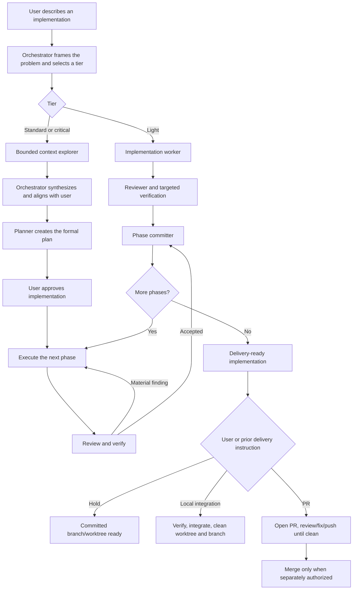

# Orchestra Workflow

## End-to-end flow

## Orchestrator behavior

The orchestrator maintains the main objective while adapting safely to facts
found during execution. It does not stop for routine technical choices and does
not blindly follow a stale step when a reversible correction is clearly needed.

It reports meaningful scope or design changes to the user. It asks before
crossing the high-impact boundaries defined in `AGENTS.md`.

## Tier flows and models

Model names describe the intended Codex profile families. The root uses its
current session configuration, selected outside Orchestra. The table below
documents that target separately from spawned specialists. For specialists,
`codex/config/roles.toml` contains only assignments consumed by executable
lanes; skills pass explicit overrides from that file when spawning a role.
Profiles contain behavior only.

| Role | Standard | Critical |
| --- | --- | --- |
| Root orchestrator (outside `roles.toml`) | Sol high | Sol xhigh |
| `planner` / `plan_scope_auditor` | Sol high | Sol xhigh |
| `implementation_worker` | Luna max | Sol high |
| `reviewer` | Luna max | Sol high; second pass Sol xhigh |
| `debugging_investigator` | Luna max | Sol high |
| `repo_context_explorer` / `web_researcher` | Luna xhigh | Luna high |
| `browser_acceptance_tester` | Luna xhigh | Luna xhigh |
| `phase_committer` | Luna xhigh | Luna high |
| PR-open synthesis fallback / PR-merge verification | Sol high | Sol high |
| Light task end-to-end | Luna max | Not applicable |

For a light task, `implementation_worker`, `reviewer`, and `phase_committer` use
Luna max. Light does not mean unreviewed; it means discovery and planning roles
are omitted because the scope is already small and certain.

## Context and planning

For standard and critical work:

1. A context explorer inspects only the domains needed for the request.
2. The orchestrator merges evidence into a compact problem statement.
3. The orchestrator and user settle objective, constraints, acceptance, and
   relevant product choices.
4. The planner writes the formal technical plan.
5. A plan audit is added only when its packet names a measurable risk,
   supporting evidence and affected area, and an independently detectable
   defect class. Architectural complexity alone is insufficient.
6. The orchestrator summarizes the plan at the user's altitude and requests
   implementation approval.

The root may create a high-level sketch and phase strategy. The planner owns
the detailed non-trivial plan; this distinction keeps the root intelligent
without forcing it to absorb the whole repository.

Standard and critical implementation does not begin until the user explicitly
approves the aligned plan. That approval covers implementation and successful
commits at the approved phase boundaries; it does not authorize merge, release,
deployment, production mutation, or another delivery action.

## Phase execution

Each phase has one outcome, allowed scope, acceptance criteria, and verification
set. A phase-specific subplan is created only when the phase cannot be safely
delegated from the main plan.

The loop is:

1. Implementation owner changes the phase scope.
2. Targeted tests run and their results are read.
3. One independent reviewer checks specification, correctness, regressions,
   safety, and materially defect-prone design.
4. Accepted findings return to the same owner.
5. Re-run affected verification and review the meaningful delta.
6. Commit automatically when the phase passes.

If the same failure repeats, stop blind retries, diagnose the root cause, and
change the approach or ask the user when the decision crosses an authority
boundary.

## Review policy

Automatically fix findings that demonstrate:

- incorrect behavior or unmet acceptance criteria;
- security, privacy, or data-integrity risk;
- likely regression;
- unsafe error handling or concurrency;
- a maintainability defect likely to cause future incorrect behavior;
- missing verification for important behavior.

Do not cycle on:

- personal style preference already covered by formatter/linter;
- speculative architecture without a concrete failure mode;
- unrelated cleanup;
- scope expansion disguised as review;
- repeated restatements of an already rejected suggestion.

## Worktrees and branches

New implementations normally start in a task branch and dedicated worktree so
multiple tasks can proceed independently. The task records its base branch and
worktree path without creating a global workflow database.

After authorized integration:

1. verify the exact task revision;
2. integrate using the selected local or PR path;
3. confirm the target branch contains the expected commit;
4. remove the task worktree;
5. delete the merged task branch when safe.

Unmerged or dirty worktrees are never removed automatically.

## Commit path

Plan approval covers commits at successful phase boundaries. The phase
committer is a specialized but thin subagent. It receives the phase intent,
changed paths, and verification summary; it does not rediscover the repository
or reopen product decisions.

The commit implementation should preserve the useful `commitbot` behavior:

- inspect scope and relevant diff;
- use a structured message that captures why, acceptance, invariants,
  validation, and risks;
- stage only intended paths;
- use `git commit -F`;
- verify the stored commit message and resulting SHA;
- return success or a stable failure reason.

Git provides atomic commit and reflog behavior. Local commits do not require an
isolated index, crash journal, authority bundle, or repeated subprocess
validation.

## Delivery policy

A consumer repository stores an explicit delivery policy. When it is missing,
Orchestra asks the user once and recommends `hybrid`. It does not infer
permission from existing PRs, CI workflows, or branch history.

Supported policy modes:

- `pr-required`: final integration goes through a PR.
- `hybrid`: the user chooses local integration or PR per task.
- `local-direct`: local integration is permitted when explicitly requested.

## PR path

The Orchestra-named PR skills preserve the proven behavioral chain:

1. PR-open reads the complete branch commit range and diff.
2. It synthesizes and publishes a compact `PR-CONTEXT` capsule.
3. PR-review uses a polling specialist for GitHub/CI state and a triage
   specialist for actionable feedback.
4. Triage validates comments against intent, current code, and scope.
5. The implementation owner applies accepted fixes, verifies them, commits, and
   pushes.
6. The loop continues until the established clean condition is met, including
   two clean observations on the same head when external state is asynchronous.

`Open a PR` authorizes opening, review processing, fixes, commits, and pushes
needed to make that PR clean. It does not authorize merge unless the user said
`merge when clean` or separately requests merge later.

## Local integration path

Local integration is a direct alternative, not a degraded PR path. It requires:

- policy permission;
- explicit task-level user direction;
- clean task scope and fresh verification;
- integration into the intended base without rewriting unrelated history;
- confirmation of the result;
- worktree and merged-branch cleanup.

It does not authorize release, deployment, or production mutation.

## Maturity

Automated checks and representative canaries provide evidence. The user decides
when Codex Orchestra is sufficiently mature to port to another harness.
