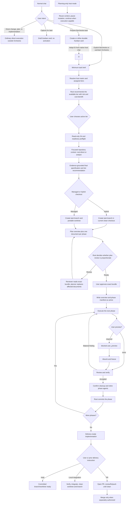

# Orchestra Workflow

## End-to-end flow

## Orchestrator behavior

Orchestra is an explicit planned-work route. It activates only through
`$orchestra`, native-host-chat adoption of a ready `$orchestra-task`, or an
unequivocal imperative to use or start Orchestra. Ordinary plan requests,
descriptive mentions, task capture, and direct change, fix, or implementation
work remain outside Orchestra.

If Orchestra is invoked in a planning-only host mode, reuse the conversation,
identify the latest candidate checkpoint, and pause before branch, worktree,
plan persistence, implementation, or commit mutations. Ask the user to switch
to an execution-capable mode, then continue without a second invocation.
Orchestra observes the host mode; it never changes the host into a
planning-only mode.

Every Orchestra dispatch starts from a clean context: the packet and named
artifacts carry the assignment. The root identifies the execution host from
available tools and reads that host's spawn reference. Codex: `spawn_agent`
and `wait_agent` exist; under multi-agent V2 pass `fork_turns: none` explicitly
on every spawn (the V2 default forks the full root history, which multiplies
token cost and destroys reviewer independence); under V1 never set
`fork_context: true`. Grok Build: use `spawn_subagent` when the session
schema offers it, otherwise the host `workflow` `agent()` transport per the
Grok spawn reference; use a fresh isolated subagent per dispatch,
`isolation: none`, `cwd` equal to the task checkout, and resume only the same
phase-cohort agent with `resume_from`. Cursor: `Task` exists; use a fresh isolated Task per
dispatch, resume only the same phase-cohort agent id, and never `resume: self`
for a reviewer. On both hosts a reviewer's first review is a fresh spawn and
delta reviews within the same phase resume that same reviewer, matching the
open phase cohort on Codex. Never mix Codex, Cursor, and Grok spawn protocols
in one task.

## Host adapters

Shared skills, packets, artifacts, authority, cleanup declarations, and Git are
identical across hosts. Each host owns spawn/wait/close, the model matrix,
conversation identity, permissions, and `browser_route`.

- Codex has native/external modes, Guardian defaults, `session_model.py`, and
  profiles under `$CODEX_HOME/agents`. Wait uses `wait_agent` with
  `timeout_ms: 600000`. Close uses V1 `close_agent` or V2 completed-state
  evidence.
- Cursor has no native/external mode and does not run `session_model.py`. It
  reads `${ORCHESTRA_HOME:-$HOME/.orchestra}/hosts/cursor/roles.toml`. Dispatch
  uses Cursor Task workers from that matrix plus the existing `orchestra-role-*`
  skill. Custom `~/.cursor/agents` files are not the dispatch API. Wait uses a
  background Task and completion notification without busy-polling. Cleanup
  requires completed agents with no retained write-capable resources. Cursor
  sync never writes Codex `config.toml` or Cursor `settings.json`.
- Grok Build has no native/external mode and does not run `session_model.py`.
  It reads `${ORCHESTRA_HOME:-$HOME/.orchestra}/hosts/grok/roles.toml`. Dispatch
  uses `spawn_subagent` with `general-purpose` plus the existing
  `orchestra-role-*` skill. Do not use the host workflow tool or
  `isolation: worktree`. Wait uses `get_command_or_subagent_output` with
  `timeout_ms: 600000`. Cleanup requires completed agents with no retained
  write-capable resources. Grok sync never writes `~/.grok/config.toml` or
  Codex `config.toml`.

Shared helpers, checkout-mode, and worktree-root live under
`${ORCHESTRA_HOME:-$HOME/.orchestra}`. `$CODEX_HOME` remains the Codex-only
install root. During the compatibility window, Codex sync also mirrors helpers
under `$CODEX_HOME/orchestra/scripts`.

The orchestrator maintains the main objective while adapting safely to facts
found during execution. It does not stop for routine technical choices and does
not blindly follow a stale step when a reversible correction is clearly needed.

It reports meaningful scope or design changes to the user. It owns capability
routing, the local plan, phase commits, direct PR observation, and final
judgment.

## Autonomy within an approved objective

The root is the technical lead: it receives the objective, hard constraints,
and success criteria, and decides the steps itself.

Preserve the approved objective, constraints, acceptance, and authority unless
the user explicitly changes them. Treat a proposed mechanism or causal
explanation as a hypothesis, challenge it against current source and evidence,
and prefer the smallest supported approach that preserves the approved result.

For requests to answer, explain, review, diagnose, or plan: inspect the
relevant materials and report the result; implement nothing.

Within an approved objective or plan: make in-scope reversible decisions and
carry out every step named in the plan without asking again — technical
choices, tool and configuration details, file and directory locations,
dependency and environment fixes, changed-approach retries, and
non-destructive validation. A step named in the approved plan is authorized
by that approval. Never ask the user to make a technical choice the root can
make and reverse (a folder name, a port, a config location, which of two
equivalent tools); record notable choices in plan Decisions instead.

Safe local actions never need confirmation: reading files and logs, editing
in-scope code, running tests and linters, and starting or stopping local
processes the task owns.

Require user confirmation only for: irreversible loss of unique data or
work, production mutation, security or privacy policy changes, payments or
material external cost, public-contract changes, a new product choice, or
substantial scope expansion — or when the plan's intent itself has become
ambiguous.

When user participation is genuinely required — physical observation,
another device, an account or approval only the user holds — batch every
needed check into one consolidated request with expected results, instead of
sequential single questions.

## Durable task intake

The installed `task_control.py` helper is a harness-neutral JSON boundary for a
small local prepared-task Kanban. `task create` assigns an immutable human ID
and UUID; `task note` accepts caller-stable idempotency keys and bounded source
references. Capturing or preparing a card does not activate Orchestra, launch
an execution host, choose permissions or tier, create a checkout, or authorize
implementation.

Task Control is the sole allocator of the `A1`, `A2`, ... namespace. Neither a
native chat nor Coordinator may derive a short ID from task order, concurrent
activity, a branch name, or an example in these documents. A direct Orchestra
task has no short ID. Clients join a short ID to execution state only when the
Coordinator task UUID exactly matches the Control UUID.

For every newly resolved Git path, `repository` means the validated primary
worktree of that local clone and `worktree` means the task's concrete checkout.
The shared resolver records the current checkout, primary worktree, Git
common-dir, and HEAD. Preparation, adoption, resume, decomposition, and
Coordinator registration compare the common-dir when available, so another
linked worktree from the same clone is valid and a different clone or Git
repository is rejected. Draft paths that are not yet usable Git checkouts stay
verbatim until preparation. Existing rows are never mass-rewritten, and legacy
path identity remains a tolerated idempotency fallback. No remote, URL, or
GitHub lookup participates in this identity.

A card becomes `ready` only after focused repository research equivalent to
`repository_context` and explicit specification confirmation. The helper binds
private `repository-context.md`, `specification.md`, and a marker under
`$HOME/.orchestra/tasks/<short-id>/` to the inspected full Git revision and
digests. `control.sqlite3` stores the Kanban identity and preparation metadata;
legacy `runs`, `turns`, and `interactions` remain readable after migration but
new code never writes or exposes App Server operations.

Adoption occurs only inside the user's current native Codex, Cursor, or Grok
Build chat.
`task adopt` requires the adapter-provided conversation identity; no caller may
invent or override that identity. On Codex that identity is `CODEX_THREAD_ID`
(UUID). On Cursor the plugin's `sessionStart` hook verifies that `session_id`
matches `conversation_id` and exposes that exact value through
`ORCHESTRA_HOST_THREAD_ID`; if it is unavailable, adopt is `blocked`. On Grok
Build that identity is `GROK_SESSION_ID`; if it is unavailable, adopt is
`blocked`. The chat then explicitly activates Orchestra,
inherits its current permissions, and applies the installed checkout policy. Matching Git
reuses prepared context; changed Git requires a focused `repository_context`
delta and specification reconfirmation only when the result materially changes.
After checkout and task-state initialization, Coordinator registers with the
Kanban UUID. An explicit stable-checkpoint transfer releases ownership so
another native chat can resume the same worktree and plan. When that owning
chat cannot release the card, an explicit user resume or reclaim of the same
ID in a different native host chat runs `task reclaim --authorized`, swaps
ownership in one transaction, and resumes the existing worktree and plan.
Ordinary `task adopt` of a card owned by another thread remains `busy`.
Reclaim abandons the previous chat; do not use it while that chat is still
working. The helper does not ping the previous host.

One card is the default. The agent proposes a minimal two- or three-card
initiative only for independent execution, acceptance, repository, or delivery
boundaries and obtains explicit confirmation unless the user already directed
the split. The confirmed decomposition is one transaction: it reuses the
source draft as the first card, creates the remaining cards, allocates global
human IDs, and persists only an immutable `blocked_by` DAG. More than three
cards requires a specific reason for every card. Failed validation consumes no
IDs and creates no partial rows. Cards without a dependency path are parallel;
no `related` relation is stored. Each card remains self-contained and receives
its own preparation, adoption, checkout, plan, review, verification, terminal
commit, and delivery evidence.

Blocked cards may be prepared but not adopted. `completed` requires the
blocking card to finish implementation, independent gates, and its terminal
commit. `delivered` additionally requires an exact verified local integration
or PR merge registered by the predecessor's owning native chat. For cards in
the same Git common-dir, adoption also proves the delivered base revision is an
ancestor of the checkout HEAD and otherwise asks the user to update it; no
helper pulls automatically. Opening a PR or choosing hold never satisfies
delivery.

The prepared specification is an already satisfied final-specification
checkpoint. It may be replaced only before the card has any execution-owner
history. After first adoption, transfer and safe-stop reopening preserve and
resume the existing checkout and plan rather than rewriting the prepared
documents. A checkout at the prepared revision proceeds to formal planning
after the ordinary tier choice. A changed revision requests only a focused
context delta; only a material specification change requires confirmation
again.

The public stdio MCP exposes capture, query, notes, preparation, confirmed
decomposition, archive, and restore only. It cannot adopt, transfer, reclaim,
finish, record delivery, start an execution host, or mutate a checkout. The Hub
remains GET-only. The native macOS app invokes the local JSON CLI for its
bounded card actions and never mutates through Hub HTTP. Git, the approved
`plan.md`, the native conversation, and explicit user authority remain
authoritative for formal work.

### Cooperative safe stop and card lifecycle

`task request-stop` records a cooperative request and never interrupts a tool,
agent, process, or mutable implementation owner. For every adopted card, the
root queries current Task Control state at real pauses: before a phase commit,
before terminal completion, before PR or local delivery, and whenever it
returns to the user for input. Routine capability dispatches and stable
handoffs inside an actively running phase do not each require a query. A
pending request prevents new work at those boundaries. `task transfer` and
`task finish` reject it; `task reclaim --authorized` preserves it.

After the current owner reaches a stable handoff, it closes its exact owned
resources using the normal cleanup contract, writes the existing approved plan
as `blocked` with the safe stop as blocker and resume as next action, then runs
`task acknowledge-stop` with the adapter-provided owner identity. Codex uses
`CODEX_THREAD_ID`, Cursor uses `ORCHESTRA_HOST_THREAD_ID`, and Grok uses
`GROK_SESSION_ID`. Acknowledgement changes the card to `cancelled`, releases
current ownership to the matching previous owner fields, and preserves the
checkout and plan. `task reopen` returns it to `ready`; the same previous owner
may adopt it and must resume the exact checkout and blocked plan instead of
creating a second task. A withdrawn request resumes normal boundary checks.

Archive remains metadata-only. Trash is recoverable and hidden from Hub
results. Permanent purge requires the caller to type the exact short ID and is
allowed only for a trashed, unprepared draft with no owner, notes,
dependencies, initiative, legacy runs, completion, or delivery evidence. Task
Control quarantines only that card's exact documents directory inside the
database transaction, restores it on rollback, and never reuses the consumed
short ID. If post-commit removal of that quarantine fails, the purge result
reports the residual private documents explicitly and native clients surface
the warning instead of claiming a clean deletion. The stdio MCP exposes none
of purge, owner mutation, or safe-stop commands.

## Tier flows and models

Tiers are host-specific lookups, not a shared enum.

On Codex, the user selects the root's current Sol medium or Sol high entry
outside Orchestra. The additive `dual` installation exposes native Sol as V2
and an Orchestra Sol compatibility alias as V1. Before tier selection, Orchestra
reads the current task's model, multi-agent version, and effort through the
installed read-only session helper. Native Sol V2 selects `native`; the
Orchestra Sol V1 alias selects `external`. Any other root combination blocks
before resource creation. Orchestra never changes or respawns the root.

On Cursor, there is no native/external mode and `session_model.py` is not
invoked. The root reads
`${ORCHESTRA_HOME:-$HOME/.orchestra}/hosts/cursor/roles.toml`. Cursor offers
`minimal`, `standard`, and `critical`. This cut assigns `minimal` and
`standard`. The
root recommends `standard`; it recommends `minimal` when the user prioritizes
cost or speed. Selecting `critical` blocks until
those rows are assigned.

On Grok Build, there is no native/external mode and `session_model.py` is not
invoked. The root reads
`${ORCHESTRA_HOME:-$HOME/.orchestra}/hosts/grok/roles.toml`. Grok offers
`minimal`, `standard`, and `critical`. This cut assigns `standard` and
`critical` on the live `grok-4.6` catalog. The root recommends `standard`.
Selecting `minimal` blocks: there is no cheaper Grok row. `critical` uses the
same spawn rows and raises root scrutiny; it does not change model or
reasoning.

For every spawned dispatch, the root selects the explicit capability, base
profile, and host assignment from the selected Codex mode or the Cursor or
Grok host matrix. The selected model configuration is kept in memory before plan approval
and in plan Decisions afterward. It cannot change within a task, including
during tier transitions. Legacy Codex `native` and `external` installations
continue to provide one fixed top-level matrix and do not run session
detection.

The installed assignment is always attempted first. The only runtime
compatibility exception is `repository_context`: when its assigned model is
rejected before execution because the internal subagent runtime does not support
that model, a legacy installation may retain its current Luna-high behavior and
dual external may use its Orchestra V1 Luna alias. Dual native blocks instead of
crossing protocol versions. Record a permitted substitution only in live root
memory. Do not create a visible Codex task, modify source or installed matrices,
persist fallback state, or apply the fallback to another capability. An
unsupported assigned model for any other capability returns `blocked`.

Profiles contain behavior only. Existing public skill identifiers remain stable;
`orchestra-project-start` is the additive implicit greenfield entry point.
`general_implementation` and `independent_review` are assignment keys whose
behavior remains in the base `orchestra_implementation_worker` and `orchestra_reviewer` prompts;
neither has an internal playbook.

The only internal playbooks are `repository_context`, `web_research`,
`technical_planning`, `difficult_debugging`, `frontend_implementation`,
`browser_acceptance`, and `runtime_verification`. `architecture_analysis` uses
the shared architecture guidance reference also used with `technical_planning`
or `independent_review` when architecture is named; it has no dedicated
playbook.

The native Codex mode offers `standard` and `critical`. The Codex external mode
additionally offers `luna` as a cost-focused opt-in for ordinary, bounded work
when the user explicitly prioritizes cost. On Codex, `standard` remains the
default recommendation. Material risk still calls for `standard` or `critical`;
choosing `luna` after a warning never waives production, migration, data,
security, payment, destructive-action, or delivery authority gates. Tier
transitions remain user-directed and cannot change the task's selected Codex
mode.

Cursor `minimal` is the equivalent of Codex `luna`. This cut also assigns
Cursor `standard`. Grok has no cheap assigned tier. Hard gates never change
with the cheap tier. Do not rename the Codex `luna` key.

### Installed matrices are the assignment truth

The installed TOML matrices, not this document, define every model and
reasoning assignment. The sources are `codex/config/roles.native.toml` and
`codex/config/roles.external.toml` (installed as
`$CODEX_HOME/orchestra/roles.toml`, dual installs composing both under
`modes`), `hosts/cursor/config/roles.cursor.toml`, and
`hosts/grok/config/roles.grok.toml` (installed under
`${ORCHESTRA_HOME:-$HOME/.orchestra}/hosts/<host>/roles.toml`). Reassigning a
model or reasoning effort edits only the matching TOML file; this document is
not updated for such a change. Structural invariants the matrices must keep:

- Codex native defines exactly `standard` and `critical`; Codex external adds
  exactly one complete `luna` matrix. Every defined tier assigns all ten
  capabilities to the four base profiles.
- The external Luna tier is a single-model cost lane. A dual installation
  rewrites every native model in the external mode to its `orchestra-v1/`
  compatibility alias; Cursor, OpenCode, and Antigravity assignments remain
  unchanged, so a tier transition never crosses protocol versions. Luna
  agents remain leaf workers; the Sol root retains orchestration and
  descendant ownership.
- No Orchestra assignment uses Sol xhigh. A second critical review reuses
  `independent_review` only for a named measurable risk and independently
  detectable defect class.
- Cursor assigns `minimal` and `standard` and blocks unassigned `critical`;
  never use Fast variants. The Cursor spawn reference maps each row onto the
  closest live Task worker without rewriting product names.
- Grok assigns `standard` and `critical` on the live `grok-4.6` catalog with
  identical spawn rows (`critical` raises root scrutiny, not the model) and
  blocks unassigned `minimal`. The Grok spawn reference maps rows onto
  `spawn_subagent` `general-purpose` without inventing a per-dispatch
  reasoning field.
- Frontend implementation composes `orchestra_implementation_worker`; browser
  acceptance composes `orchestra_verifier`. They never run as one combined
  role.

## Context and planning

After explicit activation in an execution-capable mode:

1. The root reuses the prior conversation, classifies the internal checkpoint
   (exploration, candidate specification, candidate plan, adopted
   implementation, or resumable Orchestra task), and obtains a minimum brief:
   objective, visible result, approximate repository area, known critical
   risks, and bounded factual open questions. If `$orchestra` arrives without
   an objective, ask for it before creating resources. If the user explicitly
   limits the request to brainstorming, remain read-only until the user
   authorizes formal task setup.
2. The root identifies the host and reads the installed assignment matrix. On
   Codex, a dual matrix requires one successful read-only session inspection and
   selects `native` or `external` from the root model and multi-agent version
   before tier selection. A legacy Codex matrix remains fixed. The selected dual
   mode is immutable for the task. On Cursor, skip session inspection and read
   the Cursor host matrix; `minimal` and `standard` are assigned. On Grok
   Build, skip session inspection and read the Grok host matrix; `standard`
   and `critical` are assigned.
3. From that brief, the root recommends an available assigned tier with one
   concise explanation of material risk, added scrutiny, and expected
   cost-benefit. Codex native offers `standard` or `critical`; Codex external
   may recommend `luna` only when ordinary bounded work has an explicit cost
   priority, and otherwise defaults to `standard`. Cursor recommends
   `standard`, recommends `minimal` when cost or speed is the priority, and
   blocks `critical` until those rows are assigned. Grok recommends `standard`
   and offers `critical` for matching high-impact risk; it blocks `minimal`.
   The user
   explicitly chooses the active assigned tier. In that same message, offer
   user preview when the [User preview](#user-preview) detection rule matches;
   a bare tier choice is preview `none`. A user-selected `luna`,
   `minimal`, or `standard` tier does not waive separate authority gates for
   production, migrations, data, security, payments, destructive actions, or
   delivery.
4. The root performs a short read-only Git and execution-readiness preflight:
   it resolves the intended base branch and revision, reads repository policy,
   and identifies the canonical runtime, dependency setup, services,
   permissions, credential categories without reading secrets, verification
   commands, test-data provenance, and generated paths relevant to the task.
   It also resolves the installed checkout mode. No branch, worktree, plan, or
   fetch mutation happens yet.
5. The root answers the brief's bounded factual questions itself when its
   read-only preflight already covers them; the criterion is the volume of
   evidence still needed, never the root's familiarity with the repository.
   When the remaining questions require reading a material amount of source,
   dispatch an `orchestra_analyst` with `repository_context` and those bounded
   questions. Before the task checkout exists, that analyst works read-only in
   the current repository checkout and returns the complete inline report with
   a stable label; after checkout creation it publishes a revision-identified
   context artifact to the task-private artifacts path. Consume the result and
   close each one-shot analyst. Additional dispatches are allowed only for
   newly material factual questions and request only the targeted context
   delta.
6. The orchestrator continues the user dialogue using that evidence and
   confirms the final specification with Objective, User-visible behavior,
   Constraints, Acceptance, Exclusions, Decisions, and Open questions, then
   recommends any justified tier change; the user chooses whether to change
   it. If the worktree has no `.agent/` directory, include the missing-store
   checkpoint in that same consolidated request rather than a later turn.
7. For a task the root judges single-phase on a non-critical tier, it may
   present the specification and the candidate plan in the same message,
   visually separated as what it understood and what it will do; one explicit
   user approval then covers both, and any specification correction
   invalidates the plan candidate with it. Critical and multi-phase tasks keep
   two stops: specification confirmation, then plan approval.
8. Immediately after specification confirmation, the root creates the task
   checkout per [Task checkout and branch](#task-checkout-and-branch): it
   fetches the configured upstream for a fresh canonical-base task (a failed
   fetch blocks; no remote or upstream permits only an explicitly identified
   locally unverified base), creates the collision-free `orchestra/*` branch
   in the managed worktree or verified clean hybrid checkout, and never runs
   `git pull`, creates an implicit merge, or rebases the base. Dirty,
   detached, conflicted, active-operation, or identity-ambiguous state
   requires one consolidated decision before mutation. For an adopted prepared
   card, the root revalidates that the inspected specification revision still
   matches the fetched base; a changed revision triggers only a focused
   context delta and reopens confirmation only for a material change. It then
   runs one idempotent `task_state.py init --worktree <task-worktree>`, keeps
   the returned state, plan, and artifacts paths in memory, passes the exact
   artifacts path to every producer, and attempts one idempotent
   `coordination.py task create` (passing an adopted card's exact Control UUID
   with `--task-id`). When the state database is outside the active workspace,
   that first attempt uses one exact, narrow host permission escalation
   (Guardian on Codex) instead of first running the known-protected operation
   unprivileged. An `invalid` or `unavailable` result after that correctly
   authorized attempt is reported as lost observability; the root omits the
   task identifier from later packets and continues with full authority.
9. Final specification confirmation starts formal planning. The task-level
   User preview Decision must already be recorded from tier selection; do not
   introduce it at plan approval. The root authors the plan directly whenever
   the work fits one phase, using the same two-document shape; it dispatches
   `technical_planning` only when the work does not fit one phase or carries
   cross-component or critical risk. Either author reads the exact context
   evidence and produces one complete `plan-overview` plus one complete
   `plan-phase` per phase, returned as an explicit candidate bundle; no
   consumer reconstructs the bundle from a summary or chooses members by
   timestamp. The mandatory core of each phase is small: outcome, exact
   allowed scope, acceptance, `Implementation handoff checks` versus the
   `Independent verification gate`, and stop conditions, plus the structural
   declarations below. Every other section (risks, exclusions, dependencies,
   execution readiness) appears only when it carries material content; an
   empty risks section is a sign of a well-bounded plan, and no author ever
   invents content to satisfy a format. Every overview contains
   `Review context`: exact context artifact IDs and revisions or stable
   inline-fallback labels, canonical source paths, and only the material
   facts, each with a `Review use` naming the exact acceptance, risk,
   invariant, exclusion, or phase dependency it informs. Every phase names its
   exact context dependencies, declares `Context maintenance paths` as `none`
   unless an exact repository-relative versioned documentation path is already
   a named consumer (globs and directory-wide authority are forbidden), and
   declares `User preview: required | none`.
10. Default to one phase for ordinary work and two to three for a large task.
   Every additional phase must name the independent review boundary it buys;
   phase splits without one are format inflation. An unverified assumption
   that does not determine feasibility may be checked at the start of the
   phase that consumes it instead of creating a preparation phase or blocking
   planning; feasibility-determining facts still require direct evidence.
11. After the complete bundle exists, the root reads the overview, phase
   index, named risks, and only the detail needed for judgment. It may skip
   independent plan review for a single-phase non-critical plan. A non-trivial
   multi-phase or cross-component plan receives one review. A critical plan
   receives a focused review naming its measurable risk, supporting evidence,
   affected area, and detectable defect class. Every plan-review mandate asks
   first whether fewer phases or a smaller mechanism preserves the approved
   result — the same anti-overengineering judgment the code reviewer applies —
   before defect hunting.
12. A dispatched reviewer reads the exact bundle and publishes `plan-review`
    with stable finding identifiers. Accepted IDs and the review artifact
    return to the same author, which publishes complete replacement documents
    only for affected members and names all current members in the next
    bundle. The root observes convergence after a second material plan review.
    Before a third correction, or immediately for marginal, contradictory, or
    out-of-scope findings, it reads the exact bundle and review artifacts,
    accepts or rejects findings by identifier, and corrects direction. No
    persisted review counter or mechanical limit is introduced.
13. The root presents the exact accepted bundle at the user's altitude and
    requests implementation approval, unless step 7 already combined that
    request with specification confirmation.

Every planning, implementation, review, verification, plan, and commit operation
uses the exact selected task checkout. Managed mode leaves the base checkout
read-only; hybrid mode switches only the selected clean checkout to the new
task branch. Scoped dirty adoption remains available only into a managed task
worktree unless the user explicitly authorizes carrying named changes in place.

Standard and critical implementation does not begin until the user explicitly
approves the aligned plan. That approval covers implementation and successful
commits at the approved phase boundaries; it does not authorize merge, release,
deployment, production mutation, or another delivery action. If adopted
committed work passes unchanged, completion does not require an artificial
commit.

If the user rejects or abandons the task before plan approval, preserve unique
work. Remove a managed task worktree or restore a hybrid starting branch only
when the exact checkout and task branch still match their captured identity and
contain no unique work. No plan has been persisted at this point.

### Local task plan

Before approval, the provisional specification remains in conversation while
the formal candidate exists only as private `plan-overview`, `plan-phase`, and
optional `plan-review` artifacts. After approval, the root writes `active` to
the exact plan path returned by task-state initialization, normally
`<task-worktree>/.orchestra/plan.md`. It is an intent, exact-bundle, and resume
aid, not a workflow database. New-task plan writes remain inside the writable
checkout and require no protected-path escalation.

The file records task and Git identity, checkout mode and resource ownership,
the hybrid starting branch/revision when applicable, active tier, immutable
dual model configuration, user and root decisions, authorized preexisting
changes, and the approved overview verbatim. Its phase manifest maps every
phase number to the exact artifact ID, private path, artifact revision, progress
status, accepted commit, blocker, and next action. It does not duplicate phase
details. Private paths allow resolution when SQLite is unavailable. When
adoption applies, it also records source revision, imported paths, existing
commit range, and remaining phases.

Task identity explicitly records `origin: prepared-card` or `origin: direct`.
For `prepared-card`, it also records the exact `kanban_uuid`, canonical
`kanban_short_id`, and confirmed `kanban_title` returned by `task adopt`; resume
requires all three to match the adopted card. For `direct`, those Kanban fields
are absent and the plan never creates a short ID. These are identity fields in
the existing plan, not a new manifest or allocator.

Its statuses are:

- `active`: the root is executing after explicit user approval;
- `blocked`: execution stopped at a named blocker and next action;
- `completed`: phases are reviewed, verified, and committed, while delivery
  authority remains separate.

The normal lifecycle is `active` to `completed`, with `active` to `blocked` to
`active` when needed. A `user_preview` pause uses that existing `blocked` to
`active` resume; it is not a fourth status. The root owns every update; plan state never grants
authority beyond the user's instruction.

On resume, the root resolves the path again and requires checkout, initial
identity, current branch, base, HEAD, and relevant commits to reconcile with
Git, then resolves every current phase through its exact ID or recorded path.
Do not require a clean worktree or a phase commit. Preserve uncommitted unique
work and report observed Git and plan status. After reclaim, skip the previous
host's wait and close contract, spawn fresh workers on this host, re-read this
host's assignment matrix, and recommend an assigned tier; a recorded Codex
tier is not a Cursor assignment. Permissions stay those of the current chat.
Git is authoritative for code, worktree state, and history; the plan is
authoritative only for approved intent, exact bundle selection, and progress.
A missing or unreadable plan prevents automatic continuation until reconstructed
and realigned with the user. Worktree cleanup removes the plan; coordination
never substitutes for it or supplies authority.

Plan artifacts are immutable. A reversible clarification within approved
objective and authority creates a complete replacement phase and the root
updates its manifest entry. A material scope, public-contract, or user-visible
behavior change requires renewed user approval.

Setting the plan to `completed` freezes its approved objective, acceptance,
and artifact selection. During an authorized PR review, an accepted fix may
advance the affected phase's terminal commit only when it remains inside that
approved intent and is verified, reviewed, and committed through the existing
phase path; the root updates the manifest before pushing it. A new objective,
user-visible behavior, or material scope after `completed` or `hold` requires a
new Orchestra task and plan rather than reopening or rewriting the old one.
Before PR or local delivery, the root reads the terminal commit from the
completed manifest and requires the effective task head to match it exactly.
An unexplained mismatch blocks continuation and delivery under that plan.

`Review context`, `Context maintenance paths`, and `User preview` are
semantic sections of the approved overview and phase artifacts; they add no
`plan.md` status, manifest field, coordination state, or new artifact kind. A later validated context
delta that changes a future dependency produces a complete replacement for the
affected phase. Widening a maintenance path follows the same replacement and
authority rules.

### Coordination snapshots and artifacts

The installed
`${ORCHESTRA_HOME:-$HOME/.orchestra}/scripts/coordination.py` helper exposes
`task` and `activity` commands with compact JSON results. It stores task and
activity snapshots in `$HOME/.orchestra/state.sqlite3`.
If that helper path is missing, use the Codex compatibility copy at
`${CODEX_HOME:-$HOME/.codex}/orchestra/scripts/coordination.py`.
The database and its SQLite sidecars use mode `0600`. Schema creation and
version assignment are one transaction; an empty version-zero file may be
initialized, but a partial, unknown, or corrupt database remains untouched and
returns `unavailable`. Concurrent registration of one worktree converges on one
active task identifier.

When that state database is outside the active workspace, each write operation
uses one exact, narrow Guardian escalation on its first attempt. Existing
database, WAL, and SHM files already at `0600` are left unchanged; regular files
with another mode are corrected to `0600`, while symlinks and non-regular files
remain unsafe and return `unavailable`.

Artifacts live only on the filesystem. Agents write each semantic handoff
directly as UTF-8 Markdown under the exact task-private artifacts directory
returned by `task_state.py init`, normally
`<task-worktree>/.orchestra/artifacts`, named
`<NN>-<kind>[-p<phase>].md` with a zero-padded creation ordinal (for example
`03-plan-phase-p2.md`). The file name is the artifact identifier. Packets and
the plan manifest reference these exact file names; no database locator
exists. `task_state.py` creates a self-ignored ownership marker and artifacts
directory after branch/worktree creation, refuses tracked or unsafe collisions,
and proves that the private state leaves Git status unchanged. New-task
publication therefore stays inside the writable checkout without a
protected-write escalation under Guardian. A detected legacy task continues
using its exact Git-private paths without migration or dual writes. If the
selected artifacts directory cannot be written, the agent returns the complete
report inline instead.

The root updates task stage, tier, revision, summary, blocker, and next action
only at material transitions. Each delegated agent may update its own activity
at start, final outcome, or blocker; there are no heartbeats. Stages and states
are descriptive labels with no transition graph. Timestamps indicate freshness
but never prove that an agent or process is live.

For external progress surfaces, the root writes `summary` as one concise,
localized milestone line at material transitions only: phase started, blocked
(with the blocker), phase committed, and the delivery outcome (implementation
complete, hold, PR open/clean/merged, or verified local integration). Once an
approved plan exists it may prefix the manifest's exact `Phase X/Y`. Interior
review numbering, accepted-finding counts, and per-return transitions are not
required milestones; only findings accepted by the root ever appear. Managed
or hybrid checkout mode is not itself reported unless it explains a delivery
blocker. The root never derives milestones from free-text agent output and
creates no event ledger, locale field, or second progress state machine.

Coordination keeps machine-facing `tier`, `stage`, `status`, activity
`capability`, and activity `state` labels in English. User-visible task
`summary`, `blocker`, `next_action`, and activity `summary` use the user-facing
language selected by applicable instructions, falling back to the language of
the user's conversation when none is configured. Localized prose preserves
literal errors, commands, paths, and identifiers verbatim. This language policy
does not change the English-only internal plan, semantic artifacts, code, or
technical logs, and requires no locale field or coordination schema change.

Every packet carries capability, explicit authority, worktree, exact target
artifact IDs and roles, stop conditions, current revision, accepted finding
IDs, and only the new context delta. An implementation-review packet also
carries every exact `repository-context` and `context-delta` required by the
approved overview and current phase, or each complete inline fallback with its
stable label and revision. Initial repository context also carries
its minimum objective and focused questions. Later agents read objective,
scope, acceptance, verification, plan details, and findings directly from named
documents. A changed HEAD invalidates only affected evidence.

Conventional artifact kinds are `repository-context`, `context-delta`,
`plan-overview`, `plan-phase`, `plan-review`, `implementation-report`,
`verification-report`, `implementation-review`, `debugging-report`, and
`pr-review` only when PR analysis has a semantic downstream consumer. Corrected
overview or phase documents are complete immutable replacements. Current
membership is selected only by exact packet or manifest IDs, never timestamp or
list order. Start, final, commit, push, check, and merge facts do not receive
semantic artifacts.

### Material context discovery and promotion

Any delegated role may discover a material fact, supported inference, or
unresolved uncertainty absent from its exact inputs. Record it under the
existing report's conditional `Context discoveries` section only when it
affects a named material judgment in the current phase or a named dependency of
an identified later phase; the section is opt-in reporting, never a
per-report obligation. Each entry has a report-local stable identifier such
as `CTX-001`, evidence and locator, inspected revision, the claim
classification (`descriptive` current-state information, `normative` intended
behavior or constraint, or `uncertain` when the source's role cannot be
established), material impact, mandatory `Affected judgment`, and the named
current-task consumer. Classification applies to the individual claim, not an
entire mixed-purpose file. The
globally unambiguous reference for a published report is the composite
`<artifact-identifier>#CTX-001`. When publication is unavailable, the agent
returns the complete inline report with its report-local `CTX-001`, and the root
keeps that inline report and local ID together in every dependent packet. The
agent omits incidental stale information with no such consumer as well as the
section and return field when there is no qualifying context. It never repeats
unchanged context, turns a guess into a fact, edits an earlier artifact, or
claims that a discovery is authoritative.

A context discovery grants no new edit, plan, product, or delivery authority.
It is not a new artifact kind and does not enter coordination or another state
store. Only `repository_context`, performed by an `orchestra_analyst`, may
publish a `context-delta`; other roles keep the discovery in the report kind
they already produce.

At a stable handoff, and never while an implementation owner is actively
mutating the worktree, the root judges each material discovery and gives it
one of four dispositions. It may first confirm a consequential disputed claim
with one bounded `repository_context` dispatch when at least one possible
result can change current-task acceptance, a finding disposition, replanning,
or a persist; that confirmation is ordinary root judgment, not a separate
disposition or machine state:

- `route`: the report already provides sufficient evidence for a named
  current-task consumer, so its exact artifact and composite discovery ID, or
  its complete inline fallback and local ID, are included in that consumer's
  packet;
- `replan`: a discovery changes an approved phase or later dependency, so the
  affected phase becomes a complete replacement artifact and the root updates
  the manifest; material scope, public-contract, or user-visible behavior
  changes still require renewed approval;
- `persist`: knowledge needs to survive task-artifact cleanup. Product
  documentation goes through the current responsible implementation owner,
  who may update the repository's canonical versioned human-readable
  documentation only for a confirmed `descriptive` claim and an exact path
  already listed under the phase's `Context maintenance paths`; if no such
  phase exists, the root uses `replan` when the change remains within
  approved authority, and otherwise reports the follow-up or requests the
  newly required authority. An `.agent/**` destination is a root write at the
  next approved-phase stable handoff; do not list `.agent/` under `Context
  maintenance paths`. A `normative` or `uncertain` conflict is never
  rewritten to match current code automatically; executable configuration,
  databases, generated data, and operational data remain normal
  implementation scope; or
- `discard`: the candidate is duplicate, immaterial, disproven, or
  unsupported, or a useful out-of-scope follow-up that the root reports to
  the user without silently expanding the current task.

The root routes only the exact reports or targeted context deltas required by a
later consumer. When a later phase depends on the discovery, that dependency is
captured through the existing complete replacement-phase mechanism rather than
an implicit packet-only assumption. Before phase teardown, every reported
material discovery has an explicit disposition. Task-private artifacts remain
current-task evidence and are not cross-task memory. If a role returns a
discovery without an affected judgment and named current-task consumer, the
root discards it without confirmation or another agent dispatch.

A stale-context claim that names the exact material review judgment it makes
unreliable cannot be deferred into an `accepted` phase; an incidental
discrepancy neither creates a discovery nor blocks. After an authorized
documentation edit — the owner's product-documentation `persist` or a
root-authored `.agent/**` write — the same implementation owner reruns the
affected deterministic handoff checks and publishes a replacement
`implementation-report`; when `.agent/` adds or changes a hard gate, that
evidence includes the new literal hard-gate command. The replacement evidence
and meaningful delta then go to the same reviewer for delta review. No
mandatory post-edit `repository_context` revalidation or verifier rerun is
chained onto a documentation edit; the reviewer keeps full authority to block
acceptance and commit when a named material judgment still depends on
missing, stale, or conflicting context.

All coordination operations are fail-soft after their correctly authorized
first attempt. `invalid` or `unavailable` status
cannot block implementation, verification, review, a tier change, commit, or
delivery. Failed publication returns the full result inline; failed lookup uses
the inline packet or current source. The helper never runs mutating Git
commands, grants authority, validates transitions, or triggers another agent.
Completed metadata remains queryable. Successful managed delivery removes the
exact worktree-local task state before removing the task worktree; successful
hybrid delivery removes that same state after restoring the preserved checkout.
Legacy tasks retain the prior Git-private cleanup path until they complete.

## Phase execution

Each phase has one outcome, allowed scope, acceptance criteria, and verification
set. A phase-specific subplan is created only when the phase cannot be safely
delegated from the main plan.

The phase's existing `Verification` section distinguishes `Implementation
handoff checks` from the `Independent verification gate`. The implementation
owner runs every required local deterministic check: affected tests, lint, type
checks, builds, validation commands, and the canonical full suite when one
exists; the suite is the `.agent/` hard gate when that store exists. The owner diagnoses and corrects failures within approved scope before
handoff. An ordinary deterministic non-critical phase sets the independent
gate to `none`. A verifier is required only for browser interaction, owned
services or processes, mutable or stateful data, credentials, network or
another external environment, explicit repository policy, or any critical
phase. Critical phases keep double evidence: the owner runs the deterministic
checks and a verifier independently repeats the applicable gate. After an
accepted fix, the owner and any applicable verifier rerun only affected checks
unless the repository explicitly requires another full gate. Configured
delivery checks remain a separate final delivery boundary.

Every planned or added test maps to an observable acceptance journey or a named
regression risk. Prefer proving a change with existing tests; add a new test
only when existing coverage cannot demonstrate the changed behavior, and treat
a test materially more complex than the change it proves as a sign of
over-engineering. Do not add duplicated coverage, count-driven tests, or tests
coupled to implementation details unless those details are an approved
contract. Each implementation handoff states the behavior or regression risk
demonstrated by every changed test.

### User preview

User preview is an optional inspection of a user-visible surface after that
phase's implementation handoff and before its independent verification and
review. It is not a tier, matrix row, profile, `plan.md` status, or semantic
artifact kind.

In the same message as the initial tier recommendation, offer preview when all
three hold from the minimum brief, with no extra research pass: the visible
result is a surface the user operates or looks at; the change is material
(new or substantially changed screen or flow, not a string or minor CSS
tweak); and a local run recipe is known or trivially inferable. The offer is brief,
lives inside the tier message, and is answerable together with the tier
choice. Bare tier choice or silence is `none`. A conversational
`interactive` / `interactivo` (or equivalent in the chat language) that
clearly means this pause is `required`; if it might mean the product is
interactive, disambiguate once in that same message. Do not re-ask when
already chosen. Do not offer on API, schema, worker, CI, migration, or
library-only work. Preview is never persisted as an internal tier label.

Record the task-level choice as a Decision before dispatching
`technical_planning`. Plan approval confirms only the per-phase mapping the
planner recommends. Changing preview on a not-yet-started phase uses a
complete replacement phase artifact. During any pause the user may skip
remaining previews; unstarted `required` phases become `none` the same way.

Each `plan-phase` contains `User preview: required | none`. Mark `required`
only when the task-level Decision is `required`, the phase has a user-visible
surface, and the phase names an executable local preview recipe. When preview
is required, split mixed API and UI work so non-visible work commits before
the inspectable phase. Prefer fewer UI phases when preview is on.

After an `implemented` handoff whose required deterministic checks are green,
if the current phase line is `required`:

1. Close every Orchestra-owned resource with no retention exception. The user
   starts any preview process themselves.
2. Set `plan.md` to `blocked` with named blocker `user_preview` and next
   action user inspection. This is distinct from a safe-stop blocker.
3. Give the user a preview pack in the conversation: worktree cwd, task
   branch, how to run the surface, allowed paths, a short visible-result
   summary, cited existing implementation screenshot paths, stay on the task
   branch, edit and do not commit, and do not invoke Orchestra in the
   iteration chat. Git and the `implementation-report` remain truth; no
   preview artifact is written.
4. Wait with `request_user_input` for iterate, freeze as-is, or skip this
   phase. The user iterates in a native chat they open, as direct work
   outside Orchestra, without adopting or transferring the card. On Cursor
   hybrid the current checkout is the worktree; on managed the pack names
   that worktree path; on Grok or Codex the user opens another session on
   that cwd. The root cannot open a user thread.

Do not auto-continue if the user never returns. Hybrid preview can occupy the
primary checkout for a long time; mention that when recommending preview.

Resume in the owning chat, or reclaim at this stable checkpoint meaning the
user finished iterating and Orchestra continues here, never that iteration
moves inside Orchestra. Reclaim abandons the previous chat. The same
implementation owner absorbs the delta when it is still available; spawn a
fresh owner only when the original no longer exists (transfer, reclaim, or a
closed host session). Git is authoritative.
Treat in-scope uncommitted and untracked edits as the delta. Recommend
against user commits; if the task branch gained commits, record them as
authorized preexisting changes and include them in absorption. Out-of-scope
paths or new product behavior block or replan. The absorbing owner reruns
handoff checks and publishes a replacement `implementation-report`. The
frozen revision is that post-absorption revision with green checks. Then
dispatch any required independent gate and review against it.

The review packet states that the user accepted the visible result at that
frozen revision; taste findings are out of scope; bugs, accessibility,
regressions, and defect-prone complexity remain in scope; a defect that
forces a constrained visual change enables a short re-inspection. Preview
does not replace `browser_acceptance`, lower the tier, or waive hard gates.
After `completed`, further taste work is a PR-fix inside approved intent or a
new task.

The loop is:

1. The root selects one `orchestra_implementation_worker` with
   `general_implementation` or `frontend_implementation` and keeps that owner
   for the whole phase, including delta absorption after a user-preview
   pause; a fresh owner is spawned only when the original owner no longer
   exists. Its packet contains edit authority, worktree,
   `plan.md` path, exact overview and current phase IDs, revision, accepted
   finding IDs, stop conditions, and only new context. The worker reads scope,
   acceptance, verification, and dependencies from those documents and reads
   only prior outputs explicitly required by the phase. A context-maintenance
   fix additionally carries the exact discovery ID, root `persist` disposition,
   validating context delta, and exact path already listed under `Context
   maintenance paths`. While active,
   the task-worktree implementation is mutable: the root waits and limits
   itself to user dialogue, agent/resource coordination, and root-owned setup
   that does not inspect or exercise the evolving implementation. It does not
   read the evolving diff, run speculative canaries against it, or send design
   corrections.
2. At each stable handoff, the worker publishes a complete
   `implementation-report` for the evaluated revision or returns it inline.
   It cannot return `implemented` while a required deterministic check is
   failing, omitted without an approved reason, stale for the reported
   revision, contradicted by its output, or weakened to manufacture a pass.
   For every check the report names the exact command and working directory,
   evaluated revision and dirty paths, exit status and salient output, mapped
   acceptance or regression risk, tests changed and their coverage, permitted
   generated effects and cleanup, and residual risk.
   The root performs at most one bounded check of exact
   Git identity, status, allowed-path scope, `git diff --check`, and the declared
   evidence inventory. That check exempts root-authored `.agent/**` deltas.
   When the approved plan records a seed Decision in `plan.md`, the root writes
   only the approved `.agent/**` seed paths at the first phase's stable
   handoff, before dispatching review. Seed handoff order is owner delivers,
   then that root write, then the independent gate, then initial review, then
   commit. A later `.agent/**` `persist` follows steps 5–7 instead of this seed
   path.
   If it investigates a possible correctness defect
   directly, it completes and confirms that investigation against the current
   source and diff before contacting the owner or pausing the phase cohort. It
   sends one consolidated finding packet containing evidence, impact, and
   acceptance, never provisional or superseding directions. It also disposes
   any returned context-discovery identifiers before routing a dependent
   consumer. Cleanup reporting is exception-based: a handoff with no
   `cleanup`/`retained_resources` declaration means pass with nothing
   retained. When a declaration is present, authorized non-browser retention
   stays in root memory until phase teardown, `partial` is non-blocking only
   for a source-read-only task tab or window, and `blocked` prevents
   downstream dispatch and receives one cleanup-only follow-up to the same
   owner; failure to clear it blocks the phase without a retry loop.
   When the current phase's `User preview` line is `required`, complete that
   pause and absorption before the next step. Do not dispatch verification or
   review against the pre-pause revision.
3. The root first validates the owner's evidence inventory. When the phase's
   independent gate is `none`, it creates no verifier. Otherwise it creates at
   most one verifier for each applicable capability and passes the exact
   dedicated-gate reason, overview, phase, implementation-report, authority,
   and revision.
   Every capability publishes a complete `verification-report`. If verification
   fails, its report ID and accepted finding IDs return to the same owner
   without root-authored replay, followed by affected reverification
   before dispatching `independent_review`. If it returns `blocked`, the root
   decides whether review proceeds on source alone and, when it does, records
   the blocked reason in the review evidence. Once a stable revision packet is
   under verification, the root stops speculative source review. It interrupts
   only when the revision changed or a finding confirmed against the exact
   current source and diff invalidates that packet. Context discovered by a
   verifier stays in its verification report and receives the same root
   disposition before downstream use.
4. One reviewer receives exact overview, phase, implementation, and
   verification IDs, plus every exact repository-context artifact or inline
   fallback required by the approved overview and current phase. When the
   independent gate is not `none`, the root may dispatch this source review in
   parallel with verification; the reviewer then receives each required
   `verification-report` (or an explicitly accepted blocker) as a delta and
   must consume it before publishing its `implementation-review`. A failed
   verification returns to the owner first, and the reviewer receives the
   resulting replacement evidence as a delta. When the phase commit will include root-authored
   `.agent/` files, that packet must cite the exact `.agent/` seed paths as
   additional evidence; a commit containing those files cannot close without
   that citation and inspection. It independently inspects source and diff,
   evaluates approved intent before project guardrails and current
   implementation evidence, publishes a complete initial
   `implementation-review` with `Context basis`, and later publishes meaningful
   deltas naming the full-review base and prior finding dispositions. `Context
   basis` names only evidence actually consulted, and a
   delta review receives only new or replaced evidence rather than replaying the
   full packet. The reviewer does not routinely rerun tests, lint, type checks,
   builds, or full-suite gates already evidenced by the owner or verifier. It
   inspects source, diff, tests, evidence freshness and completeness, and may
   run only the smallest local deterministic check needed to test one concrete
   defect hypothesis. That diagnostic command and result stay in the
   `implementation-review`, not a `verification-report`. Missing, stale,
   contradictory, incomplete, or artificially weakened required evidence is a
   finding or blocker. The reviewer opens full context only for a named
   `Review use` whose judgment depends on it. A context discovery remains
   read-only and requires its exact `Affected judgment` and named current-task
   consumer; incidental stale information is omitted. Missing, stale, or
   conflicting context returns `blocked` only when that exact material judgment
   is named, after independently resolvable findings are reported.
5. The review artifact and accepted stable finding IDs return to the same owner;
   the root does not restate findings. For a potentially stale context
   discovery, the root confirms the claim only when at least one possible
   result can change acceptance, a finding disposition, replanning, or a
   `persist` needed by the named consumer; otherwise it uses `discard` without
   dispatch. Only a confirmed `descriptive` claim at an exact authorized
   versioned documentation path receives `persist`. Product documentation
   returns to the same owner; an `.agent/**` destination remains root-authored
   at this stable handoff.
   `normative` or `uncertain` conflicts are corrected as implementation defects,
   replanned, reported as follow-ups, or taken to the applicable authority
   boundary rather than rewritten to follow code automatically.
6. After the owner edits product documentation or the root writes an authorized
   `.agent/**` `persist`, the same implementation owner reruns affected
   deterministic handoff checks and publishes a replacement
   `implementation-report` for that dirty revision. If the `.agent/` change
   adds or changes a hard gate, the owner must run the new literal hard-gate
   command; prior evidence is stale. Send the replacement evidence and
   meaningful delta to the same reviewer for delta review. No mandatory
   post-edit context revalidation or verifier rerun is chained onto the edit;
   stale required evidence still blocks this path.
7. After final evidence is consumed and every material context discovery has an
   explicit disposition, require the reviewer to have an unblocked current
   context basis. A material unresolved, stale, or conflicting context basis
   blocks commit. The root then performs the proportional phase teardown
   described below.
8. When teardown permits the phase to close, the root commits with direct Git
   or the narrow exact-path helper and records the commit in the phase manifest.
   No commit artifact duplicates Git.

When the same causal failure repeats, correction cycles demonstrably fail to
converge, scope expands, or evidence indicates a deeper shared cause, stop blind
retries and choose: reassess the phase approach, recommend a tier change,
dispatch `difficult_debugging`, or ask the user when an authority boundary is
crossed. Distinct legitimate findings alone are not an escalation trigger. An
isolated mechanical Git failure stays with the root: inspect the current status
and latest commit once, make an obvious safe correction when available, and do
not dispatch an agent merely to operate or explain Git.

### Tier transition

The active tier may change among those available in the selected mode only
after explicit user direction. Wait for the current tool call to settle,
collect the exact revision
and dirty-diff state, accepted evidence, completed acceptance, pending work, and
any explicitly retained resources, then request cleanup only from their owners
and retire only live phase agents whose assignment changes. Do not revert work,
restart the workflow, or create a transition commit. Update the plan's active
tier and Decisions, then create
replacement agents only when needed with a compact continuation packet. The new
implementation worker owns the remaining phase and receives later accepted
findings. Evidence for the unchanged revision and conditions remains valid; a
new risk receives only targeted context and reverification. A best-effort
coordination update records the selected tier, but its failure never delays or
reverses the transition. A tier transition never changes the task's selected
model configuration; switching between native V2 and external V1 requires a new
Orchestra task rooted in the matching model selector entry.

### Phase teardown

The root keeps only an in-memory list of the agents and temporary resources it
created or explicitly permitted an agent to retain for the current phase. Every
agent closes its own servers, managed or detached processes, terminal sessions,
and task tabs before a final, failed, or blocked handoff by default. Analysts
and reviewers retain none. Implementation owners and verifiers remain open
through the phase so fixes, reruns, and delta review reuse their context, not
their tool resources; they recreate resources as needed unless the packet
explicitly authorizes retention of an exact non-browser category. Browser task
tabs are never retained across a handoff. Persisted activity rows are
observability snapshots, not resource handles or cleanup authority.

Teardown is proportional to what the phase actually used. Cleanup reporting
is exception-based: a handoff with no `cleanup`/`retained_resources`
declaration means pass with nothing retained. For an edit-only phase — no
agent declared retention, `partial`, or `blocked`, and no processes, services,
or browser work were used — the root retires the cohort with the host close
contract and proceeds directly to commit with no cleanup follow-ups.

When any agent declared authorized retention, `partial`, or `blocked`, or the
phase used owned processes, services, or browser work, the root, after final
review and verification pass and before phase commit, sends one parallel
cleanup-only follow-up (without new implementation or verification work) only
to the owners of those declarations, stops shared temporary processes it
started itself, consumes those results, then retires every phase agent: under
V1 it calls `close_agent` so descendants close as well; under V2, where no
true close operation is exposed, it requires every phase agent to be
completed with no active descendant or retained resource. It finally confirms
that no known agent or owned process with worktree write access remains
active.

An active write-capable agent or owned process blocks the commit. Failure to
close a source-read-only browser tab is reported as partial cleanup but does not
invalidate otherwise accepted evidence or the Git commit. Orchestra never scans
for or kills unrelated processes, closes unrelated tabs or sessions, persists a
resource registry, or adds cleanup behavior to the phase-commit helper. The
root directly stops only a root-owned resource or an exact safely addressable
handle reported by its owner.
Best-effort activity clearing occurs after the real teardown evidence is
consumed and can never affect the commit result.

### Test permissions and browser routing

On Codex, Orchestra synchronizes Guardian (`:workspace`, `on-request`, and
Auto-review) as the default. Cursor and Grok observe the host permission
choice and never write permission configuration. The active permission choice for the
task, host, or launcher remains authoritative: Orchestra never changes it or
blocks execution solely because it differs. When Codex Guardian is active,
commands inside the workspace run
directly and one exact command that crosses a protected boundary requests one
narrow escalation for automatic review. With manual approvals, that escalation
may prompt the user; with Full Access, it runs without the workspace sandbox
boundary. Never retry a denial through a workaround or broaden permissions.
Deterministic syntax, type, compile, lint, import, assertion,
validation-contract, and CLI-usage failures remain real failures. A missing
external service, credential, or dependency may still return `blocked`, but
never broadens the task's approved authority.

Packets for `frontend_implementation` browser work and `browser_acceptance`
carry `browser_route: auto | in_app | chrome`:

- `auto` on Codex explicitly selects the dedicated Chrome connector first. After
  supported connection recovery, it may fall back to Codex's in-app Browser
  only when Chrome is unavailable or has a technical capability gap that the
  in-app Browser can satisfy. On Cursor, `auto` and `chrome` map to Browser Use.
  On Grok Build, `auto` maps to Playwright.
- `in_app` selects only the in-app Browser on Codex and is `blocked` on Cursor
  and Grok.
- `chrome` selects only the dedicated Chrome connector on Codex, maps to Browser
  Use on Cursor, and is `blocked` on Grok.

An explicit route from the user, relayed by the root or given directly in the
agent conversation, must be attempted even when the scenario is a canary for a
previously failing tool, wins, and remains fixed without fallback. An agent may
return the selected route's technical blocker but
may not veto or substitute it. A functional failure, application timeout, or
selector problem never causes a switch. On an allowed `auto` fallback, capture
the Chrome blocker, close any task-owned Chrome tab already created, open a new
in-app Browser task tab, and repeat the complete scenario so evidence from
different browser surfaces is never combined into one pass. If both surfaces
are unavailable, return `blocked`. Computer Use and standalone browser
automation are not substitutes for either route, except the host-mapped
surfaces: Cursor `auto` and `chrome` use Browser Use, and Grok `auto` uses
Playwright. The Cursor IDE browser and the Browser Use CLI are not substitutes.
If Browser Use MCP is unavailable or Chrome remote-debugging permission is
missing, return `blocked`.

Every visual interaction or acceptance run creates a fresh task-owned tab on
its selected surface. It never claims or reuses a user tab or a tab from an
earlier run. The owner closes that exact tab before every successful, failed, or
blocked handoff and opens a new one for any later fix or rerun; browser tabs are
never eligible for phase retention. Browser-work handoffs also stop their owned
supporting processes and report `retained_resources: none`. Frontend iteration
and independent browser acceptance use separate tabs and evidence. Orchestra
preserves unrelated tabs, authenticated sessions, windows, and browser state
and never closes the Chrome application or a shared window.

Every `browser_acceptance` run that reached a visible page writes PNG
screenshot files into the exact task-private artifacts directory as
`<NN>-verification-report-shot-<k>.png` and cites those filenames in the
`verification-report`. A passed, failed, or blocked run still cites the last
useful shot. Missing cited screenshots after a visible page mean the
acceptance evidence is incomplete. A
`frontend_implementation` run that used the browser for visual iteration writes
`<NN>-implementation-report-shot-<k>.png` the same way and cites them in the
`implementation-report`; a frontend phase that never opened the browser does
not invent screenshots. These files are evidence referenced by the Markdown
report, not a new artifact kind. The root opens the cited paths when consuming
the report.

## Review policy

The first independent review completes the entire bounded target and returns all
known material findings together. Later reviews inspect only the meaningful
delta and interactions affected by accepted fixes.

Implementation review follows approved user intent, material project
guardrails, current source and diff, and verification evidence in that order.
It records only the exact context basis actually used. Context evidence must
name its review use; a discovery or blocker must name the affected material
judgment and current-task consumer. Incidental stale information is omitted. A
stale descriptive fact may become an authorized documentation correction only
after decision-changing independent validation; normative intent is never
silently rewritten to match current implementation.

Automatically fix findings that demonstrate:

- incorrect behavior or unmet acceptance criteria;
- security, privacy, or data-integrity risk;
- likely regression;
- unsafe error handling or concurrency;
- a maintainability defect likely to cause future incorrect behavior;
- missing verification for important behavior.

Do not cycle on:

- personal style preference already covered by formatter/linter;
- speculative architecture without a concrete failure mode;
- unrelated cleanup;
- scope expansion disguised as review;
- repeated restatements of an already rejected suggestion.

When the review packet names a frozen user-preview revision, do not treat
taste or cosmetic preference as a required finding. Bugs, accessibility,
regressions, and defect-prone complexity remain in scope. A defect that
forces a constrained visual change enables a short re-inspection rather than
reopening taste.

## Task checkout and branch

Every formal Orchestra task uses a fresh `orchestra/<task-slug>[-N]` branch.
The installed `${ORCHESTRA_HOME:-$HOME/.orchestra}/checkout-mode` file selects
`managed` by default or opt-in `hybrid`; an explicit task direction may override
that value and is recorded in the approved plan. If that file is missing, read
the Codex compatibility copy at
`${CODEX_HOME:-$HOME/.codex}/orchestra/checkout-mode`.

Managed mode uses a dedicated Git worktree below the effective root resolved
from `ORCHESTRA_WORKTREE_ROOT`, the installed worktree-root file, or
`$HOME/.orchestra/worktrees`, in that order. Hybrid mode uses the current clean
primary checkout or linked worktree and creates the task branch from its exact
captured HEAD with direct Git. For a fresh task on the repository's canonical
base branch, the root resolves its configured upstream, fetches that remote
branch, and compares the two commits before fixing the task base. Managed mode
creates from the fetched upstream commit without updating the local base
checkout. Hybrid mode proceeds when the commits are equal, fast-forwards a
strictly behind clean base with `git merge --ff-only <upstream>`, and blocks for
a user decision when the local base is ahead or diverged. A configured upstream
fetch failure blocks. With no remote or upstream, the root may proceed from the
local canonical base only after identifying it as not remotely verified.
Orchestra never runs `git pull`, creates an implicit merge, or rebases the base.

An explicitly selected noncanonical base remains at its captured commit, so
stacked work stays possible; a PR-required task must still prove that selected
base is remotely usable before task mutation.
Neither mode ever implements on the starting branch or directly on `main`.

Codex synchronization reads `codex --version` before mutation and requires
Codex 0.146.0 or later. It installs exactly one modern configuration:
`default_permissions = ":workspace"`, `approval_policy = "on-request"`, and
`approvals_reviewer = "auto_review"`. No legacy sandbox mode, custom permission
profile, workspace-root list, execpolicy rule, or Git helper is installed.
Older or unreadable clients block before any destination changes. Historical
manifest-owned Full Access or legacy blocks migrate atomically; `uninstall`
remains version-independent and restores the exact prior configuration.
Cursor and Grok synchronization never write those Codex permission keys or
Grok permission configuration.

Native host chats inherit their configured permission choice; Task Control
never launches an execution host or supplies a permission override. Explicit
host choices remain authoritative and Orchestra does not reject or rewrite
them. When Codex Guardian is active, protected shared
Git metadata remains outside the workspace boundary, so the root issues the
exact direct Git operation once with a narrow escalation for automatic review.
A denial is not bypassed or converted to Full Access.

Checkout creation happens immediately after specification confirmation; only
read-only preflight and read-only pre-checkout context work precede it. Before
the first capability dispatch into the task checkout, the root writes and
removes one temporary canary in the selected checkout location (creating the
managed repository directory first when applicable). A failure blocks the task
with exact path and environment evidence. Existing
active tasks outside the configured root are not migrated automatically. If
`git worktree add` fails, the root inspects the exact branch, path, and Git error
once and blocks before capability dispatch.

The root records checkout mode, checkout path, starting branch and HEAD, task
branch, resource ownership, base branch and revision, and any authorized
preexisting changes in transient context. It
creates no classifier, registry, or additional workflow state. Fresh tasks
start at the intended committed base revision. Adopted committed work starts at
the adopted source HEAD while retaining the integration base. Scoped dirty
adoption imports selected non-ignored paths through `adopt_worktree.py`;
imported content may remain unstaged. Ambiguous dirty ownership always blocks.
When fetching the canonical base changes the revision of an adopted prepared
Kanban task, the root requests only a focused `repository_context` delta from
the prepared revision to the fetched revision. It reopens specification
confirmation only when that delta materially changes the confirmed objective,
behavior, constraints, acceptance, exclusions, decisions, or open questions.

Reuse is allowed only for the same live pre-approval task or when the approved
local plan, objective, checkout mode/path, starting identity, task branch, base,
and HEAD all identify the
same resumed task. Missing or conflicting identity blocks reuse. A legacy plan
with a retired environment field blocks automatic resume unless the root
verifies that it already identifies the exact sibling task worktree and the
user authorizes adoption. Preapproval cancellation never discards unique work
and removes only proven-clean task resources.

After authorized integration or merge, managed cleanup removes the exact
worktree-local `.orchestra/` state before removing the clean task worktree and
safe branches. Hybrid cleanup restores the unchanged starting branch, preserves
the user/host-owned checkout, and removes only the guarded Orchestra task branch
and its worktree-local state. Hold and an open PR intentionally retain the
selected checkout state and task branch. Preapproval cancellation uses the same
state helper and never recursively deletes an unrecognized directory.

Dirty, moved, ambiguous, or unverified resources are never removed. Cleanup
after a completed mutation returns `partial` for resources that could not be
cleaned safely.
Because `.orchestra/` is intentionally ignored, an explicit user-run
`git clean -x` may remove it; Orchestra never runs that destructive clean, and
a missing approved plan blocks automatic resume under the normal reconciliation
rules.

## Agent waiting

The root waits on live agents in non-interruptive ten-minute windows
(`timeout_ms: 600000`). Completion returns immediately; `timed_out` only means
the agent remains active, so the root waits again without sending a status
request or using `interrupt: true`. After 30 accumulated minutes, the root may
assess once for concrete blocker evidence, but elapsed time alone never marks
the assignment failed. Interruptions are reserved for cancellation, material
scope changes, or indispensable invalidating information.

A normal `timed_out` result is not a user-visible transition and produces no
progress update unless the user asks. The 30-minute assessment is reported only
when it establishes a material blocker or another reportable transition.

## Commit path

Plan approval covers commits at successful phase boundaries. Commit execution
is a root responsibility, not an agent profile or capability. The default path
is one direct pass: inspect status and the relevant diff, stage only the accepted
paths, create a file-based commit with a concise title plus useful intent and
validation, then read the resulting SHA and status once. Do not require empty
ceremonial sections, byte-for-byte message equality, repeated authority checks,
or an agent dispatch.

The optional narrow helper exists only when exact-path staging is useful. It
preserves unrelated work, rejects staged paths outside the accepted scope,
commits the selected paths, and verifies that any created commit contains no
other paths. A legitimate commit-message hook may add trailers. If Git created
the intended commit, its SHA is success evidence even when an auxiliary command
reported a failure; do not retry, amend, or manufacture another commit.

Git provides atomic commit and reflog behavior. Local commits do not require an
isolated index, crash journal, authority bundle, or repeated subprocess
validation.

Phase-agent and temporary-resource teardown is complete before this path starts;
it is not part of direct Git or `commit_phase.py`.

## Repository conventions

A consumer repository may store durable agent operating conventions in tracked
`.agent/` topic files. That store is not task-private `.orchestra/` state, not
host-injected `AGENTS.md`, and not `orchestra.toml` delivery argv. Files use a
fixed taxonomy when present: scope, hard gate with exact argv and cwd,
diagnostic-only commands, forbidden substitutions, opt-in gates, and
prerequisites. There is no closed file enum and no empty stub.

Lookup reads `.agent/` first, then applicable `AGENTS.md` files if present, then
Makefile, CI, package manifests, and `orchestra.toml` as evidence. Packets name
exact `.agent/` paths and do not paste file bodies. The plan copies literal
hard-gate commands into `Implementation handoff checks`. If `.agent/` disagrees
with `AGENTS.md` or delivery checks, block and do not guess. Resolve that with
the existing canonical-source rule: a `normative` or `uncertain` conflict is an
authority boundary and is never rewritten to match current code automatically.

After first `repository_context` and before the product plan, a missing `.agent/`
directory is a missing-store checkpoint batched into the same consolidated user
request as spec confirmation. Recommend creating conventions from verified
analysis. Explicit "not now" infers commands for this task only; the next
`$orchestra` on the same repo asks again until `.agent/` exists. Never create
the store in silence. A new project skips that checkpoint: the first Orchestra
plan automatically includes the seed Decision in `plan.md`, and the first phase
names the exact `.agent/` paths in its scope and outputs.

The checkpoint or greenfield auto-include is only that decision, not a disk
write. For that seed, the root writes only `.agent/**` at the first approved
phase's stable handoff, before dispatching review, never before plan approval
and never as a setup mutation analogous to `plan.md`. Abort or reject of the
plan therefore leaves no versioned `.agent/` orphans. Seed handoff order is
owner delivers, then the root writes `.agent/`, then the independent gate
(`none` for ordinary convention docs), then initial review that must cite the
exact `.agent/` seed paths, then commit. Subagents suggest later convention
updates only as `Context discoveries` whose named consumer is an exact
`.agent/` path. Evidenced descriptive corrections may persist after validation
without a second ask; after the root write they require post-edit
repository-context revalidation, a replacement owner report with affected
checks (including any new literal hard gate), any applicable verifier rerun,
and delta review by the same reviewer. New normative policy waits for user
confirmation; a task shortcut is `discard`. `persist` forks by destination as
specified above. The allowed-path check exempts root-authored `.agent/**`
deltas; implementer allowed paths exclude `.agent/`. Delivery checks remain in
`orchestra.toml`.

## Delivery policy

A consumer repository stores an explicit delivery policy. When it is missing,
Orchestra asks the user once and recommends `hybrid`. It does not infer
permission from existing PRs, CI workflows, or branch history.

`orchestra.toml` contains only the delivery mode and ordered verification checks
as argument arrays. PR merge and local integration share that check runner;
commands never pass through a shell.

Supported policy modes:

- `pr-required`: final integration goes through a PR.
- `hybrid`: the user chooses local integration or PR per task.
- `local-direct`: local integration is permitted when explicitly requested.

## PR path

The unchanged public PR skills preserve the proven behavioral chain:

1. PR-open reads the complete branch commit range and diff.
2. The root synthesizes and publishes a compact `PR-CONTEXT` capsule.
3. The root calls the narrow PR helper directly to observe GitHub/CI and
   review-thread state.
4. The root evaluates actionable feedback against intent, current code, and
   scope, using an independent `orchestra_reviewer` when code-review judgment is useful.
5. The same implementation owner applies accepted fixes, reruns affected
   deterministic handoff checks, and publishes a replacement
   `implementation-report`; any applicable independent gate reruns with the
   same verifier. The same reviewer evaluates the meaningful delta and
   replacement evidence, producing the current accepted `pr-review`. The root
   commits with that current review and only the `verification-report` evidence
   required by the relevant gate, updates the affected phase's terminal
   manifest commit, and pushes.
6. The loop continues until two complete clean observations occur on the same
   head. The root passes the first clean head directly to the second observation
   in memory; a push or head change resets it. The second observation on an
   unchanged head is a lightweight but complete re-poll of checks and review
   threads; it does not re-read the diff.

GitHub remains the external truth. PR-CONTEXT lives only as one upserted capsule
in the PR body. The helper reports current checks and review-thread evidence; it
does not interpret feedback, fix code, route work, or persist state. The root
evaluates only unresolved, non-outdated feedback and returns accepted findings
to the same implementation owner by stable finding or GitHub reference. Publish
`pr-review` only when an agent's semantic analysis must be consumed downstream;
do not duplicate check, push, thread, or merge state as artifacts.

`Open a PR` authorizes opening, review processing, fixes, commits, and pushes
needed to make that PR clean. It does not authorize merge unless the user said
`merge when clean` or separately requests merge later.

After an authorized merge, the PR helper verifies the `MERGED` state against the
exact reviewed head and performs conservative cleanup. It uses lease-protected
deletion for an unchanged remote task branch and expected-value guards for local
resources. Managed mode removes its task worktree; hybrid mode restores the
starting branch and preserves the checkout. This exact
merged-head proof permits cleanup after merge, squash, or rebase without
pretending that all three preserve commit ancestry. An absent remote branch is
already clean; a moved branch is retained.

## Local integration path

Local integration is a direct alternative, not a degraded PR path. It requires:

- policy permission;
- explicit task-level user direction;
- clean task scope and fresh verification;
- integration into the intended base without rewriting unrelated history;
- confirmation of the result;
- mode-aware checkout and merged-branch cleanup.

The mechanical path runs configured checks in the clean task checkout, permits
only conservative fast-forward integration, and verifies that the base contains
the captured task SHA. Before those checks, it requires the task HEAD to equal
the terminal commit supplied from the completed plan manifest. Managed mode
removes its still-clean worktree and branch;
hybrid mode restores and fast-forwards the unchanged starting branch, preserves
the checkout, and deletes only the fully merged task branch. Divergence returns
to the root for resolution.

It does not authorize release, deployment, or production mutation.

## Maturity

Automated checks and representative canaries provide evidence. Codex, Cursor,
and Grok Build are approved execution hosts. Hermes, Devin, and any further
harness remain deferred.

## User-facing progress and handoff

Report only material phase transitions, findings or decisions, blockers, fresh
verification results, and authority requests. Each update states current state,
user-visible result or evidence, and next action without routine agent/model
plumbing. At completion, distinguish implementation-complete from delivered and
state the result location, how to run or demonstrate it, verification performed,
safe test data, limitations, exact delivery state, and the next authority needed.
The same material transitions are exposed through coordination snapshots for
external querying, without requiring the user to open each agent conversation.
An adopted card keeps its immutable short ID and confirmed human title. A
client may render that identity as `[<short-id>: Human title]`, substituting
only the canonical value returned by Task Control. A task without a card falls
back to `[Repository: Human title]`, never a fabricated short ID, UUID, or
branch slug.

For user explanations, the root distinguishes verified facts, supported
inference, and uncertainty, and uses an available visualization capability only
when a complex sequence, hierarchy, comparison, or mapping becomes materially
easier to understand. Simple explanations remain concise prose and an
unavailable visualization capability never blocks progress. Delegated agents
report evidence to the root and do not create user-facing visualizations.

A question whose answer is required to continue uses `request_user_input`
without `autoResolutionMs` when the tool is available and remains open until
the user responds. If the tool is not available or does not return a usable
selection, ask one concise plain-text question in the final response and wait
for the user without retrying the selector. Automatic resolution is reserved
for explicitly informational, non-blocking questions whose timeout can safely
accept the recommended default. This rule does not change command, test, or
host-wait timeouts.
