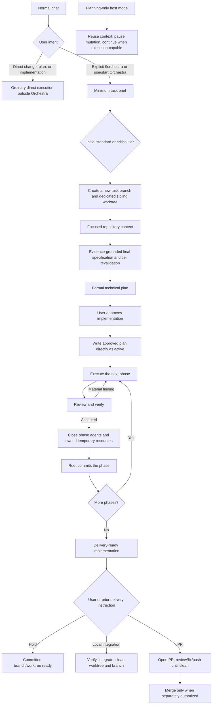

# Orchestra Workflow

## End-to-end flow

## Orchestrator behavior

Orchestra is an explicit planned-work route. It activates only through
`$orchestra` or an unequivocal imperative to use or start Orchestra. Ordinary
plan requests, descriptive mentions, and direct change, fix, or implementation
work remain outside Orchestra.

If Orchestra is invoked in a planning-only host mode, reuse the conversation,
identify the latest candidate checkpoint, and pause before branch, worktree,
plan persistence, implementation, or commit mutations. Ask the user to switch
to an execution-capable mode, then continue without a second invocation.
Orchestra observes the host mode; it never changes the host into a
planning-only mode.

The orchestrator maintains the main objective while adapting safely to facts
found during execution. It does not stop for routine technical choices and does
not blindly follow a stale step when a reversible correction is clearly needed.

It reports meaningful scope or design changes to the user. It asks before
crossing the high-impact boundaries defined in `AGENTS.md`. It owns capability
routing, the local plan, phase commits, direct PR observation, and final
judgment.

## Tier flows and models

The user selects the root's current Sol medium or Sol high session
configuration outside Orchestra. The root has no machine-readable assignment,
and Orchestra never changes its model or reasoning effort.

For every spawned dispatch, the root selects the explicit capability, base
profile, model, and reasoning effort from the one globally installed
configuration. Direct sync selects `native` or `external` outside Orchestra and
installs only that matrix at the canonical runtime path. Orchestra does not ask
for, persist, or override the selection per task. Do not switch the installed
configuration while an Orchestra task is active.

The installed assignment is always attempted first. The only runtime
compatibility exception is `repository_context`: when its assigned model is
rejected before execution because the internal subagent runtime does not support
that model, the root may spawn the same `analyst` packet with `gpt-5.6-luna`
reasoning `high`. Record that substitution only in live root memory. Do not
create a visible Codex task, modify either source or installed matrices, persist
fallback state, or apply the fallback to another capability. An unsupported
assigned model for any other capability returns `blocked`.

Profiles contain behavior only; public skill identifiers remain unchanged.
`general_implementation` and `independent_review` are assignment keys whose
behavior remains in the base `implementation_worker` and `reviewer` prompts;
neither has an internal playbook.

The only internal playbooks are `repository_context`, `web_research`,
`technical_planning`, `difficult_debugging`, `frontend_implementation`,
`browser_acceptance`, and `runtime_verification`. `architecture_analysis` uses
the shared architecture guidance reference also used with `technical_planning`
or `independent_review` when architecture is named; it has no dedicated
playbook.

### Native standard configuration

| Tier | Capability | Base profile | Model | Reasoning |
| --- | --- | --- | --- | --- |
| Standard | `repository_context` | `analyst` | `gpt-5.6-terra` | `high` |
| Standard | `web_research` | `analyst` | `gpt-5.6-terra` | `high` |
| Standard | `technical_planning` | `analyst` | `gpt-5.6-sol` | `high` |
| Standard | `architecture_analysis` | `analyst` | `gpt-5.6-sol` | `high` |
| Standard | `difficult_debugging` | `analyst` | `gpt-5.6-sol` | `high` |
| Standard | `general_implementation` | `implementation_worker` | `gpt-5.6-sol` | `medium` |
| Standard | `frontend_implementation` | `implementation_worker` | `gpt-5.6-sol` | `medium` |
| Standard | `independent_review` | `reviewer` | `gpt-5.6-sol` | `medium` |
| Standard | `browser_acceptance` | `verifier` | `gpt-5.6-terra` | `high` |
| Standard | `runtime_verification` | `verifier` | `gpt-5.6-terra` | `high` |

### External standard configuration

| Tier | Capability | Base profile | Model | Reasoning |
| --- | --- | --- | --- | --- |
| Standard | `repository_context` | `analyst` | `cursor/composer-2.5-fast` | `high` |
| Standard | `web_research` | `analyst` | `antigravity/gemini-3.6-flash-high` | `high` |
| Standard | `technical_planning` | `analyst` | `gpt-5.6-sol` | `high` |
| Standard | `architecture_analysis` | `analyst` | `gpt-5.6-sol` | `high` |
| Standard | `difficult_debugging` | `analyst` | `gpt-5.6-sol` | `high` |
| Standard | `general_implementation` | `implementation_worker` | `cursor/grok-4.5` | `high` |
| Standard | `frontend_implementation` | `implementation_worker` | `opencode/glm-5.2` | `max` |
| Standard | `independent_review` | `reviewer` | `gpt-5.6-terra` | `high` |
| Standard | `browser_acceptance` | `verifier` | `gpt-5.6-terra` | `medium` |
| Standard | `runtime_verification` | `verifier` | `gpt-5.6-terra` | `high` |

### Shared critical configuration

| Tier | Capability | Base profile | Model | Reasoning |
| --- | --- | --- | --- | --- |
| Critical | `repository_context` | `analyst` | `gpt-5.6-sol` | `medium` |
| Critical | `web_research` | `analyst` | `gpt-5.6-sol` | `medium` |
| Critical | `technical_planning` | `analyst` | `gpt-5.6-sol` | `high` |
| Critical | `architecture_analysis` | `analyst` | `gpt-5.6-sol` | `high` |
| Critical | `difficult_debugging` | `analyst` | `gpt-5.6-sol` | `high` |
| Critical | `general_implementation` | `implementation_worker` | `gpt-5.6-sol` | `high` |
| Critical | `frontend_implementation` | `implementation_worker` | `gpt-5.6-sol` | `high` |
| Critical | `independent_review` | `reviewer` | `gpt-5.6-sol` | `high` |
| Critical | `browser_acceptance` | `verifier` | `gpt-5.6-sol` | `medium` |
| Critical | `runtime_verification` | `verifier` | `gpt-5.6-sol` | `medium` |

A second critical review reuses `independent_review`
with Sol high only for a named measurable risk and independently detectable
defect class. No Orchestra assignment uses Sol xhigh.

Frontend implementation composes `implementation_worker`; browser acceptance
composes `verifier`. They remain independent and never run as one combined
role.

## Context and planning

After explicit activation in an execution-capable mode:

1. The root reuses the prior conversation, classifies the internal checkpoint
   (exploration, candidate specification, candidate plan, adopted
   implementation, or resumable Orchestra task), and obtains a minimum brief:
   objective, visible result, approximate repository area, known critical
   risks, and bounded factual open questions. If `$orchestra` arrives without
   an objective, ask for it before creating resources. If the user explicitly
   limits the request to brainstorming, remain read-only until the user
   authorizes formal task setup.
2. From that brief, the root declares an initial standard or critical tier.
3. The root resolves the intended base branch and committed revision, then uses
   Git directly to create a collision-free `orchestra/<task-slug>[-N]` branch
   and dedicated sibling worktree. Never mutate, switch, clean, stash, commit,
   or repurpose the source checkout. For prior committed work, create the task
   worktree at the adopted source HEAD while recording the integration base.
   For scoped uncommitted work, import selected non-ignored paths through
   `adopt_worktree.py` into the clean task worktree. The root verifies
   distinct task/base paths and branches before any capability dispatch. A
   fresh task `HEAD` equals the captured base revision; an adopted task `HEAD`
   equals the adopted source revision while the earlier integration base
   remains recorded.
4. An `analyst` with `repository_context` answers the brief's bounded factual
   questions from the exact task worktree. The root may skip or reduce this
   dispatch only when it cites the specific prior evidence it reuses (artifact
   and HEAD, same session); otherwise dispatch. Consume the result and close the
   one-shot analyst.
5. The orchestrator continues the user dialogue using that evidence. Additional
   `repository_context` dispatches are allowed only for newly material factual
   questions and request only the targeted context delta; consume and close each
   one-shot analyst before continuing.
6. The root confirms the final specification with Objective, User-visible
   behavior, Constraints, Acceptance, Exclusions, Decisions, and Open questions,
   then revalidates the tier. If evidence changes the tier, use the new tier for
   every later dispatch and request only the context delta tied to the newly
   discovered risk.
7. Final specification confirmation is the checkpoint for the root to write the
   formal plan in conversation or system temporary storage; no second literal
   request to make a plan is required. Dispatch `technical_planning` (or
   `architecture_analysis` for a bounded named architecture question) when
   useful; for a small single-phase standard task the root may write the
   compact plan directly. A single-phase standard plan is explicitly compact:
   objective, one phase contract, verification, nothing else.
8. A critical plan audit is an independent `reviewer` dispatch only when its
   packet names a measurable risk, supporting evidence and affected area, and
   an independently detectable defect class. Complexity alone is insufficient.
9. The root reviews the plan, summarizes it at the user's altitude, and requests
   implementation approval.

Every planning, implementation, review, verification, plan, and commit operation
for the task uses the exact dedicated worktree. Formal planning remains
read-only against the source checkout. Source branch, index, and uncommitted
content stay unchanged; scoped dirty adoption copies selected paths into the
task worktree only.

Standard and critical implementation does not begin until the user explicitly
approves the aligned plan. That approval covers implementation and successful
commits at the approved phase boundaries; it does not authorize merge, release,
deployment, production mutation, or another delivery action. If adopted
committed work passes unchanged, completion does not require an artificial
commit.

If the user rejects or abandons the task before plan approval, preserve any
resource that contains unique work. Remove only a demonstrably clean task
worktree whose branch is still at the captured base or adopted revision, using
the existing safe cancellation contract. No plan has been persisted at this
point.

### Local task plan

Before approval, neither the provisional specification nor the formal-plan
draft is persisted. After approval, the root writes the exact approved plan
directly as `active` to
`git rev-parse --git-path orchestra/plan.md`. It is never versioned and is an
intent and resume aid for the root, not a workflow database. It records the
objective, tier, branch, base revision, decisions, phase contracts,
verification, current phase, blocker, next action, and uncommitted-work note.
When adoption applies, also record the adopted source revision, imported
paths, existing commit range, and remaining phases.

Its statuses are:

- `active`: the root is executing after explicit user approval;
- `blocked`: execution stopped at a named blocker and next action;
- `completed`: phases are reviewed, verified, and committed, while delivery
  authority remains separate.

The normal lifecycle is `active` to `completed`, with `active` to `blocked` to
`active` when needed. The root owns every update; plan state never grants
authority beyond the user's instruction.

On resume, the root resolves the path again and reconciles the plan with
`git status`, branch, HEAD, merge base, and relevant commits. Git is
authoritative for code, worktree state, and history; the plan is authoritative
only for approved intent and recorded progress. The root corrects stale
progress, revalidates affected evidence, and never infers missing approval. A
missing or unreadable plan prevents automatic continuation until it is
reconstructed and realigned with the user. Worktree cleanup removes the plan;
there is no global index, plan CLI, Kanban board, event log, or state engine.

## Phase execution

Each phase has one outcome, allowed scope, acceptance criteria, and verification
set. A phase-specific subplan is created only when the phase cannot be safely
delegated from the main plan.

The loop is:

1. The root selects one `implementation_worker` with `general_implementation`
   or `frontend_implementation` and keeps that owner available for the whole
   phase.
2. The root creates at most one `verifier` for each applicable capability,
   `runtime_verification` and `browser_acceptance`, and reuses the corresponding
   verifier for affected reruns during the phase. If verification returns
   `failed`, return findings to the same implementation owner and re-verify
   before dispatching `independent_review`. If it returns `blocked`, the root
   decides whether review proceeds on source alone and, when it does, records
   the blocked reason in the review evidence.
3. One independent `reviewer` checks specification, correctness, regressions,
   safety, and materially defect-prone design and remains available for delta
   review during the phase.
4. Accepted findings return to the same implementation owner.
5. Re-run affected verification with the same capability verifier and send the
   meaningful delta to the same reviewer.
6. After final evidence is consumed, the root performs the phase teardown
   described below.
7. When teardown permits the phase to close, the root commits with direct Git
   by default. It may use the narrow commit helper when exact-path staging is
   useful.

When either the same failure repeats (its second occurrence) or two fix-review
rounds with distinct legitimate findings fail to converge, stop blind retries
and choose: reassess the phase approach, dispatch `difficult_debugging` when
the pattern suggests a deeper cause, or ask the user when an authority boundary
is crossed. An isolated mechanical Git failure stays with the root: inspect the
current status and latest commit once, make an obvious safe correction when
available, and do not dispatch an agent merely to operate or explain Git.

### Phase teardown

The root keeps only an in-memory list of the agents and temporary resources it
created for the current phase. It closes one-shot repository, planning, plan
audit, web research, or difficult-debugging agents after consuming their
result. The implementation owner, independent reviewer, and each capability
verifier remain open through the phase so fixes, reruns, and delta review reuse
their relevant context.

After final review and verification pass, but before phase commit, the root:

1. asks resource-owning phase agents to stop only the exact servers or processes
   they started and close only their task-dedicated browser tabs;
2. stops any shared temporary process the root itself started;
3. consumes the teardown results, then calls `close_agent` for every phase
   agent, which also closes its descendants;
4. confirms that no known agent or owned process with worktree write access
   remains active.

An active write-capable agent or owned process blocks the commit. Failure to
close a source-read-only browser tab is reported as partial cleanup but does not
invalidate otherwise accepted evidence or the Git commit. Orchestra never scans
for or kills unrelated processes, closes unrelated tabs or sessions, persists a
resource registry, or adds cleanup behavior to the phase-commit helper.

### Test permissions and browser routing

Test commands run in the ordinary sandbox unless their packet declares a
specific elevated requirement. Before broadening verification, diagnosing, or
returning any failed test as product evidence, rerun the exact same command,
arguments, and working directory once with elevated permission. If it passes,
record the sandbox dependency and accept the elevated evidence. If it fails
again, treat the repeated result as trustworthy failure evidence. If elevation
is unavailable or unsafe, return `blocked`. Do not turn the retry into a shell
wrapper or a broader command.

Packets for `frontend_implementation` browser work and `browser_acceptance`
carry `browser_route: auto | in_app | chrome`:

- `auto` explicitly selects Codex's in-app Browser first. After supported
  connection recovery, it may fall back to Computer Use with Chrome only when
  the in-app Browser is unavailable or cannot provide required authentication,
  extension, native-dialog, browser-specific, or system-integration behavior.
- `in_app` selects only the in-app Browser.
- `chrome` selects only Computer Use with Chrome.

An explicit route from the user, relayed by the root or given directly in the
agent conversation, wins and remains fixed unless that instruction also permits
fallback. A functional failure, application timeout, or selector problem never
causes a switch. On an allowed fallback, close the in-app task tab, open an
independent Chrome task tab, and repeat the complete scenario so evidence from
different browser surfaces is never combined into one pass. Frontend iteration
and independent browser acceptance use separate tabs and evidence.

## Review policy

Automatically fix findings that demonstrate:

- incorrect behavior or unmet acceptance criteria;
- security, privacy, or data-integrity risk;
- likely regression;
- unsafe error handling or concurrency;
- a maintainability defect likely to cause future incorrect behavior;
- missing verification for important behavior.

Do not cycle on:

- personal style preference already covered by formatter/linter;
- speculative architecture without a concrete failure mode;
- unrelated cleanup;
- scope expansion disguised as review;
- repeated restatements of an already rejected suggestion.

## Worktrees and branches

Every new formal Orchestra task owns a new task branch and dedicated sibling
worktree. Existing source checkouts belong to their owners and are never
repurposed, cleaned, stashed, committed, or otherwise mutated for a new task.
The root chooses the first available `orchestra/<task-slug>[-N]` branch and
sibling path, records the exact base branch, base revision, task branch, and
worktree path in its transient context, and creates no global registry.

For a fresh task, create the worktree from the intended committed base revision
so task `HEAD` equals that base. For adopted committed work, create the
worktree at the adopted source HEAD while retaining the earlier integration
base. For scoped uncommitted work, keep the source unchanged and import selected
non-ignored paths through `adopt_worktree.py` into the clean task worktree;
imported content may remain unstaged there. Preserve existing commits without
rewriting. If ownership of dirty paths is ambiguous, pause for exact path
selection rather than inferring hunk splits.

Reuse is allowed only for the same live pre-approval task or when the approved
local plan, objective, task branch, base, and worktree all identify the same
resumed task. Missing or conflicting identity blocks reuse. If planning is
rejected or canceled, the root may remove the worktree and branch only after
proving that the worktree is clean, its branch still points to the captured
base or adopted revision, and it contains no unique work. Otherwise it
preserves the resources and reports them.

After authorized integration:

1. verify the exact task revision and selected delivery result;
2. integrate using the selected local or PR path;
3. confirm either the exact local fast-forward or the exact merged PR head;
4. remove the clean task worktree and its local plan;
5. delete the unchanged local task branch;
6. for a merged PR, delete the remote task branch only when it still points to
   the merged head.

`hold`, an open PR, or pending delivery authority intentionally retains the task
resources. Dirty, moved, ambiguous, or unverified resources are never removed.
Cleanup after a completed mutation returns `partial` and names every retained
resource when it cannot finish safely.

## Commit path

Plan approval covers commits at successful phase boundaries. Commit execution
is a root responsibility, not an agent profile or capability. The default path
is one direct pass: inspect status and the relevant diff, stage only the accepted
paths, create a file-based commit with a concise title plus useful intent and
validation, then read the resulting SHA and status once. Do not require empty
ceremonial sections, byte-for-byte message equality, repeated authority checks,
or an agent dispatch.

The optional narrow helper exists only when exact-path staging is useful. It
preserves unrelated work, rejects staged paths outside the accepted scope,
commits the selected paths, and verifies that any created commit contains no
other paths. A legitimate commit-message hook may add trailers. If Git created
the intended commit, its SHA is success evidence even when an auxiliary command
reported a failure; do not retry, amend, or manufacture another commit.

Git provides atomic commit and reflog behavior. Local commits do not require an
isolated index, crash journal, authority bundle, or repeated subprocess
validation.

Phase-agent and temporary-resource teardown is complete before this path starts;
it is not part of direct Git or `commit_phase.py`.

## Delivery policy

A consumer repository stores an explicit delivery policy. When it is missing,
Orchestra asks the user once and recommends `hybrid`. It does not infer
permission from existing PRs, CI workflows, or branch history.

`orchestra.toml` contains only the delivery mode and ordered verification checks
as argument arrays. PR merge and local integration share that check runner;
commands never pass through a shell.

Supported policy modes:

- `pr-required`: final integration goes through a PR.
- `hybrid`: the user chooses local integration or PR per task.
- `local-direct`: local integration is permitted when explicitly requested.

## PR path

The unchanged public PR skills preserve the proven behavioral chain:

1. PR-open reads the complete branch commit range and diff.
2. The root synthesizes and publishes a compact `PR-CONTEXT` capsule.
3. The root calls the narrow PR helper directly to observe GitHub/CI and
   review-thread state.
4. The root evaluates actionable feedback against intent, current code, and
   scope, using an independent `reviewer` when code-review judgment is useful.
5. The implementation owner applies accepted fixes, verifies them, commits, and
   pushes.
6. The loop continues until two complete clean observations occur on the same
   head. The root passes the first clean head directly to the second observation
   in memory; a push or head change resets it. The second observation on an
   unchanged head is a lightweight but complete re-poll of checks and review
   threads; it does not re-read the diff.

GitHub remains the external truth. PR-CONTEXT lives only as one upserted capsule
in the PR body. The helper reports current checks and review-thread evidence; it
does not interpret feedback, fix code, route work, or persist state. The root
evaluates only unresolved, non-outdated feedback and returns accepted findings
to the same implementation owner.

`Open a PR` authorizes opening, review processing, fixes, commits, and pushes
needed to make that PR clean. It does not authorize merge unless the user said
`merge when clean` or separately requests merge later.

After an authorized merge, the PR helper verifies the `MERGED` state against the
exact reviewed head and performs conservative cleanup. It removes only a still
clean task worktree whose branch remains at that head, deletes the local branch
with an expected-value guard, and uses lease-protected deletion for an unchanged
remote task branch. This exact merged-head proof permits cleanup after merge,
squash, or rebase without pretending that all three preserve commit ancestry.
An absent remote branch is already clean; a moved branch is retained.

## Local integration path

Local integration is a direct alternative, not a degraded PR path. It requires:

- policy permission;
- explicit task-level user direction;
- clean task scope and fresh verification;
- integration into the intended base without rewriting unrelated history;
- confirmation of the result;
- worktree and merged-branch cleanup.

The mechanical path runs configured checks in the clean task worktree, permits
only conservative fast-forward integration, verifies that the base contains the
captured task SHA, and removes only a still-clean integrated worktree and fully
merged task branch. Divergence returns to the root for resolution.

It does not authorize release, deployment, or production mutation.

## Maturity

Automated checks and representative canaries provide evidence. The user decides
when Codex Orchestra is sufficiently mature to port to another harness.
