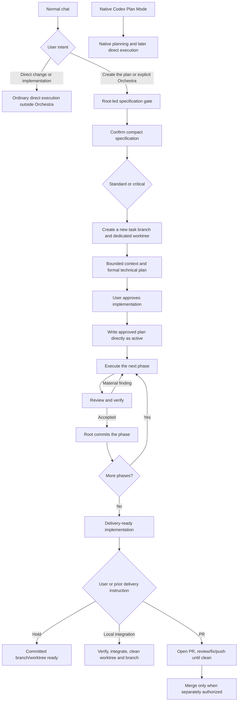

# Orchestra Workflow

## End-to-end flow

## Orchestrator behavior

Orchestra is an explicit planned-work route. Native Codex Plan Mode and
Orchestra are mutually exclusive; an Orchestra request made while Plan Mode is
active must wait until the user leaves Plan Mode. In normal chat, ordinary
change, fix, implementation, and implementation of a prior native plan remain
direct work. Explicit intent to create, prepare, or write the implementation
plan starts Orchestra.

The orchestrator maintains the main objective while adapting safely to facts
found during execution. It does not stop for routine technical choices and does
not blindly follow a stale step when a reversible correction is clearly needed.

It reports meaningful scope or design changes to the user. It asks before
crossing the high-impact boundaries defined in `AGENTS.md`. It owns capability
routing, the local plan, phase commits, direct PR observation, and final
judgment.

## Tier flows and models

The user selects the root's current Sol medium or Sol high session
configuration outside Orchestra. The root has no machine-readable assignment,
and Orchestra never changes its model or reasoning effort.

For every spawned dispatch, the root selects the explicit capability, base
profile, model, and reasoning effort from the one globally installed
configuration. Direct sync selects `native` or `external` outside Orchestra and
installs only that matrix at the canonical runtime path. Orchestra does not ask
for, persist, or override the selection per task. Do not switch the installed
configuration while an Orchestra task is active.

Profiles contain behavior only; public skill names remain unchanged.
`general_implementation` and `independent_review` are assignment keys whose
behavior remains in the base `implementation_worker` and `reviewer` prompts;
neither has an internal playbook.

The only internal playbooks are `repository_context`, `web_research`,
`technical_planning`, `difficult_debugging`, `frontend_implementation`,
`browser_acceptance`, and `runtime_verification`. `architecture_analysis` uses
the shared architecture guidance reference also used with `technical_planning`
or `independent_review` when architecture is named; it has no dedicated
playbook.

### Native standard configuration

| Tier | Capability | Base profile | Model | Reasoning |
| --- | --- | --- | --- | --- |
| Standard | `repository_context` | `analyst` | `gpt-5.6-terra` | `high` |
| Standard | `web_research` | `analyst` | `gpt-5.6-terra` | `high` |
| Standard | `technical_planning` | `analyst` | `gpt-5.6-sol` | `high` |
| Standard | `architecture_analysis` | `analyst` | `gpt-5.6-sol` | `high` |
| Standard | `difficult_debugging` | `analyst` | `gpt-5.6-sol` | `high` |
| Standard | `general_implementation` | `implementation_worker` | `gpt-5.6-sol` | `medium` |
| Standard | `frontend_implementation` | `implementation_worker` | `gpt-5.6-sol` | `medium` |
| Standard | `independent_review` | `reviewer` | `gpt-5.6-sol` | `medium` |
| Standard | `browser_acceptance` | `verifier` | `gpt-5.6-terra` | `high` |
| Standard | `runtime_verification` | `verifier` | `gpt-5.6-terra` | `high` |

### External standard configuration

| Tier | Capability | Base profile | Model | Reasoning |
| --- | --- | --- | --- | --- |
| Standard | `repository_context` | `analyst` | `cursor/composer-2.5-fast` | `high` |
| Standard | `web_research` | `analyst` | `antigravity/gemini-3.6-flash-high` | `high` |
| Standard | `technical_planning` | `analyst` | `gpt-5.6-sol` | `high` |
| Standard | `architecture_analysis` | `analyst` | `gpt-5.6-sol` | `high` |
| Standard | `difficult_debugging` | `analyst` | `gpt-5.6-sol` | `high` |
| Standard | `general_implementation` | `implementation_worker` | `cursor/grok-4.5` | `high` |
| Standard | `frontend_implementation` | `implementation_worker` | `opencode/glm-5.2` | `max` |
| Standard | `independent_review` | `reviewer` | `gpt-5.6-terra` | `max` |
| Standard | `browser_acceptance` | `verifier` | `gpt-5.6-luna` | `xhigh` |
| Standard | `runtime_verification` | `verifier` | `gpt-5.6-terra` | `high` |

### Shared critical configuration

| Tier | Capability | Base profile | Model | Reasoning |
| --- | --- | --- | --- | --- |
| Critical | `repository_context` | `analyst` | `gpt-5.6-sol` | `medium` |
| Critical | `web_research` | `analyst` | `gpt-5.6-sol` | `medium` |
| Critical | `technical_planning` | `analyst` | `gpt-5.6-sol` | `high` |
| Critical | `architecture_analysis` | `analyst` | `gpt-5.6-sol` | `high` |
| Critical | `difficult_debugging` | `analyst` | `gpt-5.6-sol` | `high` |
| Critical | `general_implementation` | `implementation_worker` | `gpt-5.6-sol` | `high` |
| Critical | `frontend_implementation` | `implementation_worker` | `gpt-5.6-sol` | `high` |
| Critical | `independent_review` | `reviewer` | `gpt-5.6-sol` | `high` |
| Critical | `browser_acceptance` | `verifier` | `gpt-5.6-sol` | `medium` |
| Critical | `runtime_verification` | `verifier` | `gpt-5.6-sol` | `medium` |

A second critical review reuses `independent_review`
with Sol high only for a named measurable risk and independently detectable
defect class. No Orchestra assignment uses Sol xhigh.

Frontend implementation composes `implementation_worker`; browser acceptance
composes `verifier`. They remain independent and never run as one combined
role.

## Context and planning

After explicit activation in normal chat:

1. The root reuses the prior conversation, asks only genuine gaps, and confirms
   Objective, User-visible behavior, Constraints, Acceptance, Exclusions,
   Decisions, and Open questions with the user. No artifact is persisted.
2. The root classifies the settled work as standard or critical.
3. The root resolves the intended base branch and committed revision, then uses
   Git directly to create a collision-free `orchestra/<task-slug>[-N]` branch
   and dedicated sibling worktree. A new task never reuses the current
   worktree, even when it is already linked to the repository. The root verifies
   distinct task/base paths and branches, the captured base revision at task
   `HEAD`, and a clean task worktree before any capability dispatch.
4. An `analyst` with `repository_context` inspects only the domains needed for
   the request. The root may skip or reduce this dispatch only when it cites the
   specific prior evidence it reuses (artifact and HEAD, same session);
   otherwise dispatch. A reduced dispatch requests only the targeted context
   delta.
5. The orchestrator merges evidence into the settled specification.
6. The root writes the formal plan in conversation or system temporary storage,
   dispatching `technical_planning` (or
   `architecture_analysis` for a bounded named architecture question) when
   useful; for a small single-phase standard task the root may write the
   compact plan directly. A single-phase standard plan is explicitly compact:
   objective, one phase contract, verification, nothing else.
7. A critical plan audit is an independent `reviewer` dispatch only when its
   packet names a measurable risk, supporting evidence and affected area, and
   an independently detectable defect class. Complexity alone is insufficient.
8. The root reviews the plan, summarizes it at the user's altitude, and requests
   implementation approval.

Every planning, implementation, review, verification, plan, and commit operation
for the task uses the exact dedicated worktree. Formal planning remains
read-only. Uncommitted changes in the base worktree are preserved and never
copied, stashed, or treated as task input.

Standard and critical implementation does not begin until the user explicitly
approves the aligned plan. That approval covers implementation and successful
commits at the approved phase boundaries; it does not authorize merge, release,
deployment, production mutation, or another delivery action.

### Local task plan

Before approval, neither the provisional specification nor the formal-plan
draft is persisted. After approval, the root writes the exact approved plan
directly as `active` to
`git rev-parse --git-path orchestra/plan.md`. It is never versioned and is an
intent and resume aid for the root, not a workflow database. It records the
objective, tier, branch, base revision, decisions, phase contracts,
verification, current phase, blocker, next action, and uncommitted-work note.

Its statuses are:

- `active`: the root is executing after explicit user approval;
- `blocked`: execution stopped at a named blocker and next action;
- `completed`: phases are reviewed, verified, and committed, while delivery
  authority remains separate.

The normal lifecycle is `active` to `completed`, with `active` to `blocked` to
`active` when needed. The root owns every update; plan state never grants
authority beyond the user's instruction.

On resume, the root resolves the path again and reconciles the plan with
`git status`, branch, HEAD, merge base, and relevant commits. Git is
authoritative for code, worktree state, and history; the plan is authoritative
only for approved intent and recorded progress. The root corrects stale
progress, revalidates affected evidence, and never infers missing approval. A
missing or unreadable plan prevents automatic continuation until it is
reconstructed and realigned with the user. Worktree cleanup removes the plan;
there is no global index, plan CLI, Kanban board, event log, or state engine.

## Phase execution

Each phase has one outcome, allowed scope, acceptance criteria, and verification
set. A phase-specific subplan is created only when the phase cannot be safely
delegated from the main plan.

The loop is:

1. The root selects one `implementation_worker` with `general_implementation`
   or `frontend_implementation`.
2. A `verifier` runs applicable checks and reports their observed results. If
   verification returns `failed`, return findings to the same implementation
   owner and re-verify before dispatching `independent_review`. If it returns
   `blocked`, the root decides whether review proceeds on source alone and,
   when it does, records the blocked reason in the review evidence.
3. One independent `reviewer` checks specification, correctness, regressions,
   safety, and materially defect-prone design.
4. Accepted findings return to the same owner.
5. Re-run affected verification and review the meaningful delta.
6. The root commits directly or through the narrow commit helper when the phase
   passes.

When either the same failure repeats (its second occurrence) or two fix-review
rounds with distinct legitimate findings fail to converge, stop blind retries
and choose: reassess the phase approach, dispatch `difficult_debugging` when
the pattern suggests a deeper cause, or ask the user when an authority boundary
is crossed.

## Review policy

Automatically fix findings that demonstrate:

- incorrect behavior or unmet acceptance criteria;
- security, privacy, or data-integrity risk;
- likely regression;
- unsafe error handling or concurrency;
- a maintainability defect likely to cause future incorrect behavior;
- missing verification for important behavior.

Do not cycle on:

- personal style preference already covered by formatter/linter;
- speculative architecture without a concrete failure mode;
- unrelated cleanup;
- scope expansion disguised as review;
- repeated restatements of an already rejected suggestion.

## Worktrees and branches

Every new formal Orchestra task owns a new task branch and dedicated worktree
created from its intended committed base revision. Existing worktrees belong to
their existing tasks and are never adopted merely because they are current or
clean. The root chooses the first available `orchestra/<task-slug>[-N]` branch
and sibling path, records the exact base branch, base revision, task branch, and
worktree path in its transient context, and creates no global registry.

Reuse is allowed only for the same live pre-approval task or when the approved
local plan, objective, task branch, base, and worktree all identify the same
resumed task. Missing or conflicting identity blocks reuse. If planning is
rejected or canceled, the root may remove the worktree and branch only after
proving that the worktree is clean, its branch still points to the captured
base revision, and it contains no unique work. Otherwise it preserves the
resources and reports them.

After authorized integration:

1. verify the exact task revision and selected delivery result;
2. integrate using the selected local or PR path;
3. confirm either the exact local fast-forward or the exact merged PR head;
4. remove the clean task worktree and its local plan;
5. delete the unchanged local task branch;
6. for a merged PR, delete the remote task branch only when it still points to
   the merged head.

`hold`, an open PR, or pending delivery authority intentionally retains the task
resources. Dirty, moved, ambiguous, or unverified resources are never removed.
Cleanup after a completed mutation returns `partial` and names every retained
resource when it cannot finish safely.

## Commit path

Plan approval covers commits at successful phase boundaries. Commit execution
is a root responsibility, not an agent profile or capability. The root uses Git
directly or the narrow deterministic commit helper; it does not rediscover the
repository or reopen product decisions.

The commit implementation should preserve the useful `commitbot` behavior:

- inspect scope and relevant diff;
- use a structured message that captures why, acceptance, invariants,
  validation, and risks;
- stage only intended paths;
- use `git commit -F`;
- verify the stored commit message and resulting SHA;
- return success or a stable failure reason.

Git provides atomic commit and reflog behavior. Local commits do not require an
isolated index, crash journal, authority bundle, or repeated subprocess
validation.

## Delivery policy

A consumer repository stores an explicit delivery policy. When it is missing,
Orchestra asks the user once and recommends `hybrid`. It does not infer
permission from existing PRs, CI workflows, or branch history.

`orchestra.toml` contains only the delivery mode and ordered verification checks
as argument arrays. PR merge and local integration share that check runner;
commands never pass through a shell.

Supported policy modes:

- `pr-required`: final integration goes through a PR.
- `hybrid`: the user chooses local integration or PR per task.
- `local-direct`: local integration is permitted when explicitly requested.

## PR path

The unchanged public PR skills preserve the proven behavioral chain:

1. PR-open reads the complete branch commit range and diff.
2. The root synthesizes and publishes a compact `PR-CONTEXT` capsule.
3. The root calls the narrow PR helper directly to observe GitHub/CI and
   review-thread state.
4. The root evaluates actionable feedback against intent, current code, and
   scope, using an independent `reviewer` when code-review judgment is useful.
5. The implementation owner applies accepted fixes, verifies them, commits, and
   pushes.
6. The loop continues until two complete clean observations occur on the same
   head. The root passes the first clean head directly to the second observation
   in memory; a push or head change resets it. The second observation on an
   unchanged head is a lightweight but complete re-poll of checks and review
   threads; it does not re-read the diff.

GitHub remains the external truth. PR-CONTEXT lives only as one upserted capsule
in the PR body. The helper reports current checks and review-thread evidence; it
does not interpret feedback, fix code, route work, or persist state. The root
evaluates only unresolved, non-outdated feedback and returns accepted findings
to the same implementation owner.

`Open a PR` authorizes opening, review processing, fixes, commits, and pushes
needed to make that PR clean. It does not authorize merge unless the user said
`merge when clean` or separately requests merge later.

After an authorized merge, the PR helper verifies the `MERGED` state against the
exact reviewed head and performs conservative cleanup. It removes only a still
clean task worktree whose branch remains at that head, deletes the local branch
with an expected-value guard, and uses lease-protected deletion for an unchanged
remote task branch. This exact merged-head proof permits cleanup after merge,
squash, or rebase without pretending that all three preserve commit ancestry.
An absent remote branch is already clean; a moved branch is retained.

## Local integration path

Local integration is a direct alternative, not a degraded PR path. It requires:

- policy permission;
- explicit task-level user direction;
- clean task scope and fresh verification;
- integration into the intended base without rewriting unrelated history;
- confirmation of the result;
- worktree and merged-branch cleanup.

The mechanical path runs configured checks in the clean task worktree, permits
only conservative fast-forward integration, verifies that the base contains the
captured task SHA, and removes only a still-clean integrated worktree and fully
merged task branch. Divergence returns to the root for resolution.

It does not authorize release, deployment, or production mutation.

## Maturity

Automated checks and representative canaries provide evidence. The user decides
when Codex Orchestra is sufficiently mature to port to another harness.
