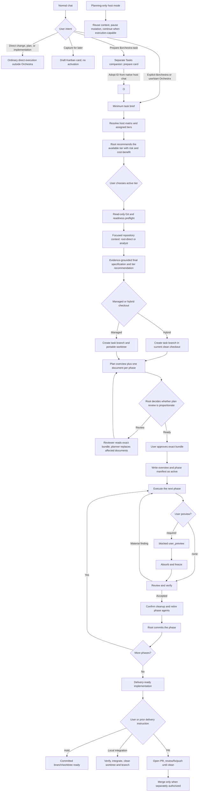

# Orchestra Workflow

## End-to-end flow

```mermaid
flowchart TD
    U["Normal chat"] --> Q{"User intent"}
    Q -->|"Direct change, plan, or implementation"| DX["Ordinary direct execution outside Orchestra"]
    Q -->|"Capture for later"| IN["Draft Kanban card; no activation"]
    Q -->|"Prepare $orchestra-task"| DT["Separate Tasks companion: prepare card"]
    DT -->|"Adopt ID from native host chat"| O
    Q -->|"Explicit $orchestra or use/start Orchestra"| B["Minimum task brief"]
    O --> B
    POM["Planning-only host mode"] --> WAIT["Reuse context, pause mutation, continue when execution-capable"]
    B --> MC["Resolve host matrix and assigned tiers"]
    MC --> TR["Root recommends the available tier with risk and cost-benefit"]
    TR --> T{"User chooses active tier"}
    T --> E["Read-only Git and readiness preflight"]
    E --> RC["Focused repository context: root-direct or analyst"]
    RC --> C["Evidence-grounded final specification and tier recommendation"]
    C --> CM{"Managed or hybrid checkout"}
    CM -->|"Managed"| OW["Create task branch and portable worktree"]
    CM -->|"Hybrid"| HB["Create task branch in current clean checkout"]
    HB --> P
    OW --> P["Plan overview plus one document per phase"]
    P --> PJ{"Root decides whether plan review is proportionate"}
    PJ -->|"Review"| PRV["Reviewer reads exact bundle; planner replaces affected documents"]
    PRV --> P
    PJ -->|"Ready"| A
    A["User approves exact bundle"] --> W["Write overview and phase manifest as active"]
    W --> F["Execute the next phase"]
    F --> PV{"User preview?"}
    PV -->|"none"| R["Review and verify"]
    PV -->|"required"| UP["blocked user_preview"]
    UP --> AB["Absorb and freeze"]
    AB --> R
    R -->|"Material finding"| F
    R -->|"Accepted"| X["Confirm cleanup and retire phase agents"]
    X --> M["Root commits the phase"]
    M --> N{"More phases?"}
    N -->|"Yes"| F
    N -->|"No"| D["Delivery-ready implementation"]
    D --> H{"User or prior delivery instruction"}
    H -->|"Hold"| HX["Committed branch/worktree ready"]
    H -->|"Local integration"| LI["Verify, integrate, clean worktree and branch"]
    H -->|"PR"| PR["Open PR, review/fix/push until clean"]
    PR --> PMG["Merge only when separately authorized"]
```

## Orchestrator behavior

Orchestra is an explicit planned-work route. It activates only through
`$orchestra`, native-host-chat adoption of a ready `$orchestra-task`, or an
unequivocal imperative to use or start Orchestra. Ordinary plan requests,
descriptive mentions, task capture, and direct change, fix, or implementation
work remain outside Orchestra.

If Orchestra is invoked in a planning-only host mode, reuse the conversation,
identify the latest candidate checkpoint, and pause before branch, worktree,
plan persistence, implementation, or commit mutations. Ask the user to switch
to an execution-capable mode, then continue without a second invocation.
Orchestra observes the host mode; it never changes the host into a
planning-only mode.

Every dispatch starts from a clean context: the packet and named artifacts
carry the assignment. The root identifies the execution host from available
tools and follows its native protocol under "Host adapters" and that host's
spawn reference. On every host the
first review is fresh; later delta reviews reuse that reviewer only while it is
available, and a closed owner or reviewer is recorded unavailable and replaced
with the same logical assignment and exact approved artifact IDs (a replacement
reviewer is always fresh and independent). Explicit CLI delegation is a
separate executor boundary that never changes the owning host or its native
spawn API.

## Host adapters

Shared skills, packets, artifacts, authority, cleanup declarations and Git are
identical across hosts. Each host owns spawn, wait and close, its model
matrix, conversation identity, permissions and `browser_route`. The host's
spawn reference owns the exact dispatch mechanics; this table names the
contract it implements.

| Host | Matrix and mechanics | Fresh agent per dispatch | Completed-state evidence before commit |
| --- | --- | --- | --- |
| Codex | native matrix, four behavior profiles; `host_codex.md` | `spawn_agent` with `fork_turns: none` | `wait_agent` completed state |
| Cursor | `hosts/cursor/roles.toml`; Cursor spawn reference | isolated Task worker plus role skill; never `~/.cursor/agents` or `resume: self` for a reviewer | completed, no retained write-capable resource |
| Grok Build | `hosts/grok/roles.toml`; Grok spawn reference | `general-purpose` subagent plus role skill, `isolation: none`, `cwd` = task checkout | completed, no retained write-capable resource |
| Devin | `hosts/devin/roles.toml`; Devin spawn reference | `run_subagent` with the matrix profile plus role skill | foreground return or `read_subagent` result |
| Claude Code | `hosts/claude/roles.toml`; Claude spawn reference | `Agent` with the matrix agent and explicit model, never `isolation: worktree`; packet names the checkout | returned result |

Matrix paths resolve under the selected runtime
(`${ORCHESTRA_RUNTIME_ROOT:-${ORCHESTRA_HOME:-$HOME/.orchestra}}`). Every host
resumes a phase-cohort agent only for preview absorption or an unfinished
turn, never for a fix round or a review, and waits under "Agent waiting"
without busy-polling. Devin and Claude Code have no `close_agent`; their
returned result is the completed-state evidence. Devin and Claude Code
plugin installations namespace agents as `orchestra:<name>`. A Claude Code
`managed` checkout is entered with `EnterWorktree` before the first dispatch
and left with `ExitWorktree` (`keep`) before cleanup. Devin has no native
browser route: acceptance uses `codex-cu` or an explicitly selected Codex CLI
Chrome handoff under "CLI delegation", otherwise `blocked`.

Inside T3 Code (its `t3-code` MCP tools are available) the provider remains
the host with its matrix, except that on `standard` and `critical` the review
pair under "Review policy" is `gpt-6.1-sol` and `claude-haiku-5-5`, both at
`high`. T3 creates a `managed` checkout through
`t3_worktree_handoff` and carries roles through `delegate_task` with the
row's explicit provider, model and effort, as `host_t3.md` defines; the root
still checks Git after every child and delivers with preserved T3-owned
resources.

Resolve executable resources through `orchestra/runtime.md`. A plugin keeps
skills, helpers, profiles, host matrices and presets in one relocatable
package; direct sync keeps its managed global destinations and helper
mirrors; explicit source mode uses the runtime reference's source layout.
Settings stay outside the plugin under `${ORCHESTRA_HOME:-$HOME/.orchestra}`; the separately
installed Tasks companion owns its data.

Plugins register no Codex agent types and edit no global configuration. A
Codex plugin or prepared-source dispatch spawns a native `default` agent with
the matrix's explicit model and effort and includes the selected behavior
profile's instructions and exact role skill path in the packet; direct sync
uses its registered profile type. If the host cannot dispatch the required
independent agents or explicit model assignment, report that gap; plugin
compatibility alone does not imply workflow support.

Codex synchronization requires `codex --version` 0.146.0 or later before any
mutation and installs exactly `default_permissions = ":workspace"`,
`approval_policy = "on-request"` and `approvals_reviewer = "auto_review"`,
with no legacy sandbox mode, custom permission profile, workspace-root list,
execpolicy rule or Git helper. Older or unreadable clients block before any
change; manifest-owned Full Access or legacy blocks migrate atomically, and
`uninstall` restores the exact prior configuration regardless of version. Other hosts' sync installs their
agents, profiles and skills (Devin under `~/.config/devin/`, Claude Code under
`~/.claude/`), with no settings, identity hook or Task configuration, and
never writes any host's permission configuration. Native chats inherit configured
permissions; explicit host choices are never rejected or rewritten, and Task
Control never launches a host or overrides permissions. Under Codex Guardian,
shared Git metadata is outside the workspace boundary, so the root issues the
exact Git operation once with a narrow escalation; a denial is never
bypassed or turned into Full Access. The Claude Code plugin's only hook
allows read-only tools inside the installed package; direct sync instead asks
the user to add its runtime and skills directories.

Installing or loading a plugin does not activate Orchestra, select a tier,
install another runtime or grant delivery authority. Use one installation
route per host to avoid duplicate skills. The core package contains no Task
Control, Hub, identity hook or MCP server; the Orchestra Tasks companion is
optional.

The orchestrator keeps the main objective while adapting safely to facts
found during execution: it does not stop for routine technical choices or
follow a stale step when a reversible correction is clearly needed, reports
meaningful scope or design changes, and owns capability routing, the local
plan, phase commits, direct PR observation and final judgment.

## Standalone tools

The role skills and `orchestra-phase-commit` also support direct user requests
outside the planned workflow. Calling one never activates `$orchestra`.
The same role boundaries apply: analysts and reviewers are read-only,
implementers own bounded edits, and verifiers inspect behavior without editing
source. The direct request supplies intent, scope, target checkout or revision,
available evidence, and authority; ask only for information that cannot be
inferred safely. Return a concise inline result unless a named consumer needs
a file. Standalone work requires no tier, Coordinator, task card, phase IDs,
plan persistence, or fabricated Orchestra artifacts.

Capability playbooks retain their substantive engineering guidance in direct
use. Their phase-specific transport, artifact naming, preview decisions, and
plan bundle requirements apply only inside an activated Orchestra task.
Standalone planning returns a proportional proposal without writing a formal
plan bundle; visual work still supplies inspectable evidence through the
available host. Repository checks and authority boundaries apply in either
route. A standalone commit requires explicit commit authority and honest
verification/review status; it does not certify independent review. Within
Orchestra, a phase commit still requires the approved plan and all current
review and verification gates.

The PR and local-integration skills remain specialized delivery tools with
their existing policy, task identity, authority, and freshness requirements;
standalone role use does not waive those contracts. They do not require legacy
`commitbot`, `prbot`, `openprbot`, or `prmerge`. Direct code or PR analysis may
use the reviewer role without creating Orchestra delivery state.

## Modular engineering

Orchestra supplies reusable engineering capabilities as well as an explicitly
selected planned workflow. `orchestra-engineering` can be discovered for an
ordinary investigation, explanation, design, implementation or evidence task;
it preserves that task's outcome, authority and chosen flow. It does not select
a tier, create task state, dispatch agents, require phase reports or activate
`$orchestra`. `orchestra-project-verification` maintains and executes reusable
project verification knowledge under the lifecycle below. Installed metadata
makes skills discoverable, not guaranteed to run; hosts without automatic skill
routing can invoke the same skill explicitly or link it from an authorized
project instruction. Never claim universal enforcement from installation.

Route by the required result, not by a list of mandatory activities. An
implementation can investigate, try a bounded experiment, change code and test
it within its existing authority. A read-only question stays read-only. A
simple edit does not acquire an architect, research pass or verification map.
Use independent roles when their responsibility or evidence independence is
needed. A selected role keeps its limits; reading a playbook's engineering
technique does not make an implementer an independent reviewer or grant an
analyst write authority. Existing custom workflows may consume these resources
without producing Orchestra artifacts.

The substantive criteria, including the mandatory source-comment policy for
authored source, live in `architecture_guidance.md`; capability
playbooks add domain technique, and role skills define bounded assignments.
Orchestra's own workflow rules, role boundaries and engineering conventions
are revisable design choices. Within authorized scope, propose and review a
better mechanism at its canonical source; an existing rule is a current
constraint, not an immutable product decision or a reason to reject a viable
improvement. Evaluate Orchestra changes against VISION.md "Success criteria"
and "Quality per token". Distinguish a proposed benefit from observed
improvement and generalization evidence. Changes to authority or delivery
policy follow their respective authority boundaries; rule changes do not
themselves grant task or host permissions. Until an
authorized change is accepted, do not silently ignore normative instructions.
New rules must address the demonstrated cause rather than accumulate
prohibitions after every failure.

## Repository readiness

`orchestra-repo-readiness` is the explicit entry that prepares an existing
repository so agents can work in it reliably: it diagnoses the repository
against its target state, repairs what a grant names, cleans the test suite and
maintains `.agent/` conventions. The target state lives only in that skill. It
composes with ordinary engineering and full Orchestra without activating a
tier, creating task state or adding a mandatory audit stage. Every
source-writing entry consumes the comment policy directly.

Diagnosis needs only the brief's execution authority and never edits. It
reports each item with observed evidence and coverage; sampled inspection never
certifies the whole repository. A repair grant names the area or items and
covers in-scope investigation and reversible fixes without a second approval
per candidate. Material product, public-contract, data, security or normative
policy changes remain proposals. "Repository conventions" owns policy writes;
never relax a rule to authorize the operation it blocks.

Repairs prefer structure, then mechanical checks, then text. One implementation
owner carries each problem across code, docs and tests; parallel writers need
disjoint paths. The root resolves overlap and policy edits and preserves
independent implementation review through the selected route, using the
existing completion-aware waiting policy. No health score, backlog service or
report schema is introduced. Folder reorganization, aesthetic renames,
formatting sweeps, major dependency upgrades and unrelated behavior changes are
out of scope. Recurring mistakes are repaired through that skill.

## Project verification

`orchestra-project-verification` supports four operations: prepare a useful
feature map, run selected journeys, refresh affected knowledge, or audit a named
map. The direct brief or approved phase supplies authority; no separate tier,
plan, report schema or global install is required. Reuse maintained repository
documentation and tests. If no entry exists, `.agent/verification/README.md`
may index short feature recipes and existing commands. Keep helpers with the
repository's test tooling and retain them only for a recurring interaction the
current tools cannot express cheaply. Do not wrap adequate tools for symmetry.

Preparation discovers real commands, entry points, supported test data and
runtime prerequisites. Start with the most useful three to five journeys (or
fewer for a smaller product), then prove one end to end when execution is
within scope. This is a starting set, not a coverage claim or universal quota.
A read-only preparation produces a proposed map and unexecuted recipes; it
never claims that a runnable application was observed. Recipe content and proof
standards are in shared engineering guidance, "Verification recipes".

A run uses the selected recipes against the actual instance and revision. The
executor verifies readiness, performs the named behavior, inspects its effects,
and retains evidence outside disposable runtime data before cleanup. A cold
agent should be able to follow the entry without prior conversation: provide
only the prerequisites and references needed for that journey. Authentication
requirements name credential categories and safe provisioning, never values.
Missing credentials, unsafe reset or unavailable interaction capabilities are
explicit gaps, not permission to bypass them.

Refresh follows affected behavior and dependencies. An explicit full audit
covers every entry in the named map, including blocked/unexecuted ones; it does
not silently expand ordinary maintenance to the whole application. Classify a
failure as recipe drift, insufficient interaction tooling or a product defect
using current evidence. Correct an authorized stale command or helper and
re-exercise it; never change the expected result merely to fit a regression.
Record draft versus demonstrated recipes and their relevant revision/environment
without appending a history of every run. A feature list is not test evidence.

An authorized implementation may maintain affected descriptive recipes and
necessary test helpers in its named scope, including operational `.agent/`
paths. A planner names those paths when a phase needs them. Normative policy
(hard gates, product expectations, required architecture or prohibitions) still
follows "Repository conventions"; moving policy into a recipe never evades its
authority. Per-run screenshots, logs and task progress belong to existing task
reports/private evidence, not the reusable knowledge store or plugin cache.
The normal review/check loop assesses meaningful recipe changes with the code.

## Initiative coordination

`orchestra-coordinate` is an explicit route for an initiative with genuinely
independent project, repository, acceptance or task-root boundaries; it never
activates from a multi-file edit and needs no Task Control, Hub or Bridge.
Ordinary work stays one task with proportional phases. An initiative may span
concurrent tasks in one repository, several repositories or projects on
different hosts; resolve actual Git roots, instructions and execution
environments rather than treating a project name or folder as the scope.

The parent owns shared intent, contracts, dependency ordering, resource and
tier choices within the user's selection, cross-child decisions and combined
acceptance. Each child owns its plan, implementation, review, verification and
permitted delivery as a full Orchestra root with proportional phases and the
normal role agents, carrying explicit activation in its packet; task size and
repository count never select another workflow. A child root is not a leaf
capability sent through `delegate.py`. A user's explicit custom or standalone
selection stays available under "Standalone tools", identified as such,
never presented as Orchestra execution or used as an automatic fallback. If the host cannot execute a root
responsibility, report that gap. One parent coordinates independent children;
children create no further hierarchy or sibling tasks.

Before dispatch, the approved initiative identifies each child's outcome,
repository and scope, exclusions, acceptance, supported tier or route, shared
contract and dependency conditions. Authority is inherited only within those
bounds; implementation, phase commits and each delivery action are separate
grants. The parent may accept derived child plans within the already approved
implementation scope,
but never pretends the user approved an unseen artifact or reopens settled
approval at every child. Children route unresolved material product,
public-contract, security, cost or destructive decisions to the parent, which
asks the user when existing authority does not settle them. Host permission
prompts remain user or host decisions. Unsupported models, tools or
authorization produce a precise blocker, never a substitution. Independent
unaffected work may continue while one child waits.

An exploratory assignment without implementation approval goes to a
root-capable child with investigation-only authority, naming the bounded
question, inspected product revision, investigation resources and a parent-readable
report destination. The child runs the read-only investigation of "Context
and planning", directly or with focused analyst evidence under "Standalone
tools" when no tier is chosen; only explicitly assigned analysis resources are
authorized. It returns the evidence-backed specification, cause or remaining
hypotheses, affected scope, risks, verification approach, tier recommendation
and a proportional plan candidate when useful; unavailable reproduction stays
an explicit limitation. The report is authorized output outside product
source, not a phase plan or task state, and grants no implementation, branch, phase
state or delivery. A host-provisioned checkout is a separately authorized
resource with one owner and a cleanup handoff, not permission to edit.

The parent synthesizes that report for the user's decision without repeating
the investigation, then continues the same root when supported, carrying only
the actual scope, tier, implementation, commit and delivery grants and
investigating only a material context delta. Use the existing combined
approval or parent acceptance of a derived plan, never a child approving its
own unseen plan; already authorized implementation gets no extra user stop
merely because the child investigated. An unavailable handle uses the
recovery rule below and the accessible report, never an automatic second
writer.

Keep one compact Markdown register, typically `BOARD.md`, linking the approved
brief and authority, repositories and checkout owners, shared contracts, child
routes and tiers, task-root resources, native handles, dependencies, results,
accepted SHAs, blockers and actual delivery. It replaces the initiative
index and does not duplicate child plans; optional `PROJECT.md` holds stable context, not progress; Now/Next/Done
are navigation, not states. Git and the host own execution state; a backlog
entry grants no authority.

Honor the user's chosen accessible location; otherwise use a caller-owned
external folder, an explicitly selected ignored
`<repo>/orchestra/projects/<project>` in a persistent checkout, or a verified
native project store. Resolve Git's exclude path with `git rev-parse
--git-path info/exclude` (`.git` may be a file). Never keep the register in
`.orchestra` or a disposable checkout. Verify access and retention, including
across hosts; ignored files are not backups, so retain or export needed
context through authorized storage at project closure or before
environment teardown. Obsidian may
edit these files but is no dependency. Durable repository knowledge follows
"Repository conventions".

The parent is the register's sole agent writer; children write their reports
elsewhere. Reread before narrow updates to keep human edits. An approved brief
is never rewritten: a later decision is appended as a dated amendment naming
what it supersedes, so a reader still sees what was approved. Write the pending
dispatch intent before launch, then the observed handle. A missing file or
pending row proves neither an empty project nor a failed launch: reconcile
native state first. Recover retrievable existing authority without re-asking;
unresolved material grants remain questions. Keep final evidence and
continuation handles while they have a consumer and remove only owned
transient prompts and logs no longer needed. No board schema, allocator, database or watcher.

Select resources separately for the parent, each task root and its role
agents. Carry the explicit root model and effort in the packet and register
through the host's actual controls, not a new matrix capability; role
assignments keep the chosen tier or preset. Actual concurrency, nesting and
tool access must support the assignment; a model-family label is no evidence
of effort.

Dispatch only through a host surface that supports the responsibility: native
user-owned tasks when the user asked for separate tasks and the app supports
them; native agents for internal roles, never as a claim of persistent
task-root capabilities they lack; or an explicitly selected supported CLI
running a root session. Consult `orchestra-coordinate/host-transports.md`
under the resolved skills root for concrete host primitives and model
selections. Check availability before
launch, preserve exact session identities and use argument APIs or safe
quoting. Never run a root through the leaf wrapper, strip its protections,
enable hidden bypass permissions, or assume a plugin provides missing host
tools.

Exactly one checkout creator owns each checkout: the native task transport or
the child's setup, never both; a clean host-supplied isolated checkout may be
adopted under "Child root setup". Several mutable repositories get separate
checkouts and owners or explicitly serialized writes, each with its own
instructions. Never run two writers in one checkout; same-repository parallel
tasks need separate checkouts, and an explicitly shared checkout serializes
writes. Reconcile shared ports, databases and containers too: Git isolation
does not isolate them. Read dependencies from accepted revisions or a fixed
contract, never a sibling's evolving files. `completed` evidence marks a
reviewed child revision; `delivered` only an actual integration into the
required base or environment. Task Control cards may expose those facts but
are no dependency.

Resolve instructions separately from the product checkout through the
selected runtime and source-preparation recipe: each environment uses one
verified plugin or pinned read-only source, with absolute entry, role,
workflow, matrix and adapter paths in packets. When changing Orchestra itself,
prepare that copy before source edits. Verify it at launch instead of
reinstalling per role. Project preferences point to the pinned coordination
entry instead of copying its policy. After an update, report the instruction
revision the next child uses; local plugin updates do not change remote
Project pins.

Before mutable work in a disposable environment, settle how the parent
retrieves the accepted revision and required reports or screenshots after
release: the task-branch push grant with a verified remote SHA (never base
push, PR or merge authority), or an authorized retained artifact or held
result. Resolve a missing preservation route before dispatch. An
environment-local path is no evidence of cross-host access; send an
accessible bounded packet or report.

Waiting follows "Agent waiting": completion and attention events with known
handles and cursors, compact summaries at stable handoff, and no active diff
or file inspection or repeated transcript reads to infer progress; an interactive CLI does not by itself
cure polling. On a stable result, read full child evidence only when a missing fact or concrete
failure requires it. Process success establishes neither acceptance,
independent review nor delivery.

A child messages the parent only when it needs the parent or is done: a
decision outside its authority, a derived plan for acceptance, a shared
resource request or release, a blocker, or its stable final handoff. Progress,
started work, unsubmitted candidates and intermediate results stay in its own
thread and reports for the parent to read when needed; a grant is acknowledged
by acting on it, never by a reply. A parent woken by a message that needs no
decision records any needed register fact without narrating it to the user.

After interruption or an ambiguous launch, reconcile the existing host handle,
checkout and Git revision first; a pending entry does not mean nothing
launched. Never replay a mutating packet or create a replacement while an
earlier owner may be active; if the host cannot settle that, block that child
for reconciliation. Resume the same logical child with the current revision,
accepted correction scope and changed dependency evidence. Replace a confirmed
unavailable owner only after its writes stop and its checkout and evidence are
handed over. A local failure requires no whole-initiative restart.

Every implementation handoff gives repository, checkout, base and final full
SHA, acceptance, checks, independent review status, evidence and recipe
paths, blockers, assumptions, delivery state and resource cleanup. The parent
consumes it once, then runs the real cross-project journey against the exact
set of accepted revisions and relevant environment and configuration, naming which revisions
and determining non-Git dependency versions actually ran; individual green
suites cannot establish a shared contract. Before integrating a child
revision, the parent runs the repository's hard gates itself at that exact
SHA in a clean checkout, since a child may reuse evidence across its last
delta, and reads every changed test assertion against the product's real
behavior; a test changed to match a mock or current output is a finding. A
child the user authorized to `merge when clean` is its own integrator instead:
once its PR is clean and its branch contains the current base (otherwise it
first refreshes under "Base refresh before delivery"), it merges and reports
the merged SHA to the parent once; joint acceptance then runs on the delivered
base. A parent without the repository's execution environment commissions
these runs to a verifier in that environment at the exact revision and judges
its actual commands and exit codes.

A joint failure goes to its owning child as a focused repair, keeping the same
child and reviewer when supported. Before that child's delivery, a repair
within approved intent reopens only its affected implementation, review and
check cycle and updates its terminal SHA and plan, the same bounded exception
as an accepted PR fix. Unchanged sibling evidence stays valid; a changed
interface invalidates dependent acceptance even without sibling code changes.
After verified delivery, a repair is a new bounded child task or PR from the
delivered base under the remaining authority, checking whether its delivery is
covered; never reuse a merged PR or its pre-squash branch, and preserve the
old plan and delivery evidence. The parent reviews contract and integration
consequences rather than repeating unchanged local code reviews. Completion requires joint acceptance
and honest delivery state, not a list of successful child messages; merge,
push, release and deployment stay separately scoped under delivery policy.

### Child root setup

A coordinated child root first resolves inherited approval and the supplied
checkout here and under the checkout rules, reusing settled scope, tier and
authority instead of presenting them as new decisions. An investigation-only
grant runs the read-only steps and returns at specification confirmation (or
the combined candidate), never reaching setup or execution without that
authority. Pending tier selection follows the analysis-resource rule above.

A child may adopt a clean isolated host-supplied checkout and owned non-base
branch after verifying repository identity, the approved base and HEAD, and no
other writer; a detached HEAD or base branch there gets one collision-free task
branch at that revision. For managed setup, an approved full base SHA in the
parent packet overrides upstream selection: verify it is available and
contained in the selected local base or its fetched upstream, then create the
checkout there, or block for parent reconciliation. Before setup or refresh
meant to publish, the base SHA must be in the fetched upstream unless the grant
covers publishing those local-only commits; otherwise the parent reconciles
publication scope. This never limits an authorized held result or local-only
integration. A child launched from a shared primary directory establishes its
isolated checkout before any write and uses it exclusively; an explicit
shared-checkout choice serializes writers. Supplied branches are not the
integration base; use managed semantics. A supplied branch outside
`orchestra/*` skips optional Coordinator registration and its Hub projection
(declared before setup; the child plan and register give visibility); when
that projection is required, select an owned `orchestra/*` branch in the same
checkout before registration, never silently losing a required card's
identity. Unexpected commits, even descendants, are preserved,
reported and reconciled; unknown work is never reset. The parent may direct safe selection of the approved
revision or accept a new captured base through a focused context delta. When
host metadata and the actual branch disagree, establish how resume and
publication use the branch first; invent no metadata API.

### Cross-environment acceptance

The child's independent review remains its responsibility. Parent-side
reproduction is conditional on a named risk, inaccessible evidence or a
different acceptance environment leaving a material verification gap. First
request retrievable child evidence or a focused correction where that
suffices; otherwise commission the missing proof at the exact child full SHA, before or after
delivery, in an owned independent checkout naming checks, environment,
permissions and cleanup. A verifier executes runtime or browser checks; a
reviewer assesses source and uses only the diagnostic execution "Review
policy" allows. `orchestra-coordinate/acceptance-packet.md` under the
resolved skills root illustrates this handoff without a result schema or a
mandatory second review. A shared VM does not remove reasoning independence;
a different environment establishes a separate property.

Consume actual commands, exit codes and limitations, not prose claims of
success, against repository requirements and authorized exceptions under
"Engineering guidance and evidence". A failure also present at the base is
evidence about its cause, not a waiver or a pass. Preserve partial work and
route findings to the same child and reviewer; the parent does not take over
its implementation or review loop.

## CLI delegation

On explicit user selection, the root may execute one bounded capability with
Codex, Cursor, Grok Build, Devin or Claude Code CLI through
`orchestra-delegate`, from any supported host. The executor choice changes
neither the owning host nor the tier. Use the exact requested model and a
supported effort after checking that CLI's current catalog or help; never fall
back silently to another model, provider, account or billing path. Native
assignments remain the default; a selected execution preset supplies the
overrides below. A delegate is a worker, never a second root running the
whole workflow.

Browser acceptance stays in the owning host by default; delegating
implementation never selects a browser handoff. An explicitly chosen Codex
CLI Chrome handoff uses `--capability browser_acceptance --browser-route
chrome` with explicit model and `--effort`, and needs a working dedicated
Chrome connector in that CLI session (such as the `cua_repl` Chrome surface);
Desktop tool availability is not evidence, and `requested_model` /
`requested_effort` do not prove provider-observed execution. The packet names
URL, readiness, journey, expected results, PNG evidence location and cleanup;
the verifier opens and closes its own tab and stays source-read-only. If the
connector returns an inline image without a file-save API, the root may save
the original image from the completed tool event in the delegate's private
log, preserving it and converting decoded pixels to PNG after checking the actual
format, and records the event identity and image paths in the handoff; a textual description is not
screenshot evidence. An unavailable model, connector, browser or permission
returns `blocked`, with no in-app, standalone or manual-preview fallback.

The packet carries objective, acceptance, owned paths, checkout, expected
HEAD, capability, constraints, permissions and useful evidence, and only the
context the assignment needs, never the full conversation. Implementation
packets link the shared "Source comments" guidance directly; do not assume
another CLI reads the owning host's global instructions. Inside a phase, include the
exact approved artifacts and handoff fields; outside it, the standalone
contract. Keep one writer per overlapping scope and preserve unrelated dirty
work.

Permissions follow the task's explicit authority and host restrictions; never
change global permissions or bypass an active host denial. The helper's
`default` policy keeps the configured approval rules of Codex, Devin and Claude
Code for implementation and verification, and runs Grok in its `default`
permission mode. `trusted` runs unattended and is used only
when the user authorized it, including a standing task instruction:

| CLI | `trusted` | Analysis and review |
| --- | --- | --- |
| Cursor | `--trust`, plus `--force` for implementation and verification | `--mode ask`, never `--force` |
| Grok | `--permission-mode bypassPermissions` | `plan` |
| Codex | `--sandbox danger-full-access`, `approval_policy="never"` | `read-only`, no escalation |
| Devin | `--permission-mode dangerous` | least-permissive `auto` |
| Claude Code | `--permission-mode bypassPermissions` | `plan` |

Analysts and reviewers keep read-only mode even under `trusted`; every Devin
assignment keeps workspace-trust checks and every Claude Code assignment
denies the `Agent` tool. Verifiers run authorized checks in
the CLI's execution mode with source-read-only instructions; a plan mode that
rejects the test command cannot supply runtime evidence. Reapply explicit
permissions on resume. Flags and prompts are not an operating-system sandbox:
the helper detects tracked and non-ignored content, index and HEAD changes
after execution and the root inspects them. Verification may declare exact
new untracked report paths with `--output-path`, never tracked edits. Ignored
build outputs and changes outside the checkout need their own runtime
evidence.

Execution is headless with structured output in the selected checkout; no
interactive driver, relay, extra worktree or persisted workflow state. Private
event logs outside the repository hold the observed session ID for explicit
resume when the executor reports one. Accepted fixes start a fresh
implementation session that receives a bounded continuation packet; start every
independent review, including a delta review, in a fresh session and never
resume a reviewer or an implementation session as its reviewer. A resume
packet names the current revision and context delta after the root rechecks
the worktree. Never use a last-session shortcut: Codex resume passes the
exact session UUID, checkout, model and effort, never `--last` or
`--ephemeral`. When the protocol reports no actual model, `observed_model`
stays unknown.

Launch once through the host's process tool, keep its handle and wait under
"Agent waiting"; do not detach and poll files. Supply a new private
`--result-file` beside the event log; the helper writes the final JSON
atomically, never over an existing file. Read that result (or the equivalent
tool output) once, then only the evidence judgment needs. Keep result and log
through review and recovery, then remove them together.

If the process ended without final output, inspect the result file and the
exact native session once; an absent result proves neither progress nor
success. Reconcile terminal evidence, Git content and owned resources before
any same-session follow-up. A completed native session with its attributable
report and check logs can recover evidence; otherwise it stays partial or
blocked. Never repeat implementation or passed checks to recreate a summary,
and do not claim arbitrary interruptions are recoverable.

`session_id` is observed identity; `resume_session_id` preserves the request
when the stream fails first; neither proves completion. Classify provider
refusals separately from local approvals, authentication, quota and transport
failures; a provider `403` never authorizes broader permissions or a bypass
retry. Timeout, interruption, authentication, denial, quota or malformed
evidence returns a bounded failure with the observed session and changes:
stop only that invocation's processes, never replay a possibly mutating
request, and inspect partial edits before resuming.

Exit zero is execution success, not acceptance: the root reads the result and
diff, completes repository checks, obtains the required independent review
and judges. Commit, push, PR, merge, production and deployment authority never
travel with a worker's write permissions; the root owns delivery. A missing
browser transport blocks browser evidence; a CLI text result cannot
substitute for it.

## Delegated execution presets

`standard-delegate` is an optional execution preset on the `standard` tier,
available from Codex, Cursor, Grok, Devin, and Claude Code. Selecting it explicitly authorizes its
assignments and bounded recovery ladder within the task's existing scope and
permissions; it never activates Orchestra by itself, changes the root model
or effort, or grants delivery authority. Ordinary native assignments remain
the default. Do not combine it with another tier silently: a tier change
requires an explicit choice to leave the preset or select a compatible one.
`cross-review` keeps every assignment on the owning host's matrix and sends
only independent review to another model family, because a reviewer from
the implementer's family tends to share its blind spots.
`mixed-models` gives each capability the model family chosen for it from
measured role runs; inside T3 Code its assignments run through
`delegate_task`.

The sole assignment source is `codex/config/execution-presets.toml`, installed
as `${ORCHESTRA_RUNTIME_ROOT:-${ORCHESTRA_HOME:-$HOME/.orchestra}}/execution-presets.toml` with a Codex
compatibility mirror. Its consumer is `delegate.py --resolve-only`: resolve
the selected preset, owning host, capability, tier, and root-selected attempt
before dispatch. It returns an exact CLI assignment, a native Codex assignment,
root reuse, or the owning host's browser matrix. Check actual model/tool
availability before use; unavailable assignments block rather than invoking a
different account, model, host, or billing path. Native Codex assignments must
be supported by the active host runtime. Other hosts use Codex CLI for Codex assignments and keep their own
browser route. The preset's Codex browser assignment stays native. An explicit
CLI Chrome handoff is a separate bounded assignment under "CLI delegation";
it does not silently override the preset or another host's matrix.
An explicitly supplied `--presets-file` may hold user-customized assignments;
never edit managed installed files to customize one task.

Keep the selection in conversation before approval and in the existing plan
Decisions afterward, including the exact preset source and resolved assignments.
On resume compare those assignments; configuration drift requires an explicit
decision, never an unnoticed reroute. Attempt history stays in the existing
reports and conversation. There is no retry database, agent registry, new
artifact kind, or automatic retry process. Direct use stays in conversation.

The launching conversation owns specification, orchestration, final judgment,
and delivery; its chosen model and effort are authoritative. Reuse the root
for planning and architecture when its observed model matches the configured
planner and it has sufficient context, including multi-phase planning. This
overrides the default requirement to dispatch a planner for complexity alone.
Dispatch an independent planner only for a named investigation or missing
context; a nonmatching root uses the configured planner without replacing
itself. Independent plan and code reviews still follow Review policy.

Delegate coherent assignments, not individual searches or commands. Context
workers return focused source evidence; the root does not repeat their whole
investigation. Each fix round is a fresh implementer session and each delta
review a fresh reviewer. Never forward the full chat or convert an implementer
session into its reviewer.

For this preset, the implementer writes or updates tests and runs useful
development checks. The runtime verifier owns the terminal required tests,
lint, types, build, and canonical suite in a separate source-read-only session.
Put their exact argv and cwd in the phase's `Independent verification gate`,
with reason `execution preset`; keep development checks under `Implementation
handoff checks`. This is the explicit exception to the default all-checks-owner
rule: the owner's handoff may name terminal checks as pending verification,
never as passing. A required user preview still waits for those checks to pass.
Then perform final independent review with the current verification evidence.
Failed checks return to the implementer, not to a verifier that edits source.
Rerun affected checks after fixes and the full gate only when required by
repository policy. Browser verification remains a separate capability.
If a repository explicitly requires the implementer itself to run a check,
preserve that requirement; otherwise avoid duplicating whole suites.

Recovery applies only to implementation and difficult debugging: attempt one
uses the capability row, attempt two the first configured recovery assignment,
and attempt three the last recovery assignment. A failed attempt means the
agent returns with acceptance unmet, establishes a substantive blocker, or
exhausts an agreed bounded work budget without a solution. An ordinary failing
test during active development is not an exhausted attempt. Authentication,
quota, unavailable models, permissions, transport failures, and an ordinary
wait timeout do not consume attempts or trigger escalation. Scope or authority
blockers require their existing decision, not a more privileged model.

The root decides each transition from evidence after the previous worker has
stopped and its changes/resources are inspected. Preserve useful edits. Before
the second attempt, pass what failed and the current revision; resume with the
new model only if that CLI supports it, otherwise start fresh. Before the third,
assemble both attempts' changes, commands/results, failed approaches, discarded
hypotheses, remaining acceptance, and exact scope in one compact packet. Use a
fresh Codex subagent on Codex or Codex CLI on another host; never pass a Cursor
session ID to Codex. Difficult debugging remains read-only; actual fixes use an
implementation capability with explicit edit scope. The rescue model does not
replace the preset's independent reviewer or verifier. If the third attempt
fails, report the concrete blocker and needed decision. Do not reset the ladder
by renaming the same unresolved assignment or switching its capability.

## Autonomy within an approved objective

The root is the technical lead: it receives the objective, hard constraints,
and success criteria, and decides the steps itself.

Preserve the approved objective, behavioral acceptance, scope, authority, and
binding user, repository and verified-contract constraints. An explicitly
user-selected mechanism remains a constraint; if satisfying the result requires
changing a binding constraint, seek user direction instead of overriding it.
Approval authorizes the plan's work; it does not establish the truth of an
agent-proposed technical premise, even when the plan labels that premise a
constraint or acceptance criterion.
When evidence shows that a planned mechanism cannot satisfy the approved
result, the root corrects the affected plan through the existing replacement
and review rules. Reassess only changed decisions and affected evidence. Do not
weaken behavioral acceptance or hard gates to preserve the mechanism; seek user
direction only when the correction crosses a boundary below. Treat causal
explanations as hypotheses and prefer the smallest supported approach that
preserves the approved result.

For requests to answer, explain, review, diagnose, or plan: inspect the
relevant materials and report the result; implement nothing.

Within an approved objective or plan: make in-scope reversible decisions and
carry out the approved work, correcting technical steps as above without asking
again — technical choices, tool and configuration details, file and directory
locations, dependency and environment fixes, changed-approach retries, and
non-destructive validation. A step named in the approved plan is authorized
by that approval. Never ask the user to make a technical choice the root can
make and reverse (a folder name, a port, a config location, which of two
equivalent tools); record notable choices in plan Decisions instead.

Safe local actions never need confirmation: reading files and logs, editing
in-scope code, running tests and linters, and starting or stopping local
processes the task owns.

Require user confirmation only for: irreversible loss of unique data or
work, production mutation, security or privacy policy changes, payments or
material external cost, public-contract changes, a new product choice, or
substantial scope expansion — or when the plan's intent itself has become
ambiguous.

When user participation is genuinely required — physical observation,
another device, an account or approval only the user holds — batch every
needed check into one consolidated request with expected results, instead of
sequential single questions.

## Conversation continuity

Interpret incoming messages in the active conversation. A question,
acknowledgement or progress update does not replace the approved objective,
cancel pending work, change authority or complete the task. A reply such as
"yes" can resolve a pending question; infer its scope from that question, not
from the word alone. A request to continue resumes the existing assignment.
Apply a correction or additional constraint to the affected work while keeping
the rest of the objective. A delivery-only restriction does not pause unrelated
authorized implementation. Honor an explicit stop, pause or cancellation and
preserve unique work; clarify genuinely conflicting intent before dependent work.

During active work, answer incidental questions through the host's nonterminal
response channel when available, then continue the authorized task. Do not end
the turn merely to answer a status question while actionable work remains.
With no active work, answer a casual message from context without starting tools
or a workflow solely because it arrived. Neither case creates task state,
memory initialization, a new wait, cleanup or a checkpoint just for the message;
tools and waits needed by the existing assignment remain valid. Report only
meaningful changes to the existing plan or handoff, not a message ledger.

Worker commentary, a wait timeout and a completed native turn are different
signals. A progress message is not a result, blocker or failed launch. Use the
existing host handle and completion evidence under "Agent waiting" and "CLI
delegation"; even process success needs the assigned deliverable and acceptance
evidence. Do not relaunch, retire or inspect an evolving implementation because
its worker said it was still working. A user correction goes to the same owner
when supported, without replaying its original mutating assignment.

After interruption or compaction, retain the objective, constraints, decisions,
authority, completed acceptance, outstanding work and existing handles. Recover
only missing context from the established plan, reports or native session. Check
whether the previous owner is still running, completed, blocked or unavailable
before resuming or replacing it; a missing tool response alone cannot decide
that. Reconcile any interrupted mutation before repeating it, and preserve the
implementation observation boundary. Only affected evidence becomes stale.
Continue independent authorized work while a genuine dependency waits. Do not
create a recovery database or promise continuation the host cannot provide.

## Engineering guidance and evidence

The shared `architecture_guidance.md` reference, reached through the loaded role
skill and its runtime resources, owns reusable engineering criteria and
verification recipes. Apply only sections relevant to the task's acceptance or
material risks; a trivial edit acquires no design exercises, new tests,
benchmarks or dedicated verifier from it. Planning uses "Decision evidence" and
"Behavioral verification" to identify consequential choices, expected outcomes,
failure hypotheses and the evidence to settle them; implementation fills
affected gaps and applies "Change quality"; review assesses necessity,
maintainability and test sensitivity, reconciling original scope with actual
journeys and omitted paths; verification executes assigned checks against
their expectations and records observed effects and limits.
These criteria also apply to standalone roles; capability boundaries,
terminal-check ownership, authority rules and dedicated-gate reasons stay
decisive.

Resolve material acceptance or policy ambiguity before dependent code. Before
implementation, independently review consequential choices that select or
change authorization, cross-system compatibility, data integrity or recovery
behavior, including choices an analyst calls settled; no tier or model exempts
them. Use the plan review or a bounded decision review, not a second gate for
choices already covered. A consequential choice emerging after combined
approval is still reviewed and reconciled under "Autonomy within an approved
objective" before dependent work. The root supplies the exact identities and
accessible results of the producers behind the decision, including results
omitted from `Review context`; the reviewer reads their material conclusions
and limits and checks for decision-changing omissions against the original
intent. `Review context` routes that evidence rather than replacing it with the
author's summary; incidental facts need no inventory. Assess alternatives,
authority, preservation and discriminating checks using "Decision evidence".
Touching related files or preserving an already reviewed policy needs
no new decision review. Factual questions may first be settled by the analyst
or an authorized experiment. Recommendations and agreement follow the
authority limits in "Decision evidence"; do not re-ask authorized decisions,
and if the owner picks a reviewed alternative, inspect only newly affected
assumptions. Standalone work uses the caller's review route and surfaces a
missing decision or review as a dependency; it never silently dispatches
agents or activates Orchestra. Decision review never replaces implementation review.

At intake, reconcile task acceptance, repository hard gates and optional
diagnostics with their execution owner and environment. "If available" waives
nothing. A genuine exception names the requirement and comes from authority
allowed to change it; inherited task approval does not supply it. Record an
already authorized exception and its limits in decisions instead of asking
again; until reconciled, keep the gate and report its blocker. An exception
covers only its named obligation, never separate review or configured delivery
checks, which need their own explicit authority and a supported policy or
configuration change. Never relabel a
missing mandatory check as optional or passing. Before accepting a report,
compare actual commands, results and source identity with the required set; well-formed output or a green subset is insufficient.

Before accepting work, diagnosing a failure or changing the workflow from a
retrospective, read the producer's relevant report and the evidence that could
change the judgment; a short final message does not prove missing
investigation. Keep observed facts, authorized decisions, recommendations and
uncertainty distinct when synthesizing. If a summary contradicts its source,
correct the summary and its dependent claims and prescribe no fix for the
unsupported diagnosis. Preserve prior reports and name superseded recommendations. This is
bounded source consumption, not replaying logs or repeating research.

Task-specific recipes and material assumptions live in the plan's acceptance,
risks and `Verification`, or the standalone brief; reports carry observed
evidence and limits in their existing fields. A decision map may live in a
report or an explicitly supplied portable document whose revision and access
consumers verify. There is no separate recipe registry or new artifact kind.
Reusable knowledge follows "Repository conventions" and "Durable knowledge
checkpoint"; a suggested recipe never becomes a hard gate by appearing in a
report.

## Attached Tasks companion

Orchestra works without Orchestra Tasks. Do not discover its installation, run
its helpers or publish global snapshots for ordinary direct tasks. An explicitly
tracked direct run may use its observation path without becoming a card.

A plan with `origin: prepared-card` retains the exact `kanban_uuid`, canonical
`kanban_short_id` and confirmed `kanban_title` from `task adopt`; resume
requires all three to match. This is an attached card, never a direct
task merely because its companion is unavailable. Load the host-selected
`orchestra-task` skill and its own runtime mapping. Do not resolve it relative
to the core bundle, use a different installed copy, or persist cache paths.
Missing, ambiguous or incompatible required skills/helpers block the card path.
Matching database schemas alone do not prove CLI/workflow compatibility.

At the existing pauses before phase commit, terminal completion, delivery and
returning to the user, apply the loaded companion's owner and safe-stop
obligations. An unavailable authoritative query blocks further mutation and
cleanup; mark the existing plan blocked with the concrete reason. The companion
owns command semantics, transfer, acknowledgement, finish and registration.
Its read-only snapshots cannot grant authority or replace the approved plan.

Before a delivery helper can remove local plan state, retain the exact card,
terminal revision and delivery inputs in the native handoff. Apply the
companion's delivery-registration and reconciliation instructions to the actual
verified result. A successful Git delivery with failed registration remains
registration-pending, not a reason to repeat delivery or claim Tasks is updated.
The companion documents the current original-chat-only recovery limitation.

Only an attached card or an explicitly tracked direct run passes an observation
ID plus the resolved absolute snapshot-helper path in transient packets. Observation failure is fail-soft;
card ownership or stop-state failure is not. Direct tasks without tracking have
no missing-companion warning. Loading either plugin does not activate this route.

## Tier flows and models

Tiers are host-specific lookups, not a shared enum.

On Codex, the recommended native root uses the installed matrix's
`technical_planning` model and effort. The user's current root remains
authoritative: Orchestra never changes or respawns it. Read
the Codex matrix selected by runtime resources and check the host's available
tools and models before dispatch. No rollout inspection, bridge aliases, or
external-model mode selection is required.

On Cursor, the root reads
`${ORCHESTRA_RUNTIME_ROOT:-${ORCHESTRA_HOME:-$HOME/.orchestra}}/hosts/cursor/roles.toml`. Cursor offers
`minimal`, `standard`, and `critical`. This cut assigns all three. The
root recommends `standard`; it recommends `minimal` when the user prioritizes
cost or speed; it recommends `critical` for matching high-impact risk.

On Grok Build, the root reads
`${ORCHESTRA_RUNTIME_ROOT:-${ORCHESTRA_HOME:-$HOME/.orchestra}}/hosts/grok/roles.toml`. Grok offers
`minimal`, `standard`, and `critical`. This cut assigns `standard` and
`critical` on `grok-4.7-build-fast` at effort `xhigh`. The root recommends
`standard`. Selecting `minimal` blocks: there is no cheaper Grok row.
`critical` uses the same spawn rows and raises root scrutiny; it does not
change model or reasoning.

On Devin, the root reads
`${ORCHESTRA_RUNTIME_ROOT:-${ORCHESTRA_HOME:-$HOME/.orchestra}}/hosts/devin/roles.toml`. Devin offers
`minimal`, `standard`, and `critical`. This cut assigns `standard` and
`critical`: every capability pins `swe-2-max`, whose slug already encodes
maximum reasoning, so there is no cheaper Devin row. The root recommends
`standard`. Selecting `minimal` blocks. `critical` uses the same spawn rows
and raises root scrutiny; it does not change model or reasoning.

On Claude Code, the root reads
`${ORCHESTRA_RUNTIME_ROOT:-${ORCHESTRA_HOME:-$HOME/.orchestra}}/hosts/claude/roles.toml`. Claude Code
offers and assigns `minimal`, `standard`, and `critical`. The root recommends
`standard`; it recommends `minimal` when the user prioritizes cost or speed;
it recommends `critical` for matching high-impact risk. The recommended root
runs at `high` effort on every tier (Sonnet 5.5 on `minimal` and `standard`,
Opus 5.5 on `critical`), because the root owns the approval gates; the user's
`/model` and `/effort` remain authoritative.

For every spawned dispatch, select a capability, profile, and explicit model
and effort from the owning host's matrix, unless an explicit CLI assignment or
execution preset overrides it. An unavailable assignment blocks that dispatch
until the user selects a supported option. Never silently substitute a bridge
alias, another provider, or an account with different billing.

The current workflow does not resume a former Codex external-mode task under
native assignments automatically. If an existing plan records external or dual
routing, stop before mutation and obtain an explicit transition decision that
preserves its checkout, approved scope, and accepted evidence. Historical
compatibility sources are archived in CodexBridge; they are not a runtime
fallback or a currently supported add-on.

Profiles contain behavior only.
`orchestra-project-start` is the additive implicit greenfield entry point;
`orchestra-repo-readiness` is the explicit-only lane that prepares an existing
repository and writes or refreshes its tracked `.agent/` store without
activating the workflow.
`general_implementation` and `independent_review` are assignment keys whose
behavior remains in the base `orchestra_implementation_worker` and `orchestra_reviewer` prompts;
neither has an internal playbook.

The only internal playbooks are `repository_context`, `web_research`,
`technical_planning`, `difficult_debugging`, `frontend_implementation`,
`browser_acceptance`, and `runtime_verification`. `architecture_analysis` uses
the review frame of the shared engineering guidance; it has no dedicated
playbook. Applicability for other roles follows "Engineering guidance and
evidence".

Codex offers `standard` and `critical`, with `standard` as the default
recommendation. Cursor and Claude Code additionally assign `minimal` for
ordinary work when cost or speed is the priority. Grok and Devin have no
cheaper assigned tier.
A tier choice
never waives production, migration, data, security, payment, destructive-action,
or delivery authority gates. Tier transitions remain user-directed.

### Installed matrices are the assignment truth

Explicit CLI and preset overrides follow "CLI delegation" and "Delegated
execution presets"; the invariants below describe the native matrices.

The installed TOML matrices, not this document, define native model and
reasoning assignment. The sources are `codex/config/roles.native.toml`
(installed as `$CODEX_HOME/orchestra/roles.toml`), `hosts/cursor/config/roles.cursor.toml`,
`hosts/grok/config/roles.grok.toml`, `hosts/devin/config/roles.devin.toml`, and
`hosts/claude/config/roles.claude.toml` (installed under
`${ORCHESTRA_RUNTIME_ROOT:-${ORCHESTRA_HOME:-$HOME/.orchestra}}/hosts/<host>/roles.toml`). Reassigning a
model or reasoning effort edits only the matching TOML file; this document is
not updated for such a change. Structural invariants the matrices must keep:

- Codex defines exactly `standard` and `critical`. Every defined tier assigns
  all ten capabilities to the four base profiles.
- No Orchestra assignment uses Sol xhigh.
- Cursor assigns `minimal`, `standard`, and `critical`. Composer 2.5 Fast
  remains the fast lane for repository, research, and runtime verification
  on `minimal` and `critical`. The Cursor spawn reference maps each row onto
  the closest live Task worker without rewriting product names.
- Grok assigns `standard` and `critical` on `grok-4.7-build-fast` at effort
  `xhigh` with identical spawn rows (`critical` raises root scrutiny, not the
  model) and blocks unassigned `minimal`. The Grok spawn reference maps rows
  onto `general-purpose` using supported explicit fields or documented host
  resolution, verified against host-recorded child model and effort. The spawn
  reference owns dispatch and recovery; do not invent a field a transport lacks.
- Devin assigns `standard` and `critical` with every capability on `swe-2-max`
  at `inherit` effort (`critical` raises root scrutiny, not the model) and
  blocks unassigned `minimal`. The model is pinned in each installed Devin
  agent profile; `run_subagent` accepts no per-dispatch model or reasoning
  field. The Devin spawn reference maps `subagent_type` onto that custom
  profile name, namespaced `orchestra:<name>` under a plugin installation.
- Claude Code assigns `minimal`, `standard`, and `critical`. Each row's
  `subagent_type` is `<profile>_<effort>`, a registered agent whose
  frontmatter pins that effort, because `Agent` accepts a per-dispatch model
  but no effort. Every such agent exists and no other is shipped. The Claude
  Code spawn reference maps product models onto `Agent` model aliases.
- Frontend implementation composes `orchestra_implementation_worker`; browser
  acceptance composes `orchestra_verifier`. They never run as one combined
  role.

## Context and planning

An initiative child root first applies "Child root setup".

After explicit activation in an execution-capable mode:

1. Reuse the conversation and classify the checkpoint (exploration, candidate
   specification, candidate plan, adopted implementation, resumable task).
   Obtain a minimum brief: objective, visible result, approximate area, known
   critical risks and bounded factual questions. Without an objective, ask
   before creating resources. Explicit brainstorming stays read-only until
   setup is authorized.
2. Read the owning host's installed matrix and capabilities ("Tier flows and
   models"); never inspect Codex rollout files or choose a provider
   compatibility mode.
3. Recommend one available assigned tier, following the host defaults in
   "Tier flows and models", with its risk, scrutiny and cost; the user
   explicitly chooses. Offer [User preview](#user-preview) in the same message when its
   detection rule matches; a bare tier choice is preview `none`. No tier waives
   authority gates for production, migrations, data, security, payments,
   destructive actions or delivery.
4. Run a short read-only preflight: base branch and revision, repository
   policy, canonical runtime, dependency setup, services, permissions,
   credential categories (never secrets), verification commands, test-data
   provenance, generated paths and checkout mode. No branch, worktree, plan or
   fetch mutation yet. Once execution readiness is authorized and before
   substantial work, run the cheap required checks (lint, configuration
   validation) as a baseline and surface
   existing failures with their gate implications; do not run the whole suite
   speculatively, waive a baseline failure or fix unrelated issues.
5. Answer bounded factual questions directly when the preflight covers them;
   the criterion is the evidence still needed, never familiarity. When a
   material amount of source remains, dispatch an `orchestra_analyst` with
   `repository_context`, the minimum objective and those questions: before
   checkout it works read-only in the current checkout and returns a complete
   labeled inline report; afterwards it publishes a revision-identified
   artifact. Close each one-shot analyst; later dispatches request only
   targeted deltas for newly material questions.
   External questions arise only when the task adds a capability the
   repository lacks or replaces a mechanism (authentication, payments, email, storage, search, jobs, analytics and
   similar), adds or pins a dependency, depends on an unpinned external API,
   SDK or platform contract, touches auth, payments, stores or compliance, or
   hinges on a deprecation or CVE; cosmetic, refactor and in-code defect work
   raise none. Resolve them directly when two or three lookups suffice;
   dispatch one `web_research` analyst with dated, versioned questions when
   the remaining volume or the risk of mis-stating a version or contract is
   material, before specification confirmation. A claim about an unpinned
   external contract needs current primary evidence with version or date, or
   stays an Open question or Decision; nobody closes it from memory. For a
   missing capability, present the adopt-versus-build recommendation with
   alternatives against the reported constraints (stack, runtime, hosting,
   credentials, cost, lock-in, data residency) as a specification Decision in
   the same confirmation message; adopting is not a default, the user
   decides, and the plan inherits the Decision with its pinned version.
6. Confirm the final specification (Objective, User-visible behavior,
   Constraints, Acceptance, Exclusions, Decisions, Open questions), visibly on
   first confirmation, and recommend any justified tier change. Resolve
   material product questions here; technical review never substitutes for
   the user's authority. Before confirming, ask what the outcome means from
   each reachable prior state in the context's `State writers` (already partly done, refunded,
   consumed, granted). Record the expected result in Acceptance when the
   user's words or a binding contract settle it; when plausible readings
   change a user-visible result, ask it as a material question with a
   recommended reading, never settled by literal wording or current behavior
   alone. Include the missing-conventions checkpoint in the same request when
   the worktree has no normative conventions.
7. A single-phase, non-critical task may combine specification and candidate
   plan in one message, visibly separated, only when step 11 permits skipping
   plan and decision review; one approval covers both and a specification
   correction invalidates the plan. Otherwise confirm the specification,
   plan, complete required review, then request plan approval. Later in-scope
   corrections follow "Autonomy within an approved objective".
8. Immediately after confirmation, create the task checkout under "Task
   checkout and branch" (fresh canonical-base tasks fetch the configured
   upstream; a failed fetch blocks; never `git pull`, implicit merge or base
   rebase). Dirty, detached, conflicted, active-operation or
   identity-ambiguous state needs one consolidated decision before mutation.
   An adopted prepared card revalidates its specification revision against
   the fetched base; a change gets a focused context delta and reopens
   confirmation only if material. Run one idempotent `task_state.py init
   --worktree <task-worktree>` and pass the returned artifacts path to every
   producer; no global registration is required. Apply "Attached Tasks
   companion" only for an attached card or explicit tracking.
9. Confirmation starts formal planning; a selected execution preset's
   root-reuse rule, when present, replaces the planner criteria here. The root authors the
   plan when the work fits one phase and its material design decisions are
   resolved; otherwise, or for critical risk or unresolved boundary decisions
   (version compatibility, migration order, recovery semantics, ownership
   handoffs), it dispatches `technical_planning`. Work fits one phase when one
   owner of one implementation capability covers it, its risk order is
   uniform and no result must be committed before another begins; item, file
   or screen counts and crossing a runtime boundary are not criteria. Record
   unresolved boundaries in risks or open questions; a short diff settles
   none, and this routing waives no gate.
   Either author reads the exact context evidence and returns one complete
   `plan-overview` plus one `plan-phase` per phase as an explicit bundle. Each
   phase's core is: outcome, exact allowed scope, `Outcome invariants`,
   `State writers`, acceptance, `Implementation handoff checks` versus
   `Independent verification gate`, and stop conditions, as the
   `technical_planning` playbook defines; other sections only with material
   content. Every overview carries quoted human authority ("Local task plan")
   and a `Review context` index of exact context artifact IDs and revisions
   (or inline labels), canonical source paths and material facts, each with
   its `Review use`. Every phase names its context dependencies, `Context
   maintenance paths` (`none` unless an exact versioned documentation path is
   a named consumer; no globs or directories) and `User preview: required | none`, already
   decided at tier selection.
10. Default to one phase; a large task may need two or three. Each extra phase
    is a full serial cycle (fresh owner with no carried context, handoff checks, any verifier, one
    review, teardown, commit), so it must name the boundary it buys: the next
    work depends on a reviewed commit; one owner cannot safely cover the
    whole; required preview needs a reviewed commit before inspectable work
    (preview alone is no boundary); or risk order differs materially (a
    migration versus its UI). Distinct areas, files, cleaner commits or
    separate reviewability are not boundaries; the limit is a diff reviewable
    in one pass. Separately shippable changes are Kanban decomposition. A
    non-feasibility assumption may be checked at the start of its consuming
    phase; feasibility facts need direct evidence.
11. With the complete bundle, read the overview, phase index, risks and only
    the detail judgment needs, and complete any required review before
    requesting approval. Skip independent plan review only when current
    evidence settles the material design choices, every `State writers` entry
    (including `none`) cites source evidence, and "Engineering guidance and
    evidence" requires no decision review. Dispatch it for an unresolved
    architectural alternative, consequential contract, migration or recovery
    assumption, unfamiliar dependency or costly-to-reverse decision; counts
    never create the gate. Prefer a bounded authorized experiment for an
    empirical question. A critical plan always gets a focused review naming
    its measurable risk, evidence, area and defect class. Reviews follow the
    reviewer role skill: counterexamples first, then whether fewer phases or
    a smaller mechanism preserves the result. Phases naming no step 10
    boundary are collapsed by the root directly, without a review cycle.
12. A dispatched reviewer publishes `plan-review` with stable finding IDs. The
    root judges each defect and its proposed correction separately; accepting
    a defect requires its cited basis and does not approve its correction. A correction that narrows,
    excludes or excepts the confirmed outcome is replaced by an in-scope one.
    Only a genuine new product choice, or infeasibility crossing an authority
    boundary, goes to the user with options and consequences. Accepted IDs,
    correction direction and the review return to the same author, which republishes only affected
    members and names the full current bundle. After a second material review,
    and immediately for marginal, contradictory or out-of-scope findings, the
    root reads the exact bundle and reviews and corrects direction by finding
    ID. No review counter or mechanical limit.
13. Request implementation approval for the exact accepted bundle at the
    user's altitude (or in the step 7 message), separating required outcomes
    and binding constraints from the technical approach. The approval shows
    the plan and every material change to the requested outcome (narrowing,
    exclusion, exception, changed user-visible amount or behavior, new
    user-facing consequence, including effects on indirect consumers), each
    with its consequence and recorded in Decisions or Risks. Each `Dismissed
    counterexamples` entry that changes a user-visible result is asked with
    its recommended reading unless an earlier answer settles it;
    technical-only entries stay root decisions. Ordinary technical conditions
    are not outcome exceptions, unchanged requirements and reversible
    technical decisions are not reconfirmed, and the disclosure adds no gate. A
    multi-phase bundle names, one line per extra phase, the step 10 boundary
    it buys.

All planning, implementation, review, verification and commit work uses the
exact selected task checkout. Managed mode leaves the base checkout read-only;
hybrid mode switches only the selected clean checkout to the task branch.
Scoped dirty adoption goes only into a managed task worktree unless the user
authorizes carrying named changes in place.

Standard and critical implementation begins only after the user explicitly
approves the aligned plan, or the authorized initiative parent accepts the
derived child plan under "Initiative coordination". Approval covers implementation and commits at approved phase
boundaries, never merge, release, deployment, production mutation or other
delivery. Adopted committed work that passes unchanged needs no artificial
commit.

If the user rejects or abandons the task before approval, preserve unique
work; remove a managed worktree or restore a hybrid starting branch only when
the captured identity still matches and holds no unique work.

### Local task plan

Before approval the specification stays in conversation and the candidate
exists only as private `plan-overview`, `plan-phase` and optional
`plan-review` artifacts. After approval the root writes `active` to the plan
path returned by task-state initialization, normally
`<task-worktree>/.orchestra/plan.md`, inside the writable checkout with no
protected-path escalation. The plan is an intent, exact-bundle and
resume aid, not a workflow database: no field, artifact kind, ledger or status
beyond those named here.

It records task and Git identity, checkout mode and resource ownership, the
hybrid starting branch and revision, owning host, active tier, user and root
decisions, authorized preexisting changes, and the effective approved
overview verbatim, including authorized replacements; material corrections go
in the root decisions so resume uses the current bundle. Its phase manifest
maps each phase to the exact artifact ID, path, revision, progress, accepted
commit, blocker and next action, without duplicating phase details. Adoption also records source revision,
imported paths, existing commit range and remaining phases. Task identity is
`origin: direct` (no Kanban fields or short ID), or `origin: prepared-card` under "Attached Tasks
companion".

Material human authority is quoted, not paraphrased: the user's outcome
statement and each answer that settles a material product question, with that
question, once, in Constraints or Decisions, in the original language and
attributed to the actual speaker, while the author's surrounding text stays
English; the question is context, not user authorization. A labeled gloss may
follow but never replaces or extends a quote; the Objective remains the
root's labeled synthesis. A dispatched planner receives these quotes, and
replacement overviews carry them unchanged; a later correction adds a new
quote naming the one it supersedes. Packets reach quotes through the overview
ID or `plan.md` and do not replay conversations.

Statuses are `active`, `blocked` (named blocker and next action; a
`user_preview` pause uses it) and `completed` (phases reviewed, verified and
committed; delivery authority stays separate). The root owns every update;
plan state never grants authority.

On resume, resolve the path again, reconcile checkout, identity, branch, base,
HEAD and commits with Git, then each phase by exact ID or path. Do not require
a clean worktree or a phase commit; preserve uncommitted unique work and
report Git and plan status. After reclaim on another host, skip the previous
host's wait and close contract, spawn fresh workers, re-read this
host's matrix and recommend an assigned tier; permissions stay those of the
current chat. Git is authoritative for code and history; the plan only for
approved intent, bundle and progress. A missing or unreadable plan blocks
automatic continuation until reconstructed and realigned with the user.

Plan artifacts are immutable. A reversible in-scope clarification creates a
complete replacement phase and a manifest update; a material scope,
public-contract or user-visible change needs renewed approval. `completed`
freezes objective, acceptance and artifact selection; during authorized PR
review, an initiative's bounded joint-acceptance repair or "Base refresh
before delivery", an in-intent
correction advances a phase's terminal commit only through the phase path (or
the reviewed base-refresh merge), updating the manifest before pushing. A new
objective, behavior or material scope after `completed` or `hold` needs a new
task. Before delivery the
task head must equal the manifest's terminal commit. Between the last phase
commit and `completed`, run the "Durable knowledge checkpoint".

`Review context`, `Context maintenance paths` and `User preview` are sections
of the approved artifacts, not plan status. A validated context delta that
changes a future dependency, or a widened maintenance path, produces a
complete replacement for that phase.

### Task-private artifacts

Artifacts live only on the filesystem as UTF-8 Markdown in the task-private
directory returned by `task_state.py init`, normally
`<task-worktree>/.orchestra/artifacts`, named `<NN>-<kind>[-p<phase>].md`
with a zero-padded creation ordinal (for example `03-plan-phase-p2.md`). The file name
is the identifier packets and the manifest use. `task_state.py` creates a
self-ignored ownership marker, refuses tracked or unsafe collisions and proves
Git status unchanged, so publication needs no escalation. A legacy task keeps
its Git-private paths without migration or dual writes. If the directory cannot be written,
the agent returns the complete report inline.

An inline result that must survive task setup for a named consumer is copied
verbatim into the next matching artifact kind with its label and revision
(publication metadata identifies the producer without changing the report),
or kept inline when no kind fits; such copies follow the task-private
lifecycle, and a label alone is not a readable evidence
location. Root synthesis belongs in `Review context` or root decisions, never
in a producer's identity. An unrecoverable original is disclosed as missing
evidence, never reconstructed.

Role skills are self-contained; a packet never sends a role to WORKFLOW
sections. Every packet carries capability, explicit authority, worktree,
exact target artifact IDs and roles, stop conditions, current revision,
accepted finding IDs and only the new context delta; an implementation-review
packet also carries every context artifact the overview and phase require, or
each complete inline fallback with its label and revision. Initial repository
context also carries its minimum objective and focused questions. Later
agents read objective, scope, acceptance, verification and findings from the
named documents. A changed HEAD invalidates only affected evidence.

Load shared instructions once per context and read only the sections the
checkpoint needs; reread when the source changed or the context is gone. Consume delegated investigation rather than repeating it;
reopen source only for a named question or independent judgment, not to watch
progress. Reports keep enough evidence to establish their outcome and cite
prior evidence for unchanged facts; a delta report
names its prior report, revision, affected findings and new verification. Raw
logs and large tables stay in the evidence location.

Kinds are `repository-context`, `context-delta`, `plan-overview`,
`plan-phase`, `plan-review`, `implementation-report`, `verification-report`,
`implementation-review`, `debugging-report`, and `pr-review` only when PR
analysis has a downstream consumer. Corrected overview or phase documents
are complete immutable replacements, selected only by exact packet or manifest
IDs. Start, commit, push, check and
merge facts get no artifacts.

### Material context discovery and promotion

A delegated role that finds a material fact, inference or uncertainty absent
from its inputs records it in its report's optional `Context discoveries`
section only when it affects a named judgment in the current phase or a named
dependency of an identified later phase. Each entry has a report-local ID such as `CTX-001`
(globally `<artifact-identifier>#CTX-001`), evidence locator, inspected
revision, classification (`descriptive` current state, `normative` intended
behavior, or `uncertain` when the source's role cannot be established),
material impact, `Affected judgment`, and the named current-task consumer. Classification applies per claim. Agents omit incidental stale
information, never repeat unchanged context, turn guesses into facts, edit
earlier artifacts or claim authority. A discovery grants no authority and is
not an artifact kind or an entry in coordination or another state store; only
`repository_context`, performed by an `orchestra_analyst`, publishes a
`context-delta`.

At a stable handoff, never while an owner is mutating the worktree, the root
gives each material discovery one disposition, optionally after one bounded
`repository_context` confirmation of a consequential disputed claim when a
possible result could change
acceptance, a finding disposition, replanning or a persist:

- `route`: the report already gives sufficient evidence for a named
  current-task consumer; include the exact artifact and discovery ID (or the complete
  inline report and local ID) in the named consumer's packet;
- `replan`: replace the affected phase artifact and update the manifest;
  material scope, contract or user-visible changes need renewed approval;
- `persist`: canonical versioned human-readable product documentation goes
  through the current implementation owner, only for a confirmed
  `descriptive` claim at an exact path listed in `Context maintenance paths` (else `replan` within authority, or report the
  follow-up). Documentation states current behavior, commands and limits;
  verification evidence (dates, revisions, hashes, counts, runtime
  observations) stays in task artifacts and the handoff, so a code change never
  forces a documentation-only refresh. Normative `.agent/` conventions stay root-owned; descriptive
  recipes follow "Project verification". A `normative` or `uncertain`
  conflict is never rewritten to match code automatically; executable
  configuration, databases, generated and operational data remain normal
  implementation scope; or
- `discard`: duplicate, immaterial, disproven or unsupported, or an
  out-of-scope follow-up reported to the user.

Every reported discovery has a disposition before phase teardown; one without
an affected judgment and consumer is discarded without dispatch. Task-private
artifacts are not cross-task memory. A stale-context claim naming the exact
review judgment it undermines cannot be deferred into an `accepted` phase.

After an authorized documentation edit (owner `persist` or root `.agent/**`
write), the same owner reruns affected handoff checks and publishes a
replacement `implementation-report`, including any new literal hard-gate
command; a fresh delta review follows. Revalidate with
`repository_context` only when an unresolved factual question could change
acceptance or a finding; rerun a verifier only when its gate is affected. The
reviewer may still block when a named judgment depends on missing, stale or
conflicting context.

Publication failure returns the result inline without changing authority.
Successful managed delivery removes the worktree-local task state before the
task worktree; successful hybrid delivery removes it after restoring the
checkout.
Legacy tasks keep their Git-private cleanup path until they complete.

## Phase execution

Each phase has one outcome, allowed scope, acceptance criteria and
verification set. A phase-specific subplan exists only when the phase cannot
be safely delegated from the main plan.

The phase's `Verification` section separates `Implementation handoff checks`
from the `Independent verification gate`. The implementation owner runs every
required local deterministic check: affected tests, lint, type checks, builds,
validation commands and the canonical full suite when one exists, including
each applicable `.agent/` hard gate when configured, and fixes failures within scope before
handoff. An ordinary deterministic non-critical phase sets the independent
gate to `none`. A verifier is required only for browser interaction, owned
services or processes, mutable or stateful data, credentials, network or
another external environment, explicit repository policy, or a critical
phase, where it independently repeats the applicable gate. After an accepted
fix, rerun only affected checks unless the repository explicitly requires
another full gate. Configured delivery checks remain a separate final boundary.

Use shared "Behavioral verification" to select and assess tests. Each handoff
states the behavior or regression risk its changed tests demonstrate and any
concrete benefit of overlapping coverage. Changing test selection never
waives a repository gate.

### User preview

User preview is an optional user inspection of a user-visible surface after a
phase's implementation handoff and before its independent verification and
review. It is not a tier, matrix row, profile, plan status or artifact kind.

Offer it in the initial tier message, without extra research, when all three
hold: the result is a surface the user operates or looks at; the change is
material (a new or substantially changed screen or flow, not a string or
minor CSS tweak); and a local run recipe is known or trivially inferable. A
bare tier choice or silence is `none`. A conversational `interactive` /
`interactivo` (or an equivalent in the chat language) that clearly means this
pause is `required`; if it might mean
the product is interactive, disambiguate once in that message. Never offer it
for API, schema, worker, CI, migration or library-only work, and do not
re-ask.

Record the task-level choice as a Decision before planning; plan approval
confirms the per-phase mapping. Each `plan-phase` carries `User preview:
required | none`, `required` only when the task Decision is `required`, the
phase has a user-visible surface and it names an executable local recipe.
Preview does not force a phase split. Changing preview on an unstarted phase
uses a replacement phase artifact; during any pause the user may skip the
remaining previews, and unstarted `required` phases become `none` the same
way.

After an `implemented` handoff with green required checks on a `required`
phase:

1. Keep only resources needed to show the result. The owning chat may start
   or retain a task-owned local preview process when the packet permits; the root
   records it and cleans it at completion or cancellation. Browser tabs follow
   the selected route and cleanup contract.
2. Set `plan.md` to `blocked` with blocker `user_preview` and next action user
   inspection.
3. Give the owning chat a preview pack: worktree, task branch, how to run or
   show the surface, allowed paths, a short visible-result summary and cited
   screenshots. The user may iterate the approved scope in this conversation; no new chat
   or manual process start is required.
   Git and the `implementation-report` remain truth; no preview artifact.
4. Wait with `request_user_input` for iterate, freeze as-is, or skip. Iteration
   stays uncommitted on the task branch unless the user authorized a commit;
   out-of-scope paths or new behavior block or replan.

Never auto-continue if the user does not return; mention that hybrid preview
can occupy the primary checkout for a long time when recommending it.

After freeze or skip, resume in the owning chat or reclaim (which abandons the
previous chat). Keep the logical owner and exact artifacts; spawn a
replacement with the same packet only after confirmed closure or
unavailability. In-scope uncommitted and untracked edits are the delta;
recommend against user commits, and record any new branch commits as
authorized preexisting changes for absorption. The absorbing owner reruns
handoff checks and publishes a replacement `implementation-report`, then the
pause repeats until the user explicitly confirms, freezes or skips; the root
never infers that exit. Dispatch the independent gate and review once,
against the frozen post-absorption revision with green checks.

The review packet states that the user accepted the visible result at that
revision: taste findings are out of scope; bugs, accessibility, regressions
and defect-prone complexity remain in scope, and a defect forcing a visual
change enables a short re-inspection. Preview never replaces
`browser_acceptance`, lowers the tier or waives hard gates. After `completed`,
further taste work is a PR-fix inside approved intent or a new task.

The loop below is the default assignment. A selected execution preset applies
its check-ownership and bounded-recovery exceptions from "Delegated execution
presets"; acceptance, independent review, source-read-only verification and
delivery gates still apply.

1. The root selects one `orchestra_implementation_worker` with
   `general_implementation` or `frontend_implementation` as the phase's
   logical owner. One session covers the first handoff and preview
   absorption; every fix round is a fresh session of that owner whose packet
   carries the current revision and diff and the accepted findings with their
   evidence, started only after the previous session is confirmed closed, so
   there is never a second writer. The packet holds edit
   authority, worktree, `plan.md` path, exact overview and phase IDs,
   revision, accepted finding IDs, stop conditions and only new context. The
   worker reads scope, acceptance, verification and dependencies from those
   documents and only prior outputs the phase requires. A
   context-maintenance fix also carries the discovery ID, `persist`
   disposition, validating delta and exact maintenance path. While the worker
   is active the root waits: it handles user dialogue, resource coordination
   and root-owned setup that does not inspect or exercise the evolving
   implementation, and does not read the evolving diff, consume the
   worker's transcript as progress, run canaries against it or send design
   corrections.
2. At each stable handoff the worker publishes a complete
   `implementation-report` (or returns it inline). It cannot return
   `implemented` while a required check is failing, omitted without approved
   reason, stale, contradicted by its output or weakened to pass. For every
   check the report names the command and directory, evaluated revision and
   dirty paths, exit status and salient output, mapped acceptance or risk,
   tests changed and their coverage, permitted generated effects and cleanup, and
   residual risk.
   The root makes at most one bounded check of Git identity, status,
   allowed-path scope (exempting only its own authorized normative `.agent/`
   paths), `git diff --check` and the evidence inventory. For a
   `frontend_implementation` phase that changed a visible surface with preview
   `none`, that check also opens the cited screenshots, where the host renders
   images, and judges layout, states and coherence with the existing design; a
   material aesthetic defect becomes a finding, and missing screenshots block
   unless the report records why no runnable surface existed.
   When `plan.md` records a seed Decision, the root writes only the approved
   `.agent/**` seed paths at the first phase's stable handoff: owner delivers,
   root writes the seed, then independent gate, initial review and commit.
   Later `.agent/**` persists follow steps 5–7.
   A root investigation of a possible correctness defect is completed and
   confirmed against the current source and diff before it contacts the
   owner or pauses the phase cohort, then sent as one consolidated finding
   packet with evidence, impact and acceptance, never provisional or
   superseding directions. Returned discoveries get
   their disposition before routing a dependent consumer.
   Cleanup reporting is exception-based: no `cleanup`/`retained_resources`
   declaration means pass with nothing retained. Authorized non-browser
   retention stays in root memory until teardown; `partial` is non-blocking
   only for a source-read-only task tab or window; `blocked` stops downstream
   dispatch and gets one cleanup-only follow-up to the same owner, and a
   second failure blocks the phase.
   A `required` preview completes, with absorption, before the next step;
   never verify or review the pre-pause revision.
3. The root first validates the owner's evidence inventory. For a gate of
   `none` it creates no verifier; otherwise at most one verifier per
   applicable capability, passing the gate reason, overview, phase,
   implementation report, authority and revision. Each publishes a complete
   `verification-report`. The gate runs on the first stable handoff, in
   parallel with the first review, and once more on the final revision before
   commit when a fix changed its inputs; fix rounds in between rely on the
   owner's handoff checks and delta review. A failure goes to a fix round with
   its report and accepted finding IDs, without root-authored replay. The
   verifier receives the revision as a commit SHA: `HEAD` when committed,
   otherwise a commit of the working tree that leaves branch and index
   untouched (`t=$(mktemp -u); GIT_INDEX_FILE=$t git read-tree HEAD &&
   GIT_INDEX_FILE=$t git add -A && git commit-tree $(GIT_INDEX_FILE=$t git
   write-tree) -p HEAD -m verify`). Verification copies are `git worktree add
   --detach` checkouts of that SHA; equal SHAs prove equal trees, so no file
   manifests or hash inventories.
   On `blocked`, the root decides whether review proceeds on source alone and
   records the blocked reason in the review evidence. While a stable revision is under verification the root does
   no speculative source review; it interrupts only for a changed revision or
   a finding confirmed against the exact current source and diff that
   invalidates that packet. Verifier
   discoveries stay in the verification report and get a disposition before
   use.
4. One reviewer receives the plan path with the relevant user and root
   decisions as authority, exact overview, phase, implementation and
   verification IDs, every context artifact the overview and phase require,
   the cited screenshots for a visible change, and the exact `.agent/` seed
   paths when the commit will include root-authored `.agent/` files (that
   commit cannot close without their inspection). With an independent gate,
   review may run in parallel with verification; the reviewer then consumes
   each `verification-report` (or explicitly accepted blocker), and any replacement
   evidence after a failed verification, as a delta before publishing.
   The reviewer inspects source and diff independently, judges approved
   intent before project guardrails and implementation evidence, and
   publishes a complete initial `implementation-review` with `Context basis`
   (only evidence actually consulted); fresh delta reviews under "Review
   policy" name the full-review base and prior dispositions and receive only
   new or replaced evidence rather than a replay of the full packet. It inspects source, diff, tests,
   evidence freshness and completeness, and does not rerun checks already
   evidenced; it may run the smallest local deterministic check that tests
   one concrete defect hypothesis and records that command and result in the
   `implementation-review`. Missing, stale,
   contradictory, incomplete or weakened required evidence is a finding or
   blocker. It opens full context only for a named `Review use` whose judgment depends
   on it, and returns
   `blocked` for missing or stale context only when that exact material
   judgment is named, after reporting independently resolvable findings.
5. The review and accepted finding IDs return to the same logical owner; the
   root does not restate findings.
   Context discoveries follow "Material context discovery and promotion":
   confirm only when a result could change acceptance, a disposition,
   replanning or a needed persist; product documentation returns to the owner;
   normative `.agent/` policy stays root-authored; `normative` or `uncertain`
   conflicts are fixed as defects, replanned, reported or escalated, never
   rewritten to follow code.
6. After an authorized documentation or `.agent/` edit, the same owner reruns
   affected handoff checks and publishes a replacement `implementation-report`
   for that revision; a new or changed hard gate requires running its literal
   command. A fresh delta review follows. Apply the revalidation rule
   in "Material context discovery and promotion" without a second analysis
   cycle, and rerun a verifier only for an affected gate.
7. After final evidence is consumed and every discovery has a disposition,
   the reviewer must have an unblocked current context basis; a material
   unresolved, stale or conflicting basis blocks commit. The root then runs
   phase teardown.
8. When teardown permits, the root commits with direct Git or the exact-path
   helper and records the commit in the manifest. No commit artifact.

When the same causal failure repeats, corrections do not converge, scope
expands or evidence points to a deeper shared cause, stop blind retries and
choose: reassess the approach, recommend a tier change, dispatch
`difficult_debugging`, or ask the user at an authority boundary. Distinct
legitimate findings are not a trigger. An isolated Git failure stays with the
root: inspect status and the latest commit once, apply an obvious safe fix,
and never dispatch an agent merely to operate Git.

### Tier transition

The active tier changes among the host's assigned tiers only on explicit user
direction. Let the current tool call settle, collect revision and dirty state,
accepted evidence, completed acceptance, pending work and retained resources,
request cleanup only from their owners, and retire only phase agents whose
assignment changes. Do not revert work, restart the workflow or create a
transition commit. Update the plan's tier and Decisions and create replacement
agents only when needed, with a compact continuation packet; the new worker
owns the remaining phase. Evidence for the unchanged revision and conditions stays valid; a new risk
receives only targeted context and reverification. A tier transition never changes the owning host, provider or billing path.

### Phase teardown

The root keeps only an in-memory list of the agents and temporary resources it
created or permitted for the current phase. Every agent closes its own
servers, processes, terminal sessions and task tabs before a final, failed
or blocked handoff by default. Analysts and reviewers retain nothing. Implementation owners and
verifiers stay open through the phase to reuse context, not tools; they
recreate resources unless the packet authorizes retaining an exact
non-browser category. Browser tabs are never retained across a handoff.
Activity rows are observability snapshots, not resource handles.

Teardown is proportional. For an edit-only phase (no declared retention,
`partial` or `blocked`, no processes, services or browser work) the root
retires the cohort with the host close contract and commits. Otherwise, after
review and verification pass and before commit, it sends one parallel
cleanup-only follow-up to the owners of those declarations, stops shared
temporary processes it started, consumes the results, retires every phase
agent through the host adapter (on Codex, completed with no active descendant
or retained resource), and confirms that no agent or owned process with
worktree write access remains.

An active write-capable agent or owned process blocks the commit. A
source-read-only browser tab that failed to close is partial cleanup and does
not invalidate evidence or the commit. Orchestra never scans for or kills
unrelated processes, closes unrelated tabs or sessions, persists a resource
registry, or adds cleanup to the commit helper; the root stops only its own
resources or an exact safely addressable handle reported by the owner. Best-effort activity
clearing runs after teardown and never affects the commit.

### Test permissions and browser routing

On Codex, Orchestra synchronizes Guardian (`:workspace`, `on-request`,
Auto-review) as the default. Cursor, Grok, Devin and Claude Code observe the
host permission choice and never write permission configuration. The active
permission choice stays authoritative; Orchestra never changes it or blocks
because it differs. Under Codex Guardian, workspace commands run directly and
one exact command crossing a protected boundary requests one narrow
escalation (a prompt under manual approvals; no sandbox boundary under Full
Access). Never retry a denial through a workaround or broaden permissions.
Syntax, type, compile, lint, import, assertion, validation-contract and
CLI-usage failures are real failures. A missing external service, credential
or dependency may return `blocked` but never broadens authority.

Packets for `frontend_implementation` browser work and `browser_acceptance`
carry `browser_route: auto | in_app | chrome | codex-cu`. Without a
user-selected route, the root uses the one-line user setting
`${ORCHESTRA_HOME:-$HOME/.orchestra}/browser-route`, else `auto`; no
installation writes or removes that setting.

| Route | Codex | Cursor | Grok Build | Devin | Claude Code |
| --- | --- | --- | --- | --- | --- |
| `auto` | Chrome connector, then in-app Browser (see below) | Browser Use | Playwright | `blocked` | Claude in Chrome; inside T3 Code without `--chrome`, `codex-cu` |
| `in_app` | in-app Browser only | `blocked` | `blocked` | `blocked` | `blocked` |
| `chrome` | Chrome connector only | Browser Use | `blocked` | `blocked` | Claude in Chrome; inside T3 Code without `--chrome`, `blocked` |
| `codex-cu` | codex-cu MCP | codex-cu MCP | codex-cu MCP | codex-cu MCP | codex-cu MCP |

Codex `auto` may fall back to the in-app Browser only after supported Chrome
connection recovery, when Chrome is unavailable or has a capability gap the
in-app Browser satisfies. `codex-cu` is Codex's computer-use engine driving
Chrome; it is `blocked` when the server, the ChatGPT app or its Chrome
extension is unavailable, and because it cannot write files, copy each
screenshot from the path its result reports and convert it to the required
PNG evidence path. The optional server is
[codex-cu](https://github.com/FranciscoJSBarragan/codex-cu-mcp). Devin has no native browser: `codex-cu` or a user-selected Codex CLI
Chrome handoff under "CLI delegation" may run its acceptance; otherwise the
gate stays `blocked`, and User preview never replaces it.

Inside T3 Code (its `t3-code` MCP `preview_*` tools are available), T3's
collaborative browser precedes the table on every provider: `auto` uses it
first and falls back to the host column only when it is unavailable, and
`in_app` means T3's browser only. Open each run with `preview_open`
(`reuseExistingTab: false`, `open: false`, `profileId: incognito` unless the
recipe needs a signed-in profile) and pass its `tabId` on every call. A
snapshot with `save: true` returns only the screenshot path, so read page
state from a separate snapshot and copy the saved file to the PNG evidence
path. After every open attempt, including a failed one, which can still
create a tab, close each task-owned tab with `t3_preview_close` and confirm
through `t3_preview_list` that none remains; a tab that cannot be closed is
reported as retained, never as clean. An `auto` run treats a `preview_open`
sandbox or setup error as T3's browser being unavailable.

An explicit user route, relayed or given directly, must be attempted even as
a canary for a previously failing tool, and stays fixed without fallback. An
agent may return the route's technical blocker but never veto or substitute
it. Functional failures, application timeouts and selector problems never
cause a switch. On an allowed `auto` fallback, capture the first surface's
blocker, close any task-owned tab on it, open a new task tab on the fallback
surface and repeat the complete scenario, so evidence from different surfaces
is never combined; if both are unavailable, return `blocked`. Computer Use,
standalone browser automation, the Cursor IDE browser and the Browser Use CLI
are not substitutes, except the host mappings in the table and T3's browser. A missing Browser Use MCP
or Chrome remote-debugging permission returns `blocked`.

Every visual interaction or acceptance run opens a fresh task-owned tab on
its surface, never a user tab or an earlier run's tab, and closes that exact
tab before every handoff; fixes and reruns open a new one. Browser handoffs
also stop their owned supporting processes and report `retained_resources:
none`. Frontend iteration and independent acceptance use separate tabs and
evidence. Orchestra preserves unrelated tabs, sessions, windows and browser
state and never closes Chrome or a shared window.

Every `browser_acceptance` run that reached a visible page writes PNG
screenshots into the task artifacts directory as
`<NN>-verification-report-shot-<k>.png` and cites them in the
`verification-report`; passed, failed and blocked runs cite at least the last
useful shot, and missing screenshots after a visible page make the evidence
incomplete. A `frontend_implementation` run that used the browser for visual iteration
writes
`<NN>-implementation-report-shot-<k>.png` the same way; a phase that never
opened the browser invents none. These files are evidence referenced by the
report, not an artifact kind. The root opens the cited paths when consuming
the report.

## Review policy

Every phase is accepted only after one current independent code review of its
exact revision, never on implementation checks alone; local integration and PR
delivery also need an independent review of the exact terminal revision before
their mutation or clean result: a single-phase task's phase review of that
revision is that review, and a multi-phase task gets one baseline review of the
complete range whose packet carries no earlier review. The first review covers
the whole bounded target and returns all known material findings; later reviews
inspect only the meaningful delta and interactions affected by accepted fixes,
because each fresh full review finds a different subset and never converges.

Where a host defines a review pair, the review that first covers the complete
terminal range runs as both reviewers in parallel on the same packet, blind to
each other. The root merges their findings by defect, and one reviewer's
dismissal never cancels the other's finding. Every other review uses the pair's
first reviewer alone.

A reviewer is never resumed. Each delta round dispatches fresh reviewers, both
of the pair when the pair ran, whose packet carries the full-review base, prior
dispositions and only the meaningful delta.

How to review (counterexamples first, what counts as a finding, the scope of
exclusions, `Dismissed counterexamples` and the report) is defined only by the
reviewer role skill, which no packet can omit or narrow. A review packet names
the target, revision, producer evidence to read in full, quoted user outcome,
artifacts directory, accepted finding IDs and any exclusions. Author concerns in a packet are
non-exhaustive prompts, never the agenda or a narrower scope. The root uses
`Dismissed counterexamples` at approval under "Context and planning" step 13.

The root may add a second plan or decision reviewer (`independent_review`)
only for a named measurable risk whose defect class it detects independently,
for example omissions in indirect consumers or pending external actions,
recorded in the plan risks or decisions. It gets the same intent, candidate
and producer evidence, never narrows the first review or duplicates a gate
under "Engineering guidance and evidence", may run in parallel with a distinct
publication target, and corrections get fresh delta reviews.

Implementation review follows approved user intent, material project
guardrails, current source and diff, and verification evidence, in that order;
no packet reorders it or exempts an accepted mechanism. Authority-based
dispositions follow "Decision evidence"; phase acceptance does not establish
that an unpresented consequence was authorized. A review discovery or blocker
names the affected judgment and current-task consumer.
Incidental stale information is omitted. A stale descriptive fact becomes a
documentation correction only after decision-changing independent validation;
normative intent is never rewritten to match current implementation.

The root triages every finding, from its reviewers and PR feedback alike,
before any fix; a finding is not fixed because it was reported. In order:
reject one that conflicts with approved intent, an invariant or an earlier
accepted fix; resolve without code one the current HEAD disproves; take a
genuine product, contract or authority choice, or a fix that would change
user-visible appearance or behavior beyond the request, to the user in one
grouped question; reject what the reviewer role skill lists under "Not
findings" or what matters only in a deployment or exposure the system does not
have; and confirm a plausible defect that lacks a concrete reachable scenario
in a supported environment with one cheap deterministic check, or reject it.
Fix the rest, grouped per owner, when it shows incorrect behavior or unmet
acceptance; security, privacy or data-integrity risk; a regression of existing
behavior; unsafe error handling or concurrency; missing verification of
important behavior; a mechanism materially larger than a named smaller design
that meets the same outcome; or scope, duplication or fragile tests with a
demonstrated maintenance cost ("Change quality", "Behavioral verification").
Judge impact, not label or editing cost; a false authorization claim in
documentation is not cosmetic. A fix packet states each accepted defect, its
evidence and the outcome or invariant it breaks; the owner designs the
correction. The root prescribes a mechanism only when the user chose it or an
alternative must stay excluded. Changed tests or instructions also need affected checks and delta
review. Do not reopen unaffected evidence or loop on pure preference.

The root alone sees every round, so it stops patching when the third review
round of a phase or a PR still has findings or a finding lands in machinery an
earlier correction added. It compares the change's size with the problem and
seeks a simpler design that removes the failure class; when the outcome admits
unbounded failures, it narrows the failure model with the parent or user before
another round.

### Mechanical release metadata

After reviewed implementation and its authorized delivery, the root may prepare
a separately authorized release's mechanical version and changelog updates
without dispatching another independent reviewer. Inspect the exact delta,
derive notes from the released Git range, and use the existing release tooling
to validate version, tag, changelog and packaging consistency. Preserve all
repository-required checks and any explicitly required release review; do not
infer a full-suite exemption from this review exception.

This lane covers only version identifiers and accurate release notes. Changes
to executable behavior, dependencies, build/release logic, migrations, security
or compatibility need the normal implementation review. Unresolved semantic
versioning or compatibility claims require evidence or a focused review, not a
mechanical-pass label. This is not a new phase, delivery authority, or permission
to replace the completed plan's terminal revision with an unreviewed commit.

## Task checkout and branch

A formal task normally uses a fresh `orchestra/<task-slug>[-N]` branch, created
immediately after specification confirmation; only read-only preflight and
pre-checkout context precede it. Neither mode ever implements on the starting
branch or on `main`.

The installed `${ORCHESTRA_HOME:-$HOME/.orchestra}/checkout-mode` file selects
`managed` (default) or opt-in `hybrid`, with fallback to
`${CODEX_HOME:-$HOME/.codex}/orchestra/checkout-mode` and then `managed`; an
explicit task direction overrides it and is recorded in the plan. Loading a
plugin creates no settings file. Managed mode uses a dedicated worktree below
`ORCHESTRA_WORKTREE_ROOT`, the installed worktree-root file, or
`$HOME/.orchestra/worktrees`, in that order. Hybrid mode creates the task
branch from the exact captured HEAD of the current clean primary checkout or
linked worktree.

For a fresh task on the canonical base, resolve and fetch its configured
upstream and compare commits. Managed mode creates from the fetched upstream
without updating the local base. Hybrid mode proceeds when equal,
fast-forwards a strictly behind clean base with `git merge --ff-only
<upstream>`, and blocks for a user decision when ahead or diverged. A failed
upstream fetch blocks; with no remote or upstream, proceed from the local base
only when identified as not remotely verified. Never `git pull`, create an
implicit merge or rebase the base. An explicitly selected noncanonical base
stays at its captured commit (stacking stays possible), but a PR-required task
must first prove it remotely usable.

Initiative child checkouts follow "Child root setup".

Exactly one owner creates or adopts the checkout, recorded with the branch in
plan Decisions; never create a redundant worktree. Before the first dispatch
into it, write and remove one canary file there (creating the managed
repository directory first); failure blocks with exact path and environment
evidence. A failed `git worktree add` gets one inspection of branch, path and
error, then blocks. Active tasks outside the configured root are not migrated.

The root keeps checkout mode and path, starting branch and HEAD, task branch,
resource ownership, base and revision, and authorized preexisting changes in
transient context, with no classifier or registry. Fresh tasks start at the
intended committed base; adopted committed work starts at the source HEAD and
keeps the integration base. Scoped dirty adoption imports selected
non-ignored paths through `adopt_worktree.py` (content may stay unstaged);
ambiguous dirty ownership blocks. When the fetched base changes an adopted
prepared card's revision, request only a focused `repository_context` delta
and reopen confirmation only for a material change.

Reuse is allowed only for the same live pre-approval task, or when plan,
objective, checkout mode and path, starting identity, task branch, base and
HEAD all identify the same resumed task; missing or conflicting identity
blocks. A legacy plan with a retired environment field blocks automatic resume
unless it already identifies the exact sibling worktree and the user
authorizes adoption.

After authorized integration or merge, managed cleanup removes the
worktree-local `.orchestra/` state, then the clean worktree and safe branches;
hybrid cleanup restores the unchanged starting branch, keeps the user's
checkout and removes only the guarded task branch and its state. Hold and an
open PR retain checkout and branch. For a host-owned managed checkout, pass
`--preserve-task-resources` to `pr.py merge` or `integrate_local.py`: it keeps
worktree and evidence for host release with no policy, review, freshness or
check waiver; PR delivery still attempts guarded remote-branch cleanup and
reports moved or inaccessible refs, and the helper reports verified delivery
with `partial` cleanup and `retained_resources`. The parent records
the local ref, delivered SHA and cleanup owner and, after release, removes only
an unchanged reviewed ref without rerunning delivery, keeping preserved
evidence accessible until it no longer needs it. Pre-approval
cancellation uses the state helper, removes only proven-clean resources and
never recursively deletes an unrecognized directory.
Dirty, moved, ambiguous or unverified resources are never removed; cleanup
after a completed mutation reports `partial` for them. Orchestra never runs
`git clean -x`; if a user's clean removes `.orchestra/`, the missing plan
blocks automatic resume.

## Agent waiting

Apply "Conversation continuity" to user messages and worker updates received
while waiting. An intermediate message does not terminate the assignment.

Prefer the host's completion notification or a non-interruptive wait on the
exact live agent/process handle. Native adapters use ten-minute windows
(`timeout_ms: 600000`) when supported; obey a shorter active host limit.
Completion or error must return immediately, including before the first status
inspection interval. A timeout only means the wait ended, not that work failed.
Do not replace an event-aware wait with unconditional sleeps or a chain of
model turns whose only purpose is deciding to sleep again. If the host supports
only short waits, continue on the same handle without extra Git/log inspection
or unchanged narration; do not invent a background-notification API.

Choose foreground or background execution from the actual lifecycle. A task root
whose background-role continuation is unverified runs its roles in the foreground
(independent roles may use a supported parallel batch). A persistent root with
verified completion-driven continuation may use background roles. A task root
returns a stable accepted result or precise blocker, never completion while
required descendants remain active. Ending a turn alone proves neither lost nor
completed work. Resume only a confirmed completed/stopped owner, preserving its
handle; progress messages do not justify relaunch or another writer.

For CLI delegation, wait on the launcher process, not an empty redirected file.
If manual status inspection is necessary, allow at least five minutes after
dispatch and between inspections. For a review delegated through Cursor CLI,
allow ten minutes before its first manual inspection unless the user specifies
otherwise. These intervals limit unsolicited polling, never delay an available
completion/error or an answer to the user. Apply the mutable-implementation
boundary from `Phase execution` to active implementers in both phase and
standalone assignments.

After 30 accumulated minutes, the root may assess once for a concrete blocker;
a reported error, unavailable process, or known stuck command can justify an
earlier targeted diagnosis. Inspect only the needed process state or bounded
diagnostic tail, without dumping full process arguments or event history. The
owning worker should resolve a stalled command within its assignment. If CLI
transport cannot receive a message while running, do not pretend otherwise:
first reconcile the current invocation and its resources, then resume its exact
session with the focused blocker when necessary. Never replay a mutating prompt.
Stop only the identified owned resource when justified; elapsed time or silence
alone never authorizes cancellation, escalation, or a replacement worker.

A normal timeout is not a user-visible transition. Report a material result,
blocker or decision, and answer explicit status requests, without repeating
unchanged progress.

## Commit path

Plan approval covers commits at successful phase boundaries. Commit execution
is a root responsibility, not an agent profile or capability. The default path
is one direct pass: inspect status and the relevant diff, stage only the accepted
paths, create a file-based commit with a concise title plus useful intent and
validation, then read the resulting SHA and status once. Do not require empty
ceremonial sections, byte-for-byte message equality, repeated authority checks,
or an agent dispatch.

The optional narrow helper exists only when exact-path staging is useful. It
refuses active merge, cherry-pick, revert, sequencer or rebase operations before
staging, preserves unrelated work, rejects staged paths outside the accepted scope,
commits the selected paths, and verifies that any created commit contains no
other paths. A legitimate commit-message hook may add trailers. If Git created
the intended commit, its SHA is success evidence even when an auxiliary command
reported a failure; do not retry, amend, or manufacture another commit.

Git provides atomic commit and reflog behavior. Local commits do not require an
isolated index, crash journal, authority bundle, or repeated subprocess
validation.

Phase-agent and temporary-resource teardown is complete before this path starts;
it is not part of direct Git or `commit_phase.py`.

## Base refresh before delivery

When a pending task's base moves, the parent sends its existing root the actual
authorized target's full SHA, expected task HEAD, affected dependencies and
unchanged authority. Local delivery uses the authorized local base, including
legitimate local commits ahead of origin; PR delivery uses the relevant remote
base. Ancestry or equal trees only classify candidates: reconcile acceptance and
actual delivery before replay or declaring success. Proven delivery with missing
reporting needs recovery, not another integration. Repairs after delivery use a
new bounded task. Serialize deliveries to each base; external writers still
require a final base recheck and refreshed affected evidence when it moves.

This continuation covers managed/host-supplied isolated tasks. Do not overwrite
hybrid's captured `start_revision` guard or silently change checkout mode. Resolve
that unsupported stale-base case explicitly. Refresh stays within existing scope
and delivery grants, including the base-publication check in "Task checkout and
branch"; it is not permission to push, force-push, rebase or merge the task into
its base. Product/security/public-contract expansion remains a question.

For full Orchestra, the task owner incorporates the exact target with
`git merge --no-commit --no-ff <target-sha>` after reconciling a clean task HEAD.
If `MERGE_HEAD` already exists, reconcile it with the requested target and preserve
unique resolutions before resuming. Never auto-stash, reset or abort such work.
Resolve textual conflicts and semantic interactions in the owning child, not the
parent. Separate imported upstream paths/range from child-authored resolution or
compatibility paths. A combined tree equal to the target can indicate lost task
behavior as well as prior delivery; reconcile original acceptance before a no-op
or empty merge, and never infer a squash delivery from equality alone.

Use existing replacement implementation-report and delta implementation-review
(or PR-review) artifacts. Identify the frozen result by old task HEAD, exact
`MERGE_HEAD` and `git write-tree` index SHA, with no unmerged paths or unrecorded
source edits. Run applicable required checks and independent delta review of the
task against the target plus changed interactions, even after a textually clean
merge. Reuse unaffected prior evidence when still valid. The root must not replace independent review with conflict resolution.

Commit the accepted merge directly with Git and normal hooks, without a pathspec;
`commit_phase.py` deliberately refuses this operation. Verify exact parents,
accepted tree and relevant checkout cleanliness after hooks. Compared with the old
task HEAD, no unexpected path may lie outside imported paths plus authorized
resolution/compatibility paths; these sets need not be equal. A changed tree or
hook-generated source edit invalidates acceptance: preserve the created commit and
work, return to its owner for reconciliation, and never automatically amend/reset
or retry the commit. Update the completed plan's terminal revision only after the
accepted commit under its bounded correction exception. Normal delivery then uses
that exact SHA, fresh configured checks and its existing policy; local integration
remains fast-forward. Recheck the base before delivery and return affected work to
the same child if it moved. Escalate actual unresolved scope or sustained contention,
not an arbitrary retry count.

## Repository conventions

A consumer repository may keep tracked `.agent/` knowledge. Distinguish three
kinds by meaning, not just directory: normative operating policy; descriptive
setup/verification instructions; and per-run evidence. The last belongs to task
reports, not durable `.agent/` knowledge. Reuse existing canonical contributor,
test or product docs rather than duplicate them. `orchestra.toml` remains the
source of delivery argv; host `AGENTS.md` and task-private `.orchestra/` have
their existing responsibilities.

Normative topic files use the established taxonomy where relevant: scope, hard
gates with exact argv/cwd, diagnostics, forbidden substitutions, opt-in gates,
prerequisites and conventions. No empty stubs or closed file enum. A convention
records a non-obvious intended constraint or failure it prevents, not general
engineering advice or a linter's defaults. A hard gate names a literal command.
New or changed policy requires user confirmation unless the current approved
scope already authorizes that exact policy change. Descriptive operational
recipes use "Project verification" and may be maintained by their authorized
implementation owner; they do not need to masquerade as hard gates.

Lookup reads relevant `.agent/` entries, applicable `AGENTS.md`, maintained docs,
Makefile/CI/manifests and `orchestra.toml`. Packets cite exact paths instead of
pasting bodies. Formal plans name task-relevant conventions in `Review context`
and copy literal mandatory commands into handoff checks. Applicable repository
instructions remain binding independently of packet citation. Conflicting
normative sources are an authority question; current implementation never
silently wins. Stale descriptive setup can be corrected from observed evidence
within scope, without changing what the product is expected to do.

After first `repository_context`, absence of normative project conventions is
one consolidated question with specification confirmation: offer only a useful,
evidence-backed seed or the explicit `orchestra-repo-readiness` route. A directory
containing only operational recipes does not establish normative policy.
If the user declines, infer and cite existing instructions/checks for this task;
do not repeatedly interrupt the same task or require an empty store. Greenfield
work may already have authorized operational recipes; the first full Orchestra
plan includes only any still-needed normative seed Decision and exact paths.

Normative seed writes remain root-owned at the approved phase's stable handoff,
before independent review and commit, never before plan approval. The root's
exact authorized policy paths are the allowed-path exception; implementers may
own explicitly scoped descriptive verification entries. Readiness first reads
and proposes policy, then uses its existing confirmation boundary. That same
confirmation may authorize bounded recipe execution and helpers; it is not
product-feature or production authority. All meaningful knowledge changes use
the affected checks and review under "Material context discovery and promotion".
Discovery alone grants no authority. Delivery checks remain in `orchestra.toml`.

## Durable knowledge checkpoint

For the final implementation phase, after its required verification and
independent review pass and before phase teardown retires owners or the phase is
committed, the root judges once whether the task produced knowledge of this
repository that a later task would otherwise have to rediscover at cost: a
convention the work had to infer, a verified operational lesson (a failing
setup, its cause, and the proven recovery), or a hard gate or prerequisite the
store did not name. For a genuinely blocked task, make the same judgment at the
blocking boundary. Sources are phase reports, discoveries already dispositioned
`discard` as out-of-scope, and the root's own observations; the root does not
dispatch an agent to search for candidates.

For a recurring failure already evidenced by the task, apply shared engineering
guidance "Prevent recurring failures" to choose a proportionate prevention
mechanism from the verified cause. The same criterion is available to ordinary,
maintenance work without this final-phase checkpoint. This judgment adds
no reflection stage or transcript-mining job. The checkpoint's writes remain
limited to the repository knowledge below; code, routing, or Orchestra-policy
changes use normal implementation scope and review when already authorized,
otherwise become bounded follow-up proposals without delaying delivery. Agents
never gain authority to rewrite their own skills or policies from a failure.

Keep the implementation owner and reviewer available until any authorized
knowledge correction, affected checks, and delta review
finish. The destination is the existing canonical repository documentation
or an exact `.agent/` path under "Repository conventions"; do not create a
second copy of already maintained knowledge.
A candidate qualifies only when it is verified against the current revision,
non-obvious, not already represented in `.agent/`, `AGENTS.md`, source, or
canonical documentation, and not task progress, approvals, branch state,
secrets, or a user preference. Anything that fails that test is dropped in
silence; the checkpoint is never mentioned to the user when nothing qualifies.

A qualifying descriptive correction persists through its authorized owner and
exact documentation scope under the `persist` rules. A qualifying normative addition is new policy: the root names
the exact path and one-line content in the same consolidated final request
that carries the delivery decision, never as a separate turn, and writes it
only on confirmation. Either write follows the documented order (authorized owner write,
affected checks, fresh delta review, phase
commit); that commit becomes the terminal commit before `completed`. The
checkpoint never reopens scope, adds product behavior, or blocks delivery when
the user declines. Once the terminal phase commit is accepted, setting
`plan.md` to `completed` records the result; the checkpoint is not deferred until
after owners close.

## Delivery policy

A consumer repository stores an explicit delivery policy. When it is missing,
Orchestra asks the user once and recommends `hybrid`. It does not infer
permission from existing PRs, CI workflows, or branch history.

`orchestra.toml` contains only the delivery mode and ordered verification checks
as argument arrays. PR merge and local integration share that check runner;
commands never pass through a shell.

Supported policy modes:

- `pr-required`: final integration goes through a PR.
- `hybrid`: the user chooses local integration or PR per task.
- `local-direct`: local integration is permitted when explicitly requested.

## PR path

The unchanged public PR skills preserve the proven behavioral chain:

1. PR-open reads the complete branch commit range and diff, publishes the
   intended branch, and verifies the remote head and PR body after creation or
   update.
2. The root synthesizes and publishes a compact `PR-CONTEXT` capsule.
3. The root calls the narrow PR helper directly to observe every relevant
   GitHub/CI feedback surface: review bodies, issue comments, complete review
   threads, checks, review decision, merge state, and current head. It never
   relies on only the last thread comment.
4. The root triages actionable feedback under "Review policy" against
   PR-CONTEXT and current code, and dispatches a reviewer only for feedback
   whose validity needs investigation; status-only bodies need none, but a
   bot status reporting its review of the current head still in progress
   counts as a pending check until it completes. A PR
   cannot become clean without the terminal review "Review policy" requires.
   The root keeps revision-scoped dispositions in memory for the current
   observation and never persists a feedback ledger.
5. A fresh session of the implementation owner applies accepted fixes, reruns the checks
   they affect, and publishes a replacement `implementation-report`; only an
   affected independent gate reruns, with the same verifier. The pushed
   head's PR checks and the merge helper's configured checks remain the full
   gate. A fresh delta review evaluates the meaningful delta and
   replacement evidence, producing the current accepted `pr-review`. The root
   commits with that current review and only the `verification-report` evidence
   required by the relevant gate, updates the affected phase's terminal
   manifest commit, and pushes.
6. The loop continues until one complete observation of the current head is
   clean; the merge helper observes again before and after its checks.

GitHub remains the external truth. PR-CONTEXT lives only as one upserted capsule
in the PR body. The helper reports current checks and review-thread evidence; it
does not interpret feedback, fix code, route work, or persist state. The root
evaluates unresolved, non-outdated threads and supplemental review/issue comments and returns accepted findings
to the same implementation owner by stable finding or GitHub reference. Publish
`pr-review` only when an agent's semantic analysis must be consumed downstream;
do not duplicate check, push, thread, or merge state as artifacts.

`Open a PR` authorizes opening, review processing, fixes, commits, and pushes
needed to make that PR clean. It does not authorize merge unless the user said
`merge when clean` or separately requests merge later.

After an authorized merge, the PR helper verifies the `MERGED` state against the
exact reviewed head and performs conservative cleanup. The merge command itself
uses `--match-head-commit` to reject a concurrent head change. It uses lease-protected
deletion for an unchanged remote task branch and expected-value guards for local
resources. Managed mode removes its task worktree; hybrid mode restores the
starting branch and preserves the checkout. This exact
merged-head proof permits cleanup after merge, squash, or rebase without
pretending that all three preserve commit ancestry. An absent remote branch is
already clean; a moved branch is retained.

## Local integration path

Local integration is a direct alternative, not a degraded PR path. It requires:

- policy permission;
- explicit task-level user direction;
- clean task scope, a current independent code review of the terminal revision,
  and fresh complete configured checks;
- integration into the intended base without rewriting unrelated history;
- confirmation of the result;
- mode-aware checkout and merged-branch cleanup.

The mechanical path runs every configured check in the clean task checkout and
requires the independent review result for the same terminal revision. It permits
only conservative fast-forward integration, and verifies that the base contains
the captured task SHA. Before those checks, it requires the task HEAD to equal
the terminal commit supplied from the completed plan manifest. Managed mode
removes its still-clean worktree and branch;
hybrid mode restores and fast-forwards the unchanged starting branch, preserves
the checkout, and deletes only the fully merged task branch. Divergence returns
to the root for resolution.

It does not authorize release, deployment, or production mutation.

## Maturity

Automated checks and representative canaries provide evidence. Codex, Cursor,
Grok Build, Devin, and Claude Code are approved execution hosts. Hermes and any further
harness remain deferred.

## User-facing progress and handoff

Report only material phase transitions, findings or decisions, blockers, fresh
verification results and authority requests. Each update states current state,
user-visible result or evidence, and next action. Describe behavior and
decisions; mention process facts (tier, model assignment, checkout, branch,
registration, service stacks, agent plumbing) only when they need a user
decision, block progress, or another rule requires their disclosure
(completion handoff, unverified base, skipped registration, resume status,
partial cleanup). At completion, distinguish implementation-complete
from delivered and state the result location, how to run or demonstrate it,
verification performed, safe test data, limitations, exact delivery state and
the next authority needed. An attached card uses its canonical identity from
the Tasks companion; a direct task uses its repository and human title without
inventing a card ID.

Explanations distinguish verified facts, supported inference and uncertainty,
and use an available visualization only when a complex sequence, hierarchy,
comparison or mapping becomes materially clearer; an unavailable capability
never blocks. Delegated agents report to the root and create no user-facing
visualizations.

A question required to continue uses `request_user_input` without
`autoResolutionMs` when available and stays open until the user answers. If
the tool is unavailable or returns no usable selection, ask one concise
plain-text question in the final response and wait, without retrying the
selector. Automatic resolution is only for informational, non-blocking
questions whose timeout can safely accept the recommended default. This does
not change command, test or host-wait timeouts.
