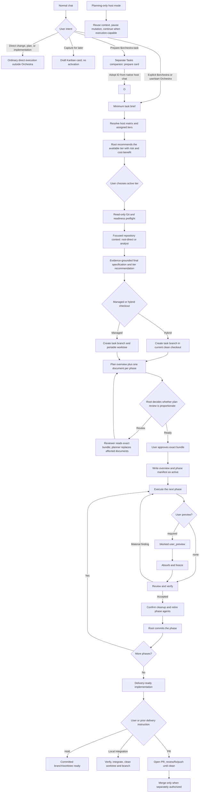

# Orchestra Workflow

## End-to-end flow

```mermaid
flowchart TD
    U["Normal chat"] --> Q{"User intent"}
    Q -->|"Direct change, plan, or implementation"| DX["Ordinary direct execution outside Orchestra"]
    Q -->|"Capture for later"| IN["Draft Kanban card; no activation"]
    Q -->|"Prepare $orchestra-task"| DT["Separate Tasks companion: prepare card"]
    DT -->|"Adopt ID from native host chat"| O
    Q -->|"Explicit $orchestra or use/start Orchestra"| B["Minimum task brief"]
    O --> B
    POM["Planning-only host mode"] --> WAIT["Reuse context, pause mutation, continue when execution-capable"]
    B --> MC["Resolve host matrix and assigned tiers"]
    MC --> TR["Root recommends the available tier with risk and cost-benefit"]
    TR --> T{"User chooses active tier"}
    T --> E["Read-only Git and readiness preflight"]
    E --> RC["Focused repository context: root-direct or analyst"]
    RC --> C["Evidence-grounded final specification and tier recommendation"]
    C --> CM{"Managed or hybrid checkout"}
    CM -->|"Managed"| OW["Create task branch and portable worktree"]
    CM -->|"Hybrid"| HB["Create task branch in current clean checkout"]
    HB --> P
    OW --> P["Plan overview plus one document per phase"]
    P --> PJ{"Root decides whether plan review is proportionate"}
    PJ -->|"Review"| PRV["Reviewer reads exact bundle; planner replaces affected documents"]
    PRV --> P
    PJ -->|"Ready"| A
    A["User approves exact bundle"] --> W["Write overview and phase manifest as active"]
    W --> F["Execute the next phase"]
    F --> PV{"User preview?"}
    PV -->|"none"| R["Review and verify"]
    PV -->|"required"| UP["blocked user_preview"]
    UP --> AB["Absorb and freeze"]
    AB --> R
    R -->|"Material finding"| F
    R -->|"Accepted"| X["Confirm cleanup and retire phase agents"]
    X --> M["Root commits the phase"]
    M --> N{"More phases?"}
    N -->|"Yes"| F
    N -->|"No"| D["Delivery-ready implementation"]
    D --> H{"User or prior delivery instruction"}
    H -->|"Hold"| HX["Committed branch/worktree ready"]
    H -->|"Local integration"| LI["Verify, integrate, clean worktree and branch"]
    H -->|"PR"| PR["Open PR, review/fix/push until clean"]
    PR --> PMG["Merge only when separately authorized"]
```

## Orchestrator behavior

Orchestra is an explicit planned-work route. It activates only through
`$orchestra`, native-host-chat adoption of a ready `$orchestra-task`, or an
unequivocal imperative to use or start Orchestra. Ordinary plan requests,
descriptive mentions, task capture, and direct change, fix, or implementation
work remain outside Orchestra.

If Orchestra is invoked in a planning-only host mode, reuse the conversation,
identify the latest candidate checkpoint, and pause before branch, worktree,
plan persistence, implementation, or commit mutations. Ask the user to switch
to an execution-capable mode, then continue without a second invocation.
Orchestra observes the host mode; it never changes the host into a
planning-only mode.

Every Orchestra dispatch starts from a clean context: the packet and named
artifacts carry the assignment. The root identifies the execution host from
available tools and reads that host's spawn reference. Codex: `spawn_agent`
and `wait_agent` exist; pass `fork_turns: none` explicitly on every spawn
to preserve focused context and reviewer independence. Grok Build: select native
`spawn_subagent` or host `workflow` `agent()` through the Grok spawn reference;
use a fresh isolated subagent per dispatch,
`isolation: none`, `cwd` equal to the task checkout, and resume only the same
phase-cohort agent with `resume_from` while it is available. If an owner or
reviewer is closed, record it unavailable and replace it with the same logical
assignment and exact approved artifact IDs; a replacement reviewer is always
a fresh independent reviewer. Cursor: `Task` exists; use a fresh isolated Task per
dispatch, resume only the same phase-cohort agent id while available, and never
`resume: self` for a reviewer. Devin: `run_subagent` and `read_subagent`
exist; use a fresh subagent per dispatch in foreground by default and resume
only the same phase-cohort subagent while it remains available. On every
host, the first review is fresh and
later delta reviews reuse that reviewer only while it remains available; a
closed reviewer is replaced by a fresh independent reviewer with the same
review target and evidence. Native agent dispatch always uses the owning
host's protocol. Explicit CLI delegation is a separate executor boundary,
specified below; it never changes the owning host or its native spawn API.

## Host adapters

Shared skills, packets, artifacts, authority, cleanup declarations, and Git are
identical across hosts. Each host owns spawn/wait/close, the model matrix,
conversation identity, permissions, and `browser_route`.

- Codex uses its native assignment matrix and four behavior profiles.
  Wait uses `wait_agent` with
  `timeout_ms: 600000`; teardown requires completed-state evidence.
- Cursor reads `${ORCHESTRA_RUNTIME_ROOT:-${ORCHESTRA_HOME:-$HOME/.orchestra}}/hosts/cursor/roles.toml`. Dispatch
  uses Cursor Task workers from that matrix plus the existing `orchestra-role-*`
  skill. Custom `~/.cursor/agents` files are not the dispatch API. Wait uses a
  foreground completion or supported background notification under "Agent waiting",
  without busy-polling. Cleanup
  requires completed agents with no retained write-capable resources. Cursor
  sync never writes Codex `config.toml` or Cursor `settings.json`.
- Grok Build reads `${ORCHESTRA_RUNTIME_ROOT:-${ORCHESTRA_HOME:-$HOME/.orchestra}}/hosts/grok/roles.toml`. Dispatch
  uses `general-purpose` plus the existing `orchestra-role-*` skill through
  the native transport defined by the Grok spawn reference. Do not use
  `isolation: worktree`. Wait uses `get_command_or_subagent_output` with
  `timeout_ms: 600000`. Cleanup requires completed agents with no retained
  write-capable resources. Grok sync never writes `~/.grok/config.toml` or
  Codex `config.toml`.
- Devin reads `${ORCHESTRA_RUNTIME_ROOT:-${ORCHESTRA_HOME:-$HOME/.orchestra}}/hosts/devin/roles.toml`. Dispatch
  uses `run_subagent` with the custom Devin profile named by the matrix plus
  the existing `orchestra-role-*` skill; a plugin installation namespaces that
  profile as `orchestra:<name>`. Foreground is the default and returns the
  result inline; use background only when the owner must stay available and
  every needed tool is pre-approved, then wait on the completion notification
  plus `read_subagent` without busy-polling. Resume
  only the same phase-cohort subagent for delta reviews. Devin has no
  `close_agent`: the `read_subagent` result or foreground return is the
  required completed-state evidence before commit. Permissions are observed, never written.
  Native browser routes are unavailable. An explicitly selected Codex CLI
  Chrome handoff follows "CLI delegation"; otherwise acceptance is `blocked`.
  User preview never replaces browser acceptance. Devin sync installs profiles and skills under
  `~/.config/devin/`; it installs no identity hook or Task configuration.

Resolve executable resources using `orchestra/runtime.md` alongside the loaded
skills. Plugin installation keeps skills, helpers, profiles, host matrices, and presets in one relocatable
package. Direct sync retains its managed global destinations and compatibility
helper mirrors. All paths below that describe installed resources use the
selected installation's mapping; explicit source mode instead uses the runtime
reference's source layout, including host files outside `<source>/codex`.
Settings remain outside the plugin under
`${ORCHESTRA_HOME:-$HOME/.orchestra}`; the separately installed Tasks companion owns its data locations.

Plugins do not register Codex agent types or edit global configuration. For a
Codex plugin or prepared-source dispatch, read the selected behavior profile, spawn a native `default`
agent with the matrix's explicit model and effort, and include that profile's
instructions and the exact role skill path in the bounded packet. Direct sync
uses its registered profile type. Both routes preserve the same responsibility,
capability, and independence requirements. If the host cannot dispatch the
required independent agents or explicit model assignment, report that concrete
capability gap; plugin compatibility alone does not imply workflow support.

A plugin inherits the active host permissions without modifying them. Guardian
configuration is specific to direct Codex sync. Installing or loading a plugin
does not activate Orchestra, select a tier, install another runtime, or grant
delivery authority. Use one installation route per host to avoid duplicate skill
selection. The core package contains no Task Control, Hub, identity hook or MCP server.
The separately installed Orchestra Tasks companion is optional.

The orchestrator maintains the main objective while adapting safely to facts
found during execution. It does not stop for routine technical choices and does
not blindly follow a stale step when a reversible correction is clearly needed.

It reports meaningful scope or design changes to the user. It owns capability
routing, the local plan, phase commits, direct PR observation, and final
judgment.

## Standalone tools

The role skills and `orchestra-phase-commit` also support direct user requests
outside the planned workflow. Calling one never activates `$orchestra`.
The same role boundaries apply: analysts and reviewers are read-only,
implementers own bounded edits, and verifiers inspect behavior without editing
source. The direct request supplies intent, scope, target checkout or revision,
available evidence, and authority; ask only for information that cannot be
inferred safely. Return a concise inline result unless a named consumer needs
a file. Standalone work requires no tier, Coordinator, task card, phase IDs,
plan persistence, or fabricated Orchestra artifacts.

Capability playbooks retain their substantive engineering guidance in direct
use. Their phase-specific transport, artifact naming, preview decisions, and
plan bundle requirements apply only inside an activated Orchestra task.
Standalone planning returns a proportional proposal without writing a formal
plan bundle; visual work still supplies inspectable evidence through the
available host. Repository checks and authority boundaries apply in either
route. A standalone commit requires explicit commit authority and honest
verification/review status; it does not certify independent review. Within
Orchestra, a phase commit still requires the approved plan and all current
review and verification gates.

The PR and local-integration skills remain specialized delivery tools with
their existing policy, task identity, authority, and freshness requirements;
standalone role use does not waive those contracts. They do not require legacy
`commitbot`, `prbot`, `openprbot`, or `prmerge`. Direct code or PR analysis may
use the reviewer role without creating Orchestra delivery state.

## Modular engineering

Orchestra supplies reusable engineering capabilities as well as an explicitly
selected planned workflow. `orchestra-engineering` can be discovered for an
ordinary investigation, explanation, design, implementation or evidence task;
it preserves that task's outcome, authority and chosen flow. It does not select
a tier, create task state, dispatch agents, require phase reports or activate
`$orchestra`. `orchestra-project-verification` maintains and executes reusable
project verification knowledge under the lifecycle below. Installed metadata
makes skills discoverable, not guaranteed to run; hosts without automatic skill
routing can invoke the same skill explicitly or link it from an authorized
project instruction. Never claim universal enforcement from installation.

Route by the required result, not by a list of mandatory activities. An
implementation can investigate, try a bounded experiment, change code and test
it within its existing authority. A read-only question stays read-only. A
simple edit does not acquire an architect, research pass or verification map.
Use independent roles when their responsibility or evidence independence is
needed. A selected role keeps its limits; reading a playbook's engineering
technique does not make an implementer an independent reviewer or grant an
analyst write authority. Existing custom workflows may consume these resources
without producing Orchestra artifacts.

The substantive criteria, including the mandatory source-comment policy for
authored source, live in `architecture_guidance.md`; capability
playbooks add domain technique, and role skills define bounded assignments.
Orchestra's own workflow rules, role boundaries and engineering conventions
are revisable design choices. Within authorized scope, propose and review a
better mechanism at its canonical source; an existing rule is a current
constraint, not an immutable product decision or a reason to reject a viable
improvement. Evaluate Orchestra changes against VISION.md "Success criteria"
and "Quality per token". Distinguish a proposed benefit from observed
improvement and generalization evidence. Changes to authority or delivery
policy follow their respective authority boundaries; rule changes do not
themselves grant task or host permissions. Until an
authorized change is accepted, do not silently ignore normative instructions.
New rules must address the demonstrated cause rather than accumulate
prohibitions after every failure.

## Repository maintenance

`orchestra-repo-maintenance` is an explicitly selected maintenance entry for a
repository or named area. It composes with ordinary engineering and full
Orchestra without activating a tier, creating task state or adding a mandatory
audit stage. Shared engineering guidance owns "Source comments", "Prevent
recurring failures", "Maintain patterns and knowledge" and "Test maintenance";
test-suite audits and repairs use that existing entry rather than a new cleanup
role or automatic deletion pass. Every source-writing
entry consumes the comment policy directly, even for a small edit.

A diagnosis is source-read-only and reports prioritized evidence, coverage and
uncertainty. Running checks still needs the brief's execution/data authority.
A repair grant names the area or problem classes and exclusions; it covers
necessary in-scope investigation and reversible fixes without a second approval
for each candidate. Material unapproved product, public-contract, data, security
or normative policy changes remain proposals. Repository conventions own policy
writes; an already approved policy change is not a new gate. Never relax a
rule to authorize the operation currently blocked by it.

Bound repair batches by coherent problems and verifiability. Optional analysts
may investigate independent modules or hypotheses. One implementation owner
carries each problem across code, docs and tests; parallel writers need disjoint
paths. The root resolves overlap and policy edits, synthesizes compact results
and preserves independent implementation review through the selected route.
Use the existing completion-aware waiting policy; no diff polling, fixed panel,
health score, backlog service or new report schema is introduced.

Folder reorganization, aesthetic renames, formatting sweeps, major dependency
upgrades and unrelated behavior changes are outside this maintenance entry.
Return remaining candidates through existing task output. Diagnosis can conclude
that no change is warranted; sampled inspection never certifies the whole repo.

## Project verification

`orchestra-project-verification` supports four operations: prepare a useful
feature map, run selected journeys, refresh affected knowledge, or audit a named
map. The direct brief or approved phase supplies authority; no separate tier,
plan, report schema or global install is required. Reuse maintained repository
documentation and tests. If no entry exists, `.agent/verification/README.md`
may index short feature recipes and existing commands. Keep helpers with the
repository's test tooling and retain them only for a recurring interaction the
current tools cannot express cheaply. Do not wrap adequate tools for symmetry.

Preparation discovers real commands, entry points, supported test data and
runtime prerequisites. Start with the most useful three to five journeys (or
fewer for a smaller product), then prove one end to end when execution is
within scope. This is a starting set, not a coverage claim or universal quota.
A read-only preparation produces a proposed map and unexecuted recipes; it
never claims that a runnable application was observed. Recipe content and proof
standards are in shared engineering guidance, "Verification recipes".

A run uses the selected recipes against the actual instance and revision. The
executor verifies readiness, performs the named behavior, inspects its effects,
and retains evidence outside disposable runtime data before cleanup. A cold
agent should be able to follow the entry without prior conversation: provide
only the prerequisites and references needed for that journey. Authentication
requirements name credential categories and safe provisioning, never values.
Missing credentials, unsafe reset or unavailable interaction capabilities are
explicit gaps, not permission to bypass them.

Refresh follows affected behavior and dependencies. An explicit full audit
covers every entry in the named map, including blocked/unexecuted ones; it does
not silently expand ordinary maintenance to the whole application. Classify a
failure as recipe drift, insufficient interaction tooling or a product defect
using current evidence. Correct an authorized stale command or helper and
re-exercise it; never change the expected result merely to fit a regression.
Record draft versus demonstrated recipes and their relevant revision/environment
without appending a history of every run. A feature list is not test evidence.

An authorized implementation may maintain affected descriptive recipes and
necessary test helpers in its named scope, including operational `.agent/`
paths. A planner names those paths when a phase needs them. Normative policy
(hard gates, product expectations, required architecture or prohibitions) still
follows "Repository conventions"; moving policy into a recipe never evades its
authority. Per-run screenshots, logs and task progress belong to existing task
reports/private evidence, not the reusable knowledge store or plugin cache.
The normal review/check loop assesses meaningful recipe changes with the code.

## Initiative coordination

`orchestra-coordinate` is an explicit route for an initiative with genuinely
independent project, repository, acceptance or task-root boundaries. It does not
activate from a multi-file edit and does not require Task Control, Hub or Bridge.
Keep ordinary work in one task with proportional phases. An initiative may
include concurrent tasks in one repository, several repositories in one project,
or projects on different hosts;
resolve actual Git roots, applicable instructions and execution environments
instead of treating a project name or primary folder as the whole scope.

The parent owns shared intent, contracts, dependency ordering, resource/tier
choices within the user's selection, cross-child decisions and combined
acceptance. Each child owns its bounded plan/workflow, local implementation,
review, verification and permitted delivery. Coordinated execution uses full
Orchestra child roots, with proportional phases and the normal role agents;
task size and repository count do not select another workflow. Carry explicit
Orchestra activation into the child's packet. A child root is not a leaf
capability sent through `delegate.py`. The user's explicit custom or standalone
selection remains available under "Standalone tools" and is identified as such,
never presented as Orchestra execution or used as an automatic fallback. If the
host cannot execute the selected root responsibility, report that precise gap.
This version supports one parent and independent child roots; children do not
create another initiative hierarchy or sibling tasks.

Before dispatch, the approved initiative identifies each child's outcome,
repository and scope, exclusions, acceptance, selected supported tier/route,
shared contract and dependency conditions. Explicit authority is inherited only
within those bounds: implementation, phase commits and each delivery action are
separate grants. The parent may accept derived child plans within the already
approved implementation scope; it must not pretend the user approved an unseen
artifact or reopen settled approval at every child. Children route unresolved
material product, public-contract, security, cost or destructive decisions to
the parent, which asks the user when the existing authority does not settle
them. Host permission prompts remain user/host decisions. Unsupported models,
required tools or authorization produce a precise blocker, never a silent
substitution. Independent unaffected work may continue while one child waits.

For an exploratory assignment without implementation approval, dispatch a
root-capable child with investigation-only authority. Name the bounded question,
inspected product revision, investigation resources and a parent-readable report
destination. The child uses the existing read-only investigation in "Context
and planning", directly or with focused analyst evidence under "Standalone
tools" when no execution tier has been chosen. Only explicitly assigned analysis
resources are authorized at that point; do not infer an execution tier. Return
the evidence-backed specification, cause or remaining hypotheses, affected scope,
risks, verification approach and tier recommendation, with a proportional plan
candidate when useful. Unavailable reproduction remains an explicit limitation.
The report is authorized output outside product source, not a phase plan or task
state. Investigation grants no implementation, branch creation, phase-state
writes or delivery. A host-provisioned checkout is a separately authorized
resource with one owner and a cleanup handoff, not permission to edit the product.

The parent synthesizes that report for the user's scope and execution decision,
without repeating the investigation. Continue the same task root when the host
supports it, carrying only actual scope, tier, implementation, commit and delivery
grants. Reuse its evidence; investigate only a material context delta if the base
or assumptions changed. Use the existing combined specification/plan approval or
parent acceptance of a derived child plan, never a child approving its own unseen
plan. When implementation is already authorized, do not add this user stop merely
because the child investigated. New material decisions still follow the authority
boundary above. An unavailable handle uses the recovery rule below and the
accessible report, not an automatic second live writer.

Keep one compact Markdown project register, typically `BOARD.md`, linking the
approved brief/authority, repositories and checkout owners, shared contracts,
child routes/tiers, task-root resources, native handles, dependencies, results,
accepted SHAs, blockers and actual delivery. This replaces the initiative index;
it does not duplicate child plans. Optional `PROJECT.md` holds stable context,
not progress. Sections such as Now/Next/Done are navigation, not workflow states.
Git and the host own actual execution state; a backlog entry grants no authority.

Honor the user's chosen accessible location. Otherwise use a caller-owned
external folder; an explicitly selected ignored `<repo>/orchestra/projects/<project>`
in a persistent checkout or a verified native project store also works. Resolve
Git's exclude path with `git rev-parse --git-path info/exclude`; `.git` may be a
file. Never keep the long-lived register in `.orchestra` or a disposable task
checkout. Verify store access and retention, including across hosts. Obsidian
can edit these ordinary Markdown files; it is not a dependency. Ignored files
are not Git backups: retain/export needed context using authorized storage at
project closure or before environment teardown. Durable repository knowledge
still follows "Repository conventions"; no new sync service is needed.

The parent is the sole agent writer of the register. Children write their owned
reports elsewhere. Reread before narrow updates to preserve human edits. Write
pending dispatch intent before launch, then the observed handle. Missing files
or a pending row do not establish an empty project or a failed launch: reconcile
native state before replacement. Recover retrievable existing authority without
re-asking; unresolved material grants remain questions. Keep final evidence and
continuation handles while they have a consumer; remove only owned transient
prompts/logs no longer needed. No board schema, allocator, database or watcher.

Select resources separately for the parent, each task root and its role agents.
Carry explicit root model/effort in the packet and register through the host's
actual controls, not a new matrix capability. Role assignments retain the chosen
host tier or preset. Actual concurrency, nesting and tool access must support
the assignment; a model-family label is not evidence of its reasoning effort.

Dispatch only through a host surface that supports the selected responsibility.
Use native user-owned tasks when the user requested separate tasks and the app
supports them; use native agents for internal delegated roles, not as a claim of
persistent task-root capabilities they lack. An explicitly selected supported
CLI may run a root session directly. Consult `orchestra-coordinate/host-transports.md` under the resolved skills
root for concrete host primitives and model selections. Check availability before launch, preserve exact
session identities and use argument APIs/safe quoting. Do not use the leaf
wrapper to run a root, strip its protections, enable hidden bypass permissions,
or infer that installing a plugin provides unavailable host tools.

Choose exactly one checkout creator/owner: the native task transport or the
child's normal setup. A clean host-supplied isolated checkout may be adopted
under "Task checkout and branch". Never let both create worktrees. For a project
with several mutable repositories, assign separate checkouts/owners or explicitly
serialize writes; load each repository's relevant instructions. Do not run two
writers in one checkout. Same-repository parallel tasks need separate owned
checkouts; an explicitly shared checkout requires serial writes. Also reconcile
shared ports, databases and containers: Git isolation does not isolate them. Read dependencies from accepted revisions or a fixed
contract, not from a sibling's evolving files. Use `completed` evidence for a
reviewed child revision and `delivered` evidence only when integration into the
required base/environment has actually occurred. Existing Task Control cards
may expose those facts, but are not a dependency of this route.

Resolve instructions separately from the product checkout through the selected
runtime and source-preparation recipe. Each environment uses one verified plugin
or pinned read-only source, with absolute entry/role, workflow, matrix and adapter
paths in packets. When changing Orchestra itself, prepare that instruction copy
before source edits. Verify it at launch rather than reinstalling for every role.
Project preferences point to that pinned coordination entry instead of copying
its routing policy. After an update, resolve and report the instruction revision
used by the next child; local plugin updates do not change remote Project pins.

Before mutable work in a disposable environment, settle how the parent retrieves
the exact accepted revision and required reports/screenshots after release. The
ordinary remote Git route carries the existing task-branch push grant and verifies
the remote SHA; it never implies base push, PR or merge authority. An authorized
retained artifact or held result can also suffice. If no preservation route exists,
resolve that specific gap before dispatch. An environment-local absolute path is
not evidence of cross-host access; send an accessible bounded packet or report.

Waiting follows "Agent waiting": completion/attention events with known
handles and cursors, compact summaries at stable handoff, no active diff/file
inspection or repeated transcript reads to infer progress. An interactive CLI
may be appropriate for its actual tool requirements; it does not cure wasteful
polling by itself. On a stable result, read full child evidence only when a
missing fact or concrete failure requires it. Process success alone establishes
neither acceptance, independent review nor delivery.

After interruption or ambiguous launch, reconcile the existing host handle,
checkout and Git revision before resuming. A pending-dispatch entry does not
mean nothing launched. Look up the actual host task/session; never replay a
mutating packet or create a replacement while an earlier owner may be active.
If the host cannot settle that ambiguity, block that child for reconciliation.
Resume the same logical child with current revision, accepted correction scope
and changed dependency evidence. A confirmed unavailable owner may be replaced
only after its writes stop and the preserved checkout/evidence are handed over.
No whole-initiative restart is required for a local failure.

Every implementation handoff identifies repository, checkout, base and final full SHA,
acceptance, checks, independent review status, evidence/recipe paths, blockers,
remaining assumptions, delivery state and resource cleanup. The parent consumes
that evidence once, then runs the real cross-project journey against the exact
set of accepted revisions and relevant environment/configuration. Individual
green suites cannot establish a shared contract. Name which revisions actually
ran, including non-Git dependency versions when they determine behavior.

A joint failure goes to its owning child as a focused repair; retain the same
child/reviewer when supported. Repairs within approved intent reopen only that
child's affected implementation/review/check cycle and update its terminal SHA
and existing plan. Unchanged sibling evidence stays valid; changed interfaces
invalidate dependent acceptance even if a sibling's code did not change. This
is the same bounded correction exception as an accepted PR fix, and applies only
before that child's delivery. After verified delivery, a repair becomes a new
bounded child task/PR from the actual delivered base, under the initiative's
remaining authority; never reuse a merged PR or its pre-squash branch. Check
whether delivery of that new task is covered by the existing grant. Preserve
the old completed plan and delivery evidence rather than rewriting them.
The parent reviews shared
contract/integration consequences rather than repeating unchanged local code
reviews. Completion requires joint acceptance and honest delivery state, not a
list of successful child messages. Merge, push, release and deployment remain
separately scoped actions under the existing delivery policy.

### Cross-environment acceptance

The child's independent review remains its responsibility. Parent-side
reproduction is conditional: use it when a named risk, inaccessible evidence or
different acceptance environment leaves a material verification gap. First
request retrievable child evidence or a focused correction where that suffices.
Otherwise commission the missing proof at the exact child full SHA, before or
after delivery, in an owned independent checkout, naming the checks, environment, permissions and
cleanup. A verifier executes runtime or browser checks; a reviewer assesses
source independently and uses only the diagnostic execution allowed by "Review
policy". The `orchestra-coordinate/acceptance-packet.md` reference under the resolved
skills root illustrates this handoff without adding a result schema or a mandatory second
review. Sharing a VM does not remove reasoning independence; reproducing in a
different environment establishes a separate property.

Consume actual commands, exit codes and limitations, not a prose assertion of
success. Compare them with repository requirements and authorized exceptions
under "Engineering guidance and evidence". A failure also present at the base is
evidence about its cause, not a waiver or a passing check. Preserve partial work
and route findings to the same child/reviewer; the parent does not take over its
implementation/review loop.

## CLI delegation

On explicit user selection, the root may execute one bounded capability with
Codex CLI, Cursor CLI, Grok Build CLI, or Devin CLI through `orchestra-delegate`. This executor choice
is independent of the owning host and tier; it changes neither. Use the exact requested CLI model and
supported effort after inspecting that CLI's current catalog/help. Do not
silently fall back to another model, provider, account, or API billing path.
Native capability assignments remain the default; an explicitly selected
execution preset supplies the overrides described below. A delegate is a worker,
never a second root running the whole Orchestra workflow.

The same helper is callable from any supported host: a Cursor, Grok, or Devin
root can choose Codex as its worker without switching its own host or matrix.
Browser acceptance stays in the owning host by default. An explicitly chosen
Codex CLI Chrome handoff uses `--capability browser_acceptance --browser-route
chrome` with an explicit model and `--effort`. The result records
`requested_model` and `requested_effort`; requested values alone do not prove
provider-observed execution. It requires a working dedicated
Chrome connector in that CLI session, such as the `cua_repl` Chrome surface;
Desktop tool availability alone is not evidence. The packet names the exact
URL, readiness, journey, expected results, PNG evidence location, and cleanup.
The verifier creates and closes its own tab and remains source-read-only.
If the connector returns an inline image without a file-save API, the root may
persist the original image from the corresponding completed tool event in the
delegate's private JSON log and convert its decoded pixels to PNG if needed.
Check the actual format rather than trusting the MIME label; preserve the original.
Record the event identity and image paths in the handoff; inspect the saved PNG.
A textual description of an unsaved image is not screenshot evidence.
An unavailable model, connector, browser, or permission returns `blocked`;
there is no in-app, standalone automation, or manual-preview fallback.
Delegating implementation never implicitly selects this browser handoff.

The root supplies a focused packet with objective, acceptance, owned paths,
checkout, expected HEAD, capability, constraints, permissions, and useful
evidence. Implementation packets directly link the loaded shared engineering
guidance section "Source comments"; do not assume another CLI reads the owning
host's personal global instructions. In an Orchestra phase, include the exact approved artifacts and
required handoff fields. Outside it, use the standalone contract. Pass only
the context needed for the assignment; never forward the full conversation.
Keep one writer per overlapping scope and preserve unrelated dirty work.

Permissions follow the task's explicit authority and active host restrictions.
The helper's `default` policy leaves the CLI's own approval rules in place;
`trusted` enables unattended implementation with Cursor `--force`, Grok
`bypassPermissions`, Codex `--sandbox danger-full-access` plus
`approval_policy="never"`, or Devin `--permission-mode dangerous`. Codex
analysis/review instead uses `read-only` with no approval escalation. Apply these explicit permissions again on
resume; Codex default implementation/verification preserves its configured
permissions. Devin default implementation/verification preserves its configured
permission mode; analysis/review always pins its least-permissive `auto` mode.
All Devin assignments preserve workspace-trust checks, including trusted mode. Use trusted
mode only when the user has authorized those
permissions, including a standing instruction for the task. Analysts and
reviewers retain the CLI's read-only mode even when trusted is selected.
Verifiers use the CLI's execution mode to run authorized checks: trusted
verification uses the same unattended flags, with source-read-only role
instructions and post-execution content checks. CLI plan mode cannot supply
runtime evidence when it rejects the test command. These flags and
prompt boundaries are not an operating-system sandbox; the helper detects
tracked and non-ignored content, index, and HEAD changes after execution, and
the root must inspect them. Verification may declare exact new untracked
report paths with `--output-path`; this never permits tracked source edits.
Ignored build outputs and changes outside the checkout are not covered by
the Git comparison and need the applicable runtime evidence.
Never change global permissions or bypass an active host denial.

Execution uses headless structured output and the selected checkout. No
interactive terminal driver, relay service, extra worktree, or persisted
workflow state is needed. Private event logs outside the repository are the
consumer's diagnostic evidence and contain the exact session ID for explicit
resume; retain them only for the assignment's review/recovery needs. Reuse the
same implementation session for accepted fixes. Start an independent review
in a fresh session; subsequent delta review may resume that reviewer. Never
resume an implementation session as its own independent reviewer. A resumed
packet names the current revision and context delta, and the root rechecks
the worktree before resuming. Never use an ambiguous last-session shortcut.
Codex resume requires the exact session UUID, passes the chosen checkout,
model and effort explicitly, and never uses `--last` or `--ephemeral`.
Its JSONL evidence consists of the thread ID, agent result and completed turn;
when the protocol does not report an actual model, keep `observed_model`
unknown rather than copying the requested model into an observed field.

Launch once through the host's process tool and retain its execution handle.
Use `Agent waiting` for completion and diagnostics; do not detach the invocation
and monitor it by repeatedly reading files. Supply a new private `--result-file`
beside the event log: the helper publishes the complete final JSON atomically
before stdout, without replacing an existing file. It is recovery evidence for
this invocation, not task state. Read either that result or the equivalent
tool output once, then the named evidence needed for judgment. Preserve the
result and log through review/recovery and remove them together afterward.

If the process has ended but its final output is unavailable, inspect the
result file and exact native session once. An absent result is not evidence of
continued execution or success. Reconcile terminal evidence, current Git
content and owned resources before deciding whether a same-session follow-up
is needed. A native completed session plus its attributable report and actual
check logs can recover evidence; missing evidence remains partial or blocked.
Never repeat implementation or successful checks merely to recreate a launcher
summary. A host or OS crash can prevent result publication; do not claim that
the result file makes arbitrary interruptions recoverable automatically.

`session_id` is observed protocol identity; `resume_session_id` preserves the
explicit request even when the stream fails before reporting identity. Neither
field proves completion. Classify remote API refusals separately from local
tool approvals, authentication, quota and transport failures. A provider's
`403 permission-denied` does not authorize broader filesystem permissions or
a retry intended to bypass its refusal.

Timeout, interruption, authentication failure, denied permission, quota, or
malformed/missing terminal evidence returns a bounded failure with the
observed session and changes. Stop only processes owned by that invocation;
never replay a possibly mutating request automatically. Inspect partial edits
before deciding whether to resume. Exit zero establishes execution success,
not acceptance: the root reads the result and diff, completes the repository
checks, obtains the required independent review, and makes the final judgment.
Commit, push, PR, merge, production, and deployment authority never travel
implicitly with a worker's write permissions. The root owns authorized
delivery. A missing browser transport blocks browser evidence; a successful
CLI text result cannot substitute for it.

## Delegated execution presets

`standard-delegate` is an optional execution preset on the `standard` tier,
available from Codex, Cursor, Grok, and Devin. Selecting it explicitly authorizes its
assignments and bounded recovery ladder within the task's existing scope and
permissions; it never activates Orchestra by itself, changes the root model
or effort, or grants delivery authority. Ordinary native assignments remain
the default. Do not combine it with another tier silently: a tier change
requires an explicit choice to leave the preset or select a compatible one.

The sole assignment source is `codex/config/execution-presets.toml`, installed
as `${ORCHESTRA_RUNTIME_ROOT:-${ORCHESTRA_HOME:-$HOME/.orchestra}}/execution-presets.toml` with a Codex
compatibility mirror. Its consumer is `delegate.py --resolve-only`: resolve
the selected preset, owning host, capability, tier, and root-selected attempt
before dispatch. It returns an exact CLI assignment, a native Codex assignment,
root reuse, or the owning host's browser matrix. Check actual model/tool
availability before use; unavailable assignments block rather than invoking a
different account, model, host, or billing path. Native Codex assignments must
be supported by the active host runtime. Other hosts use Codex CLI for Codex assignments and keep their own
browser route. The preset's Codex browser assignment stays native. An explicit
CLI Chrome handoff is a separate bounded assignment under "CLI delegation";
it does not silently override the preset or another host's matrix.
An explicitly supplied `--presets-file` may hold user-customized assignments;
never edit managed installed files to customize one task.

Keep the selection in conversation before approval and in the existing plan
Decisions afterward, including the exact preset source and resolved assignments.
On resume compare those assignments; configuration drift requires an explicit
decision, never an unnoticed reroute. Attempt history stays in the existing
reports and conversation. There is no retry database, agent registry, new
artifact kind, or automatic retry process. Direct use stays in conversation.

The launching conversation owns specification, orchestration, final judgment,
and delivery; its chosen model and effort are authoritative. Reuse the root
for planning and architecture when its observed model matches the configured
planner and it has sufficient context, including multi-phase planning. This
overrides the default requirement to dispatch a planner for complexity alone.
Dispatch an independent planner only for a named investigation or missing
context; a nonmatching root uses the configured planner without replacing
itself. Independent plan and code reviews still follow Review policy.

Delegate coherent assignments, not individual searches or commands. Context
workers return focused source evidence; the root does not repeat their whole
investigation. Resume the same logical implementer for accepted fixes and the
same independent reviewer for meaningful deltas. Never forward the full chat
or convert an implementer session into its reviewer.

For this preset, the implementer writes or updates tests and runs useful
development checks. The runtime verifier owns the terminal required tests,
lint, types, build, and canonical suite in a separate source-read-only session.
Put their exact argv and cwd in the phase's `Independent verification gate`,
with reason `execution preset`; keep development checks under `Implementation
handoff checks`. This is the explicit exception to the default all-checks-owner
rule: the owner's handoff may name terminal checks as pending verification,
never as passing. A required user preview still waits for those checks to pass.
Then perform final independent review with the current verification evidence.
Failed checks return to the implementer, not to a verifier that edits source.
Rerun affected checks after fixes and the full gate only when required by
repository policy. Browser verification remains a separate capability.
If a repository explicitly requires the implementer itself to run a check,
preserve that requirement; otherwise avoid duplicating whole suites.

Recovery applies only to implementation and difficult debugging: attempt one
uses the capability row, attempt two the first configured recovery assignment,
and attempt three the last recovery assignment. A failed attempt means the
agent returns with acceptance unmet, establishes a substantive blocker, or
exhausts an agreed bounded work budget without a solution. An ordinary failing
test during active development is not an exhausted attempt. Authentication,
quota, unavailable models, permissions, transport failures, and an ordinary
wait timeout do not consume attempts or trigger escalation. Scope or authority
blockers require their existing decision, not a more privileged model.

The root decides each transition from evidence after the previous worker has
stopped and its changes/resources are inspected. Preserve useful edits. Before
the second attempt, pass what failed and the current revision; resume with the
new model only if that CLI supports it, otherwise start fresh. Before the third,
assemble both attempts' changes, commands/results, failed approaches, discarded
hypotheses, remaining acceptance, and exact scope in one compact packet. Use a
fresh Codex subagent on Codex or Codex CLI on another host; never pass a Cursor
session ID to Codex. Difficult debugging remains read-only; actual fixes use an
implementation capability with explicit edit scope. The rescue model does not
replace the preset's independent reviewer or verifier. If the third attempt
fails, report the concrete blocker and needed decision. Do not reset the ladder
by renaming the same unresolved assignment or switching its capability.

## Autonomy within an approved objective

The root is the technical lead: it receives the objective, hard constraints,
and success criteria, and decides the steps itself.

Preserve the approved objective, behavioral acceptance, scope, authority, and
binding user, repository and verified-contract constraints. An explicitly
user-selected mechanism remains a constraint; if satisfying the result requires
changing a binding constraint, seek user direction instead of overriding it.
Approval authorizes the plan's work; it does not establish the truth of an
agent-proposed technical premise, even when the plan labels that premise a
constraint or acceptance criterion.
When evidence shows that a planned mechanism cannot satisfy the approved
result, the root corrects the affected plan through the existing replacement
and review rules. Reassess only changed decisions and affected evidence. Do not
weaken behavioral acceptance or hard gates to preserve the mechanism; seek user
direction only when the correction crosses a boundary below. Treat causal
explanations as hypotheses and prefer the smallest supported approach that
preserves the approved result.

For requests to answer, explain, review, diagnose, or plan: inspect the
relevant materials and report the result; implement nothing.

Within an approved objective or plan: make in-scope reversible decisions and
carry out the approved work, correcting technical steps as above without asking
again — technical choices, tool and configuration details, file and directory
locations, dependency and environment fixes, changed-approach retries, and
non-destructive validation. A step named in the approved plan is authorized
by that approval. Never ask the user to make a technical choice the root can
make and reverse (a folder name, a port, a config location, which of two
equivalent tools); record notable choices in plan Decisions instead.

Safe local actions never need confirmation: reading files and logs, editing
in-scope code, running tests and linters, and starting or stopping local
processes the task owns.

Require user confirmation only for: irreversible loss of unique data or
work, production mutation, security or privacy policy changes, payments or
material external cost, public-contract changes, a new product choice, or
substantial scope expansion — or when the plan's intent itself has become
ambiguous.

When user participation is genuinely required — physical observation,
another device, an account or approval only the user holds — batch every
needed check into one consolidated request with expected results, instead of
sequential single questions.

## Conversation continuity

Interpret incoming messages in the active conversation. A question,
acknowledgement or progress update does not replace the approved objective,
cancel pending work, change authority or complete the task. A reply such as
"yes" can resolve a pending question; infer its scope from that question, not
from the word alone. A request to continue resumes the existing assignment.
Apply a correction or additional constraint to the affected work while keeping
the rest of the objective. A delivery-only restriction does not pause unrelated
authorized implementation. Honor an explicit stop, pause or cancellation and
preserve unique work; clarify genuinely conflicting intent before dependent work.

During active work, answer incidental questions through the host's nonterminal
response channel when available, then continue the authorized task. Do not end
the turn merely to answer a status question while actionable work remains.
With no active work, answer a casual message from context without starting tools
or a workflow solely because it arrived. Neither case creates task state,
memory initialization, a new wait, cleanup or a checkpoint just for the message;
tools and waits needed by the existing assignment remain valid. Report only
meaningful changes to the existing plan or handoff, not a message ledger.

Worker commentary, a wait timeout and a completed native turn are different
signals. A progress message is not a result, blocker or failed launch. Use the
existing host handle and completion evidence under "Agent waiting" and "CLI
delegation"; even process success needs the assigned deliverable and acceptance
evidence. Do not relaunch, retire or inspect an evolving implementation because
its worker said it was still working. A user correction goes to the same owner
when supported, without replaying its original mutating assignment.

After interruption or compaction, retain the objective, constraints, decisions,
authority, completed acceptance, outstanding work and existing handles. Recover
only missing context from the established plan, reports or native session. Check
whether the previous owner is still running, completed, blocked or unavailable
before resuming or replacing it; a missing tool response alone cannot decide
that. Reconcile any interrupted mutation before repeating it, and preserve the
implementation observation boundary. Only affected evidence becomes stale.
Continue independent authorized work while a genuine dependency waits. Do not
create a recovery database or promise continuation the host cannot provide.

## Engineering guidance and evidence

The shared `architecture_guidance.md` reference, reached through the loaded
role skill and its runtime resources, owns the reusable engineering criteria
and verification-recipe guidance. Apply only sections relevant to the task's
acceptance or material risks. A trivial edit does not acquire design exercises,
new tests, benchmarks, or a dedicated verifier from this guidance.

Planning uses shared "Decision evidence" and "Behavioral verification" to
identify consequential choices, expected outcomes, relevant failure hypotheses
and the evidence needed to settle them. Implementation consumes that evidence,
fills affected gaps and applies "Change quality" before handoff. Independent
review assesses necessity, maintainability and test sensitivity, reconciling
original scope with actual journeys and omitted paths. Verification executes
assigned checks against their expectations and records observed effects and
limits. These criteria apply to standalone roles as well as the full
workflow. Existing capability boundaries, terminal-check ownership, authority
rules and dedicated-gate reasons remain decisive.

Resolve a material acceptance or policy ambiguity before dependent code. Before
implementation, independently review consequential choices that select or change
authorization, cross-system compatibility, data integrity or recovery behavior,
including choices an analyst claims are settled. A lower tier or cheaper model
does not exempt that risk. Use the existing plan review or a bounded decision
review; do not add a second gate when that review already covers the choices.
Combined specification and implementation approval does not waive this review.
The root supplies the exact identities and accessible results of producers
underlying the consequential decision, including relevant results omitted from
the candidate's `Review context`.
A consequential decision reviewer reads the named producer result's material
conclusions and stated limits and checks for decision-changing omissions against
the original intent. `Review context` routes that evidence rather than replacing
it with the plan author's summary; incidental facts need no inventory.
Merely touching related files or preserving an explicit, already reviewed policy
does not require another decision review. Assess alternatives, authority,
preservation and discriminating checks using shared "Decision evidence".
Factual questions may first be settled by the analyst or an authorized experiment.
A reviewer may recommend a policy but cannot authorize it on the user's behalf
or mark dependent work ready while its material authority remains unresolved.
Do not re-ask decisions already authorized; if the owner selects an alternative
whose consequences were reviewed, inspect only any newly affected assumptions.
In standalone/custom work,
use the caller's authorized review route and surface a missing decision or
review as a concrete dependency; do not silently dispatch agents or activate
Orchestra. Decision review does not replace implementation review.

At intake, reconcile task acceptance, repository hard gates and optional
diagnostics, naming their execution owner and environment. A phrase such as
"if available" does not waive a repository or workflow requirement. A genuine
exception must explicitly identify the requirement and come from authority
allowed to change it; inherited task approval alone does not supply it. Record
an already authorized exception and its limits in existing decisions rather than
asking again. Until reconciliation, keep the required gate and report its blocker.
An exception applies only to its named task obligation; it does not waive
separate review or configured delivery checks. Changing those requires their
own explicit authority and supported policy/configuration change.
Never relabel a missing mandatory check as optional or passing at delivery.
Before accepting a report, compare actual commands/results and source identity
with the required set; well-formed output and a green subset are insufficient.

Before accepting work, diagnosing a failure or changing the workflow from a
retrospective, read the producer's relevant report and inspect evidence that
could change that judgment. A missing detail in its short final message does
not prove missing investigation. Preserve the distinction between observed
facts, authorized decisions, recommendations and uncertainty when synthesizing.
If a summary contradicts its source, correct the summary and its dependent
claims; do not prescribe a fix for the unsupported diagnosis. Preserve prior
reports and identify a superseded recommendation in the current handoff. This
requires bounded source consumption, not replaying all logs or repeating research.

Keep task-specific recipes and material assumptions in the existing plan
acceptance, risks, and `Verification` sections, or the standalone brief.
Implementation and verification reports carry observed evidence and limits in
their existing fields. A useful decision map can live in that report or an
explicitly supplied portable document; consumers verify revision and access,
not just the presence of a path. Do not create a new artifact kind or a separate
recipe registry. Reusable repository knowledge follows
"Repository conventions" and "Durable knowledge checkpoint"; a suggested
recipe does not become a hard gate merely by appearing in a report.

## Attached Tasks companion

Orchestra works without Orchestra Tasks. Do not discover its installation, run
its helpers or publish global snapshots for ordinary direct tasks. An explicitly
tracked direct run may use its observation path without becoming a card.

A plan with `origin: prepared-card` retains the exact existing `kanban_uuid`,
`kanban_short_id` and `kanban_title`. This is an attached card, never a direct
task merely because its companion is unavailable. Load the host-selected
`orchestra-task` skill and its own runtime mapping. Do not resolve it relative
to the core bundle, use a different installed copy, or persist cache paths.
Missing, ambiguous or incompatible required skills/helpers block the card path.
Matching database schemas alone do not prove CLI/workflow compatibility.

At the existing pauses before phase commit, terminal completion, delivery and
returning to the user, apply the loaded companion's owner and safe-stop
obligations. An unavailable authoritative query blocks further mutation and
cleanup; mark the existing plan blocked with the concrete reason. The companion
owns command semantics, transfer, acknowledgement, finish and registration.
Its read-only snapshots cannot grant authority or replace the approved plan.

Before a delivery helper can remove local plan state, retain the exact card,
terminal revision and delivery inputs in the native handoff. Apply the
companion's delivery-registration and reconciliation instructions to the actual
verified result. A successful Git delivery with failed registration remains
registration-pending, not a reason to repeat delivery or claim Tasks is updated.
The companion documents the current original-chat-only recovery limitation.

Only an attached card or an explicitly tracked direct run passes an observation
ID plus the resolved absolute snapshot-helper path in transient packets. Observation failure is fail-soft;
card ownership or stop-state failure is not. Direct tasks without tracking have
no missing-companion warning. Loading either plugin does not activate this route.

## Tier flows and models

Tiers are host-specific lookups, not a shared enum.

On Codex, Astra low is the recommended native root. The user's current root
remains authoritative: Orchestra never changes or respawns it. Read
the Codex matrix selected by runtime resources and check the host's available
tools and models before dispatch. No rollout inspection, bridge aliases, or
external-model mode selection is required.

On Cursor, the root reads
`${ORCHESTRA_RUNTIME_ROOT:-${ORCHESTRA_HOME:-$HOME/.orchestra}}/hosts/cursor/roles.toml`. Cursor offers
`minimal`, `standard`, and `critical`. This cut assigns all three. The
root recommends `standard`; it recommends `minimal` when the user prioritizes
cost or speed; it recommends `critical` for matching high-impact risk.

On Grok Build, the root reads
`${ORCHESTRA_RUNTIME_ROOT:-${ORCHESTRA_HOME:-$HOME/.orchestra}}/hosts/grok/roles.toml`. Grok offers
`minimal`, `standard`, and `critical`. This cut assigns `standard` and
`critical` on `grok-4.7-build-fast` at effort `xhigh`. The root recommends
`standard`. Selecting `minimal` blocks: there is no cheaper Grok row.
`critical` uses the same spawn rows and raises root scrutiny; it does not
change model or reasoning.

On Devin, the root reads
`${ORCHESTRA_RUNTIME_ROOT:-${ORCHESTRA_HOME:-$HOME/.orchestra}}/hosts/devin/roles.toml`. Devin offers
`minimal`, `standard`, and `critical`. This cut assigns `standard` and
`critical`: every capability pins `swe-2-max`, whose slug already encodes
maximum reasoning, so there is no cheaper Devin row. The root recommends
`standard`. Selecting `minimal` blocks. `critical` uses the same spawn rows
and raises root scrutiny; it does not change model or reasoning.

For every spawned dispatch, select a capability, profile, and explicit model
and effort from the owning host's matrix, unless an explicit CLI assignment or
execution preset overrides it. An unavailable assignment blocks that dispatch
until the user selects a supported option. Never silently substitute a bridge
alias, another provider, or an account with different billing.

The current workflow does not resume a former Codex external-mode task under
native assignments automatically. If an existing plan records external or dual
routing, stop before mutation and obtain an explicit transition decision that
preserves its checkout, approved scope, and accepted evidence. Historical
compatibility sources are archived in CodexBridge; they are not a runtime
fallback or a currently supported add-on.

Profiles contain behavior only. Existing public skill identifiers remain stable;
`orchestra-project-start` is the additive implicit greenfield entry point;
`orchestra-repo-onboard` is the explicit-only lane that analyzes an existing
repository and writes or refreshes its tracked `.agent/` store without
activating the workflow.
`general_implementation` and `independent_review` are assignment keys whose
behavior remains in the base `orchestra_implementation_worker` and `orchestra_reviewer` prompts;
neither has an internal playbook.

The only internal playbooks are `repository_context`, `web_research`,
`technical_planning`, `difficult_debugging`, `frontend_implementation`,
`browser_acceptance`, and `runtime_verification`. `architecture_analysis` uses
the review frame of the shared engineering guidance; it has no dedicated
playbook. Applicability for other roles follows "Engineering guidance and
evidence".

Codex offers `standard` and `critical`, with `standard` as the default
recommendation. Cursor additionally assigns `minimal` for ordinary work when
cost or speed is the priority. Grok and Devin have no cheaper assigned tier.
A tier choice
never waives production, migration, data, security, payment, destructive-action,
or delivery authority gates. Tier transitions remain user-directed.

### Installed matrices are the assignment truth

Explicit CLI and preset overrides follow "CLI delegation" and "Delegated
execution presets"; the invariants below describe the native matrices.

The installed TOML matrices, not this document, define native model and
reasoning assignment. The sources are `codex/config/roles.native.toml`
(installed as `$CODEX_HOME/orchestra/roles.toml`), `hosts/cursor/config/roles.cursor.toml`,
`hosts/grok/config/roles.grok.toml`, and `hosts/devin/config/roles.devin.toml` (installed under
`${ORCHESTRA_RUNTIME_ROOT:-${ORCHESTRA_HOME:-$HOME/.orchestra}}/hosts/<host>/roles.toml`). Reassigning a
model or reasoning effort edits only the matching TOML file; this document is
not updated for such a change. Structural invariants the matrices must keep:

- Codex defines exactly `standard` and `critical`. Every defined tier assigns
  all ten capabilities to the four base profiles.
- Native `standard` follows the installed matrix's Astra low principal,
  planning, and review assignments, Luna `max` implementation assignments,
  and Luna `xhigh` evidence/browser assignments. The matrix remains the source
  of exact rows; this description is only the routing constraint.
- No Orchestra assignment uses Sol xhigh.
- Cursor assigns `minimal`, `standard`, and `critical`. Composer 2.5 Fast
  remains the fast lane for repository, research, and runtime verification
  on `minimal` and `critical`. The Cursor spawn reference maps each row onto
  the closest live Task worker without rewriting product names.
- Grok assigns `standard` and `critical` on `grok-4.7-build-fast` at effort
  `xhigh` with identical spawn rows (`critical` raises root scrutiny, not the
  model) and blocks unassigned `minimal`. The Grok spawn reference maps rows
  onto `general-purpose` using supported explicit fields or documented host
  resolution, verified against host-recorded child model and effort. The spawn
  reference owns dispatch and recovery; do not invent a field a transport lacks.
- Devin assigns `standard` and `critical` with every capability on `swe-2-max`
  at `inherit` effort (`critical` raises root scrutiny, not the model) and
  blocks unassigned `minimal`. The model is pinned in each installed Devin
  agent profile; `run_subagent` accepts no per-dispatch model or reasoning
  field. The Devin spawn reference maps `subagent_type` onto that custom
  profile name, namespaced `orchestra:<name>` under a plugin installation.
- Frontend implementation composes `orchestra_implementation_worker`; browser
  acceptance composes `orchestra_verifier`. They never run as one combined
  role.

## Context and planning

For an explicitly coordinated child root, resolve inherited approval and the
supplied checkout through "Initiative coordination" and "Task checkout and
branch" before this sequence. Reuse settled scope, tier and authority rather
than presenting the same approval as a new user decision. Its investigation-only
grant uses the read-only steps and returns at specification confirmation (or the
combined specification/plan candidate); it never reaches task setup or execution
without the corresponding authority. Pending tier selection follows the bounded
analysis-resource rule in "Initiative coordination".

After explicit activation in an execution-capable mode:

1. The root reuses the prior conversation, classifies the internal checkpoint
   (exploration, candidate specification, candidate plan, adopted
   implementation, or resumable Orchestra task), and obtains a minimum brief:
   objective, visible result, approximate repository area, known critical
   risks, and bounded factual open questions. If `$orchestra` arrives without
   an objective, ask for it before creating resources. If the user explicitly
   limits the request to brainstorming, remain read-only until the user
   authorizes formal task setup.
2. The root identifies the owning host and reads its installed native matrix:
   Codex and Grok assign `standard` and `critical`; Cursor additionally assigns
   `minimal`. Check the available host capabilities without inspecting Codex
   rollout files or choosing a provider compatibility mode.
3. From that brief, the root recommends an available assigned tier with one
   concise explanation of material risk, added scrutiny, and expected
   cost-benefit. Codex offers `standard` or `critical` and defaults to
   `standard`. Cursor recommends
   `standard`, recommends `minimal` when cost or speed is the priority, and
   offers `critical` for matching high-impact risk. Grok recommends `standard`
   and offers `critical` for matching high-impact risk; it blocks `minimal`.
   The user
   explicitly chooses the active assigned tier. In that same message, offer
   user preview when the [User preview](#user-preview) detection rule matches;
   a bare tier choice is preview `none`. A user-selected `luna`,
   `minimal`, or `standard` tier does not waive separate authority gates for
   production, migrations, data, security, payments, destructive actions, or
   delivery.
4. The root performs a short read-only Git and execution-readiness preflight:
   it resolves the intended base branch and revision, reads repository policy,
   and identifies the canonical runtime, dependency setup, services,
   permissions, credential categories without reading secrets, verification
   commands, test-data provenance, and generated paths relevant to the task.
   It also resolves the installed checkout mode. No branch, worktree, plan, or
   fetch mutation happens yet.
   During authorized execution-readiness work, establish the baseline of cheap
   required checks such as lint or configuration validation before substantial
   implementation. Surface existing failures early with their scope and gate
   implications. Do not run the whole suite speculatively, silently waive a
   baseline failure, or expand the implementation to unrelated fixes.
5. The root answers the brief's bounded factual questions itself when its
   read-only preflight already covers them; the criterion is the volume of
   evidence still needed, never the root's familiarity with the repository.
   When the remaining questions require reading a material amount of source,
   dispatch an `orchestra_analyst` with `repository_context` and those bounded
   questions. Before the task checkout exists, that analyst works read-only in
   the current repository checkout and returns the complete inline report with
   a stable label; after checkout creation it publishes a revision-identified
   context artifact to the task-private artifacts path. Consume the result and
   close each one-shot analyst. Additional dispatches are allowed only for
   newly material factual questions and request only the targeted context
   delta.
   The brief's factual questions may also include time-sensitive external
   questions. They arise only when the task introduces a capability the
   repository lacks or replaces an existing mechanism (authentication,
   payments, email, storage, search, jobs, analytics, and similar), adds or
   pins a dependency, depends on an external API, SDK, or platform contract
   the repository does not pin, touches auth, payments, stores, or compliance
   rules, or hinges on a deprecation or CVE. Cosmetic, layout, refactor, or
   defect work inside existing code raises none, and then no external
   dispatch happens. The same volume criterion applies: the root resolves
   external questions itself when two or three bounded lookups suffice, and
   dispatches one `orchestra_analyst` with `web_research` and dated,
   versioned questions when the remaining volume or the risk of mis-stating
   a version or contract is material. This happens before specification
   confirmation, never as a standing step. A specification or plan claim
   about an external contract the repository does not pin (version, API, SDK,
   quota, platform policy, deprecation, CVE) requires current primary
   evidence with its version or date cited, or it is recorded under Open
   questions or Decisions; neither the root nor any planner closes such a
   claim from memory, and plan review may block a version or contract claim
   that lacks that evidence under the planning playbook's existing
   feasibility-evidence rule. When the trigger is a capability the
   repository lacks, the root compares adopting an established current
   solution against building it, judged against the constraints the
   preflight and `repository_context` already report (stack, runtime,
   hosting, credential categories, cost, lock-in, data residency), and
   presents the recommendation with its alternatives as a specification
   Decision in the same confirmation message. Adopting is not a default
   preference; the user decides, and the approved plan inherits that
   Decision with the pinned version.
6. The orchestrator continues the user dialogue using that evidence and
   confirms the final specification with Objective, User-visible behavior,
   Constraints, Acceptance, Exclusions, Decisions, and Open questions, then
   recommends any justified tier change; the user chooses whether to change
   it. If the worktree has no normative project conventions, include the missing-store
   checkpoint in that same consolidated request rather than a later turn.
7. For a task the root judges single-phase on a non-critical tier, it may
   present the specification and the candidate plan in the same message,
   visually separated as what it understood and what it will do; one explicit
   user approval then covers both, and any specification correction
   invalidates the plan candidate with it. Critical and multi-phase tasks keep
   two stops: specification confirmation, then plan approval. On the combined
   path, approval is followed by any required decision review before
   implementation; review corrections follow "Autonomy within an approved
   objective".
8. Immediately after specification confirmation, the root creates the task
   checkout per [Task checkout and branch](#task-checkout-and-branch): it
   fetches the configured upstream for a fresh canonical-base task (a failed
   fetch blocks; no remote or upstream permits only an explicitly identified
   locally unverified base), creates the collision-free `orchestra/*` branch
   in the managed worktree or verified clean hybrid checkout, and never runs
   `git pull`, creates an implicit merge, or rebases the base. Dirty,
   detached, conflicted, active-operation, or identity-ambiguous state
   requires one consolidated decision before mutation. For an adopted prepared
   card, the root revalidates that the inspected specification revision still
   matches the fetched base; a changed revision triggers only a focused
   context delta and reopens confirmation only for a material change. It then
   runs one idempotent `task_state.py init --worktree <task-worktree>`, keeps
   the returned state, plan and artifacts paths, and passes the exact artifacts
   path to every producer. No global registration is required. Apply
   "Attached Tasks companion" only for an attached card or explicit tracking.
9. Final specification confirmation starts formal planning. Apply the selected
   execution preset's root-reuse rule when present; otherwise use the default
   planner-dispatch criteria below. The task-level
   User preview Decision must already be recorded from tier selection; do not
   introduce it at plan approval. The root authors the plan directly whenever
   the work fits one phase and its material design decisions are resolved,
   using the same two-document shape. It dispatches `technical_planning` when
   the work does not fit one phase, carries critical risk, or has unresolved
   material boundary decisions, such as version
   compatibility, migration order, recovery semantics, or ownership handoffs.
   Work fits one phase when one owner of one
   implementation capability can cover it, its risk order is uniform, and no
   result must be reviewed and committed before another begins; the number of
   items, areas, screens, or files in the brief is not a criterion. Crossing a
   runtime or ownership boundary does not by itself require a second
   implementation capability. A non-visual client credential change and its
   server route can be one `general_implementation` phase with a root-authored
   plan when their material decisions are settled. The root records
   any material unresolved boundary in the existing risks or open questions;
   a short diff does not settle it. This routing does not waive material
   decision review, independent implementation review, or verification gates.
   Either author reads the exact context
   evidence and produces one complete `plan-overview` plus one complete
   `plan-phase` per phase, returned as an explicit candidate bundle; no
   consumer reconstructs the bundle from a summary or chooses members by
   timestamp. The mandatory core of each phase is small: outcome, exact
   allowed scope, acceptance, `Implementation handoff checks` versus the
   `Independent verification gate`, and stop conditions, plus the structural
   declarations below. Every other section (risks, exclusions, dependencies,
   execution readiness) appears only when it carries material content; an
   empty risks section is a sign of a well-bounded plan, and no author ever
   invents content to satisfy a format. Every overview contains
   `Review context`: exact context artifact IDs and revisions or stable
   inline-fallback labels, canonical source paths, and only the material
   facts, each with a `Review use` naming the exact acceptance, risk,
   invariant, exclusion, or phase dependency it informs. Every phase names its
   exact context dependencies, declares `Context maintenance paths` as `none`
   unless an exact repository-relative versioned documentation path is already
   a named consumer (globs and directory-wide authority are forbidden), and
   declares `User preview: required | none`.
10. Default to one phase for ordinary work and two to three for a large task.
   Every additional phase must name the independent review boundary it buys;
   phase splits without one are format inflation. A phase is a full serial
   cycle, not a ticket: a fresh implementation owner with no carried context,
   handoff checks, any required verifier, one independent review with possible
   fixes, teardown, and a commit. Phases never run in parallel, so a split
   never shortens the task; it only adds cycles. A boundary exists only when
   at least one of these holds: the next work depends on a reviewed and
   committed state; one owner or capability cannot safely cover the whole
   (frontend and non-frontend work that cannot remain bounded); the task-level
   User preview Decision is `required` and a reviewed commit is needed before
   the inspectable work; preview alone does not require a split; or the risk order differs materially (a contract or
   migration versus its UI). Distinct areas, screens, files, or brief bullets,
   cleaner commits, or the mere fact that two changes could be reviewed
   separately are not boundaries. Same capability, same risk order, and no
   need to commit A before B means one phase with several acceptance criteria;
   the owner orders that work internally within one handoff. The limit is
   size, not count: the combined diff must remain reviewable in one pass, and
   a large task splits legitimately. Changes that ship separately are Kanban
   decomposition, not phases. A migration plus the UI that consumes it is a
   legitimate split; two small screens in one frontend capability is not.
   These criteria apply to every implementation capability. An unverified
   assumption that does not determine feasibility may be checked at the start
   of the phase that consumes it instead of creating a preparation phase or
   blocking planning; feasibility-determining facts still require direct
   evidence.
11. After the complete bundle exists, the root reads the overview, phase
   index, named risks, and only the detail needed for judgment. It may skip
   independent plan review only when current evidence settles the material design
   choices and "Engineering guidance and evidence" requires no consequential
   decision review. Dispatch it for a concrete unresolved architectural alternative,
   consequential contract, migration or recovery assumption, unfamiliar
   dependency, or costly-to-reverse decision. Phase/file counts alone do not
   create the gate. Resolve empirical uncertainty with a bounded authorized
   experiment when that can answer it more directly. A critical plan always
   receives a focused review naming its measurable risk, supporting evidence,
   affected area, and detectable defect class. Every plan-review mandate asks
   first whether fewer phases or a smaller mechanism preserves the approved
   result — the same anti-overengineering judgment the code reviewer applies —
   before defect hunting. Collapsing phases that name no step 10 boundary is
   a root direction correction, not a review finding: when the candidate
   bundle fits one phase under step 9, the root authors the single-phase plan
   directly instead of opening a plan-review cycle solely to collapse phases.
12. A dispatched reviewer reads the exact bundle and publishes `plan-review`
    with stable finding identifiers. Accepted IDs and the review artifact
    return to the same author, which publishes complete replacement documents
    only for affected members and names all current members in the next
    bundle. The root observes convergence after a second material plan review.
    Before a third correction, or immediately for marginal, contradictory, or
    out-of-scope findings, it reads the exact bundle and review artifacts,
    accepts or rejects findings by identifier, and corrects direction. No
    persisted review counter or mechanical limit is introduced.
13. The root presents the exact accepted bundle at the user's altitude and
    requests implementation approval, unless step 7 already combined that
    request with specification confirmation. Distinguish required outcomes and
    binding constraints from the proposed technical approach. Before either
    approval path, name material consequences of that approach in the existing
    Decisions or Risks, including changed outputs or pending actions observed
    by indirect consumers. Present those consequences for approval even when
    the consumer's files are excluded from edits. For a multi-phase bundle it
    names, in one line per additional phase, the step 10 boundary that phase
    buys, so the user can reject a split.

Every planning, implementation, review, verification, plan, and commit operation
uses the exact selected task checkout. Managed mode leaves the base checkout
read-only; hybrid mode switches only the selected clean checkout to the new
task branch. Scoped dirty adoption remains available only into a managed task
worktree unless the user explicitly authorizes carrying named changes in place.

Standard and critical implementation does not begin until the user explicitly
approves the aligned plan, or the authorized initiative parent accepts the
derived child plan under "Initiative coordination". That approval covers implementation and successful
commits at the approved phase boundaries; it does not authorize merge, release,
deployment, production mutation, or another delivery action. If adopted
committed work passes unchanged, completion does not require an artificial
commit.

If the user rejects or abandons the task before plan approval, preserve unique
work. Remove a managed task worktree or restore a hybrid starting branch only
when the exact checkout and task branch still match their captured identity and
contain no unique work. No plan has been persisted at this point.

### Local task plan

Before approval, the provisional specification remains in conversation while
the formal candidate exists only as private `plan-overview`, `plan-phase`, and
optional `plan-review` artifacts. After approval, the root writes `active` to
the exact plan path returned by task-state initialization, normally
`<task-worktree>/.orchestra/plan.md`. It is an intent, exact-bundle, and resume
aid, not a workflow database. New-task plan writes remain inside the writable
checkout and require no protected-path escalation.

The file records task and Git identity, checkout mode and resource ownership,
the hybrid starting branch/revision when applicable, owning host, active tier,
user and root decisions, authorized preexisting
changes, and the effective approved overview verbatim, including authorized
in-scope replacements under "Autonomy within an approved objective". Record
material corrections in the existing root decisions so resume uses the current
authorized bundle. Its phase manifest maps every
phase number to the exact artifact ID, private path, artifact revision, progress
status, accepted commit, blocker, and next action. It does not duplicate phase
details. Private paths allow resolution when SQLite is unavailable. When
adoption applies, it also records source revision, imported paths, existing
commit range, and remaining phases.

Task identity explicitly records `origin: prepared-card` or `origin: direct`.
For `prepared-card`, it also records the exact `kanban_uuid`, canonical
`kanban_short_id`, and confirmed `kanban_title` returned by `task adopt`; resume
requires all three to match the adopted card. For `direct`, those Kanban fields
are absent and the plan never creates a short ID. These are identity fields in
the existing plan, not a new manifest or allocator.

Its statuses are:

- `active`: the root is executing after explicit user approval;
- `blocked`: execution stopped at a named blocker and next action;
- `completed`: phases are reviewed, verified, and committed, while delivery
  authority remains separate.

The normal lifecycle is `active` to `completed`, with `active` to `blocked` to
`active` when needed. A `user_preview` pause uses that existing `blocked` to
`active` resume; it is not a fourth status. The root owns every update; plan state never grants
authority beyond the user's instruction.

On resume, the root resolves the path again and requires checkout, initial
identity, current branch, base, HEAD, and relevant commits to reconcile with
Git, then resolves every current phase through its exact ID or recorded path.
Do not require a clean worktree or a phase commit. Preserve uncommitted unique
work and report observed Git and plan status. After reclaim, skip the previous
host's wait and close contract, spawn fresh workers on this host, re-read this
host's assignment matrix, and recommend an assigned tier; a recorded Codex
tier is not a Cursor assignment. Permissions stay those of the current chat.
Git is authoritative for code, worktree state, and history; the plan is
authoritative only for approved intent, exact bundle selection, and progress.
A missing or unreadable plan prevents automatic continuation until reconstructed
and realigned with the user. Worktree cleanup removes the plan; optional global observation
never substitutes for it or supplies authority.

Plan artifacts are immutable. A reversible clarification within approved
objective and authority creates a complete replacement phase and the root
updates its manifest entry. A material scope, public-contract, or user-visible
behavior change requires renewed user approval.

Setting the plan to `completed` freezes its approved objective, acceptance,
and artifact selection. During an authorized PR review or an initiative's
bounded joint-acceptance repair or "Base refresh before delivery", an accepted
correction before delivery may
advance the affected phase's terminal commit only when it remains inside that
approved intent and is verified, reviewed, and committed through the existing
phase path (or its reviewed base-refresh merge exception); the root updates the
manifest before pushing it. A new objective,
user-visible behavior, or material scope after `completed` or `hold` requires a
new Orchestra task and plan rather than reopening or rewriting the old one.
Before PR or local delivery, the root reads the terminal commit from the
completed manifest and requires the effective task head to match it exactly.
An unexplained mismatch blocks continuation and delivery under that plan.
Between the last phase commit and `completed`, the root runs the durable
knowledge checkpoint ("Durable knowledge checkpoint").

`Review context`, `Context maintenance paths`, and `User preview` are
semantic sections of the approved overview and phase artifacts; they add no
`plan.md` status, manifest field, coordination state, or new artifact kind. A later validated context
delta that changes a future dependency produces a complete replacement for the
affected phase. Widening a maintenance path follows the same replacement and
authority rules.

### Task-private artifacts

Artifacts live only on the filesystem. Agents write each semantic handoff
directly as UTF-8 Markdown under the exact task-private artifacts directory
returned by `task_state.py init`, normally
`<task-worktree>/.orchestra/artifacts`, named
`<NN>-<kind>[-p<phase>].md` with a zero-padded creation ordinal (for example
`03-plan-phase-p2.md`). The file name is the artifact identifier. Packets and
the plan manifest reference these exact file names; no database locator
exists. `task_state.py` creates a self-ignored ownership marker and artifacts
directory after branch/worktree creation, refuses tracked or unsafe collisions,
and proves that the private state leaves Git status unchanged. New-task
publication therefore stays inside the writable checkout without a
protected-write escalation under Guardian. A detected legacy task continues
using its exact Git-private paths without migration or dual writes. If the
selected artifacts directory cannot be written, the agent returns the complete
report inline instead.

Every packet carries capability, explicit authority, worktree, exact target
artifact IDs and roles, stop conditions, current revision, accepted finding
IDs, and only the new context delta. An implementation-review packet also
carries every exact `repository-context` and `context-delta` required by the
approved overview and current phase, or each complete inline fallback with its
stable label and revision. Initial repository context also carries
its minimum objective and focused questions. Later agents read objective,
scope, acceptance, verification, plan details, and findings directly from named
documents. A changed HEAD invalidates only affected evidence.

Load shared instructions once per available context and read only sections
needed for the checkpoint; reread when the source changed or the relevant
context is no longer available. Consume a delegated investigation rather than
repeating it. Reopen source for a named unresolved question or independent
judgment, not to observe progress. Reports keep enough evidence to establish
their outcome, while citing exact prior evidence for unchanged facts. A delta
report names its prior report, current revision, affected findings and new
verification; it does not replay the full history. Keep raw logs and large
fingerprint tables in the named evidence location instead of duplicating them
in packets, reports and the root's response. An inline publication fallback
must still contain the complete substantive result.

Conventional artifact kinds are `repository-context`, `context-delta`,
`plan-overview`, `plan-phase`, `plan-review`, `implementation-report`,
`verification-report`, `implementation-review`, `debugging-report`, and
`pr-review` only when PR analysis has a semantic downstream consumer. Corrected
overview or phase documents are complete immutable replacements. Current
membership is selected only by exact packet or manifest IDs, never timestamp or
list order. Start, final, commit, push, check, and merge facts do not receive
semantic artifacts.

### Material context discovery and promotion

Any delegated role may discover a material fact, supported inference, or
unresolved uncertainty absent from its exact inputs. Record it under the
existing report's conditional `Context discoveries` section only when it
affects a named material judgment in the current phase or a named dependency of
an identified later phase; the section is opt-in reporting, never a
per-report obligation. Each entry has a report-local stable identifier such
as `CTX-001`, evidence and locator, inspected revision, the claim
classification (`descriptive` current-state information, `normative` intended
behavior or constraint, or `uncertain` when the source's role cannot be
established), material impact, mandatory `Affected judgment`, and the named
current-task consumer. Classification applies to the individual claim, not an
entire mixed-purpose file. The
globally unambiguous reference for a published report is the composite
`<artifact-identifier>#CTX-001`. When publication is unavailable, the agent
returns the complete inline report with its report-local `CTX-001`, and the root
keeps that inline report and local ID together in every dependent packet. The
agent omits incidental stale information with no such consumer as well as the
section and return field when there is no qualifying context. It never repeats
unchanged context, turns a guess into a fact, edits an earlier artifact, or
claims that a discovery is authoritative.

A context discovery grants no new edit, plan, product, or delivery authority.
It is not a new artifact kind and does not enter coordination or another state
store. Only `repository_context`, performed by an `orchestra_analyst`, may
publish a `context-delta`; other roles keep the discovery in the report kind
they already produce.

At a stable handoff, and never while an implementation owner is actively
mutating the worktree, the root judges each material discovery and gives it
one of four dispositions. It may first confirm a consequential disputed claim
with one bounded `repository_context` dispatch when at least one possible
result can change current-task acceptance, a finding disposition, replanning,
or a persist; that confirmation is ordinary root judgment, not a separate
disposition or machine state:

- `route`: the report already provides sufficient evidence for a named
  current-task consumer, so its exact artifact and composite discovery ID, or
  its complete inline fallback and local ID, are included in that consumer's
  packet;
- `replan`: a discovery changes an approved phase or later dependency, so the
  affected phase becomes a complete replacement artifact and the root updates
  the manifest; material scope, public-contract, or user-visible behavior
  changes still require renewed approval;
- `persist`: knowledge needs to survive task-artifact cleanup. Product
  documentation goes through the current responsible implementation owner,
  who may update the repository's canonical versioned human-readable
  documentation only for a confirmed `descriptive` claim and an exact path
  already listed under the phase's `Context maintenance paths`; if no such
  phase exists, the root uses `replan` when the change remains within
  approved authority, and otherwise reports the follow-up or requests the
  newly required authority. Normative `.agent/` conventions remain root-owned;
  descriptive operational recipes follow "Project verification" and may be
  exact `Context maintenance paths` owned by the implementer. A `normative` or
  `uncertain` conflict is never
  rewritten to match current code automatically; executable configuration,
  databases, generated data, and operational data remain normal
  implementation scope; or
- `discard`: the candidate is duplicate, immaterial, disproven, or
  unsupported, or a useful out-of-scope follow-up that the root reports to
  the user without silently expanding the current task.

The root routes only the exact reports or targeted context deltas required by a
later consumer. When a later phase depends on the discovery, that dependency is
captured through the existing complete replacement-phase mechanism rather than
an implicit packet-only assumption. Before phase teardown, every reported
material discovery has an explicit disposition. Task-private artifacts remain
current-task evidence and are not cross-task memory. If a role returns a
discovery without an affected judgment and named current-task consumer, the
root discards it without confirmation or another agent dispatch.

A stale-context claim that names the exact material review judgment it makes
unreliable cannot be deferred into an `accepted` phase; an incidental
discrepancy neither creates a discovery nor blocks. After an authorized
documentation edit — the owner's product-documentation `persist` or a
root-authored `.agent/**` write — the same implementation owner reruns the
affected deterministic handoff checks and publishes a replacement
`implementation-report`; when `.agent/` adds or changes a hard gate, that
evidence includes the new literal hard-gate command. The replacement evidence
and meaningful delta then go to the same reviewer for delta review. Request a
bounded `repository_context` revalidation only when an unresolved factual
question could change acceptance or a finding disposition. A documentation edit
alone does not require another analysis pass. Rerun a verifier only when the
documentation affects its independent gate. The reviewer keeps full authority to block acceptance and commit when a
named material judgment still depends on missing, stale, or conflicting context.

Artifact publication failure returns the full result inline; it does not
change authority. Successful managed delivery removes the
exact worktree-local task state before removing the task worktree; successful
hybrid delivery removes that same state after restoring the preserved checkout.
Legacy tasks retain the prior Git-private cleanup path until they complete.

## Phase execution

Each phase has one outcome, allowed scope, acceptance criteria, and verification
set. A phase-specific subplan is created only when the phase cannot be safely
delegated from the main plan.

The phase's existing `Verification` section distinguishes `Implementation
handoff checks` from the `Independent verification gate`. The implementation
owner runs every required local deterministic check: affected tests, lint, type
checks, builds, validation commands, and the canonical full suite when one
exists; the suite includes each applicable `.agent/` hard gate when configured. The owner diagnoses and corrects failures within approved scope before
handoff. An ordinary deterministic non-critical phase sets the independent
gate to `none`. A verifier is required only for browser interaction, owned
services or processes, mutable or stateful data, credentials, network or
another external environment, explicit repository policy, or any critical
phase. Critical phases keep double evidence: the owner runs the deterministic
checks and a verifier independently repeats the applicable gate. After an
accepted fix, the owner and any applicable verifier rerun only affected checks
unless the repository explicitly requires another full gate. Configured
delivery checks remain a separate final delivery boundary.

Use shared "Behavioral verification" to select and assess planned or added tests.
Each implementation handoff states the behavior or regression risk demonstrated
by its changed tests and any concrete benefit of overlapping coverage. The
selected check owner runs the required set under the rules above; a change in
test selection does not waive a repository gate.

### User preview

User preview is an optional inspection of a user-visible surface after that
phase's implementation handoff and before its independent verification and
review. It is not a tier, matrix row, profile, `plan.md` status, or semantic
artifact kind.

In the same message as the initial tier recommendation, offer preview when all
three hold from the minimum brief, with no extra research pass: the visible
result is a surface the user operates or looks at; the change is material
(new or substantially changed screen or flow, not a string or minor CSS
tweak); and a local run recipe is known or trivially inferable. The offer is brief,
lives inside the tier message, and is answerable together with the tier
choice. Bare tier choice or silence is `none`. A conversational
`interactive` / `interactivo` (or equivalent in the chat language) that
clearly means this pause is `required`; if it might mean the product is
interactive, disambiguate once in that same message. Do not re-ask when
already chosen. Do not offer on API, schema, worker, CI, migration, or
library-only work. Preview is never persisted as an internal tier label.

Record the task-level choice as a Decision before dispatching
`technical_planning`. Plan approval confirms only the per-phase mapping the
planner recommends. Changing preview on a not-yet-started phase uses a
complete replacement phase artifact. During any pause the user may skip
remaining previews; unstarted `required` phases become `none` the same way.

Each `plan-phase` contains `User preview: required | none`. Mark `required`
only when the task-level Decision is `required`, the phase has a user-visible
surface, and the phase names an executable local preview recipe. Preview does
not force a phase split. Split mixed API and UI work only when the normal
boundary rule requires a reviewed commit before inspectable work; otherwise the
owner may preview the approved result in one phase.

After an `implemented` handoff whose required deterministic checks are green,
if the current phase line is `required`:

1. Keep only resources needed to show the approved result. The owning chat may
   start or retain a task-owned local preview process when the packet permits
   it; the root records that process and cleans it on final completion or
   cancellation. Browser tabs still follow the selected route and shared
   cleanup contract.
2. Set `plan.md` to `blocked` with named blocker `user_preview` and next
   action user inspection. This is distinct from a safe-stop blocker.
3. Give the current owning chat a preview pack: worktree cwd, task branch, how
   to run or show the surface, allowed paths, a short visible-result summary,
   and cited implementation screenshots. The user may iterate the approved
   scope in this task conversation; no new chat or manual process start is
   required. Git and the `implementation-report` remain truth, and no preview
   artifact is written.
4. Wait with `request_user_input` for iterate, freeze as-is, or skip this
   phase. Iteration stays on the task branch and is uncommitted unless the
   user already authorized a commit. Out-of-scope paths or new behavior
   return `blocked` or require replanning.

Do not auto-continue if the user never returns. Hybrid preview can occupy the
primary checkout for a long time; mention that when recommending preview.

Resume in the owning chat or reclaim at this stable checkpoint after the user
freezes or skips iteration. Reclaim abandons the previous chat. Preserve the
logical implementation owner and exact artifacts when it is available; only
after confirmed closure or unavailability spawn a replacement owner with the
same packet and accepted IDs. Git is authoritative.
Treat in-scope uncommitted and untracked edits as the delta. Recommend
against user commits; if the task branch gained commits, record them as
authorized preexisting changes and include them in absorption. Out-of-scope
paths or new product behavior block or replan. The absorbing owner reruns
handoff checks and publishes a replacement `implementation-report`. Then
offer another preview round on the absorbed result: the pause repeats with
the same owner and the same mechanics until the user confirms the visible
result, freezes as-is, or skips remaining rounds. Iteration exits only on
that explicit user signal, never by root inference. The frozen revision is
the final post-absorption revision with green checks; dispatch any required
independent gate and review once against it, not per round.

The review packet states that the user accepted the visible result at that
frozen revision; taste findings are out of scope; bugs, accessibility,
regressions, and defect-prone complexity remain in scope; a defect that
forces a constrained visual change enables a short re-inspection. Preview
does not replace `browser_acceptance`, lower the tier, or waive hard gates.
After `completed`, further taste work is a PR-fix inside approved intent or a
new task.

The loop below describes default assignment and check ownership. An explicitly
selected execution preset applies its check-ownership and bounded-recovery
exceptions from "Delegated execution presets"; all acceptance, independent
review, source-read-only verification, and delivery gates still apply.

The loop is:

1. The root selects one `orchestra_implementation_worker` with
   `general_implementation` or `frontend_implementation` and keeps that owner
   for the whole phase, including delta absorption after a user-preview
   pause; a fresh owner is spawned only after the original is confirmed closed
   or unavailable. The replacement preserves the logical owner, exact approved
   artifacts, and accepted finding IDs. Its packet contains edit authority, worktree,
   `plan.md` path, exact overview and current phase IDs, revision, accepted
   finding IDs, stop conditions, and only new context. The worker reads scope,
   acceptance, verification, and dependencies from those documents and reads
   only prior outputs explicitly required by the phase. A context-maintenance
   fix additionally carries the exact discovery ID, root `persist` disposition,
   validating context delta, and exact path already listed under `Context
   maintenance paths`. While active,
   the task-worktree implementation is mutable: the root waits and limits
   itself to user dialogue, agent/resource coordination, and root-owned setup
   that does not inspect or exercise the evolving implementation. It does not
   read the evolving diff or consume the worker's event transcript as progress,
   run speculative canaries against it, or send design corrections.
2. At each stable handoff, the worker publishes a complete
   `implementation-report` for the evaluated revision or returns it inline.
   It cannot return `implemented` while a required deterministic check is
   failing, omitted without an approved reason, stale for the reported
   revision, contradicted by its output, or weakened to manufacture a pass.
   For every check the report names the exact command and working directory,
   evaluated revision and dirty paths, exit status and salient output, mapped
   acceptance or regression risk, tests changed and their coverage, permitted
   generated effects and cleanup, and residual risk.
   The root performs at most one bounded check of exact
   Git identity, status, allowed-path scope, `git diff --check`, and the declared
   evidence inventory. That check exempts only the root's exact authorized normative `.agent/` paths.
   When a `frontend_implementation` phase changed a user-visible surface and
   its preview line is `none`, the root also opens the cited screenshots
   where the host renders images and judges basic visual quality — layout,
   states, coherence with the existing design — as part of that same bounded
   check; a material aesthetic defect becomes a consolidated finding packet
   like any other root-observed defect, and missing screenshots for such a
   phase are a missing-evidence blocker unless the report records why no
   runnable surface existed.
   When the approved plan records a seed Decision in `plan.md`, the root writes
   only the approved `.agent/**` seed paths at the first phase's stable
   handoff, before dispatching review. Seed handoff order is owner delivers,
   then that root write, then the independent gate, then initial review, then
   commit. A later `.agent/**` `persist` follows steps 5–7 instead of this seed
   path.
   If it investigates a possible correctness defect
   directly, it completes and confirms that investigation against the current
   source and diff before contacting the owner or pausing the phase cohort. It
   sends one consolidated finding packet containing evidence, impact, and
   acceptance, never provisional or superseding directions. It also disposes
   any returned context-discovery identifiers before routing a dependent
   consumer. Cleanup reporting is exception-based: a handoff with no
   `cleanup`/`retained_resources` declaration means pass with nothing
   retained. When a declaration is present, authorized non-browser retention
   stays in root memory until phase teardown, `partial` is non-blocking only
   for a source-read-only task tab or window, and `blocked` prevents
   downstream dispatch and receives one cleanup-only follow-up to the same
   owner; failure to clear it blocks the phase without a retry loop.
   When the current phase's `User preview` line is `required`, complete that
   pause and absorption before the next step. Do not dispatch verification or
   review against the pre-pause revision.
3. The root first validates the owner's evidence inventory. When the phase's
   independent gate is `none`, it creates no verifier. Otherwise it creates at
   most one verifier for each applicable capability and passes the exact
   dedicated-gate reason, overview, phase, implementation-report, authority,
   and revision.
   Every capability publishes a complete `verification-report`. If verification
   fails, its report ID and accepted finding IDs return to the same owner
   without root-authored replay, followed by affected reverification
   before dispatching `independent_review`. If it returns `blocked`, the root
   decides whether review proceeds on source alone and, when it does, records
   the blocked reason in the review evidence. Once a stable revision packet is
   under verification, the root stops speculative source review. It interrupts
   only when the revision changed or a finding confirmed against the exact
   current source and diff invalidates that packet. Context discovered by a
   verifier stays in its verification report and receives the same root
   disposition before downstream use.
4. One reviewer receives the plan path and its relevant user and root decisions
   as the authority basis, exact overview, phase, implementation, and
   verification IDs, plus every exact repository-context artifact or inline
   fallback required by the approved overview and current phase. For a phase
   that changed a user-visible surface, the packet also names the cited
   screenshot files as review evidence. When the
   independent gate is not `none`, the root may dispatch this source review in
   parallel with verification; the reviewer then receives each required
   `verification-report` (or an explicitly accepted blocker) as a delta and
   must consume it before publishing its `implementation-review`. A failed
   verification returns to the owner first, and the reviewer receives the
   resulting replacement evidence as a delta. When the phase commit will include root-authored
   `.agent/` files, that packet must cite the exact `.agent/` seed paths as
   additional evidence; a commit containing those files cannot close without
   that citation and inspection. It independently inspects source and diff,
   evaluates approved intent before project guardrails and current
   implementation evidence, publishes a complete initial
   `implementation-review` with `Context basis`, and later publishes meaningful
   deltas naming the full-review base and prior finding dispositions. `Context
   basis` names only evidence actually consulted, and a
   delta review receives only new or replaced evidence rather than replaying the
   full packet. The reviewer does not routinely rerun tests, lint, type checks,
   builds, or full-suite gates already evidenced by the owner or verifier. It
   inspects source, diff, tests, evidence freshness and completeness, and may
   run only the smallest local deterministic check needed to test one concrete
   defect hypothesis. That diagnostic command and result stay in the
   `implementation-review`, not a `verification-report`. Missing, stale,
   contradictory, incomplete, or artificially weakened required evidence is a
   finding or blocker. The reviewer opens full context only for a named
   `Review use` whose judgment depends on it. A context discovery remains
   read-only and requires its exact `Affected judgment` and named current-task
   consumer; incidental stale information is omitted. Missing, stale, or
   conflicting context returns `blocked` only when that exact material judgment
   is named, after independently resolvable findings are reported.
5. If the reviewer closes or becomes unavailable, record the closure and spawn
   a fresh independent reviewer with the same target, full-review base, prior
   finding dispositions, and exact current evidence; do not require an
   impossible same-runtime resume. The review artifact and accepted stable
   finding IDs return to the same logical owner;
   the root does not restate findings. For a potentially stale context
   discovery, the root confirms the claim only when at least one possible
   result can change acceptance, a finding disposition, replanning, or a
   `persist` needed by the named consumer; otherwise it uses `discard` without
   dispatch. Only a confirmed `descriptive` claim at an exact authorized
   versioned documentation path receives `persist`. Product documentation
   returns to the same owner, including scoped operational recipes; normative
   `.agent/` policy remains root-authored at this stable handoff.
   `normative` or `uncertain` conflicts are corrected as implementation defects,
   replanned, reported as follow-ups, or taken to the applicable authority
   boundary rather than rewritten to follow code automatically.
6. After the authorized owner edits documentation or the root writes normative
   `.agent/` policy, the same implementation owner reruns affected
   deterministic handoff checks and publishes a replacement
   `implementation-report` for that dirty revision. If the `.agent/` change
   adds or changes a hard gate, the owner must run the new literal hard-gate
   command; prior evidence is stale. Send the replacement evidence and
   meaningful delta to the same reviewer for delta review. Apply the factual
   revalidation admission rule in `Material context discovery and promotion`;
   do not introduce a second analysis cycle for the edit itself. Rerun a
   verifier only for an affected independent gate. Stale required evidence
   still blocks this path.
7. After final evidence is consumed and every material context discovery has an
   explicit disposition, require the reviewer to have an unblocked current
   context basis. A material unresolved, stale, or conflicting context basis
   blocks commit. The root then performs the proportional phase teardown
   described below.
8. When teardown permits the phase to close, the root commits with direct Git
   or the narrow exact-path helper and records the commit in the phase manifest.
   No commit artifact duplicates Git.

When the same causal failure repeats, correction cycles demonstrably fail to
converge, scope expands, or evidence indicates a deeper shared cause, stop blind
retries and choose: reassess the phase approach, recommend a tier change,
dispatch `difficult_debugging`, or ask the user when an authority boundary is
crossed. Distinct legitimate findings alone are not an escalation trigger. An
isolated mechanical Git failure stays with the root: inspect the current status
and latest commit once, make an obvious safe correction when available, and do
not dispatch an agent merely to operate or explain Git.

### Tier transition

The active tier may change among those assigned by the owning host only
after explicit user direction. Wait for the current tool call to settle,
collect the exact revision
and dirty-diff state, accepted evidence, completed acceptance, pending work, and
any explicitly retained resources, then request cleanup only from their owners
and retire only live phase agents whose assignment changes. Do not revert work,
restart the workflow, or create a transition commit. Update the plan's active
tier and Decisions, then create
replacement agents only when needed with a compact continuation packet. The new
implementation worker owns the remaining phase and receives later accepted
findings. Evidence for the unchanged revision and conditions remains valid; a
new risk receives only targeted context and reverification. A tier transition never changes the owning host or
authorizes a different provider or billing path.

### Phase teardown

The root keeps only an in-memory list of the agents and temporary resources it
created or explicitly permitted an agent to retain for the current phase. Every
agent closes its own servers, managed or detached processes, terminal sessions,
and task tabs before a final, failed, or blocked handoff by default. Analysts
and reviewers retain none. Implementation owners and verifiers remain open
through the phase so fixes, reruns, and delta review reuse their context, not
their tool resources; they recreate resources as needed unless the packet
explicitly authorizes retention of an exact non-browser category. Browser task
tabs are never retained across a handoff. Persisted activity rows are
observability snapshots, not resource handles or cleanup authority.

Teardown is proportional to what the phase actually used. Cleanup reporting
is exception-based: a handoff with no `cleanup`/`retained_resources`
declaration means pass with nothing retained. For an edit-only phase — no
agent declared retention, `partial`, or `blocked`, and no processes, services,
or browser work were used — the root retires the cohort with the host close
contract and proceeds directly to commit with no cleanup follow-ups.

When any agent declared authorized retention, `partial`, or `blocked`, or the
phase used owned processes, services, or browser work, the root, after final
review and verification pass and before phase commit, sends one parallel
cleanup-only follow-up (without new implementation or verification work) only
to the owners of those declarations, stops shared temporary processes it
started itself, consumes those results, then retires every phase agent using
the owning host adapter. On Codex, require every phase agent to be completed
with no active descendant or retained resource. It finally confirms
that no known agent or owned process with worktree write access remains
active.

An active write-capable agent or owned process blocks the commit. Failure to
close a source-read-only browser tab is reported as partial cleanup but does not
invalidate otherwise accepted evidence or the Git commit. Orchestra never scans
for or kills unrelated processes, closes unrelated tabs or sessions, persists a
resource registry, or adds cleanup behavior to the phase-commit helper. The
root directly stops only a root-owned resource or an exact safely addressable
handle reported by its owner.
Best-effort activity clearing occurs after the real teardown evidence is
consumed and can never affect the commit result.

### Test permissions and browser routing

On Codex, Orchestra synchronizes Guardian (`:workspace`, `on-request`, and
Auto-review) as the default. Cursor, Grok, and Devin observe the host
permission choice and never write permission configuration. The active permission choice for the
task, host, or launcher remains authoritative: Orchestra never changes it or
blocks execution solely because it differs. When Codex Guardian is active,
commands inside the workspace run
directly and one exact command that crosses a protected boundary requests one
narrow escalation for automatic review. With manual approvals, that escalation
may prompt the user; with Full Access, it runs without the workspace sandbox
boundary. Never retry a denial through a workaround or broaden permissions.
Deterministic syntax, type, compile, lint, import, assertion,
validation-contract, and CLI-usage failures remain real failures. A missing
external service, credential, or dependency may still return `blocked`, but
never broadens the task's approved authority.

Packets for `frontend_implementation` browser work and `browser_acceptance`
carry `browser_route: auto | in_app | chrome`:

- `auto` on Codex explicitly selects the dedicated Chrome connector first. After
  supported connection recovery, it may fall back to Codex's in-app Browser
  only when Chrome is unavailable or has a technical capability gap that the
  in-app Browser can satisfy. On Cursor, `auto` and `chrome` map to Browser Use.
  On Grok Build, `auto` maps to Playwright. On Devin, native `auto` is `blocked`.
- `in_app` selects only the in-app Browser on Codex and is `blocked` on Cursor,
  Grok, and Devin.
- `chrome` selects only the dedicated Chrome connector on Codex, maps to Browser
  Use on Cursor, and is `blocked` on Grok and native Devin.

Devin has no native browser surface. A user-selected Codex CLI Chrome handoff
may perform its browser acceptance under "CLI delegation". Otherwise the
required gate remains `blocked`; User preview never replaces it.

An explicit route from the user, relayed by the root or given directly in the
agent conversation, must be attempted even when the scenario is a canary for a
previously failing tool, wins, and remains fixed without fallback. An agent may
return the selected route's technical blocker but
may not veto or substitute it. A functional failure, application timeout, or
selector problem never causes a switch. On an allowed `auto` fallback, capture
the Chrome blocker, close any task-owned Chrome tab already created, open a new
in-app Browser task tab, and repeat the complete scenario so evidence from
different browser surfaces is never combined into one pass. If both surfaces
are unavailable, return `blocked`. Computer Use and standalone browser
automation are not substitutes for either route, except the host-mapped
surfaces: Cursor `auto` and `chrome` use Browser Use, and Grok `auto` uses
Playwright. The Cursor IDE browser and the Browser Use CLI are not substitutes.
If Browser Use MCP is unavailable or Chrome remote-debugging permission is
missing, return `blocked`.

Every visual interaction or acceptance run creates a fresh task-owned tab on
its selected surface. It never claims or reuses a user tab or a tab from an
earlier run. The owner closes that exact tab before every successful, failed, or
blocked handoff and opens a new one for any later fix or rerun; browser tabs are
never eligible for phase retention. Browser-work handoffs also stop their owned
supporting processes and report `retained_resources: none`. Frontend iteration
and independent browser acceptance use separate tabs and evidence. Orchestra
preserves unrelated tabs, authenticated sessions, windows, and browser state
and never closes the Chrome application or a shared window.

Every `browser_acceptance` run that reached a visible page writes PNG
screenshot files into the exact task-private artifacts directory as
`<NN>-verification-report-shot-<k>.png` and cites those filenames in the
`verification-report`. A passed, failed, or blocked run still cites the last
useful shot. Missing cited screenshots after a visible page mean the
acceptance evidence is incomplete. A
`frontend_implementation` run that used the browser for visual iteration writes
`<NN>-implementation-report-shot-<k>.png` the same way and cites them in the
`implementation-report`; a frontend phase that never opened the browser does
not invent screenshots. These files are evidence referenced by the Markdown
report, not a new artifact kind. The root opens the cited paths when consuming
the report.

## Review policy

Every phase is accepted only after one current independent code review of its
exact revision; no phase is accepted on implementation checks alone. Local
integration and PR delivery also require an independent review of the exact
terminal revision before their delivery mutation or clean result. The first
review completes the entire bounded target and returns all known material
findings together. Later reviews inspect only the meaningful delta and
interactions affected by accepted fixes.

The root may add a fresh focused plan or decision reviewer using
`independent_review` when a named measurable risk and independently detectable
defect class justify complementary scrutiny. State its distinct question and
evidence basis in the existing plan risks or decisions; this is optional, not
a mandatory pair. An omissions-focused assignment can examine supported prior
states, alternative paths, indirect consumers or pending external actions.
It does not narrow the first review's full target or duplicate a decision gate
already covered under "Engineering guidance and evidence".
Both reviewers receive the original intent, candidate and relevant producer
evidence supplied by the root under that section. Independent read-only passes
with distinct publication targets may run in parallel; the root keeps their
findings separate until both handoffs. Corrections reuse each affected reviewer
under the existing meaningful-delta review rules.
The root resolves findings under "Context and planning"; reviewer agreement
does not grant authority. The selected tier and configured matrix row still
apply.

Implementation review follows approved user intent, material project
guardrails, current source and diff, and verification evidence in that order.
A root packet cannot reorder that priority or exempt an accepted mechanism from
independent judgment. Authority-based finding dispositions by the root or
reviewer follow shared "Decision evidence"; phase acceptance alone does not
establish that an unpresented consequence was authorized.
It records only the exact context basis actually used. Context evidence must
name its review use; a discovery or blocker must name the affected material
judgment and current-task consumer. Incidental stale information is omitted. A
stale descriptive fact may become an authorized documentation correction only
after decision-changing independent validation; normative intent is never
silently rewritten to match current implementation.

Automatically fix findings that demonstrate:

- incorrect behavior or unmet acceptance criteria;
- security, privacy, or data-integrity risk;
- likely regression;
- unsafe error handling or concurrency;
- a maintainability defect likely to cause future incorrect behavior;
- missing verification for important behavior;
- unnecessary changed scope, duplication or fragile tests with a demonstrated
  maintenance cost, using shared "Change quality" and "Behavioral verification".

Do not cycle on:

- personal style preference already covered by formatter/linter;
- speculative architecture without a concrete failure mode;
- unrelated cleanup;
- scope expansion disguised as review;
- repeated restatements of an already rejected suggestion.

Assess a suggestion by its concrete acceptance, correctness or maintenance
impact, not its label or low editing cost. Group accepted in-scope corrections
for the same owner; explicitly defer or reject the rest when their disposition
matters to delivery. A false authorization claim in documentation is not merely
cosmetic because it is outside production code. Changed tests or instructions
also need the affected checks and meaningful delta review; a production-only
review rule would leave their evidence stale. Do not reopen unaffected evidence
or run a full correction loop for pure preference.

When the review packet names a frozen user-preview revision, do not treat
taste or cosmetic preference as a required finding. Bugs, accessibility,
regressions, and defect-prone complexity remain in scope. A defect that
forces a constrained visual change enables a short re-inspection rather than
reopening taste.

### Mechanical release metadata

After reviewed implementation and its authorized delivery, the root may prepare
a separately authorized release's mechanical version and changelog updates
without dispatching another independent reviewer. Inspect the exact delta,
derive notes from the released Git range, and use the existing release tooling
to validate version, tag, changelog and packaging consistency. Preserve all
repository-required checks and any explicitly required release review; do not
infer a full-suite exemption from this review exception.

This lane covers only version identifiers and accurate release notes. Changes
to executable behavior, dependencies, build/release logic, migrations, security
or compatibility need the normal implementation review. Unresolved semantic
versioning or compatibility claims require evidence or a focused review, not a
mechanical-pass label. This is not a new phase, delivery authority, or permission
to replace the completed plan's terminal revision with an unreviewed commit.

## Task checkout and branch

Every formal Orchestra task normally uses a fresh `orchestra/<task-slug>[-N]`
branch. An initiative child may adopt a clean isolated host-supplied checkout
and owned non-base task branch after verifying repository identity, exact
approved captured base/HEAD and no other writer. Detached HEAD or the base
branch in a clean isolated host-owned environment gets one collision-free task
branch at that exact approved revision. Unexpected commits, even descendants,
require reconciliation before mutation; preserve them and report the mismatch.
The parent can direct safe selection of the approved revision or accept a new
captured base under the existing focused context-delta rule. Do not reset unknown
work. If host metadata and actual branch disagree, establish how resume and
publication use the branch before changing it; do not invent a metadata API.

Record the checkout creator and branch in existing plan Decisions. Exactly one
owner creates/adopts the checkout; never create a redundant worktree. A child
launched from a shared primary directory must establish its isolated managed
checkout before any source, plan or task-state writes, then use it exclusively.
An explicitly shared-checkout choice instead serializes conflicting writers.
Supplied task branches are not the integration base; use managed semantics.
If the supplied branch is outside `orchestra/*`, declare before setup that optional
Coordinator registration and its Hub projection are skipped; use the child plan
and parent register for visibility. If that projection is required, select an
owned `orchestra/*` branch in the same checkout before registration; never
silently lose a required card's identity.

For a host-owned managed checkout, pass `--preserve-task-resources` to
`pr.py merge` or `integrate_local.py`. It preserves the worktree and private
evidence for host-owned release, with no policy, review, freshness or check
waiver. PR delivery still attempts the existing SHA/lease-guarded remote-branch
cleanup and reports moved or inaccessible refs. The checked-out local task ref
cannot be removed yet: the helper reports verified delivery with `partial`
cleanup and a `retained_resources` handoff. The parent records the exact local
ref, delivered SHA and cleanup owner; after the host releases the checkout it
uses existing guarded cleanup rules to remove only an unchanged reviewed ref.
Do not rerun merge/integration merely to finish cleanup. Keep preserved evidence
accessible until the parent no longer needs it. Other managed and hybrid tasks
keep their existing cleanup.

The installed `${ORCHESTRA_HOME:-$HOME/.orchestra}/checkout-mode` file selects
`managed` by default or opt-in `hybrid`; an explicit task direction may override
that value and is recorded in the approved plan. If that file is missing, read
the Codex compatibility copy at
`${CODEX_HOME:-$HOME/.codex}/orchestra/checkout-mode`. If neither file exists,
use `managed`; loading a plugin does not create a settings file.

Managed mode uses a dedicated Git worktree below the effective root resolved
from `ORCHESTRA_WORKTREE_ROOT`, the installed worktree-root file, or
`$HOME/.orchestra/worktrees`, in that order. Hybrid mode uses the current clean
primary checkout or linked worktree and creates the task branch from its exact
captured HEAD with direct Git. For a fresh task on the repository's canonical
base branch, the root resolves its configured upstream, fetches that remote
branch, and compares the two commits before fixing the task base. Managed mode
creates from the fetched upstream commit without updating the local base
checkout. Hybrid mode proceeds when the commits are equal, fast-forwards a
strictly behind clean base with `git merge --ff-only <upstream>`, and blocks for
a user decision when the local base is ahead or diverged. A configured upstream
fetch failure blocks. With no remote or upstream, the root may proceed from the
local canonical base only after identifying it as not remotely verified.
Orchestra never runs `git pull`, creates an implicit merge, or rebases the base.

For managed initiative setup, an explicit approved full base SHA in the parent
packet overrides the fresh-task upstream selection above. Verify that exact commit
is available in this repository and contained in the selected local base branch
or its fetched upstream, then create the checkout at that SHA, not the current tip
of a different ref. Otherwise block before creation for parent reconciliation.
This preserves authorized local base commits without moving or rewriting the base.

Before setup or refresh intended to publish a task branch, also require the
approved base SHA to be contained in its selected fetched upstream, unless the
existing grant explicitly covers publishing the included local-only base commits.
Otherwise the parent reconciles that publication scope before proceeding. A grant
to push the task branch does not silently publish unrelated private base history.
This does not restrict an authorized held result or local-only integration.

An explicitly selected noncanonical base remains at its captured commit, so
stacked work stays possible; a PR-required task must still prove that selected
base is remotely usable before task mutation.
Neither mode ever implements on the starting branch or directly on `main`.

Codex synchronization reads `codex --version` before mutation and requires
Codex 0.146.0 or later. It installs exactly one modern configuration:
`default_permissions = ":workspace"`, `approval_policy = "on-request"`, and
`approvals_reviewer = "auto_review"`. No legacy sandbox mode, custom permission
profile, workspace-root list, execpolicy rule, or Git helper is installed.
Older or unreadable clients block before any destination changes. Historical
manifest-owned Full Access or legacy blocks migrate atomically; `uninstall`
remains version-independent and restores the exact prior configuration.
Cursor, Grok, and Devin synchronization never write those Codex permission
keys or Grok or Devin permission configuration.

Native host chats inherit their configured permission choice; Task Control
never launches an execution host or supplies a permission override. Explicit
host choices remain authoritative and Orchestra does not reject or rewrite
them. When Codex Guardian is active, protected shared
Git metadata remains outside the workspace boundary, so the root issues the
exact direct Git operation once with a narrow escalation for automatic review.
A denial is not bypassed or converted to Full Access.

Checkout creation happens immediately after specification confirmation; only
read-only preflight and read-only pre-checkout context work precede it. Before
the first capability dispatch into the task checkout, the root writes and
removes one temporary canary in the selected checkout location (creating the
managed repository directory first when applicable). A failure blocks the task
with exact path and environment evidence. Existing
active tasks outside the configured root are not migrated automatically. If
`git worktree add` fails, the root inspects the exact branch, path, and Git error
once and blocks before capability dispatch.

The root records checkout mode, checkout path, starting branch and HEAD, task
branch, resource ownership, base branch and revision, and any authorized
preexisting changes in transient context. It
creates no classifier, registry, or additional workflow state. Fresh tasks
start at the intended committed base revision. Adopted committed work starts at
the adopted source HEAD while retaining the integration base. Scoped dirty
adoption imports selected non-ignored paths through `adopt_worktree.py`;
imported content may remain unstaged. Ambiguous dirty ownership always blocks.
When fetching the canonical base changes the revision of an adopted prepared
Kanban task, the root requests only a focused `repository_context` delta from
the prepared revision to the fetched revision. It reopens specification
confirmation only when that delta materially changes the confirmed objective,
behavior, constraints, acceptance, exclusions, decisions, or open questions.

Reuse is allowed only for the same live pre-approval task or when the approved
local plan, objective, checkout mode/path, starting identity, task branch, base,
and HEAD all identify the
same resumed task. Missing or conflicting identity blocks reuse. A legacy plan
with a retired environment field blocks automatic resume unless the root
verifies that it already identifies the exact sibling task worktree and the
user authorizes adoption. Preapproval cancellation never discards unique work
and removes only proven-clean task resources.

After authorized integration or merge, managed cleanup removes the exact
worktree-local `.orchestra/` state before removing the clean task worktree and
safe branches. Hybrid cleanup restores the unchanged starting branch, preserves
the user/host-owned checkout, and removes only the guarded Orchestra task branch
and its worktree-local state. Hold and an open PR intentionally retain the
selected checkout state and task branch. Preapproval cancellation uses the same
state helper and never recursively deletes an unrecognized directory.

Dirty, moved, ambiguous, or unverified resources are never removed. Cleanup
after a completed mutation returns `partial` for resources that could not be
cleaned safely.
Because `.orchestra/` is intentionally ignored, an explicit user-run
`git clean -x` may remove it; Orchestra never runs that destructive clean, and
a missing approved plan blocks automatic resume under the normal reconciliation
rules.

## Agent waiting

Apply "Conversation continuity" to user messages and worker updates received
while waiting. An intermediate message does not terminate the assignment.

Prefer the host's completion notification or a non-interruptive wait on the
exact live agent/process handle. Native adapters use ten-minute windows
(`timeout_ms: 600000`) when supported; obey a shorter active host limit.
Completion or error must return immediately, including before the first status
inspection interval. A timeout only means the wait ended, not that work failed.
Do not replace an event-aware wait with unconditional sleeps or a chain of
model turns whose only purpose is deciding to sleep again. If the host supports
only short waits, continue on the same handle without extra Git/log inspection
or unchanged narration; do not invent a background-notification API.

Choose foreground or background execution from the actual lifecycle. A task root
whose background-role continuation is unverified runs its roles in the foreground
(independent roles may use a supported parallel batch). A persistent root with
verified completion-driven continuation may use background roles. A task root
returns a stable accepted result or precise blocker, never completion while
required descendants remain active. Ending a turn alone proves neither lost nor
completed work. Resume only a confirmed completed/stopped owner, preserving its
handle; progress messages do not justify relaunch or another writer.

For CLI delegation, wait on the launcher process, not an empty redirected file.
If manual status inspection is necessary, allow at least five minutes after
dispatch and between inspections. For a review delegated through Cursor CLI,
allow ten minutes before its first manual inspection unless the user specifies
otherwise. These intervals limit unsolicited polling, never delay an available
completion/error or an answer to the user. Apply the mutable-implementation
boundary from `Phase execution` to active implementers in both phase and
standalone assignments.

After 30 accumulated minutes, the root may assess once for a concrete blocker;
a reported error, unavailable process, or known stuck command can justify an
earlier targeted diagnosis. Inspect only the needed process state or bounded
diagnostic tail, without dumping full process arguments or event history. The
owning worker should resolve a stalled command within its assignment. If CLI
transport cannot receive a message while running, do not pretend otherwise:
first reconcile the current invocation and its resources, then resume its exact
session with the focused blocker when necessary. Never replay a mutating prompt.
Stop only the identified owned resource when justified; elapsed time or silence
alone never authorizes cancellation, escalation, or a replacement worker.

A normal timeout is not a user-visible transition. Report a material result,
blocker or decision, and answer explicit status requests, without repeating
unchanged progress.

## Commit path

Plan approval covers commits at successful phase boundaries. Commit execution
is a root responsibility, not an agent profile or capability. The default path
is one direct pass: inspect status and the relevant diff, stage only the accepted
paths, create a file-based commit with a concise title plus useful intent and
validation, then read the resulting SHA and status once. Do not require empty
ceremonial sections, byte-for-byte message equality, repeated authority checks,
or an agent dispatch.

The optional narrow helper exists only when exact-path staging is useful. It
refuses active merge, cherry-pick, revert, sequencer or rebase operations before
staging, preserves unrelated work, rejects staged paths outside the accepted scope,
commits the selected paths, and verifies that any created commit contains no
other paths. A legitimate commit-message hook may add trailers. If Git created
the intended commit, its SHA is success evidence even when an auxiliary command
reported a failure; do not retry, amend, or manufacture another commit.

Git provides atomic commit and reflog behavior. Local commits do not require an
isolated index, crash journal, authority bundle, or repeated subprocess
validation.

Phase-agent and temporary-resource teardown is complete before this path starts;
it is not part of direct Git or `commit_phase.py`.

## Base refresh before delivery

When a pending task's base moves, the parent sends its existing root the actual
authorized target's full SHA, expected task HEAD, affected dependencies and
unchanged authority. Local delivery uses the authorized local base, including
legitimate local commits ahead of origin; PR delivery uses the relevant remote
base. Ancestry or equal trees only classify candidates: reconcile acceptance and
actual delivery before replay or declaring success. Proven delivery with missing
reporting needs recovery, not another integration. Repairs after delivery use a
new bounded task. Serialize deliveries to each base; external writers still
require a final base recheck and refreshed affected evidence when it moves.

This continuation covers managed/host-supplied isolated tasks. Do not overwrite
hybrid's captured `start_revision` guard or silently change checkout mode. Resolve
that unsupported stale-base case explicitly. Refresh stays within existing scope
and delivery grants, including the base-publication check in "Task checkout and
branch"; it is not permission to push, force-push, rebase or merge the task into
its base. Product/security/public-contract expansion remains a question.

For full Orchestra, the task owner incorporates the exact target with
`git merge --no-commit --no-ff <target-sha>` after reconciling a clean task HEAD.
If `MERGE_HEAD` already exists, reconcile it with the requested target and preserve
unique resolutions before resuming. Never auto-stash, reset or abort such work.
Resolve textual conflicts and semantic interactions in the owning child, not the
parent. Separate imported upstream paths/range from child-authored resolution or
compatibility paths. A combined tree equal to the target can indicate lost task
behavior as well as prior delivery; reconcile original acceptance before a no-op
or empty merge, and never infer a squash delivery from equality alone.

Use existing replacement implementation-report and delta implementation-review
(or PR-review) artifacts. Identify the frozen result by old task HEAD, exact
`MERGE_HEAD` and `git write-tree` index SHA, with no unmerged paths or unrecorded
source edits. Run applicable required checks and independent delta review of the
task against the target plus changed interactions, even after a textually clean
merge. Reuse the same reviewer when supported and unaffected prior evidence when
still valid. The root must not replace independent review with conflict resolution.

Commit the accepted merge directly with Git and normal hooks, without a pathspec;
`commit_phase.py` deliberately refuses this operation. Verify exact parents,
accepted tree and relevant checkout cleanliness after hooks. Compared with the old
task HEAD, no unexpected path may lie outside imported paths plus authorized
resolution/compatibility paths; these sets need not be equal. A changed tree or
hook-generated source edit invalidates acceptance: preserve the created commit and
work, return to its owner for reconciliation, and never automatically amend/reset
or retry the commit. Update the completed plan's terminal revision only after the
accepted commit under its bounded correction exception. Normal delivery then uses
that exact SHA, fresh configured checks and its existing policy; local integration
remains fast-forward. Recheck the base before delivery and return affected work to
the same child if it moved. Escalate actual unresolved scope or sustained contention,
not an arbitrary retry count.

## Repository conventions

A consumer repository may keep tracked `.agent/` knowledge. Distinguish three
kinds by meaning, not just directory: normative operating policy; descriptive
setup/verification instructions; and per-run evidence. The last belongs to task
reports, not durable `.agent/` knowledge. Reuse existing canonical contributor,
test or product docs rather than duplicate them. `orchestra.toml` remains the
source of delivery argv; host `AGENTS.md` and task-private `.orchestra/` have
their existing responsibilities.

Normative topic files use the established taxonomy where relevant: scope, hard
gates with exact argv/cwd, diagnostics, forbidden substitutions, opt-in gates,
prerequisites and conventions. No empty stubs or closed file enum. A convention
records a non-obvious intended constraint or failure it prevents, not general
engineering advice or a linter's defaults. A hard gate names a literal command.
New or changed policy requires user confirmation unless the current approved
scope already authorizes that exact policy change. Descriptive operational
recipes use "Project verification" and may be maintained by their authorized
implementation owner; they do not need to masquerade as hard gates.

Lookup reads relevant `.agent/` entries, applicable `AGENTS.md`, maintained docs,
Makefile/CI/manifests and `orchestra.toml`. Packets cite exact paths instead of
pasting bodies. Formal plans name task-relevant conventions in `Review context`
and copy literal mandatory commands into handoff checks. Applicable repository
instructions remain binding independently of packet citation. Conflicting
normative sources are an authority question; current implementation never
silently wins. Stale descriptive setup can be corrected from observed evidence
within scope, without changing what the product is expected to do.

After first `repository_context`, absence of normative project conventions is
one consolidated question with specification confirmation: offer only a useful,
evidence-backed seed or the explicit `orchestra-repo-onboard` route. A directory
containing only operational recipes does not establish normative policy.
If the user declines, infer and cite existing instructions/checks for this task;
do not repeatedly interrupt the same task or require an empty store. Greenfield
work may already have authorized operational recipes; the first full Orchestra
plan includes only any still-needed normative seed Decision and exact paths.

Normative seed writes remain root-owned at the approved phase's stable handoff,
before independent review and commit, never before plan approval. The root's
exact authorized policy paths are the allowed-path exception; implementers may
own explicitly scoped descriptive verification entries. Onboarding first reads
and proposes policy, then uses its existing confirmation boundary. That same
confirmation may authorize bounded recipe execution and helpers; it is not
product-feature or production authority. All meaningful knowledge changes use
the affected checks and review under "Material context discovery and promotion".
Discovery alone grants no authority. Delivery checks remain in `orchestra.toml`.

## Durable knowledge checkpoint

For the final implementation phase, after its required verification and
independent review pass and before phase teardown retires owners or the phase is
committed, the root judges once whether the task produced knowledge of this
repository that a later task would otherwise have to rediscover at cost: a
convention the work had to infer, a verified operational lesson (a failing
setup, its cause, and the proven recovery), or a hard gate or prerequisite the
store did not name. For a genuinely blocked task, make the same judgment at the
blocking boundary. Sources are phase reports, discoveries already dispositioned
`discard` as out-of-scope, and the root's own observations; the root does not
dispatch an agent to search for candidates.

For a recurring failure already evidenced by the task, apply shared engineering
guidance "Prevent recurring failures" to choose a proportionate prevention
mechanism from the verified cause. The same criterion is available to ordinary,
maintenance work without this final-phase checkpoint. This judgment adds
no reflection stage or transcript-mining job. The checkpoint's writes remain
limited to the repository knowledge below; code, routing, or Orchestra-policy
changes use normal implementation scope and review when already authorized,
otherwise become bounded follow-up proposals without delaying delivery. Agents
never gain authority to rewrite their own skills or policies from a failure.

Keep the implementation owner and reviewer available until any authorized
knowledge correction, affected checks, and delta review
finish. The destination is the existing canonical repository documentation
or an exact `.agent/` path under "Repository conventions"; do not create a
second copy of already maintained knowledge.
A candidate qualifies only when it is verified against the current revision,
non-obvious, not already represented in `.agent/`, `AGENTS.md`, source, or
canonical documentation, and not task progress, approvals, branch state,
secrets, or a user preference. Anything that fails that test is dropped in
silence; the checkpoint is never mentioned to the user when nothing qualifies.

A qualifying descriptive correction persists through its authorized owner and
exact documentation scope under the `persist` rules. A qualifying normative addition is new policy: the root names
the exact path and one-line content in the same consolidated final request
that carries the delivery decision, never as a separate turn, and writes it
only on confirmation. Either write follows the documented order (authorized owner write,
affected checks, delta review by the same reviewer, phase
commit); that commit becomes the terminal commit before `completed`. The
checkpoint never reopens scope, adds product behavior, or blocks delivery when
the user declines. Once the terminal phase commit is accepted, setting
`plan.md` to `completed` records the result; the checkpoint is not deferred until
after owners close.

## Delivery policy

A consumer repository stores an explicit delivery policy. When it is missing,
Orchestra asks the user once and recommends `hybrid`. It does not infer
permission from existing PRs, CI workflows, or branch history.

`orchestra.toml` contains only the delivery mode and ordered verification checks
as argument arrays. PR merge and local integration share that check runner;
commands never pass through a shell.

Supported policy modes:

- `pr-required`: final integration goes through a PR.
- `hybrid`: the user chooses local integration or PR per task.
- `local-direct`: local integration is permitted when explicitly requested.

## PR path

The unchanged public PR skills preserve the proven behavioral chain:

1. PR-open reads the complete branch commit range and diff, publishes the
   intended branch, and verifies the remote head and PR body after creation or
   update.
2. The root synthesizes and publishes a compact `PR-CONTEXT` capsule.
3. The root calls the narrow PR helper directly to observe every relevant
   GitHub/CI feedback surface: review bodies, issue comments, complete review
   threads, checks, review decision, merge state, and current head. It never
   relies on only the last thread comment.
4. The root evaluates actionable feedback against intent, current code, and
   scope through an independent `orchestra_reviewer` baseline review and any
   accepted feedback delta. A PR cannot become clean without that review. The
   root keeps revision-scoped dispositions in memory for the current observation
   and never persists a feedback ledger.
5. The same implementation owner applies accepted fixes, reruns affected
   deterministic handoff checks and every configured delivery check required for
   the terminal revision, and publishes a replacement
   `implementation-report`; any applicable independent gate reruns with the
   same verifier. The same reviewer evaluates the meaningful delta and
   replacement evidence, producing the current accepted `pr-review`. The root
   commits with that current review and only the `verification-report` evidence
   required by the relevant gate, updates the affected phase's terminal
   manifest commit, and pushes.
6. The loop continues until two complete clean observations occur on the same
   head. The root passes the first clean head directly to the second observation
   in memory; a push or head change resets it. The second observation on an
   unchanged head is a lightweight but complete re-poll of checks and all feedback
   surfaces; it does not re-read the diff.

GitHub remains the external truth. PR-CONTEXT lives only as one upserted capsule
in the PR body. The helper reports current checks and review-thread evidence; it
does not interpret feedback, fix code, route work, or persist state. The root
evaluates unresolved, non-outdated threads and supplemental review/issue comments and returns accepted findings
to the same implementation owner by stable finding or GitHub reference. Publish
`pr-review` only when an agent's semantic analysis must be consumed downstream;
do not duplicate check, push, thread, or merge state as artifacts.

`Open a PR` authorizes opening, review processing, fixes, commits, and pushes
needed to make that PR clean. It does not authorize merge unless the user said
`merge when clean` or separately requests merge later.

After an authorized merge, the PR helper verifies the `MERGED` state against the
exact reviewed head and performs conservative cleanup. The merge command itself
uses `--match-head-commit` to reject a concurrent head change. It uses lease-protected
deletion for an unchanged remote task branch and expected-value guards for local
resources. Managed mode removes its task worktree; hybrid mode restores the
starting branch and preserves the checkout. This exact
merged-head proof permits cleanup after merge, squash, or rebase without
pretending that all three preserve commit ancestry. An absent remote branch is
already clean; a moved branch is retained.

## Local integration path

Local integration is a direct alternative, not a degraded PR path. It requires:

- policy permission;
- explicit task-level user direction;
- clean task scope, a current independent code review of the terminal revision,
  and fresh complete configured checks;
- integration into the intended base without rewriting unrelated history;
- confirmation of the result;
- mode-aware checkout and merged-branch cleanup.

The mechanical path runs every configured check in the clean task checkout and
requires the independent review result for the same terminal revision. It permits
only conservative fast-forward integration, and verifies that the base contains
the captured task SHA. Before those checks, it requires the task HEAD to equal
the terminal commit supplied from the completed plan manifest. Managed mode
removes its still-clean worktree and branch;
hybrid mode restores and fast-forwards the unchanged starting branch, preserves
the checkout, and deletes only the fully merged task branch. Divergence returns
to the root for resolution.

It does not authorize release, deployment, or production mutation.

## Maturity

Automated checks and representative canaries provide evidence. Codex, Cursor,
Grok Build, and Devin are approved execution hosts. Hermes and any further
harness remain deferred.

## User-facing progress and handoff

Report only material phase transitions, findings or decisions, blockers, fresh
verification results, and authority requests. Each update states current state,
user-visible result or evidence, and next action without routine agent/model
plumbing. At completion, distinguish implementation-complete from delivered and
state the result location, how to run or demonstrate it, verification performed,
safe test data, limitations, exact delivery state, and the next authority needed.
An attached card uses its canonical identity from the Tasks companion; a direct
task uses its repository and human title without inventing a card ID.

For user explanations, the root distinguishes verified facts, supported
inference, and uncertainty, and uses an available visualization capability only
when a complex sequence, hierarchy, comparison, or mapping becomes materially
easier to understand. Simple explanations remain concise prose and an
unavailable visualization capability never blocks progress. Delegated agents
report evidence to the root and do not create user-facing visualizations.

A question whose answer is required to continue uses `request_user_input`
without `autoResolutionMs` when the tool is available and remains open until
the user responds. If the tool is not available or does not return a usable
selection, ask one concise plain-text question in the final response and wait
for the user without retrying the selector. Automatic resolution is reserved
for explicitly informational, non-blocking questions whose timeout can safely
accept the recommended default. This rule does not change command, test, or
host-wait timeouts.
